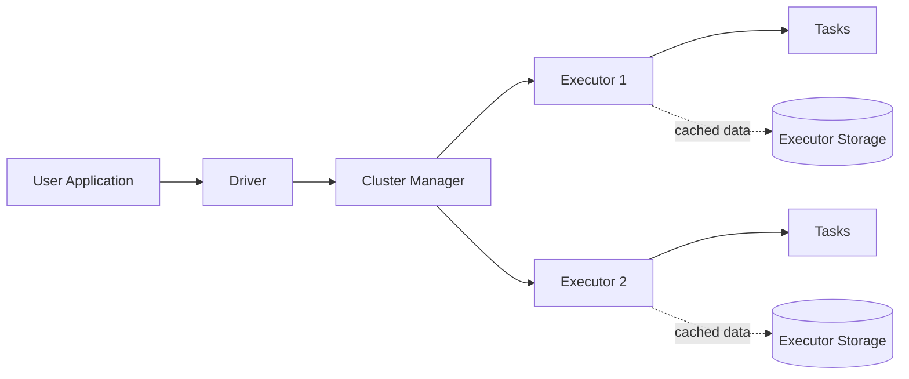
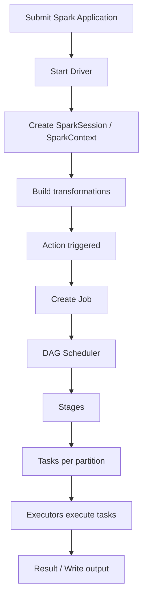

# Spark Fundamentals & Architecture

# 1. What is Apache Spark?

Apache Spark is a distributed data processing engine designed to process large datasets across a cluster.

Spark provides APIs for:

- Python (PySpark)
- Scala
- Java
- R (deprecated in the current documentation)
- SQL

Spark can run locally or on a cluster managed by Spark Standalone, Hadoop YARN, or Kubernetes.

### Why Spark?

Spark is useful when:

- data is too large or processing is too expensive for a single machine;
- the workload needs distributed computation;
- batch and streaming processing need a common API;
- SQL-style transformations need distributed execution;
- iterative processing benefits from caching.

### Important point

Modern Spark applications generally use **DataFrames / Dataset APIs and Spark SQL** rather than low-level RDD APIs. RDDs remain supported and are still important for understanding Spark internals and for some specialized workloads.

---

---

# 2. Spark Ecosystem

The current documentation exposes several major Spark components.

| Component | Purpose | Priority for Data Engineering |
|---|---|---|
| Spark Core / RDD | Distributed execution primitives | High for fundamentals |
| Spark SQL | Structured data and SQL | Very High |
| DataFrames / Datasets | Structured distributed processing | Very High |
| PySpark | Python API | Very High |
| Structured Streaming | Streaming data processing | Very High |
| MLlib | Machine learning | Medium |
| GraphX | Graph processing | Low-Medium |
| SparkR | R API | Low; deprecated |
| Spark Connect | Client-server architecture | Medium |
| Declarative Pipelines | Declarative data pipelines | Emerging / useful |

### Recommended learning order for a Data Engineer

```text
Spark fundamentals
    ↓
RDD concepts
    ↓
Transformations / actions / lazy evaluation
    ↓
DAG / stages / tasks / partitions
    ↓
DataFrames + Spark SQL
    ↓
Joins + aggregations + windows
    ↓
Shuffle + performance tuning
    ↓
PySpark application development
    ↓
Structured Streaming
    ↓
Deployment / monitoring
```

---

---

# 3. Spark Architecture

A Spark application consists primarily of a **driver** and **executors**.

## 3.1 Driver

The driver process:

- contains the application logic;
- creates the `SparkSession` / `SparkContext`;
- builds the execution plan;
- communicates with the cluster manager;
- schedules work on executors;
- coordinates jobs, stages and tasks.

Conceptually:

```text
User Application
      |
      v
   Driver
      |
      v
Cluster Manager
      |
      +------------------+
      |                  |
      v                  v
 Executor 1          Executor 2
```

## 3.2 Executors

Executors are processes launched for a Spark application on worker nodes.

They:

- execute tasks;
- store cached / persisted data;
- perform shuffle work;
- return task results to the driver.

## 3.3 Cluster Manager

The cluster manager allocates resources.

Spark supports:

- Spark Standalone
- YARN
- Kubernetes

The cluster manager is separate from Spark's scheduling logic.

---

---

# 4. Spark Application Execution

A typical flow is:

```text
User submits application
        ↓
Driver starts
        ↓
SparkSession / SparkContext created
        ↓
Transformations build a logical computation
        ↓
An action triggers execution
        ↓
Spark creates a job
        ↓
DAG Scheduler splits the job into stages
        ↓
Stages are divided into tasks
        ↓
Tasks execute on executor processes
        ↓
Results are returned / written
```

### Key terms

- **Application** = complete user program.
- **Job** = computation triggered by an action.
- **Stage** = set of tasks separated by shuffle boundaries.
- **Task** = smallest unit of work sent to an executor, normally processing one partition.
- **Partition** = logical chunk of distributed data.

---

---

# 5. SparkSession and SparkContext

## 5.1 SparkSession

`SparkSession` is the main entry point for modern Spark SQL and DataFrame work.

```python
from pyspark.sql import SparkSession

spark = (
    SparkSession.builder
    .appName("MySparkApp")
    .getOrCreate()
)
```

Common uses:

```python
spark.read...
spark.sql(...)
spark.createDataFrame(...)
spark.conf...
```

## 5.2 SparkContext

`SparkContext` is the lower-level connection to the Spark cluster and execution environment.

It is particularly important for:

- RDD operations;
- broadcast variables;
- accumulators;
- lower-level Spark configuration.

In modern applications, access is often obtained through:

```python
sc = spark.sparkContext
```

### Rule of thumb

Use:

```text
SparkSession → DataFrames / SQL / Structured Streaming
SparkContext → low-level Spark functionality / RDD-related APIs
```

---

---

# 51. Spark Architecture - Detailed Class View

```text
                         Spark Application
                                |
                           Driver Program
                                |
                     +----------+----------+
                     |                     |
                 SparkSession        Scheduler
                                           |
                                   Cluster Manager
                                           |
                 +-------------------------+------------------+
                 |                         |                  |
             Executor 1                Executor 2        Executor N
                 |                         |                  |
            Tasks / Cache             Tasks / Cache       Tasks / Cache
                 |                         |                  |
             Partitions               Partitions          Partitions
```

## 51.1 Driver

The class material describes the driver as the heart of the application. It:

- runs application logic;
- creates the Spark context/session;
- defines transformations;
- triggers actions;
- coordinates scheduling and execution.

## 51.2 SparkContext

The class material describes `SparkContext` as the primary connection between an application and the Spark cluster and as an API for creating RDDs, accumulators, and broadcast variables.

In modern Spark applications, **`SparkSession` is usually the preferred entry point** for DataFrame/Spark SQL work, while `spark.sparkContext` is used when lower-level context functionality is required.

## 51.3 Cluster manager

The class notes mention:

- Spark Standalone
- Hadoop YARN
- Mesos
- Kubernetes

## 51.4 Executors

Executors:

- run tasks;
- execute computations on partitions;
- provide storage for cached/persisted data;
- report task results/status back to the driver.

## 51.5 Task

A task is the smallest unit of Spark work sent to an executor for a partition.

---

---

# 52. Spark Standalone and YARN Architecture - Class Notes

## 52.1 Standalone

The class material uses the following components:

```text
Master
  |
  +---- Worker 1 ---- Executor(s)
  |
  +---- Worker 2 ---- Executor(s)
  |
  +---- Worker N ---- Executor(s)
```

The **Master** coordinates the standalone cluster and monitors workers. Workers provide resources/executor processes.

## 52.2 YARN

The class deck highlights:

- **ResourceManager:** controls cluster resource allocation.
- **NodeManager:** runs/monitors containers on each node.
- **ApplicationMaster:** coordinates an individual application within YARN.

```text
                YARN ResourceManager
                       |
        +--------------+--------------+
        |                             |
   NodeManager 1                 NodeManager 2
        |                             |
    Containers                    Containers
        |                             |
     Executors                    Executors
```

---


## Visual: Spark Architecture



## Visual: Application Lifecycle


