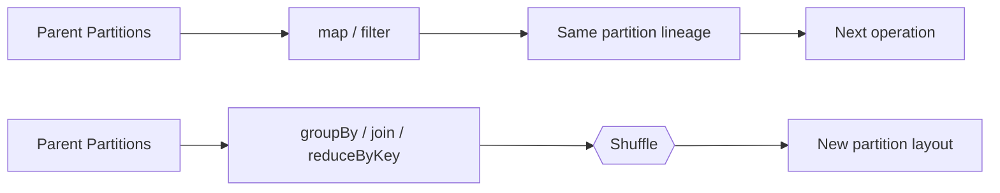
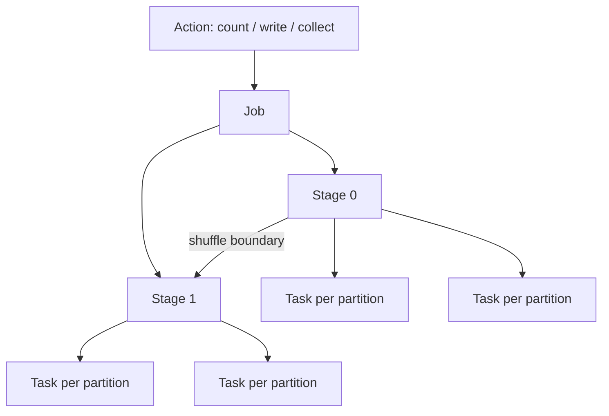

# RDDs, Transformations & Spark Execution

# 6. RDDs

RDD = **Resilient Distributed Dataset**.

It is a distributed collection of objects partitioned across cluster nodes and designed to support fault-tolerant parallel operations.

## RDD properties

### Resilient

RDDs can be recomputed after lost partitions using lineage.

### Distributed

Data is partitioned across multiple nodes.

### Dataset

RDD represents a collection of records.

## Creating RDDs

From a collection:

```python
rdd = sc.parallelize([1, 2, 3, 4, 5])
```

From a text file:

```python
rdd = sc.textFile("data.txt")
```

## Common RDD transformations

```python
map()
flatMap()
filter()
distinct()
union()
groupByKey()
reduceByKey()
sortByKey()
join()
```

## Common RDD actions

```python
collect()
count()
first()
take(n)
reduce()
foreach()
countByKey()
```

### Important warning

Avoid `collect()` on large datasets because it moves all returned data to the driver and can cause driver memory failure.

---

---

# 7. Transformations and Actions

Spark operations are broadly divided into **transformations** and **actions**.

## 7.1 Transformation

A transformation creates a new dataset from an existing dataset.

Examples:

```python
df.filter(...)
df.select(...)
df.withColumn(...)
rdd.map(...)
rdd.filter(...)
```

Transformations are generally lazy.

## 7.2 Action

An action asks Spark to actually execute the computation and produce a result or side effect.

Examples:

```python
df.count()
df.show()
df.collect()
df.write...
rdd.reduce(...)
```

### Simple mental model

```text
Transformation → Build plan
Action         → Execute plan
```

---

---

# 8. Narrow vs Wide Transformations

This distinction is central to Spark performance.

## 8.1 Narrow transformation

Each output partition depends on a small number of input partitions, often one.

Examples:

- `map`
- `filter`
- `select`
- `withColumn`
- `coalesce` in the common non-shuffle use

Conceptually:

```text
Partition 1 → Partition 1
Partition 2 → Partition 2
Partition 3 → Partition 3
```

No major redistribution of records is required.

## 8.2 Wide transformation

An output partition can depend on many input partitions. Data must usually be redistributed.

Examples:

- `groupBy`
- `groupByKey`
- `reduceByKey`
- many joins
- `distinct`
- `orderBy`
- `repartition`

Conceptually:

```text
P1 ──┐
P2 ──┼──> shuffle ──> Q1
P3 ──┘               Q2
```

### Why wide transformations matter

They can introduce:

- network transfer;
- disk I/O;
- serialization overhead;
- additional stages;
- skew-related bottlenecks.

---

---

# 9. Lazy Evaluation

Spark does not immediately execute most transformations.

Example:

```python
df2 = df.filter(df.age > 18)
df3 = df2.select("name", "age")
```

At this point Spark can build an execution plan without reading every record into memory.

When an action happens:

```python
df3.count()
```

Spark optimizes and executes the plan.

## Benefits

Lazy evaluation lets Spark:

- combine operations;
- eliminate unnecessary work;
- optimize execution;
- avoid materializing intermediate data unnecessarily.

### Interview statement

> Spark transformations are lazy; execution begins when an action requires a result.

---

---

# 10. DAG, Jobs, Stages and Tasks

## 10.1 DAG

DAG = **Directed Acyclic Graph**.

Spark builds a graph representing dependencies between computations.

Example:

```text
Read
  ↓
Filter
  ↓
Select
  ↓
GroupBy
  ↓
Count
```

## 10.2 Job

An action creates a Spark job.

Example:

```python
df.count()
```

is an action and can trigger a job.

## 10.3 Stage

A job is divided into stages, with shuffle boundaries commonly separating stages.

Example:

```text
Stage 1
Read → Filter → Select
        ↓
      Shuffle
        ↓
Stage 2
GroupBy → Aggregate
```

## 10.4 Task

A stage contains tasks.

A useful approximation is:

```text
1 partition ≈ 1 task for that stage
```

So if a stage has 200 partitions, it generally has around 200 tasks.

---

---

# 11. Partitions and Parallelism

A partition is a chunk of distributed data.

Spark processes partitions in parallel through tasks.

## 11.1 Why partitions matter

Too few partitions:

- poor parallelism;
- under-utilized cluster;
- long-running tasks.

Too many partitions:

- scheduling overhead;
- too many tiny tasks;
- excessive shuffle metadata / file overhead in some workloads.

## 11.2 `repartition`

```python
df2 = df.repartition(200)
```

Typically causes a full shuffle.

Use it when you need to redistribute data.

## 11.3 `coalesce`

```python
df2 = df.coalesce(20)
```

Primarily useful when reducing the number of partitions without requiring a full shuffle.

### Key difference

```text
repartition → generally shuffle
coalesce    → can reduce partitions without full shuffle
```

---

---

# 12. Caching and Persistence

If the same dataset is reused, recomputation can be expensive.

## Cache

```python
df.cache()
```

Equivalent to persisting using the default storage level for the API.

## Persist

```python
from pyspark import StorageLevel

df.persist(StorageLevel.MEMORY_AND_DISK)
```

Choose persistence based on workload and memory availability.

## Remove cached data

```python
df.unpersist()
```

## When to cache

Good use cases:

- reused DataFrame/RDD;
- iterative algorithm;
- interactive analysis;
- expensive upstream computation used multiple times.

Poor use case:

```text
Dataset used once + large enough to create memory pressure
```

### Important concept

Caching is not automatically faster. It costs memory/storage and can increase pressure on the cluster if applied blindly.

---

---

# 13. Broadcast Variables and Accumulators

## 13.1 Broadcast variables

Broadcast variables allow a read-only value to be efficiently distributed to executors rather than repeatedly shipping it with tasks.

Example:

```python
lookup = {1: "US", 2: "IN", 3: "UK"}
broadcast_lookup = sc.broadcast(lookup)

rdd.map(lambda x: broadcast_lookup.value.get(x)).collect()
```

Useful when:

- a lookup table is relatively small;
- many tasks need the same read-only data.

Do not use a broadcast variable when its size is too large for executor memory.

## 13.2 Accumulators

Accumulators are variables that tasks can add to and whose aggregated value can be read by the driver.

Conceptual example:

```python
counter = sc.accumulator(0)
```

Typical use cases:

- counters;
- diagnostic metrics.

They should not be treated as the primary mechanism for implementing business logic because task retries can make side-effect reasoning tricky.

---

---

# 43. RDD Deep Dive from Class Notes

## 43.1 RDD acronym

**RDD = Resilient Distributed Dataset**

- **Resilient:** Can recover from failures through lineage/recomputation.
- **Distributed:** Data is distributed across partitions on multiple nodes.
- **Dataset:** A collection of data that Spark can process in parallel.

## 43.2 RDD characteristics

The class material emphasizes:

1. Fundamental distributed data abstraction.
2. **Immutable:** transformations create new RDDs instead of changing the original RDD.
3. **Fault tolerant:** lineage allows Spark to recompute lost partitions.
4. **Lazy:** transformations are not executed until an action requires a result.
5. **Partitioned:** work is divided into partitions for parallel computation.
6. **In-memory capable:** reused RDDs can be persisted in memory and/or disk.
7. **Distributed execution:** partitions can be processed concurrently on executors.
8. Two broad operation categories: **transformations** and **actions**.

### RDD lineage mental model

```text
Source RDD
   |
   +--> map()
          |
          +--> filter()
                  |
                  +--> reduceByKey()
                          |
                       ACTION
                          |
                      COMPUTE
```

If a partition is lost, Spark can use the lineage graph to recompute the missing data rather than requiring the whole dataset to be reconstructed from scratch.

---

---

# 44. Data Partitioning - Class Explanation

## 44.1 Why partition data?

Partitioning lets Spark divide a large dataset into independent chunks that can be processed in parallel.

```text
Input Data
    |
    v
+---------+---------+---------+---------+
| Part-0  | Part-1  | Part-2  | Part-3  |
+---------+---------+---------+---------+
    |         |         |         |
   Task      Task      Task      Task
    |         |         |         |
    +---------+---------+---------+
                  |
               Result
```

The Class 1 deck explains partition creation conceptually in terms of source data blocks and Spark's logical partitions. For example, a 1 GB file with a 128 MB HDFS block size gives 8 HDFS blocks in the simplified example.

> **Important practical note:** File-system blocks and Spark partitions are related but are not universally identical. Actual Spark partitioning depends on the file source, splitability, Spark configuration, file sizes, and the scan implementation. Use the class example as a mental model, not as a universal formula.

## 44.2 Controlling partitions

```python
# Increase/decrease partitions with a shuffle
result = df.repartition(20)

# Reduce partitions with less movement when appropriate
result = df.coalesce(5)

# Partition by a key for certain output/shuffle patterns
result.write.partitionBy("country").parquet("/path/output")
```

---

---

# 45. Transformations - Class Explanation

A transformation creates another RDD/DataFrame/Dataset from an existing one and is normally evaluated lazily.

## 45.1 Narrow transformations

A narrow dependency means an output partition can be computed from a small/local set of input partitions without requiring a full shuffle across the cluster.

Class examples:

- `map()`
- `filter()`
- `flatMap()`
- `sample()`

Example:

```python
numbers = spark.sparkContext.parallelize([1, 2, 3, 4, 5])
result = numbers.filter(lambda x: x > 2)
```

## 45.2 Wide transformations

A wide dependency requires data from multiple upstream partitions and commonly introduces a **shuffle**.

Class examples:

- `groupByKey()`
- `reduceByKey()`
- `join()`
- `distinct()`
- `repartition()`
- `coalesce()` (the class deck groups it here; in practice its behavior depends on the partition reduction strategy and should be understood separately)

### Why wide transformations matter

```text
Partition 0 ----\
Partition 1 -----+---- Shuffle ----> New Partition 0
Partition 2 -----+                 New Partition 1
Partition 3 ----/                  New Partition 2
```

Wide operations can introduce:

- network transfer;
- disk I/O;
- serialization/deserialization;
- spill to disk;
- stage boundaries;
- longer task runtimes when data is skewed.

---

---

# 46. Actions - Class Explanation

An action requests a result from Spark or writes a result externally and therefore triggers execution of the required transformation lineage.

Common class examples:

| Action | Purpose |
|---|---|
| `collect()` | Bring all results to the driver |
| `count()` | Count records |
| `first()` | Return first record |
| `take(n)` | Return first `n` records |
| `foreach()` | Run a function for each element |
| `saveAsTextFile()` | Write RDD output |
| `saveAsSequenceFile()` | Write key/value RDD data in SequenceFile format |

### `collect()` warning

```python
# Safe only when the result is known to be small
sample = df.limit(100).collect()
```

Never use `collect()` casually on a massive dataset because the result is materialized on the driver and can cause driver OOM.

---

---

# 47. Read and Write Operations - Class Explanation

The class notes make an important distinction:

### Read

A read is usually used to define the input for a Spark query, but **some read-related operations can cause work immediately** depending on the arguments used.

The class's CSV examples discuss schema inference:

```python
# Header + schema inference
employees = spark.read.csv(
    "employees.csv",
    header=True,
    inferSchema=True
)
```

The class deck explains that schema inference can trigger extra work because Spark needs to inspect the data to infer types. Supplying an explicit schema avoids that inference scan.

```python
from pyspark.sql.types import StructType, StructField, StringType, IntegerType

schema = StructType([
    StructField("name", StringType(), True),
    StructField("age", IntegerType(), True)
])

employees = spark.read.csv(
    "employees.csv",
    header=True,
    schema=schema
)
```

### Write

A write operation triggers the necessary computation to produce the output.

```python
result.write.mode("overwrite").parquet("/path/output")
```

---

---

# 48. Lazy Evaluation + DAG - Class Explanation

## 48.1 Lazy evaluation

Spark records the transformations needed to produce a result but generally does not execute them immediately.

```python
filtered = df.filter("age > 30")
selected = filtered.select("name", "age")

# No final execution result has been requested yet.

selected.count()    # Action -> execution starts
```

Benefits:

- Spark can optimize the overall computation.
- Unnecessary work can be avoided.
- Multiple transformations can be combined into an efficient execution plan.

## 48.2 DAG

The class material describes the DAG as a directed acyclic graph where nodes represent data abstractions and edges represent transformations/operations.

```text
Read
 |
 v
Filter
 |
 v
Join  <----- Read other dataset
 |
 v
Join  <----- Read third dataset
 |
 v
Action
```

The DAG scheduler then uses dependency information to form stages and schedule tasks.

---

---

# 49. Job -> Stage -> Task - End-to-End Example

This is one of the most important concepts in Spark interviews.

## 49.1 Definitions

### Job

An action triggers a Spark job.

Examples:

```python
df.count()
df.collect()
df.write.parquet(...)
```

### Stage

A stage is a set of operations that can run without crossing a shuffle boundary. Shuffle boundaries typically divide stages.

### Task

A task is the unit of work for one partition within one stage.

### Mental formula

```text
1 Action
   ↓
1 Job
   ↓
Multiple Stages
   ↓
Each Stage has tasks
   ↓
Usually one task per partition per stage
```

## 49.2 Class example

The Class 1 deck uses a PySpark example with three CSV sources:

```python
employees = spark.read.csv("employees.csv", inferSchema=True, header=True)
departments = spark.read.csv("departments.csv", inferSchema=True, header=True)
regions = spark.read.csv("regions.csv", inferSchema=True, header=True)

filtered_employees = employees.filter(employees.age > 30)

result = filtered_employees.join(
    departments,
    filtered_employees.dept_id == departments.dept_id
)

result_with_regions = result.join(
    regions,
    result.region_id == regions.region_id
)

result_with_regions.collect()
```

The class explanation maps the workload conceptually as:

```text
             collect()
                 |
               JOB
                 |
      +----------+----------+
      |          |          |
   Stage 0    Stage 1    Stage 2
      |          |          |
   Filter      Join       Join
```

The class deck also shows that schema inference can create additional work/jobs before the final action. Exact job counts can vary with Spark version, source format, options, and how the application is written, so use the example to understand the execution flow rather than memorizing a fixed number.

---

---

# 50. Capacity Less Than Data Size: How Spark Still Processes It

The Class 1 deck gives a useful example: **60 GB of input with 30 GB of cluster memory**.

The key idea is that Spark does **not** need to load the entire dataset into memory at once.

```text
60 GB input
    |
    v
Partition into smaller chunks
    |
    +--> Process current partitions
    |
    +--> Spill intermediate data to disk when needed
    |
    +--> Continue with later partitions/stages
```

### Important mechanisms

- Partitioning divides the data into manageable units.
- Only the data needed for the current task/stage is actively processed.
- Shuffle/intermediate data can spill to disk.
- Disk spill is slower than memory but prevents the entire dataset from needing to fit in RAM.
- Stages can progress without holding the full dataset in memory simultaneously.

### Interview answer

> “Spark can process data larger than cluster memory because it works partition by partition and can spill intermediate data to disk. The entire dataset does not need to fit in executor memory simultaneously.”

---

---

# 65. `groupByKey()` vs `reduceByKey()`

The class material emphasizes the performance difference for pair RDDs.

### `groupByKey()`

Moves all values for each key through the grouping/shuffle process.

```text
(k, 1) (k, 1) (k, 1) ...
         |
       shuffle
         |
       (k, [1,1,1,...])
```

### `reduceByKey()`

Can combine values locally before they are shuffled.

```text
Partition 1: k -> 10
Partition 2: k -> 8
Partition 3: k -> 12
        |
   partial aggregation
        |
      shuffle
        |
   final aggregation
        |
      k -> 30
```

### Interview answer

> “Prefer `reduceByKey`/`aggregateByKey` over `groupByKey` when the operation is associative/commutative and can be partially aggregated before shuffle.”

---


## Visual: Narrow vs Wide Transformation



## Visual: Job → Stage → Task


