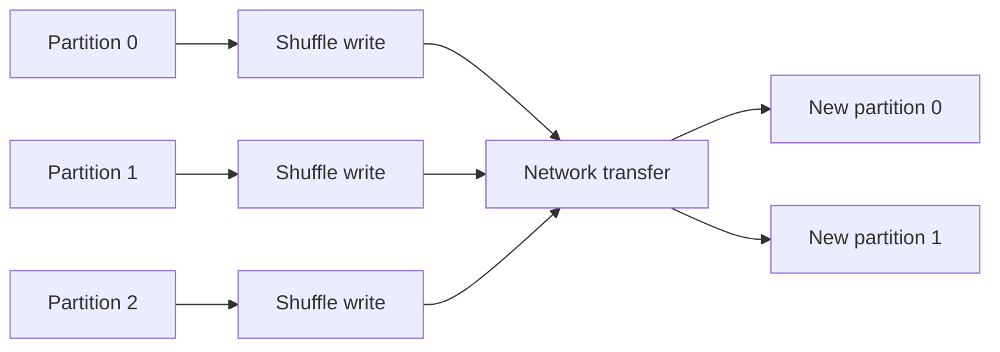
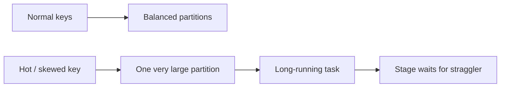

# Partitions, Shuffle, Skew & Performance

# 21. Shuffle

Shuffle is the redistribution of data across partitions, usually across executors, so records can be grouped or aligned by a key or ordering requirement.

Typical operations that can cause shuffle:

- `groupBy`
- `join`
- `distinct`
- `orderBy`
- `repartition`
- some window operations

Conceptually:

```text
Executor A ──┐
Executor B ──┼──> Network shuffle ──> New partition layout
Executor C ──┘
```

## Why shuffle is expensive

Shuffle can involve:

- network transfer;
- serialization;
- disk I/O;
- sorting / aggregation;
- large intermediate data;
- skewed partitions.

### Interview question

**Why is `groupBy` slower than `filter`?**

Because `groupBy` usually requires data redistribution by key, while `filter` can normally operate independently on each input partition.

---

---

# 22. Performance Tuning

Spark performance optimization is mostly about reducing unnecessary data movement and making effective use of cluster resources.

## 22.1 Filter early

Instead of:

```python
df.join(big_df, "id").filter(F.col("country") == "IN")
```

Prefer pushing the filter as early as correctness permits:

```python
filtered = df.filter(F.col("country") == "IN")
result = filtered.join(big_df, "id")
```

Spark SQL can perform some predicate pushdown / reordering automatically, but expressing efficient logic clearly still matters.

## 22.2 Select only required columns

Avoid carrying unnecessary columns through joins and shuffles.

```python
df = df.select("id", "amount")
```

## 22.3 Avoid unnecessary `collect()`

Bad for large data:

```python
rows = df.collect()
```

The data is brought to the driver.

## 22.4 Avoid unnecessary repartitioning

Every shuffle has a cost.

## 22.5 Use broadcast joins where appropriate

For a small dimension table, broadcasting can significantly reduce shuffle work.

## 22.6 Handle data skew

One partition containing far more records than others can create straggler tasks.

Symptoms:

```text
Most tasks complete quickly
One or a few tasks remain running for much longer
```

Possible techniques include:

- better partitioning;
- filtering useless data early;
- broadcasting small sides;
- key salting for appropriate skewed joins;
- adaptive query execution features where applicable;
- avoiding poorly distributed keys.

## 22.7 Partition sizing

Tune partition counts so work is balanced without creating an excessive number of tiny tasks.

## 22.8 Cache only when reuse justifies it

Caching a dataset used only once can waste memory.

---

---

# 23. Memory Management

Spark executors need memory for several categories of work, including:

- execution;
- cached data;
- shuffle structures;
- JVM overhead;
- Python worker processes where applicable.

## Common memory failures

### Executor OOM

A task or executor requires more memory than available.

Possible causes:

- oversized partitions;
- large aggregations;
- skew;
- excessive caching;
- large broadcasts.

### Driver OOM

Often caused by collecting too much data to the driver.

Common examples:

```python
df.collect()
df.toPandas()
```

on unexpectedly large datasets.

### Practical fixes

- reduce data before collecting;
- increase partition count when tasks are oversized;
- avoid unnecessary caching;
- address skew;
- select fewer columns;
- use appropriate executor memory and overhead settings.

---

---

# 55. Data Skew - Deep Dive

## 55.1 What is skew?

Data skew occurs when some partitions contain substantially more data than others.

```text
Partition 0 -> 10 MB
Partition 1 -> 12 MB
Partition 2 -> 11 MB
Partition 3 -> 900 MB   <-- skewed
```

Task 3 becomes the straggler, while the other tasks may finish much earlier.

## 55.2 Common causes

### Skewed join keys

One key appears much more frequently than others.

### Skewed group-by keys

A few keys dominate the data.

### Uneven partition distribution

The partitioning function or source distribution does not spread records evenly.

## 55.3 How to detect skew

Use Spark UI and compare:

- task input sizes;
- task durations;
- shuffle read/write;
- spill;
- executor utilization.

A stage with one or a few much slower tasks is a classic skew signal.

## 55.4 Mitigation techniques

### 1. Salting

Add a secondary salt value to distribute records for a hot key.

```python
import pyspark.sql.functions as F

num_salts = 100

left = df1.withColumn(
    "salt",
    (F.rand() * num_salts).cast("int")
)

salts = spark.range(num_salts).withColumnRenamed("id", "salt")
right = df2.crossJoin(salts)

result = left.join(right, ["id", "salt"])
```

Conceptually:

```text
Hot key A
   |
   +--> A_0
   +--> A_1
   +--> A_2
   ...
   +--> A_99
```

### 2. Split skewed keys

Process heavy keys separately from normal keys.

### 3. Increase partitions

More partitions can improve parallelism, though excessive partition counts increase overhead.

### 4. Prefer map-side aggregation where appropriate

For pair RDDs, `reduceByKey()` can reduce data before shuffle compared with `groupByKey()`.

### 5. Broadcast a small side of a join

Broadcasting can remove the need to shuffle the large side when the smaller dataset is suitable for broadcast.

---

---

# 56. `repartition()` vs `coalesce()` - Class 2

| Topic | `repartition()` | `coalesce()` |
|---|---|---|
| Increase partitions | Yes | No / intended for reducing |
| Reduce partitions | Yes | Yes |
| Full shuffle | Usually yes | Usually avoids full shuffle for reduction |
| Cost | More expensive | Usually cheaper |
| Balanced partitions | Better suited | Can become uneven |
| Typical use | Increase parallelism / rebalance | Reduce partitions before output |

## Examples

```python
# Increase parallelism
large_df = df.repartition(200)

# Repartition using a key
large_df = df.repartition(200, "customer_id")

# Reduce partition count before writing
output_df = df.coalesce(20)
```

### Rule

```text
Need more / better-distributed partitions?
        -> repartition()

Need fewer partitions and want to avoid a full shuffle?
        -> coalesce()
```

---

---

# 59. Processing 1 TB - Class Sizing Example

The Class 2 deck gives this educational calculation:

- Input: **1 TB**
- Assumed block/partition size: **128 MB**
- Approximate blocks: **8192**
- Executors/nodes: **20**
- Cores per executor/node: **5**
- Parallel tasks: **20 x 5 = 100**
- Data processed per wave: **100 x 128 MB = 12,800 MB ≈ 12.5 GB**
- Approximate number of waves: **1024 / 12.5 ≈ 82** (the class deck gives approximately 85 using its rounding assumptions)

The important lesson is not the exact number of waves. It is:

```text
Data volume
   ↓
Number of partitions
   ↓
Available executor cores
   ↓
Concurrent tasks
   ↓
Data processed per wave
```

> **Important:** Real Spark execution depends on input split behavior, compression, partition sizes, CPU cost, memory pressure, shuffle, file format, skew, scheduling overhead, and cluster configuration. Treat this as a capacity-planning teaching example, not a production sizing formula.

---

---

# 60. Executor Sizing - Class 2 Examples

The class material presents a rule-of-thumb-oriented approach:

1. Choose executor cores based on desired concurrency.
2. Determine executors per node.
3. Determine total executors.
4. Allocate executor memory.
5. Leave room for overhead and cluster services.

### Class example 1

Hardware:

- 6 nodes
- 16 cores/node
- 64 GB RAM/node

Class calculation:

- 5 cores/executor
- 15 usable cores/node in the example
- 3 executors/node
- 18 total executor slots across 6 nodes
- 17 after reserving one for the YARN ApplicationMaster/process assumption
- Approx. 19 GB executor memory after overhead adjustment

### Class example 2

Hardware:

- 6 nodes
- 32 cores/node
- 64 GB RAM/node

Class calculation:

- 5 cores/executor
- 6 executors/node
- 36 total, then 35 after the stated AM deduction
- Approx. 9 GB executor memory after overhead adjustment

### Important caveat

The class notes use **5 cores/executor as a rule of thumb** and use a particular overhead percentage in their examples. These are **not universal Spark requirements**. In production, executor sizing should be validated with the workload, cluster manager, Spark version, Python/JVM behavior, GC, shuffle, task size, and measured Spark UI performance.

---

---

# 66. Code-Level vs Resource-Level Optimization

The Class 2 deck divides optimization into two broad groups.

## 66.1 Code-level optimization

### Prefer DataFrames / SQL where appropriate

DataFrame/SQL operations expose more structure to Spark's optimizer than arbitrary Python logic.

### Broadcast suitable small tables

```python
from pyspark.sql.functions import broadcast

result = fact.join(broadcast(dim), "key")
```

### Minimize shuffle

Avoid unnecessary:

- `groupByKey()`;
- `distinct()`;
- repeated `repartition()`;
- wide transformations that are not needed.

### Avoid large collects

Use distributed writes or bounded samples instead.

### Use cache only for reused data

Do not cache everything by default.

## 66.2 Resource-level optimization

Class themes:

- executor/driver memory tuning;
- parallelism tuning;
- dynamic allocation;
- garbage-collection tuning;
- suitable storage formats;
- sufficient network throughput;
- sufficient disk throughput.

---

---

# 67. Dynamic Resource Allocation - Class Configuration

The Class 2 deck presents this example:

```text
spark.dynamicAllocation.enabled=true
spark.dynamicAllocation.initialExecutors=2
spark.dynamicAllocation.minExecutors=1
spark.dynamicAllocation.maxExecutors=20
spark.dynamicAllocation.schedulerBacklogTimeout=1m
spark.dynamicAllocation.sustainedSchedulerBacklogTimeout=2m
spark.dynamicAllocation.executorIdleTimeout=2min
```

### Concept

```text
Low workload
   ↓
Fewer executors

High backlog
   ↓
More executors

Idle executors
   ↓
Remove executors
```

This can improve cluster utilization, but it depends on cluster-manager support and workload behavior.

---

---

# 68. File Formats - Class Notes

The Class 2 material calls out **Parquet** and **Avro** as useful analytical/storage formats.

For Data Engineering, remember:

| Format | Typical strength |
|---|---|
| CSV | Simple interoperability, but expensive for analytics |
| JSON | Flexible/semi-structured data |
| Parquet | Columnar analytics, compression, predicate/column pruning |
| Avro | Row-oriented serialization, schema-oriented data exchange |

### Practical default for analytics

```text
Raw / ingestion
      ↓
Validated / transformed
      ↓
Parquet / Delta-style table format
```

---

---

# 69. Spark Application Design Best Practices - Class 2

## Understand the workload

Before tuning, understand:

- input size;
- file count;
- row width;
- partition sizes;
- skew;
- join patterns;
- aggregation patterns;
- batch vs streaming requirements.

## Minimize shuffle

Shuffle is one of the most important performance boundaries in Spark.

## Choose suitable partition counts

Too few:

```text
Few giant partitions
-> low parallelism
-> stragglers / memory pressure
```

Too many:

```text
Thousands of tiny partitions
-> scheduling overhead
-> small task overhead
-> many output files
```

## Use data locality where practical

Place computation close to data where the environment makes data locality relevant.

## Monitor and iterate

The Class 2 notes recommend using the Spark UI to inspect:

- long-running stages;
- task failures/retries;
- storage usage;
- computation bottlenecks;
- executor memory;
- shuffle behavior.

---


## Visual: Shuffle



## Visual: Data Skew



## Visual: Repartition vs Coalesce

```mermaid
flowchart TB
    A[Current partitions]

    A --> B[repartition(n)]
    B --> C[Full shuffle]
    C --> D[More or fewer balanced partitions]

    A --> E[coalesce(n)]
    E --> F[Primarily combines existing partitions]
    F --> G[Fewer partitions, usually less shuffle]
```
