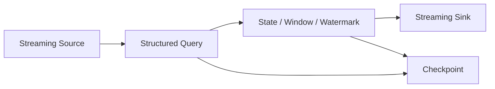

# Structured Streaming & Fault Tolerance

# 28. Structured Streaming

Structured Streaming is Spark's modern stream-processing engine built on the Spark SQL engine.

It lets you express streaming computations using DataFrame / Dataset-style APIs.

Conceptually:

```text
Streaming source
      ↓
Streaming DataFrame
      ↓
Transformations
      ↓
Aggregation / Join / Window
      ↓
Streaming sink
```

## Batch vs streaming

### Batch

Input is bounded.

### Streaming

Input is continuously arriving / unbounded.

Structured Streaming lets the same structured APIs be used across static and streaming data in many cases.

## Example

```python
from pyspark.sql import functions as F

stream_df = (
    spark.readStream
    .format("rate")
    .option("rowsPerSecond", 10)
    .load()
)

result = stream_df.groupBy(
    F.window("timestamp", "1 minute")
).count()
```

Start the query:

```python
query = (
    result.writeStream
    .format("console")
    .outputMode("complete")
    .start()
)

query.awaitTermination()
```

---

---

# 29. Streaming State, Windows and Watermarks

## 29.1 Event time

Event time is the timestamp carried by the event itself.

This matters when records arrive late or out of order.

## 29.2 Processing time

Processing time is when Spark processes the record.

These can differ significantly in real systems.

## 29.3 Windowing

A window groups data according to time intervals.

Example:

```python
F.window("event_time", "10 minutes")
```

Common concepts:

- tumbling windows;
- sliding windows;
- session-style windows, depending on API/workload.

## 29.4 Watermark

A watermark tells Spark how far it can advance event-time state while tolerating late-arriving records.

Example concept:

```python
stream_df.withWatermark("event_time", "10 minutes")
```

The important idea is:

```text
Watermark = bound used to control state for late events
```

A watermark is not simply a statement that events can never arrive late. It is used by the engine to determine when old state can be considered safe to remove according to the query semantics.

## 29.5 Stateful operations

Examples include:

- streaming aggregations;
- stream-stream joins;
- operations that maintain information across micro-batches.

State must be stored reliably so a query can recover.

---

---

# 30. Checkpointing and Fault Tolerance

Structured Streaming uses checkpointing for recovery.

Example:

```python
query = (
    result.writeStream
    .option("checkpointLocation", "/checkpoints/my-query")
    .start()
)
```

Checkpointing can store information such as:

- progress / offsets;
- state information for stateful queries;
- metadata required for recovery.

## Important rule

A checkpoint directory belongs to the logical query and should be treated carefully. Changing certain query-defining configurations can make an old checkpoint incompatible.

The official documentation also notes that some state-partitioning-related configurations should not be changed after a query has already run with an existing checkpoint.

---

---

# 31. Legacy Spark Streaming / DStreams

Spark also has an older streaming API called **Spark Streaming**, based on DStreams.

DStreams represent a continuous stream as a sequence of RDDs.

Conceptually:

```text
DStream
 ↓
RDD batch 1
RDD batch 2
RDD batch 3
...
```

### Modern recommendation

For new structured streaming workloads, **Structured Streaming** is the preferred API.

DStreams remain useful when maintaining legacy systems or when studying Spark history.

---


## Visual: Structured Streaming Mental Model


