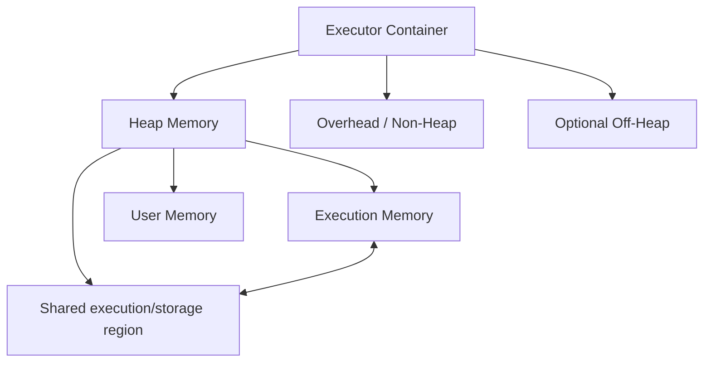
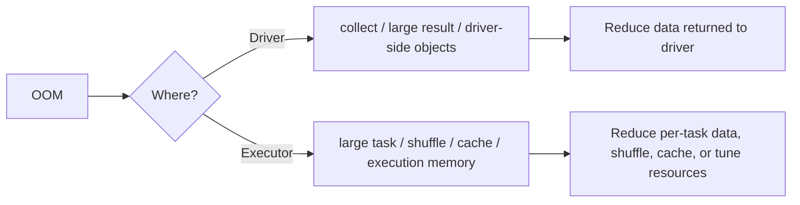

# Memory Management, Failures & OOM

# 23. Memory Management

Spark executors need memory for several categories of work, including:

- execution;
- cached data;
- shuffle structures;
- JVM overhead;
- Python worker processes where applicable.

## Common memory failures

### Executor OOM

A task or executor requires more memory than available.

Possible causes:

- oversized partitions;
- large aggregations;
- skew;
- excessive caching;
- large broadcasts.

### Driver OOM

Often caused by collecting too much data to the driver.

Common examples:

```python
df.collect()
df.toPandas()
```

on unexpectedly large datasets.

### Practical fixes

- reduce data before collecting;
- increase partition count when tasks are oversized;
- avoid unnecessary caching;
- address skew;
- select fewer columns;
- use appropriate executor memory and overhead settings.

---

---

# 58. Spark Executor Memory - Deep Dive

The Class 2 material separates executor memory into several conceptual regions.

```text
Executor Container
+
|------------------------------------------------|
| JVM Heap                                       |
|                                                |
|  +------------------+-----------------------+  |
|  | Execution Memory | Storage Memory        |  |
|  |                  |                       |  |
|  | shuffle           | cache / persisted    |  |
|  | join              | broadcast/internal   |  |
|  | sort              | data                  |  |
|  | aggregation       |                       |  |
|  +------------------+-----------------------+  |
|                                                |
| User Memory                                    |
|                                                |
+------------------------------------------------+
| Overhead / non-heap / native / Python memory   |
+------------------------------------------------+
| Reserved / system memory                      |
+------------------------------------------------+
```

## 58.1 Execution memory

Used for operations such as:

- shuffle;
- joins;
- sorts;
- aggregations.

## 58.2 Storage memory

Used for:

- cached data;
- persisted data;
- certain internal storage needs;
- broadcast-related storage.

## 58.3 User memory

The class notes describe user memory as memory available for user-defined structures and objects outside Spark's execution/storage accounting.

## 58.4 Overhead memory

Executor overhead covers memory outside the main JVM heap, including native/JVM overhead and, in some environments, Python process memory.

## 58.5 Dynamic sharing

The class material emphasizes that execution and storage memory can share available space, with **execution receiving priority** when it needs memory.

Conceptually:

```text
Execution <------> Storage
     ^
     |
  Priority when task execution needs memory
```

When execution needs memory, cached blocks may be evicted.

---

---

# 63. Failure Handling - Class 2

## 63.1 Driver failure

The class deck treats driver failure as application-fatal in the normal execution model because the driver coordinates the application.

Consequences:

- Spark application terminates.
- Executors are released.
- Work coordinated by that driver stops.

## 63.2 Executor failure

Executor failure is more recoverable.

Typical behavior:

1. Executor fails.
2. Tasks running there fail.
3. Spark can reschedule tasks on another executor.
4. The application can continue if enough resources remain.

The class material mentions a default retry threshold for task failures. Treat the exact threshold as **configuration/version dependent** and verify the current setting in the official configuration docs.

---

---

# 64. Driver OOM vs Executor OOM

## 64.1 Driver OOM scenarios

### Large `collect()`

```python
# Dangerous if the result is huge
rows = df.collect()
```

### Very large driver-side objects / broadcasts

Large objects constructed on the driver can exhaust driver memory.

### Mitigation

- Use `take(n)` for sampling.
- Use `limit(n)` before collecting.
- Write results to storage instead of collecting all rows.
- Keep driver-only state small.

## 64.2 Executor OOM scenarios

Common causes highlighted by the class material:

- oversized task results;
- large shuffles;
- expensive joins / aggregations;
- too much persisted data;
- insufficient executor memory/overhead;
- oversized records or skewed partitions.

### Mitigation checklist

```text
Check partition sizes
Check shuffle
Check skew
Check caching
Check executor memory
Check executor overhead
Avoid huge task results
Reduce unnecessary data movement
```

---


## Visual: Executor Memory



## Visual: Driver vs Executor OOM


