# Apache Spark 4.2.0 — Data Engineer Notes

> **Source:** Apache Spark 4.2.0 official documentation  
> **Repository-ready study guide:** architecture, internals, DataFrame/Spark SQL, PySpark, performance, deployment, streaming, operations, security, and interview-level mental models.

---

## Table of Contents

1. [Chapter 1 — What Apache Spark Is](#chapter-1--what-apache-spark-is)
2. [Chapter 2 — Spark Architecture](#chapter-2--spark-architecture)
3. [Chapter 3 — Spark Application Lifecycle](#chapter-3--spark-application-lifecycle)
4. [Chapter 4 — RDDs, Partitions, Lineage and Fault Tolerance](#chapter-4--rdds-partitions-lineage-and-fault-tolerance)
5. [Chapter 5 — Transformations, Actions and Lazy Evaluation](#chapter-5--transformations-actions-and-lazy-evaluation)
6. [Chapter 6 — Shuffle, Narrow/Wide Dependencies and Stages](#chapter-6--shuffle-narrowwide-dependencies-and-stages)
7. [Chapter 7 — DataFrames, Datasets and Spark SQL](#chapter-7--dataframes-datasets-and-spark-sql)
8. [Chapter 8 — Spark SQL Internals and Query Execution](#chapter-8--spark-sql-internals-and-query-execution)
9. [Chapter 9 — File Sources, Partitioning and Data Layout](#chapter-9--file-sources-partitioning-and-data-layout)
10. [Chapter 10 — Joins and Join Strategies](#chapter-10--joins-and-join-strategies)
11. [Chapter 11 — Caching, Persistence and Shared Variables](#chapter-11--caching-persistence-and-shared-variables)
12. [Chapter 12 — Performance Tuning and AQE](#chapter-12--performance-tuning-and-aqe)
13. [Chapter 13 — Memory, Serialization and Resource Tuning](#chapter-13--memory-serialization-and-resource-tuning)
14. [Chapter 14 — Deployment, spark-submit and Cluster Managers](#chapter-14--deployment-spark-submit-and-cluster-managers)
15. [Chapter 15 — Scheduling and Dynamic Allocation](#chapter-15--scheduling-and-dynamic-allocation)
16. [Chapter 16 — Monitoring, Spark UI and Debugging](#chapter-16--monitoring-spark-ui-and-debugging)
17. [Chapter 17 — Structured Streaming](#chapter-17--structured-streaming)
18. [Chapter 18 — Spark Connect](#chapter-18--spark-connect)
19. [Chapter 19 — Spark Declarative Pipelines](#chapter-19--spark-declarative-pipelines)
20. [Chapter 20 — Security and Production Hardening](#chapter-20--security-and-production-hardening)
21. [Chapter 21 — Data Engineer Design Patterns](#chapter-21--data-engineer-design-patterns)
22. [Chapter 22 — Common Anti-Patterns and Failure Modes](#chapter-22--common-anti-patterns-and-failure-modes)
23. [Chapter 23 — Interview Mental Models](#chapter-23--interview-mental-models)
24. [Chapter 24 — Spark 4.2.0 Quick Reference](#chapter-24--spark-420-quick-reference)
25. [Chapter 25 — Final Revision Checklist](#chapter-25--final-revision-checklist)

---

# Chapter 1 — What Apache Spark Is

## 1.1 Definition

Apache Spark is a **distributed data-processing engine** for large-scale batch, interactive, SQL, streaming, and other workloads.

The key idea is not “Spark stores data.” Spark is primarily a **compute engine**. Data normally lives in an external system such as cloud object storage, HDFS, a database, or another supported source.

### Core mental model

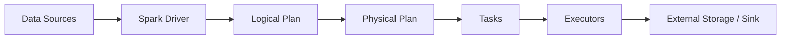

## 1.2 Why Spark became important

Traditional distributed processing systems often forced applications to materialize intermediate results between processing steps. Spark instead represents computation as a distributed execution graph and can keep useful intermediate data in memory when appropriate.

This makes Spark especially effective for:

- large ETL pipelines
- joins and aggregations
- batch analytics
- SQL workloads
- iterative processing
- structured streaming
- data preparation for ML

## 1.3 Spark 4.2.0 platform facts

According to the official 4.2.0 documentation:

- Java: 17 / 21 / 25
- Scala: 2.13
- Python: 3.10+
- R: 4.0+ and deprecated in Spark 4.2.0
- Supported cluster managers: Standalone, YARN, Kubernetes
- Spark Connect provides a client/server architecture
- Spark Declarative Pipelines provide a declarative batch + streaming pipeline framework

---

# Chapter 2 — Spark Architecture

Spark separates **application logic**, **resource management**, and **distributed execution**.

## 2.1 Major components

### Driver

The driver is the process that:

- runs the main application code
- creates the `SparkSession` / `SparkContext`
- builds execution plans
- coordinates jobs
- communicates with executors
- tracks task and stage progress

### Executor

Executors are worker-side processes that:

- execute tasks
- store cached/persisted data
- write shuffle data
- report metrics/status to the driver

### Cluster manager

The cluster manager allocates resources to the application.

Spark 4.2.0 documents three primary choices:

- Spark Standalone
- Hadoop YARN
- Kubernetes

## 2.2 Architecture diagram

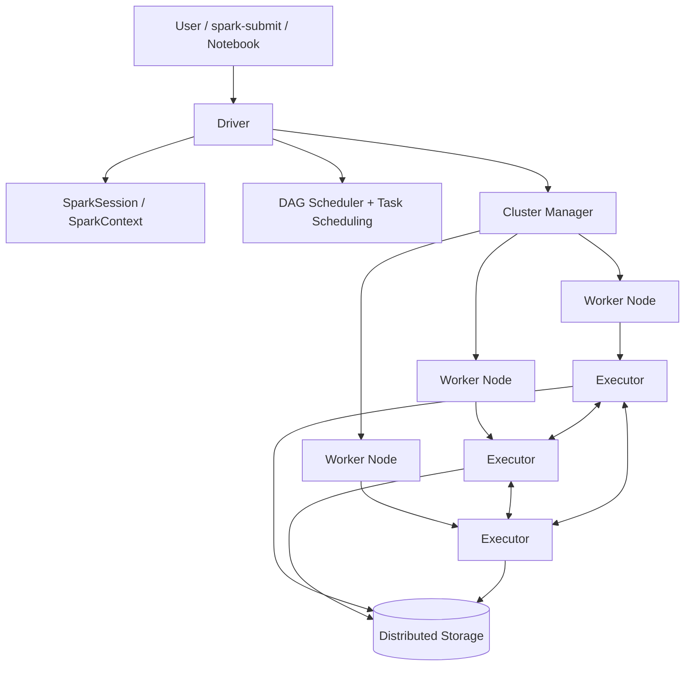

## 2.3 Application isolation

Each Spark application gets its own executor processes. Therefore:

- one application normally cannot directly share cached executor memory with another application
- applications are isolated at the executor/JVM level
- sharing data across applications generally requires an external storage system

## 2.4 Driver placement matters

The driver must communicate continuously with executors. The official cluster guide recommends placing the driver reasonably close to the worker nodes, especially for high-throughput jobs.

### Client vs cluster deploy mode

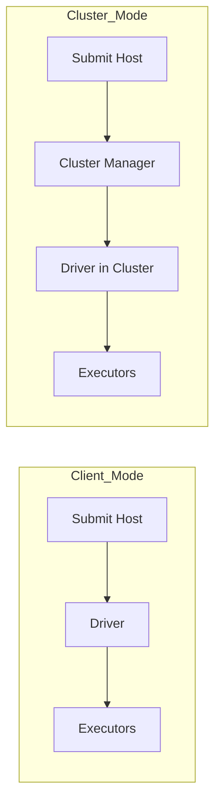

**Interview point:** deploy mode answers **where the driver runs**. It does not mean where executors run.

---

# Chapter 3 — Spark Application Lifecycle

The most important lifecycle is:

```text
Application
   ↓
SparkSession / SparkContext
   ↓
Build logical computation
   ↓
Action triggers execution
   ↓
Job
   ↓
Stages
   ↓
Tasks
   ↓
Executors execute tasks
   ↓
Result / output
```

## 3.1 Job

A **job** is created when an action requires Spark to compute a result.

Examples:

```python
df.count()
df.collect()
df.write.parquet("...")
```

## 3.2 Stage

A job is divided into stages based primarily on shuffle boundaries.

## 3.3 Task

A task is a unit of work sent to an executor. For a stage, Spark generally creates one task per partition of the stage's input.

## 3.4 Full execution view

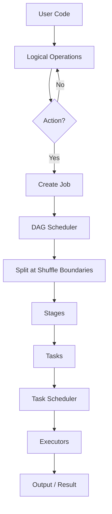

---

# Chapter 4 — RDDs, Partitions, Lineage and Fault Tolerance

## 4.1 RDD definition

RDD = **Resilient Distributed Dataset**.

An RDD is a distributed collection partitioned across cluster nodes that Spark can process in parallel.

RDDs are still supported in Spark 4.2.0, but the official Quick Start recommends using Dataset/DataFrame-based APIs for most modern workloads because they expose more structure to Spark's optimizer.

## 4.2 RDD properties

An RDD is:

- distributed
- partitioned
- immutable
- lazily evaluated
- fault tolerant through lineage

## 4.3 Partition

A partition is the basic unit of parallelism in Spark.

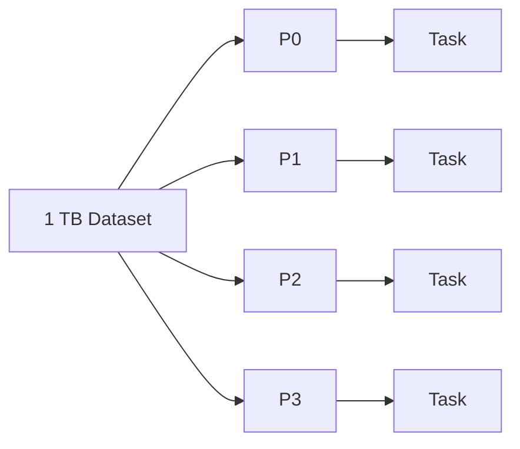

A useful mental model:

> **More useful partitions → more parallelism**, until scheduling, CPU, memory, I/O, or shuffle overhead becomes the bottleneck.

## 4.4 Lineage

Spark does not need to replicate every intermediate dataset. Instead, it tracks how an RDD was derived.

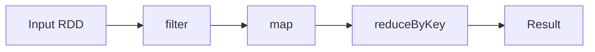

If a partition is lost, Spark can often recompute the missing partition from its lineage.

This is one of the central mechanisms behind Spark fault tolerance.

## 4.5 Why lineage is powerful

Instead of thinking:

> “Spark copies every intermediate result.”

Think:

> “Spark remembers how to rebuild partitions and only materializes/persists intermediate data when execution requires it or when I explicitly cache/persist it.”

---

# Chapter 5 — Transformations, Actions and Lazy Evaluation

## 5.1 Transformations

Transformations create a new dataset from an existing one.

Examples:

```python
filter
map
flatMap
select
withColumn
join
groupBy
repartition
```

They normally do **not** immediately execute the computation.

## 5.2 Actions

Actions require a result or external effect and therefore trigger execution.

Examples:

```python
count()
collect()
first()
show()
write...
save...
```

## 5.3 Lazy evaluation

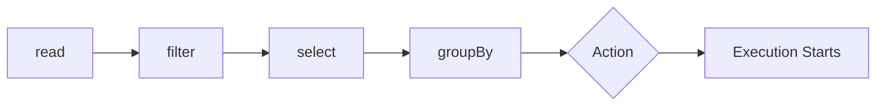

Before the action, Spark can inspect the computation and optimize it.

### Why lazy evaluation matters

It allows Spark to:

- avoid unnecessary work
- combine operations
- optimize filter placement
- select physical operators
- use runtime statistics in AQE
- avoid materializing intermediate results unnecessarily

---

# Chapter 6 — Shuffle, Narrow/Wide Dependencies and Stages

This is one of the most important Spark concepts for a Data Engineer.

## 6.1 Narrow dependency

Each child partition depends on a small number of parent partitions, typically one.

Examples:

- `map`
- `filter`
- `mapPartitions`

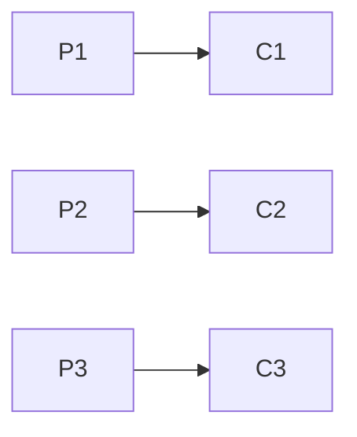

Narrow transformations can often be pipelined within the same stage.

## 6.2 Wide dependency

A child partition depends on data from multiple parent partitions.

Typical examples:

- `groupByKey`
- `reduceByKey`
- `join`
- `distinct`
- `repartition`
- sort-based operations

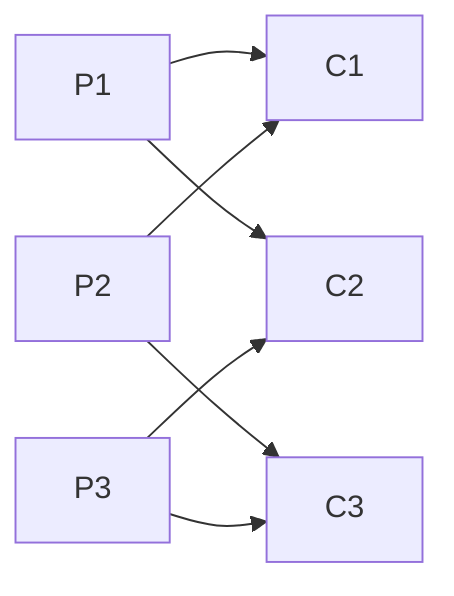

This normally requires a **shuffle**.

## 6.3 What happens during shuffle?

Conceptually:

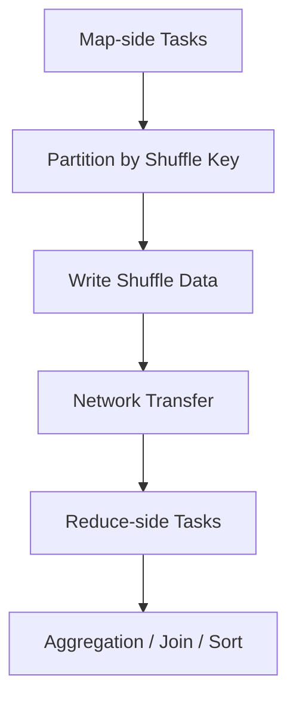

Shuffle is expensive because it can involve:

- serialization
- disk I/O
- network transfer
- sorting
- memory pressure
- many intermediate files/blocks

## 6.4 Stage boundary

A shuffle boundary usually creates a stage boundary.

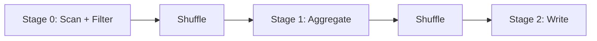

### Golden rule

> **Performance tuning often means reducing unnecessary shuffle, reducing shuffle volume, or making unavoidable shuffle efficient.**

---

# Chapter 7 — DataFrames, Datasets and Spark SQL

## 7.1 DataFrame

A DataFrame is a distributed data structure with named columns and schema information.

In PySpark, DataFrames are the primary high-level abstraction for structured workloads.

## 7.2 Dataset

Datasets combine typed APIs with Spark SQL's optimized engine. Dataset APIs are available in Scala and Java; Python uses DataFrames/Rows rather than the JVM Dataset API.

## 7.3 Why DataFrames usually beat raw RDDs

A DataFrame tells Spark more about:

- schema
- columns
- expressions
- predicates
- joins
- aggregations

That lets Spark optimize the query.

### Key idea

```text
RDD API:
    “Here is code to apply to records.”

DataFrame / SQL:
    “Here is what I want from structured data.”
```

The second form gives Spark more opportunities to optimize execution.

## 7.4 Unified execution engine

Spark SQL, DataFrame APIs and Dataset APIs ultimately use the same Spark SQL execution engine.

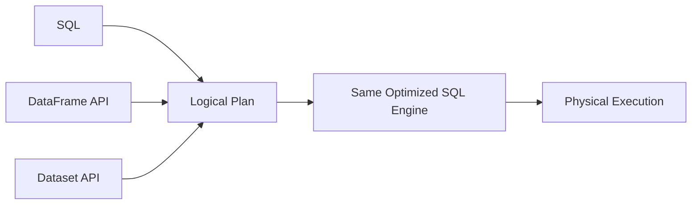

---

# Chapter 8 — Spark SQL Internals and Query Execution

This is the section that turns “I know PySpark” into “I understand Spark.”

## 8.1 Conceptual query pipeline

A query goes through several conceptual stages:

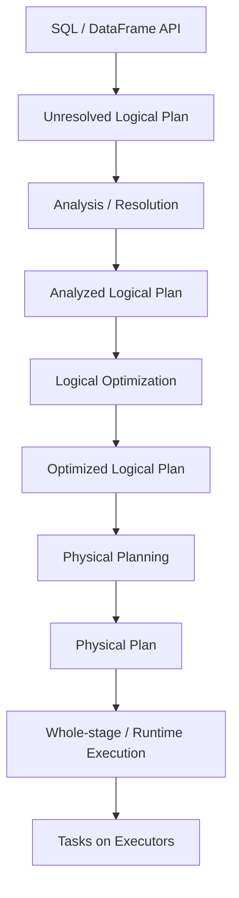

## 8.2 Analysis

Spark resolves things such as:

- tables
- columns
- types
- functions
- references

An unresolved column/table is normally caught at analysis time.

## 8.3 Catalyst optimizer

Spark SQL uses a rule-based and cost-aware optimization framework.

Common conceptual optimizations include:

- predicate pushdown
- projection pruning
- constant folding
- simplification of expressions
- join planning
- partition-aware planning

## 8.4 Physical planning

Spark may consider multiple physical implementations and select an appropriate strategy based on rules and statistics.

Examples:

- Broadcast Hash Join
- Sort Merge Join
- Shuffled Hash Join
- Broadcast Nested Loop Join

## 8.5 Explain plans

Use:

```python
df.explain()
df.explain("formatted")
df.explain("cost")
```

In real troubleshooting, do not look only at the final runtime. Inspect the plan.

### Mental model for `EXPLAIN`

```text
Logical intent
   ↓
What did I ask Spark to do?

Optimized logical plan
   ↓
What did Spark simplify?

Physical plan
   ↓
How will Spark actually execute it?
```

---

# Chapter 9 — File Sources, Partitioning and Data Layout

## 9.1 File-based partition calculation

For file sources such as Parquet, JSON and ORC, Spark uses file-size-related settings to determine read partitioning.

Important Spark SQL settings documented in 4.2.0:

| Setting | Default | Role |
|---|---:|---|
| `spark.sql.files.maxPartitionBytes` | 128 MB | Maximum bytes packed into one input partition |
| `spark.sql.files.openCostInBytes` | 4 MB | Estimated cost of opening a file |
| `spark.sql.shuffle.partitions` | 200 | Default number of partitions for shuffle operations |

These are starting points, not universal laws.

## 9.2 Small-file problem

Suppose a dataset has 1 million tiny files.

The physical data size may not be huge, but metadata, file-open overhead, scheduling, and listing can become expensive.

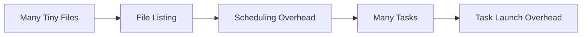

## 9.3 Large-file problem

Very large partitions can reduce parallelism or create memory pressure.

The goal is therefore not “maximum partition count.” The goal is **healthy task sizing and enough parallelism without excessive overhead**.

## 9.4 Repartition vs coalesce

### `repartition`

Usually involves a shuffle when changing partition distribution.

Use it when you need to:

- redistribute data
- increase partitions
- partition by a key
- prepare for downstream parallel processing

### `coalesce`

Usually reduces partition count without a full shuffle.

Use it mainly when reducing partitions, particularly before writing smaller output volumes.

### Practical rule

> `repartition` = redistribute.  
> `coalesce` = collapse.

---

# Chapter 10 — Joins and Join Strategies

Joins are one of the most common sources of Spark performance problems.

## 10.1 Broadcast Hash Join

If one side is small enough, Spark can broadcast it to executors.

Default auto-broadcast threshold in Spark SQL 4.2.0:

```text
spark.sql.autoBroadcastJoinThreshold = 10 MB
```

Conceptually:

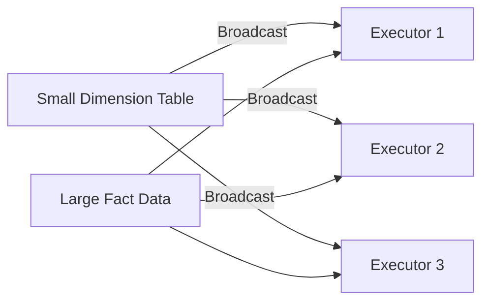

Benefit: avoid a large shuffle on the streamed side.

Risk: broadcasting a table that is too large can cause executor memory pressure or failure.

## 10.2 Sort Merge Join

A common strategy for large equi-joins when both sides are distributed.

Conceptually:

```text
Partition both sides by join key
        ↓
Sort partitions
        ↓
Merge matching ranges
```

## 10.3 Shuffled Hash Join

Data is shuffled by join key, after which hash-based local matching is performed.

## 10.4 Join hints

Spark 4.2.0 documents hints including:

- `BROADCAST`
- `MERGE`
- `SHUFFLE_HASH`
- `SHUFFLE_REPLICATE_NL`

A hint is a planning signal, not a magic guarantee. Not every strategy is valid for every join type.

## 10.5 Join decision framework

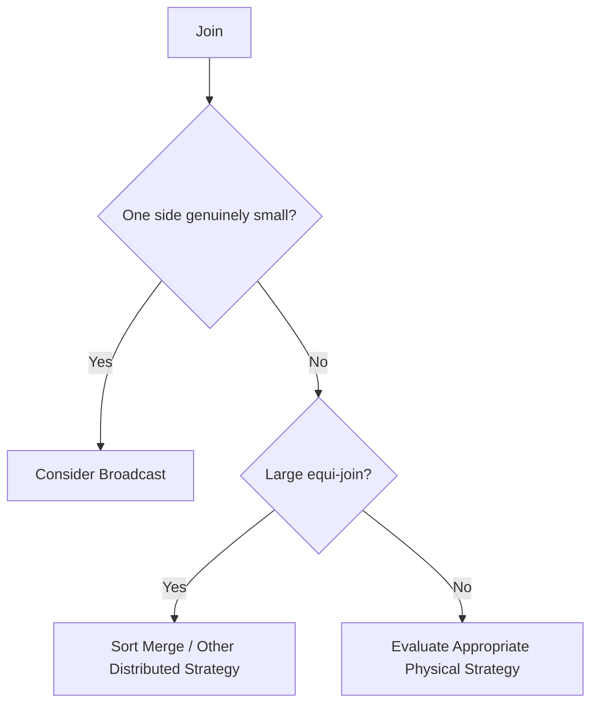

### Data Engineer lesson

Never decide join strategy from table row counts alone. Consider:

- compressed vs uncompressed size
- post-filter size
- cardinality
- skew
- executor memory
- network cost
- runtime statistics

---

# Chapter 11 — Caching, Persistence and Shared Variables

## 11.1 Cache is not magic

Caching stores computed data so future operations can reuse it.

```python
df = transformed_df.cache()
```

The cache itself does not necessarily compute the dataset immediately; an action still materializes it.

## 11.2 When caching helps

Good use cases:

- the same expensive dataset is reused multiple times
- iterative algorithms reuse the same intermediate result
- repeated actions avoid recomputation

Bad use cases:

- one-time reads
- very large datasets that do not fit well in available storage/memory
- caching everything by default

## 11.3 DataFrame caching

Spark SQL can cache tables/DataFrames in a columnar in-memory representation and can use compression based on column statistics.

## 11.4 Persistence levels

RDD persistence offers multiple storage choices such as:

- memory
- disk
- serialized forms
- combinations of memory + disk

The correct choice depends on memory pressure and recomputation cost.

## 11.5 Broadcast variables

A broadcast variable lets Spark efficiently distribute a read-only value to worker nodes.

Good example:

- small lookup map
- reference configuration

## 11.6 Accumulators

Accumulators are primarily for counters/aggregates where tasks add values.

They are useful for instrumentation, not for implementing core business state.

---

# Chapter 12 — Performance Tuning and AQE

Spark performance is usually governed by four broad resources:

```text
CPU + Memory + Network + Disk/I/O
```

## 12.1 First diagnose, then optimize

A reliable sequence is:

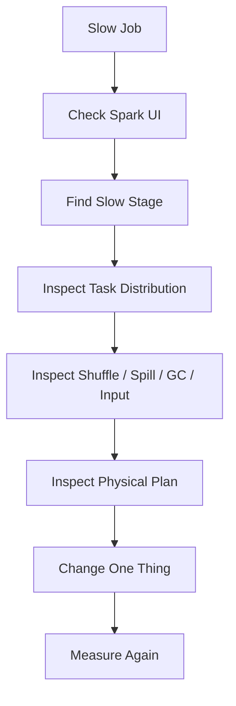

## 12.2 AQE

Adaptive Query Execution uses runtime statistics to re-optimize Spark SQL queries during execution.

Spark 4.2.0 documents AQE as enabled by default.

Major AQE behaviors include:

1. coalescing post-shuffle partitions
2. converting sort-merge join to broadcast hash join when runtime information shows a side is small enough
3. converting to shuffled hash join under suitable runtime conditions
4. optimizing skewed joins

## 12.3 AQE mental model

Without AQE:

```text
Statistics at planning time
        ↓
Physical plan
        ↓
Execute
```

With AQE:

```text
Initial plan
   ↓
Execute part of query
   ↓
Observe runtime statistics
   ↓
Re-optimize
   ↓
Continue execution
```

## 12.4 Post-shuffle coalescing

If a job generates many tiny post-shuffle partitions, AQE can combine contiguous partitions to avoid tiny tasks.

This reduces the need to guess the exact perfect shuffle partition count in advance.

## 12.5 Skew

A classic skew symptom:

- most tasks finish quickly
- a few tasks take dramatically longer

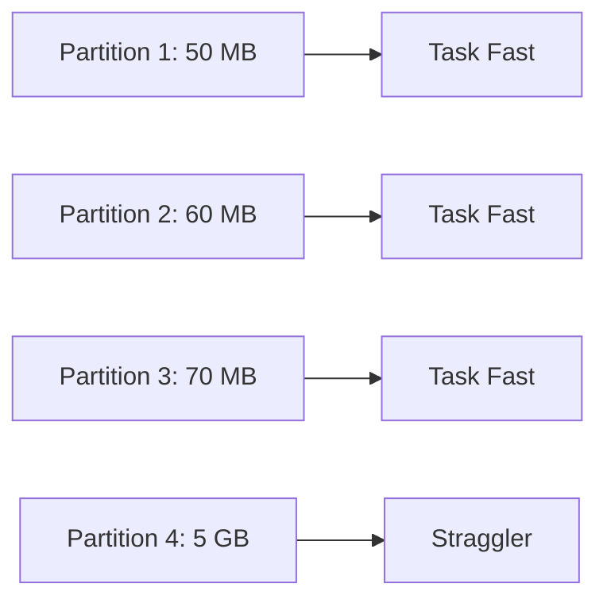

AQE can dynamically split skewed shuffle partitions for supported join scenarios.

## 12.6 Common performance levers

### Lever 1 — Reduce input

- filter early
- select only required columns
- leverage source-side pruning

### Lever 2 — Reduce shuffle

- broadcast small dimensions
- avoid unnecessary repartitioning
- aggregate before joining when semantically valid

### Lever 3 — Fix partition sizing

- avoid too many tiny tasks
- avoid giant partitions
- use appropriate shuffle settings

### Lever 4 — Fix skew

- understand key frequency
- use AQE
- redesign key distribution when needed

### Lever 5 — Use cache selectively

Cache only when reuse makes recomputation more expensive than storage cost.

---

# Chapter 13 — Memory, Serialization and Resource Tuning

## 13.1 Why memory tuning matters

Spark can bottleneck on:

- executor memory
- driver memory
- off-heap/native memory
- JVM heap
- Python worker memory
- shuffle memory
- network bandwidth
- local disk

## 13.2 Serialization

Serialization impacts:

- network traffic
- memory footprint
- CPU overhead

The tuning guide recommends thinking carefully about serialization, especially for large object-heavy RDD workloads.

## 13.3 Garbage collection

Common symptoms of GC pressure:

- long executor pauses
- high GC time
- unstable task runtimes
- executor OOMs

For DataFrame/SQL workloads, prefer Spark's optimized structured execution over heavy Python/JVM object creation when possible.

## 13.4 Hardware principles

The official hardware guide emphasizes:

- keep compute close to storage when possible
- local disks matter because Spark uses them for intermediate data and spill
- local disk capacity and throughput affect shuffle-heavy jobs
- do not allocate the machine's entire RAM to Spark; leave room for OS and cache

A documented general recommendation is to allocate at most around 75% of machine memory to Spark, leaving the remainder for the OS and buffer cache.

---

# Chapter 14 — Deployment, spark-submit and Cluster Managers

## 14.1 `spark-submit`

A uniform way to launch applications across supported cluster managers.

Typical shape:

```bash
./bin/spark-submit \
  --master <master-url> \
  --deploy-mode <client|cluster> \
  --conf <key>=<value> \
  application.py
```

For JVM applications, specify the main class and application artifact.

## 14.2 Cluster managers

### Standalone

- simplest Spark-native cluster manager
- useful for straightforward Spark clusters

### YARN

- integrates with Hadoop ecosystem
- common in enterprise Hadoop environments

### Kubernetes

- Spark applications run with Kubernetes-based resource orchestration
- useful for containerized data platforms

## 14.3 Submission mental model

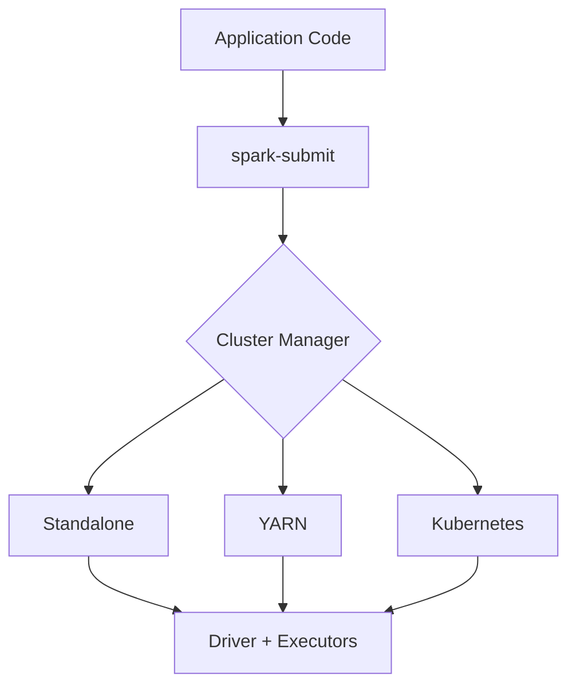

## 14.4 Dependency packaging

For JVM applications:

- package your application and required dependencies
- Spark and Hadoop libraries are typically provided by the runtime/cluster and should not simply be bundled into the application artifact

For Python:

- distribute application files
- use `--py-files` for `.py`, `.zip`, or `.egg` dependencies where appropriate

---

# Chapter 15 — Scheduling and Dynamic Allocation

Spark has two important scheduling layers.

## 15.1 Across applications

The cluster manager decides how resources are shared across Spark applications.

## 15.2 Within an application

A single Spark application can have concurrent jobs, and Spark has scheduling mechanisms such as FIFO and fair scheduling.

## 15.3 Dynamic allocation

Dynamic allocation allows Spark to add executors when there is pending work and remove idle executors when demand falls, subject to configuration and cluster-manager support.

Conceptually:

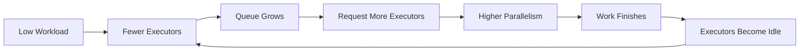

### Production caution

Dynamic allocation is not automatically “faster.” It trades resource elasticity for executor startup/teardown behavior and depends on the surrounding cluster infrastructure.

---

# Chapter 16 — Monitoring, Spark UI and Debugging

## 16.1 Spark UI

A Spark application normally exposes a Web UI on port 4040.

It provides information about:

- jobs
- stages
- tasks
- executors
- storage/cache
- environment

## 16.2 History Server

When event logging is enabled, Spark can persist event data so completed applications can be inspected later through the History Server.

Default History Server port: `18080`.

## 16.3 What to inspect first

When a Spark job is slow:

1. Jobs tab — which job is slow?
2. Stages — which stage dominates runtime?
3. Tasks — are a few tasks much slower?
4. SQL tab — what physical plan executed?
5. Executors — GC, memory, task distribution, shuffle metrics
6. Storage — is caching consuming too much memory?

## 16.4 Debugging decision tree

```mermaid
flowchart TD
    A[Slow Job] --> B{One stage slow?}
    B -->|No| C[Look at overall scheduling / input / resource bottlenecks]
    B -->|Yes| D{Uneven task duration?}
    D -->|Yes| E[Suspect skew / uneven partitions]
    D -->|No| F{High shuffle?}
    F -->|Yes| G[Inspect join / aggregation / repartition]
    F -->|No| H{High GC / memory pressure?}
    H -->|Yes| I[Tune memory / object creation / persistence]
    H -->|No| J[Inspect I/O / CPU / plan / data source]
```

## 16.5 Metrics worth learning

Understand the meaning of:

- input size
- output size
- shuffle read
- shuffle write
- spill to memory
- spill to disk
- executor CPU time
- executor run time
- GC time
- task duration
- records read/written

---

# Chapter 17 — Structured Streaming

## 17.1 What it is

Structured Streaming is Spark's stream-processing engine built on the Spark SQL engine.

The key benefit is that streaming computations are expressed using DataFrame/Dataset-style transformations.

## 17.2 Streaming mental model

```mermaid
flowchart LR
    A[Kafka / Files / Event Source] --> B[Streaming DataFrame]
    B --> C[Transformations]
    C --> D[Aggregation / Join / Window]
    D --> E[Checkpoint / State]
    E --> F[Sink]
```

## 17.3 Micro-batch model

By default, Structured Streaming processes incoming data as a sequence of small batch executions.

Conceptually:

```mermaid
flowchart LR
    A[Stream] --> B[Batch 1]
    A --> C[Batch 2]
    A --> D[Batch 3]
    B --> E[Incremental Result]
    C --> E
    D --> E
```

## 17.4 Continuous processing

Spark also documents a continuous processing mode for very low latency use cases, with different delivery semantics than the default micro-batch engine.

Do not confuse:

- micro-batch latency/semantics
- continuous processing latency/semantics

## 17.5 Stateful processing

Operations such as aggregations and some joins maintain state across batches.

State management introduces concepts such as:

- checkpoints
- state stores
- watermarking
- event-time semantics

## 17.6 Exactly-once mental model

The official Structured Streaming guide describes end-to-end exactly-once fault-tolerance guarantees for the default micro-batch model using checkpointing and write-ahead-log mechanisms, subject to source/sink semantics.

The key phrase is **end-to-end**: guarantees depend on the entire pipeline, not Spark in isolation.

## 17.7 Watermarking

Event-time watermarks let Spark reason about how late data may arrive and help bound state for supported stateful operations.

Mental model:

```text
Event Time --->
|---- processed ----|---- late but acceptable ----|---- too late ----|
                    ^ watermark
```

---

# Chapter 18 — Spark Connect

## 18.1 Why Spark Connect exists

Spark Connect introduces a client/server architecture that decouples the client application from the Spark server/driver process.

## 18.2 Architecture

```mermaid
flowchart LR
    A[Python / Scala Client] --> B[Unresolved Logical Plan]
    B --> C[gRPC + Protobuf]
    C --> D[Spark Connect Server]
    D --> E[Normal Spark SQL Analysis + Optimization]
    E --> F[Executors]
    F --> G[Arrow Row Batches]
    G --> A
```

## 18.3 Important differences from classic PySpark

In Spark Connect:

- the client is not the same process as the Spark driver
- Py4J access to driver internals is not available in the same way
- SparkContext is not client-accessible
- RDD APIs are not supported through the Connect protocol
- execution remains on the Spark server

## 18.4 Why Data Engineers should care

Spark Connect enables:

- remote interactive workloads
- client/server isolation
- better separation of dependencies
- multi-user application architectures
- notebook/IDE integrations

---

# Chapter 19 — Spark Declarative Pipelines

Spark 4.2.0 includes **Spark Declarative Pipelines (SDP)**.

## 19.1 Core idea

Instead of explicitly orchestrating all execution mechanics, define:

- what datasets should exist
- how datasets depend on other datasets
- transformation logic

The framework can then manage dependency-aware execution.

## 19.2 Key concepts

### Flow

Reads data from a source, applies logic, and writes a target dataset.

### Dataset

The queryable output produced by one or more flows.

Dataset types include:

- Streaming Table
- Materialized View
- Temporary View

### Pipeline

The unit of development and execution that contains flows and datasets.

## 19.3 Pipeline graph

```mermaid
flowchart TD
    A[Source] --> B[Flow]
    B --> C[Bronze Dataset]
    C --> D[Flow]
    D --> E[Silver Dataset]
    E --> F[Flow]
    F --> G[Gold Dataset]
```

## 19.4 Why it matters for Data Engineering

SDP is especially relevant when building maintainable:

- incremental pipelines
- batch + streaming pipelines
- dependency graphs
- table-centric ETL systems

---

# Chapter 20 — Security and Production Hardening

Spark documentation explicitly warns that many security features are **not enabled by default**.

Therefore:

> A Spark cluster should never be assumed secure merely because it is Spark.

## 20.1 Security areas

Spark documents controls for:

- authentication
- RPC security
- network encryption
- local storage encryption
- Web UI authentication/authorization
- SSL
- Kerberos
- event-log security considerations
- port configuration

## 20.2 Network encryption

Spark supports SSL-based encryption and also documents legacy AES-based encryption mechanisms.

## 20.3 Authentication

Spark RPC authentication can be enabled using Spark security configuration.

## 20.4 Secure deployment mental model

```mermaid
flowchart TD
    A[Client] --> B[Authentication]
    B --> C[Encrypted Connection]
    C --> D[Driver]
    D --> E[Authenticated RPC]
    E --> F[Executors]
    F --> G[Secure Storage / External Systems]
```

### Production checklist

- do not expose Spark UI casually to untrusted networks
- authenticate cluster communication
- encrypt sensitive traffic
- secure credentials/secrets
- protect event logs
- restrict network ports
- use the security capabilities appropriate to the cluster manager and environment

---

# Chapter 21 — Data Engineer Design Patterns

This chapter translates Spark internals into practical engineering patterns.

## Pattern 1 — Filter early

```python
df = (
    spark.read.parquet(path)
    .filter("event_date >= '2026-01-01'")
    .select("customer_id", "event_date", "amount")
)
```

Goal: reduce data volume as early as semantics allow.

## Pattern 2 — Project only needed columns

Do not carry 100 columns through a join when only 5 are needed.

## Pattern 3 — Broadcast genuine dimensions

Good fit:

```python
fact.join(dim.hint("broadcast"), "customer_id")
```

Use only when the build side is truly manageable.

## Pattern 4 — Aggregate before expensive join when valid

```text
Raw events
   ↓
Filter
   ↓
Pre-aggregate
   ↓
Smaller dataset
   ↓
Join dimension
```

## Pattern 5 — Repartition deliberately

Do not use `repartition()` as a ritual.

Ask:

- Why do I need a new distribution?
- Which key?
- How much data is being shuffled?
- What downstream operation benefits?

## Pattern 6 — Read the physical plan

```python
df.explain("formatted")
```

Train yourself to recognize:

- scans
- filters
- exchanges
- broadcast joins
- sort-merge joins
- aggregates
- shuffles

## Pattern 7 — Separate correctness from optimization

First make the transformation logically correct. Then inspect the plan and metrics before tuning.

## Pattern 8 — Make pipelines observable

Capture:

- row counts
- bad record counts
- input/output volume
- job duration
- key quality metrics
- streaming lag
- failed batches

---

# Chapter 22 — Common Anti-Patterns and Failure Modes

## 22.1 `collect()` on huge data

`collect()` moves all results to the driver.

Potential problem:

```text
Distributed dataset
        ↓
 collect()
        ↓
Single driver process
        ↓
Driver OOM
```

Use distributed writes or aggregations whenever possible.

## 22.2 `groupByKey()` for simple aggregation

For aggregations by key, combine values before the shuffle when the API allows it.

Prefer combiners such as `reduceByKey` / `aggregateByKey` for RDD workloads rather than blindly using `groupByKey`.

## 22.3 Over-caching

Caching everything creates:

- memory pressure
- eviction
- storage overhead
- GC pressure

## 22.4 Too many `repartition()` calls

Each unnecessary repartition may introduce a shuffle.

## 22.5 Ignoring skew

If one key represents a huge percentage of records, the job may be dominated by a tiny number of tasks.

## 22.6 Python UDF everywhere

Blindly using Python UDFs can prevent Spark from applying some native SQL optimizations and can add serialization/process overhead.

Prefer built-in Spark SQL functions where practical.

## 22.7 Writing too many output files

Over-partitioned writes often create a small-file problem downstream.

## 22.8 Treating default configs as universal best practices

Defaults are starting points, not performance guarantees.

---

# Chapter 23 — Interview Mental Models

## Q1. What happens when I call `df.filter(...).groupBy(...).count()`?

Strong answer:

> Spark builds a lazy logical plan. The action `count()` triggers execution. Spark analyzes and optimizes the plan, chooses a physical execution strategy, creates a job, divides it into stages around shuffle boundaries, generates tasks per partition, and executes those tasks on executors.

## Q2. Why is shuffle expensive?

Strong answer:

> Shuffle redistributes data across partitions and often requires serialization, disk I/O, sorting, and network transfer. It also creates stage boundaries and can amplify skew and spill.

## Q3. Driver vs executor?

> Driver coordinates the application; executors execute tasks and store application data such as cached blocks and shuffle data.

## Q4. Why are DataFrames usually preferred over RDDs?

> DataFrames expose schema and relational intent to Spark, allowing the SQL optimizer and optimized execution engine to improve the plan. RDDs give lower-level control but provide less structural information.

## Q5. What is AQE?

> AQE re-optimizes a running Spark SQL query using runtime statistics. Examples include shuffle partition coalescing, runtime join strategy changes, and skew join optimization.

## Q6. What causes one task to run much longer than others?

Typical suspects:

- data skew
- uneven partition sizes
- a problematic record/key
- slow storage or I/O
- GC or memory pressure
- executor/node issues

## Q7. Repartition vs coalesce?

> `repartition` redistributes data and may shuffle; `coalesce` is mainly used to reduce partitions with less movement.

## Q8. Why does `collect()` create driver-memory risk?

> Because distributed results are brought into one process: the driver.

## Q9. What would you inspect first for a slow Spark job?

> Spark UI → slow stage → task distribution → shuffle → spill/GC → physical plan → input/output volume.

## Q10. How do you optimize a join?

A good sequence:

```text
1. Filter/project early
2. Estimate post-filter sizes
3. Check statistics
4. Check for skew
5. Consider broadcast
6. Inspect physical plan
7. Measure using Spark UI
```

---

# Chapter 24 — Spark 4.2.0 Quick Reference

## 24.1 Core abstractions

| Concept | Meaning |
|---|---|
| Application | User Spark program |
| Driver | Coordinates the application |
| Executor | Runs tasks / stores data |
| Cluster Manager | Allocates resources |
| Job | Work triggered by an action |
| Stage | Set of tasks separated by shuffle boundaries |
| Task | Work on one partition |
| Partition | Unit of distributed parallelism |
| Shuffle | Redistribution across partitions |
| RDD | Low-level distributed collection |
| DataFrame | Structured distributed dataset |
| Dataset | Typed structured API in JVM languages |
| Spark SQL | Structured query engine |
| AQE | Runtime adaptive query optimization |

## 24.2 High-value configuration starting points

| Configuration | Spark 4.2.0 documented default | Main purpose |
|---|---:|---|
| `spark.sql.files.maxPartitionBytes` | 128 MB | File input partition sizing |
| `spark.sql.files.openCostInBytes` | 4 MB | Small-file planning cost estimate |
| `spark.sql.shuffle.partitions` | 200 | Shuffle partition count |
| `spark.sql.autoBroadcastJoinThreshold` | 10 MB | Automatic broadcast threshold |
| `spark.sql.adaptive.enabled` | true | Enable AQE |
| `spark.sql.adaptive.coalescePartitions.enabled` | true | Coalesce post-shuffle partitions |
| `spark.sql.adaptive.skewJoin.enabled` | true | Optimize skewed sort-merge joins |

> Defaults can change between Spark releases or downstream distributions. Always verify the exact runtime version in production.

## 24.3 Most useful commands

```bash
./bin/pyspark
./bin/spark-shell
./bin/spark-submit ...
./bin/spark-sql
./sbin/start-history-server.sh
./sbin/start-connect-server.sh
```

## 24.4 Most useful PySpark methods

```python
spark.read.parquet(path)
df.select(...)
df.filter(...)
df.withColumn(...)
df.groupBy(...).agg(...)
df.join(...)
df.repartition(...)
df.coalesce(...)
df.cache()
df.unpersist()
df.explain("formatted")
df.write.parquet(...)
```

---

# Chapter 25 — Final Revision Checklist

Before saying “I know Spark,” make sure you can explain these without notes.

## Architecture

- Driver
- Executor
- Cluster Manager
- Worker Node
- Client vs Cluster deploy mode
- Application isolation

## Execution

- Lazy evaluation
- Transformation
- Action
- Job
- Stage
- Task
- Partition
- DAG
- Shuffle
- Narrow vs wide dependency
- Lineage

## Spark SQL

- DataFrame vs RDD
- Catalyst-style optimization concepts
- Logical vs physical plan
- Predicate pushdown
- Projection pruning
- Statistics
- `EXPLAIN`

## Joins

- Broadcast hash join
- Sort merge join
- Shuffled hash join
- Join hints
- Broadcast threshold
- Skew

## Performance

- Partition sizing
- Shuffle reduction
- Cache vs persist
- Serialization
- Spill
- GC
- AQE
- Small files
- Output file sizing

## Operations

- `spark-submit`
- Standalone / YARN / Kubernetes
- Dynamic allocation
- Spark UI
- History Server
- Event logs

## Streaming

- Structured Streaming
- Micro-batch
- Continuous processing
- Checkpointing
- Watermarking
- State
- Exactly-once semantics and sink/source caveats

## Modern Spark

- Spark Connect
- Spark Declarative Pipelines

---

# One-Page Spark Mental Model

```mermaid
flowchart TD
    A[Data Source] --> B[DataFrame / SQL]
    B --> C[Logical Plan]
    C --> D[Analysis]
    D --> E[Optimization]
    E --> F[Physical Plan]
    F --> G{Shuffle?}
    G -->|No| H[Pipeline in Stage]
    G -->|Yes| I[Shuffle Boundary]
    I --> J[Next Stage]
    H --> K[Tasks]
    J --> K
    K --> L[Executors]
    L --> M[Output]

    N[Runtime Statistics] --> E
    N --> O[AQE]
    O --> F
```

## The Spark hierarchy to remember

```text
Application
  └── Job
       └── Stage
            └── Task
                 └── Partition
```

## The performance hierarchy to remember

```text
Reduce Input
    ↓
Reduce Data Volume
    ↓
Reduce Shuffle
    ↓
Choose Good Join Strategy
    ↓
Fix Partitioning / Skew
    ↓
Use AQE
    ↓
Tune Memory / CPU / Network / Disk
    ↓
Measure Again
```

## The most important engineering principle

> **Do not optimize Spark by memorizing configuration values. Optimize by understanding the data, execution plan, partition distribution, shuffle behavior, resource utilization, and runtime evidence.**

---

# Official Apache Spark 4.2.0 References

- Spark 4.2.0 Documentation: https://spark.apache.org/docs/4.2.0/
- Quick Start: https://spark.apache.org/docs/4.2.0/quick-start.html
- RDD Programming Guide: https://spark.apache.org/docs/4.2.0/rdd-programming-guide.html
- Spark SQL / DataFrames / Datasets: https://spark.apache.org/docs/4.2.0/sql-programming-guide.html
- SQL Performance Tuning: https://spark.apache.org/docs/4.2.0/sql-performance-tuning.html
- Distributed SQL Engine: https://spark.apache.org/docs/4.2.0/sql-distributed-sql-engine.html
- Structured Streaming: https://spark.apache.org/docs/4.2.0/streaming/index.html
- Cluster Mode Overview: https://spark.apache.org/docs/4.2.0/cluster-overview.html
- Submitting Applications: https://spark.apache.org/docs/4.2.0/submitting-applications.html
- Configuration: https://spark.apache.org/docs/4.2.0/configuration.html
- Monitoring: https://spark.apache.org/docs/4.2.0/monitoring.html
- Job Scheduling: https://spark.apache.org/docs/4.2.0/job-scheduling.html
- Security: https://spark.apache.org/docs/4.2.0/security.html
- Hardware Provisioning: https://spark.apache.org/docs/4.2.0/hardware-provisioning.html
- Spark Connect: https://spark.apache.org/docs/4.2.0/spark-connect-overview.html
- Spark Declarative Pipelines: https://spark.apache.org/docs/4.2.0/declarative-pipelines-programming-guide.html
- PySpark 4.2.0 Documentation: https://spark.apache.org/docs/4.2.0/api/python/

---

## Source and scope note

These notes are a condensed learning resource based on the Apache Spark **4.2.0 official documentation**. They intentionally emphasize concepts most useful to a Data Engineer: distributed architecture, execution internals, SQL/DataFrames, shuffle, joins, partitioning, tuning, streaming, deployment, monitoring, and production thinking.

For exact configuration semantics, API signatures, release-specific behavior, supported features, and security/deployment details, the official Spark 4.2.0 documentation remains the authoritative source.
