# AI Fundamentals for Data Engineering: Comprehensive Notes

A comprehensive reference guide on Artificial Intelligence, Machine Learning, Deep Learning, Natural Language Processing, and Large Language Models tailored specifically for Data Engineers building and enabling enterprise-grade data platforms and AI systems.

---

## 1. AI as a Productivity Multiplier for Data Engineers

Artificial Intelligence acts as an accelerator for data engineers, automating routine tasks, speeding up pipeline design, and enabling rapid troubleshooting.

### Practical Engineering Use Cases

* **Code Generation:** Converting natural-language requirements into functional SQL, Python, and PySpark scripts.
* **Code Explanation & Onboarding:** Deciphering complex legacy queries, Spark execution plans, and unfamiliar codebases.
* **Debugging & Log Analysis:** Analyzing execution logs, stack traces, and error messages to pinpoint root causes.
* **Data Quality & Testing:** Generating unit test suites, data-quality assertion checks, and realistic synthetic mock datasets.
* **Optimization & Refactoring:** Identifying bottleneck transformations in PySpark/SQL and suggesting performance improvements.
* **Documentation:** Automatically creating pipeline architecture docs, data dictionaries, and source-to-target mapping (STM) sheets.

---

### Real-World Engineering Example & Human Validation

#### Input Requirement
> "Read daily order data from Amazon S3, remove duplicates based on `order_id`, calculate customer-level daily revenue, and load the aggregated results into Snowflake."

#### AI-Generated Artifacts
1. **PySpark Transformation Code**
2. **Snowflake DDL & SQL Statements**
3. **Apache Airflow DAG Definition**
4. **Great Expectations Data Quality Checks**

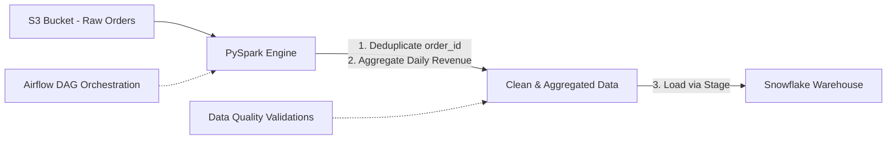

```python
# Generated PySpark Snippet Example
from pyspark.sql import SparkSession
from pyspark.sql.functions import col, sum as _sum

spark = SparkSession.builder.appName("DailyCustomerRevenue").getOrCreate()

# 1. Read daily order data from S3
raw_orders = spark.read.option("header", "true").csv("s3a://company-bucket/raw/orders/2026/09/07/*.csv")

# 2. Deduplicate based on order_id
deduped_orders = raw_orders.dropDuplicates(["order_id"])

# 3. Calculate customer-level revenue
customer_revenue = deduped_orders.groupBy("customer_id") \
    .agg(_sum(col("order_amount").cast("double")).alias("total_revenue"))

# Write output to staging area for Snowflake ingestion
customer_revenue.write.mode("overwrite").parquet("s3a://company-bucket/staged/daily_revenue/2026/09/07/")
```

#### What the Data Engineer MUST Validate
While AI accelerates the baseline code output, production engineering responsibility remains with the engineer:

* **Join & Aggregation Logic:** Ensure correct handling of `NULL` values, correct key bindings, and proper fan-out prevention.
* **Incremental Loading Strategy:** Verify state management, CDC mechanics, watermark timestamps, and append vs. upsert strategies.
* **Partitioning & Performance:** Ensure proper Spark partition sizing, avoiding small-file problems, shuffling optimizations, and cluster scaling.
* **Idempotency & Recovery:** Verify that re-running the job produces identical results without duplicating destination records.
* **Security & Production Readiness:** Sanitize credentials (use Secrets Manager), enforce RBAC, and handle governance constraints.

---

### Common Tools in the Data AI Ecosystem

```
+-------------------------------------------------------------------+
|                        AI Productivity Tools                       |
+-------------------------------------------------------------------+
|  Conversational Assistants |  ChatGPT, Claude, Google Gemini      |
|  IDE Integrations          |  Cursor, Antigravity, GitHub Copilot |
+-------------------------------------------------------------------+
```

---

## 2. Data Engineers Enabling Production AI Systems

AI applications (such as Enterprise Search and RAG) require clean, fresh, governed, and well-indexed data pipelines to deliver reliable answers. Data engineers build and maintain these underlying systems.

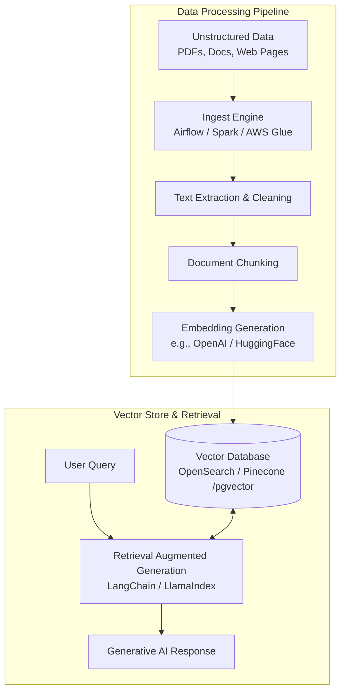

### RAG (Retrieval-Augmented Generation) Architecture Breakdown

1. **Ingestion & Extraction:** Extract raw unstructured text from PDFs, HTML, logs, and database tables.
2. **Text Cleaning & Formatting:** Remove boilerplate formatting, normalize metadata, and enforce structural cleanliness.
3. **Chunking Strategy:** Split long text documents into overlapping, context-preserving text chunks (e.g., 512 tokens with 50-token overlap).
4. **Vector Embedding:** Convert chunks into dense mathematical vector representations using embedding models.
5. **Vector Indexing:** Persist vectors in specialized databases (e.g., Amazon OpenSearch, Pinecone, pgvector) with automated sync pipelines.

---

## 3. The Artificial Intelligence Umbrella

AI is a broad field of computer science dedicated to building systems capable of performing tasks that traditionally require human intelligence.

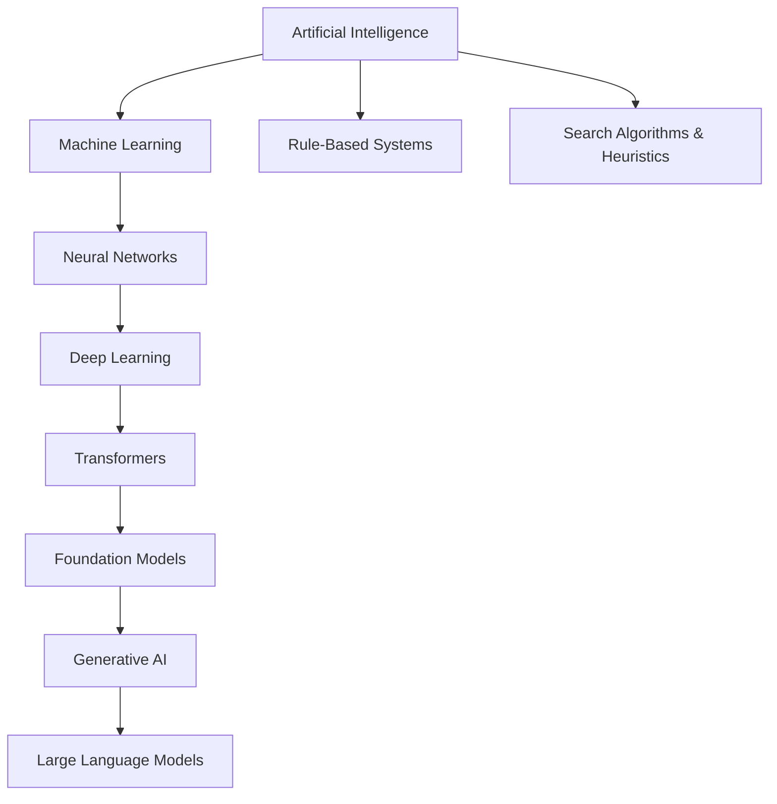

### Methods for Building AI
* **Rule-Based Systems:** Static `IF-THEN` conditional logic frameworks.
* **Search & Heuristics:** Graph traverse/game-tree search algorithms.
* **Machine Learning:** Pattern discovery using statistical models trained on data.
* **Deep Learning:** Layered artificial neural networks learning multi-tier representations.
* **Large Language Models (LLMs):** Massive Transformer models designed for language understanding and generation.
* **AI Agents:** Autonomous systems that perceive environments, execute tools, and make sequential decisions.

---

## 4. Machine Learning: Learning Patterns from Data

Machine Learning (ML) replaces explicit manual coding with statistical pattern learning.

```
+-------------------------------------------------------------------------+
|                        Traditional Programming                          |
+-------------------------------------------------------------------------+
|   Rules + Input Data  ===========================> Output               |
+-------------------------------------------------------------------------+

+-------------------------------------------------------------------------+
|                           Machine Learning                              |
+-------------------------------------------------------------------------+
|   Input Data + Labels (Correct Answers) ========> Learned Model (Rules) |
+-------------------------------------------------------------------------+
```

### Traditional Programming vs Machine Learning: Spam Detection

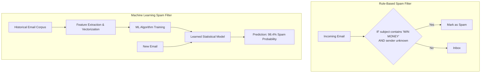

---

### Core ML Mathematical Intuition: Regression Example

Consider predicting house prices based on operational attributes:

| Size (`sqft`) | Bedrooms | Location Score | Price (`Y`) |
| :--- | :--- | :--- | :--- |
| `1000` | `2` | `7` | `₹50 Lakhs` |
| `1500` | `3` | `8` | `₹75 Lakhs` |
| `2000` | `4` | `9` | `₹1 Crore` |

#### The Model Formula
$$	ext{Price} = (w_1 	imes 	ext{Size}) + (w_2 	imes 	ext{Bedrooms}) + (w_3 	imes 	ext{Location}) + b$$

* **Features ($X$):** Input features (`Size`, `Bedrooms`, `Location Score`).
* **Target / Label ($Y$):** Objective target output value (`Price`).
* **Weights ($w_1, w_2, w_3$):** Learnable parameters determining the importance of each feature.
* **Bias ($b$):** Adjustable offset value.

#### Iterative Training Optimization Loop

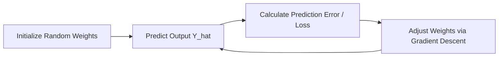

---

### Machine Learning Paradigms

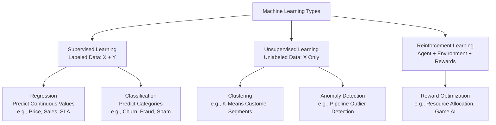

#### Supervised vs Unsupervised vs Reinforcement Learning

| Paradigm | Input Data | Target Label ($Y$) | Primary Use Cases | Algorithms |
| :--- | :--- | :--- | :--- | :--- |
| **Supervised Learning** | Features ($X$) | Yes (Explicit Targets) | Churn Prediction, Price Forecasting, Fraud Detection | Linear/Logistic Regression, Random Forest, XGBoost, SVM |
| **Unsupervised Learning** | Features ($X$) | No | Customer Segmentation, Anomaly Detection, Rule Mining | K-Means, DBSCAN, Isolation Forest, PCA |
| **Reinforcement Learning** | State ($S$) | Reward/Penalty Signal | Resource Scheduling, Autonomous Driving, Game AI | Q-Learning, PPO, Deep Q-Networks (DQN) |

---

## 5. Artificial Neural Networks & Deep Learning

Neural networks are computational models inspired by biological neural structures, designed to map complex, non-linear feature relationships.

### Deep Learning Neuron Architecture

```
   Inputs (X)        Weights (W)
   
     x1 ---------------> (w1) \
                               \
     x2 ---------------> (w2) ---> [  SUMMATION (Σ)  ] ---> [ ACTIVATION f(z) ] ---> Output (y)
                               /   [  z = Σ(xi*wi)+b ]      [ e.g., ReLU / Sigmoid ]
     xn ---------------> (wn) /
                                 
                                        ^
                                        |
                                     Bias (b)
```

$$	ext{Output } y = f\left( \sum_{i=1}^{n} (x_i \cdot w_i) + b 
ight)$$

* **Input Data:** Input feature vector fed to the input layer.
* **Forward Pass:** Information flows layer-by-layer through weighted connections.
* **Prediction:** Output layer produces final numerical value or class probability.
* **Loss Evaluation:** Compares predicted output with actual target values.
* **Backpropagation & Optimization:** Computes gradients to adjust weights and minimize error.

---

### Deep Learning Evolution

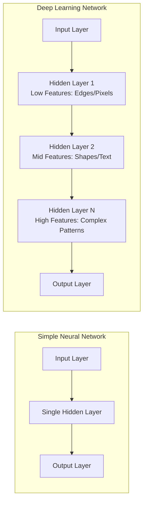

#### Hierarchical Feature Extraction Example: Document Processing

```
[ Raw Invoice Pixels ] ──> [ Edge Detection ] ──> [ Character Recognition ] ──> [ Field Mapping ] ──> [ Total Amount: $4,250 ]
```

---

## 6. Natural Language Processing (NLP)

Natural Language Processing focuses on processing, understanding, and generating human natural language.

### Evolutionary Progression of NLP

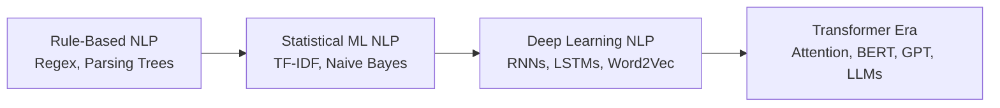

> **Key Distinction:** NLP defines the **problem domain** (working with human language). Machine Learning, Deep Learning, and Transformers are **techniques** used to solve NLP problems.

---

## 7. Generative AI & Large Language Models (LLMs)

Generative AI refers to models capable of generating new content (text, code, images, audio) based on learned probabilistic distributions.

```
+------------------------------------------------------------------------+
|                          Traditional ML                                |
+------------------------------------------------------------------------+
|   Predicts a label or probability  ==> "Customer Churn Risk = 82%"     |
+------------------------------------------------------------------------+

+------------------------------------------------------------------------+
|                          Generative AI                                 |
+------------------------------------------------------------------------+
|   Generates new domain content     ==> PySpark ETL Script / Document Summary|
+------------------------------------------------------------------------+
```

---

### Mechanics of Next-Token Prediction

An LLM is fundamentally an autocompletive probability distribution model designed to predict the most statistically probable next token.

```
Prompt: "The capital of France is"

Model Vocabulary Probabilities:
┌──────────────┬──────────────┐
│ Token        │ Probability  │
├──────────────┼──────────────┤
│ " Paris"     │    96.2%     │
│ " London"    │     1.1%     │
│ " Berlin"    │     0.5%     │
│ " dynamic"   │     0.1%     │
└──────────────┴──────────────┘
```

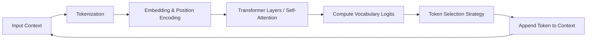

---

### Proprietary vs. Open-Weight LLMs

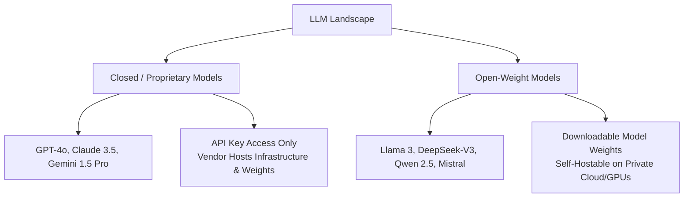

---

## 8. Fundamental Core LLM Concepts

### 1. Tokens & Tokenization
LLMs process text in atomic units called **tokens**. 

$$	ext{Rule of Thumb: } 1 	ext{ Token} pprox 4 	ext{ English Characters} pprox 0.75 	ext{ Words}$$

```
Raw Text:    "Data Engineering is amazing"
Tokenized:   ["Data", " Engineering", " is", " amazing"]
Token IDs:   [12431, 14210, 318, 7150]
```

---

### 2. Embeddings
An embedding converts a discrete token integer into a high-dimensional continuous vector space capturing semantic relationships.

```
"database"  ──> [  0.21, -0.45,  0.81,  0.12, ... ]
"table"     ──> [  0.18, -0.39,  0.76,  0.09, ... ]
"banana"    ──> [ -0.72,  0.15, -0.31, -0.88, ... ]
```

```
Vector Distance Relationship:

  [ database ] ◄──────── Closely Aligned (Cosine Similarity ~0.91) ────────► [ table ]
      │
      │
  Far Distance (Cosine Similarity ~0.12)
      │
      ▼
  [ banana ]
```

---

### 3. Prompt Engineering Components

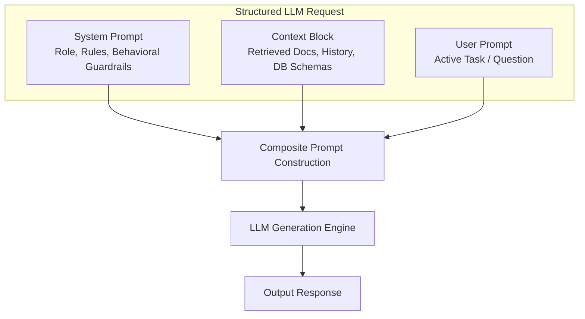

#### Code Implementation Setup

```python
# Conceptual Structure for API Calls
payload = {
    "model": "gpt-4o",
    "messages": [
        {
            "role": "system",
            "content": "You are a senior Data Platform Engineer. Respond strictly with executable PySpark code without explanations."
        },
        {
            "role": "system_context",
            "content": "Target Schema: orders(order_id STRING, customer_id STRING, amount DOUBLE, event_time TIMESTAMP)"
        },
        {
            "role": "user",
            "content": "Write a PySpark streaming query reading from Kafka topic 'orders' writing to Delta Lake."
        }
    ],
    "temperature": 0.1,
    "max_tokens": 1000,
    "top_p": 0.9
}
```

---

### 4. Sampling Hyperparameters

* **Temperature:** Controls output randomness.
  * `Temperature = 0.0 – 0.2`: Deterministic, precise, highly consistent. Best for SQL generation, code synthesis, and structured data extraction.
  * `Temperature = 0.7 – 1.0`: Creative, varied, diverse. Best for brainstorming and story generation.
* **Top-P (Nucleus Sampling):** Selects tokens from a cumulative probability threshold pool (e.g., top 90% probability mass).

---

### 5. Context Window Architecture

The context window limits the total token capacity (Input + Output) an LLM can evaluate in a single generation pass.

```
+--------------------------------------------------------------------+
|                      Total Context Window                          |
|                       (e.g., 128,000 Tokens)                       |
+-------------------------------------------------+------------------+
|               Input Context Area                | Generated Output |
| (System Prompt + History + RAG Retrieved Context)|  (Max Tokens)    |
+-------------------------------------------------+------------------+
```

---

## 9. Comprehensive End-to-End LLM Generation Architecture

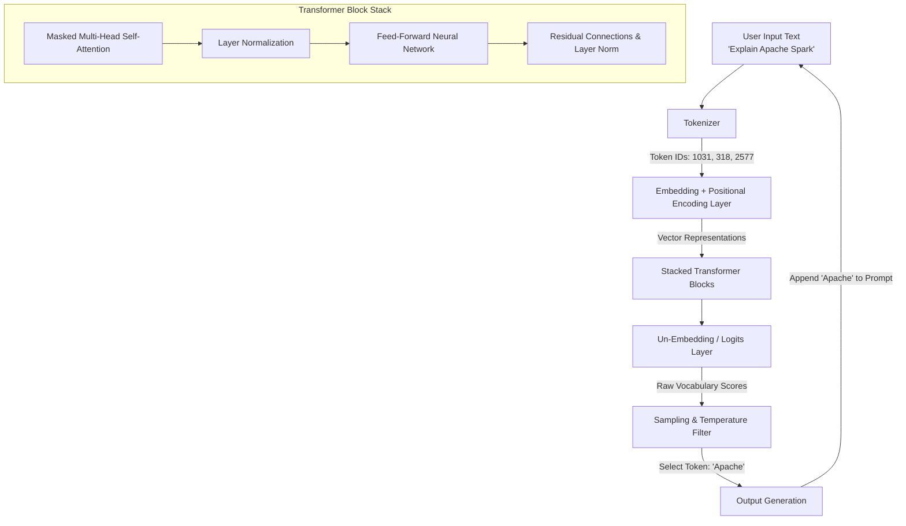

---

## 10. Deep-Dive: Transformer Internal Block Architecture

Inside each Transformer layer, two key sub-layers determine context processing:

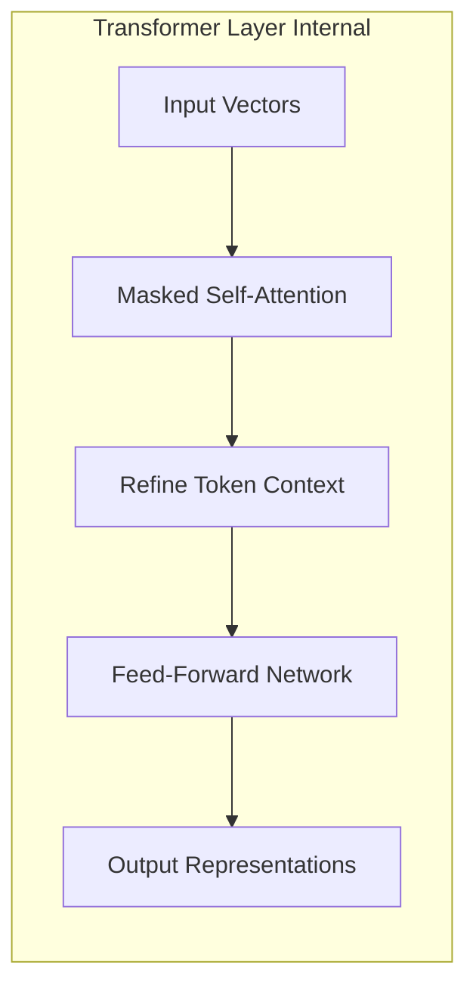

1. **Masked Self-Attention:** Enables tokens to dynamically adjust weights based on surrounding tokens.
   * *Example:* In the sentence `"Glue job failed due to schema mismatch"`, attention mechanisms link the word **"mismatch"** directly to **"schema"** and **"failed"**, establishing that the failure cause is a structural data mismatch rather than an out-of-memory error.
2. **Feed-Forward Network (FFN):** Processes the self-attention contextual embeddings to project representations into higher-level abstraction spaces, preparing the network to predict the final output token.

---

## Summary Checklist for Data Engineers

| Domain | Key Data Engineering Takeaway |
| :--- | :--- |
| **AI Workflows** | Leverage AI for boilerplate SQL/PySpark code, but manually review partition, memory, and idempotency logic. |
| **Production AI** | Data engineers own the pipeline backbone for RAG, vector database syncs, and unstructured data ingestion. |
| **Machine Learning** | Understand feature matrix ($X$) vs target labels ($Y$) to properly build ETL features for ML store platforms. |
| **LLM Mechanics** | LLMs operate via next-token prediction over dynamic context windows using embeddings and multi-head attention. |
| **Parameters** | Use lower temperature values (`0.0 - 0.2`) for deterministic code generation and structural pipeline tasks. |
