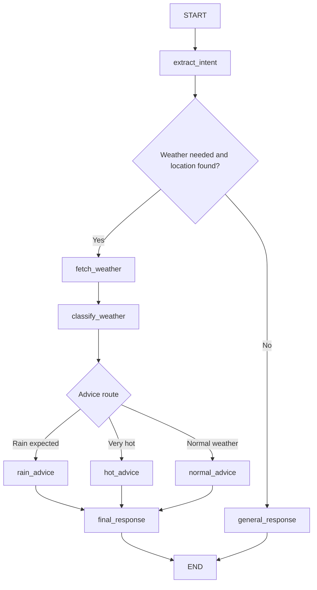

# Weather-Based Daily Planning Agent

This project is a LangGraph demo agent that helps a user plan their day using live weather data.

It uses:

- LangGraph to define the workflow as a graph
- Ollama to run a local LLM without an OpenAI API key
- Open-Meteo to fetch free weather data without an API key
- LangGraph Studio to visually run, inspect, and debug the graph

## Raw Problem Statement

**Weather-Based Daily Planning Agent**

User asks:

```text
I am going to Mumbai tomorrow. Should I carry an umbrella and what should I plan for the day?
```

The agent will:

```text
Understand user request
   |
   v
Decide whether weather data is needed
   |
   v
Call open weather API
   |
   v
Analyze weather result using LLM
   |
   v
Route conditionally:
   |-- Rain expected -> suggest umbrella + indoor-friendly plan
   |-- Very hot      -> suggest hydration + avoid afternoon outdoor plan
   `-- Normal weather -> suggest regular outdoor plan
   |
   v
Final response
```

## Final Demo Use Case

When the user asks:

```text
I am going to Mumbai tomorrow. Should I carry an umbrella?
```

The LangGraph agent:

1. Extracts the user's intent using the local Ollama LLM.
2. Decides whether live weather data is required.
3. Extracts the location and day.
4. Calls Open-Meteo geocoding to convert the city into latitude and longitude.
5. Calls Open-Meteo forecast API to get weather data.
6. Classifies the weather as rain, very hot, or normal.
7. Routes to the correct advice node.
8. Generates the final natural-language answer using the local LLM.

## Project Structure

```text
weather-agent/
|
|-- app.py
|-- langgraph.json
|-- requirements.txt
|-- pyproject.toml
|-- .env
|-- .gitignore
`-- README.md
```

### File Purpose

`app.py` contains the full LangGraph agent logic.

`langgraph.json` tells LangGraph Studio where the graph object is exported.

`requirements.txt` contains Python dependencies for setup with `pip`.

`pyproject.toml` makes the folder installable as a local Python project for LangGraph CLI.

`.env` stores local environment configuration such as the Ollama model name.

## Graph Design

### High-Level Graph Flow

```text
START
  |
  v
extract_intent
  |
  |-- weather needed and location found --> fetch_weather
  |                                         |
  |                                         v
  |                                      classify_weather
  |                                         |
  |                                         |-- rain_advice
  |                                         |-- hot_advice
  |                                         `-- normal_advice
  |                                                |
  |                                                v
  |                                          final_response
  |                                                |
  |                                                v
  |                                               END
  |
  `-- weather not needed or no location --> general_response
                                                |
                                                v
                                               END
```

### Mermaid Graph



## Graph State

Each graph run maintains a shared state dictionary.

```python
class WeatherAgentState(TypedDict):
    user_query: str
    needs_weather: bool
    location: Optional[str]
    day: Optional[str]
    weather_data: Optional[dict]
    weather_condition: Optional[str]
    advice_type: Optional[str]
    final_answer: Optional[str]
```

Example state during a weather query:

```json
{
  "user_query": "I am going to Mumbai tomorrow. Should I carry an umbrella?",
  "needs_weather": true,
  "location": "Mumbai",
  "day": "tomorrow",
  "weather_data": {
    "resolved_location": "Mumbai, India",
    "day": "tomorrow",
    "date": "2026-08-10",
    "weather_code": 80,
    "max_temp": 30.2,
    "min_temp": 26.1,
    "precipitation_probability": 70
  },
  "weather_condition": "rain_expected",
  "advice_type": "rain_advice",
  "final_answer": "..."
}
```

## Node Responsibilities

### `extract_intent`

Uses Ollama through `ChatOllama` to extract:

- Whether weather data is needed
- City or location
- Day, either `today` or `tomorrow`

### `fetch_weather`

Calls two Open-Meteo APIs:

- Geocoding API: converts city name to latitude and longitude
- Forecast API: fetches daily forecast data

### `classify_weather`

Uses simple deterministic rules:

- If precipitation probability is `>= 50`, classify as `rain_expected`
- Else if max temperature is `>= 35`, classify as `very_hot`
- Else classify as `normal_weather`

### `rain_advice`, `hot_advice`, `normal_advice`

These nodes set the final advice route in state:

- `rain_advice`
- `hot_advice`
- `normal_advice`

### `final_response`

Uses the local LLM to generate a concise final answer using:

- User query
- Location
- Day
- Weather data
- Weather condition
- Advice route

### `general_response`

Handles non-weather questions without calling the weather API.

## Conditional Routing

The graph has two routing decisions.

### Route 1: After Intent Extraction

```text
If needs_weather is true and location exists:
    go to fetch_weather
Else:
    go to general_response
```

### Route 2: After Weather Classification

```text
If advice_type is rain_advice:
    go to rain_advice
If advice_type is hot_advice:
    go to hot_advice
Else:
    go to normal_advice
```

## Prerequisites

You need:

- Python 3.10 or newer
- Internet access for Python package installation and Open-Meteo API calls
- Ollama installed locally
- The Ollama model `llama3.2:3b`

Check Python:

```bash
python --version
```

If your system uses `python3` instead of `python`, use `python3` in the setup commands.

## Complete Setup Guide

Run all commands from this folder:

```bash
cd /Users/shashankmishra/Desktop/AI_DE_With_AWS/AI-Fundamentals-Class-2/weather-agent
```

### Step 1: Install Ollama

Download and install Ollama:

```text
https://ollama.com/download
```

After installation, verify:

```bash
ollama --version
```

If this command is not found, close and reopen your terminal. If it still fails, confirm Ollama was installed correctly and that its command-line tool is available in your PATH.

### Step 2: Pull the Local LLM Model

```bash
ollama pull llama3.2:3b
```

Optional quick model test:

```bash
ollama run llama3.2:3b
```

Ask:

```text
Say hello in one sentence.
```

Exit the Ollama chat:

```text
/bye
```

Keep the Ollama app or service running in the background.

### Step 3: Create a Python Virtual Environment

```bash
python -m venv .venv
```

Activate it on macOS or Linux:

```bash
source .venv/bin/activate
```

Activate it on Windows PowerShell:

```powershell
.venv\Scripts\Activate.ps1
```

Activate it on Windows Command Prompt:

```bat
.venv\Scripts\activate.bat
```

### Step 4: Install Python Dependencies

```bash
pip install -r requirements.txt
```

### Step 5: Confirm Environment Configuration

The `.env` file should contain:

```text
OLLAMA_MODEL=llama3.2:3b
```

To use a different local Ollama model, update `.env`, then make sure that model is pulled with `ollama pull`.

### Step 6: Verify the Graph Imports

```bash
python -c "import app; print(type(app.graph).__name__)"
```

Expected output:

```text
CompiledStateGraph
```

## Runbook: Terminal Execution

### Step 1: Open Terminal in the Project Folder

```bash
cd /Users/shashankmishra/Desktop/AI_DE_With_AWS/AI-Fundamentals-Class-2/weather-agent
```

### Step 2: Activate the Virtual Environment

```bash
source .venv/bin/activate
```

### Step 3: Make Sure Ollama Is Running

```bash
ollama list
```

You should see `llama3.2:3b` in the model list.

If the model is missing:

```bash
ollama pull llama3.2:3b
```

### Step 4: Start the Agent

```bash
python app.py
```

You should see:

```text
Weather Planning Agent is ready.
Using Ollama model: llama3.2:3b
Type 'exit' to stop.
```

### Step 5: Run a Weather Prompt

```text
I am going to Mumbai tomorrow. Should I carry an umbrella and what should I plan for the day?
```

Expected behavior:

```text
extract_intent
 -> fetch_weather
 -> classify_weather
 -> rain_advice / hot_advice / normal_advice
 -> final_response
```

The terminal also prints a debug state so you can show:

- Whether weather was needed
- Which location was extracted
- Which day was extracted
- Which route was selected
- What weather data was fetched

### Step 6: Run a Non-Weather Prompt

```text
Give me 5 general tips for planning a short trip.
```

Expected behavior:

```text
extract_intent
 -> general_response
```

No weather API call should be needed for this prompt.

### Step 7: Stop the Agent

```text
exit
```

or:

```text
quit
```

## Runbook: LangGraph Studio Execution

LangGraph Studio is useful for visually inspecting the graph and seeing state updates node by node.

### Step 1: Open Terminal in the Project Folder

```bash
cd /Users/shashankmishra/Desktop/AI_DE_With_AWS/AI-Fundamentals-Class-2/weather-agent
```

### Step 2: Activate the Virtual Environment

```bash
source .venv/bin/activate
```

### Step 3: Start the LangGraph Dev Server

```bash
langgraph dev --allow-blocking
```

Why `--allow-blocking` is used:

This demo uses the synchronous `requests` package for Open-Meteo API calls. The flag allows this simple teaching example to run in the local LangGraph dev server.

### Step 4: Open Studio

The command prints URLs similar to:

```text
API: http://127.0.0.1:2024
Studio UI: https://smith.langchain.com/studio/?baseUrl=http://127.0.0.1:2024
API Docs: http://127.0.0.1:2024/docs
```

Open the Studio UI URL in your browser.

You may need to sign in to LangSmith.

### Step 5: Select the Graph

Select:

```text
weather_agent
```

### Step 6: Use This Initial State

```json
{
  "user_query": "I am going to Mumbai tomorrow. Should I carry an umbrella and what should I plan for the day?",
  "needs_weather": false,
  "location": null,
  "day": null,
  "weather_data": null,
  "weather_condition": null,
  "advice_type": null,
  "final_answer": null
}
```

### Step 7: Run the Graph

After running, inspect:

- `extract_intent` output
- `fetch_weather` API result
- `classify_weather` route
- `rain_advice`, `hot_advice`, or `normal_advice`
- `final_response`

### Step 8: Stop the Dev Server

Return to the terminal and press:

```text
Ctrl+C
```

## Demo Prompts

### Prompt 1: Weather API Path

```text
I am going to Mumbai tomorrow. Should I carry an umbrella and what should I plan for the day?
```

Expected graph path:

```text
extract_intent
 -> fetch_weather
 -> classify_weather
 -> rain_advice / normal_advice
 -> final_response
```

### Prompt 2: Hot Weather Path

```text
I am going to Jaipur tomorrow. What should I keep in mind?
```

Expected graph path:

```text
extract_intent
 -> fetch_weather
 -> classify_weather
 -> hot_advice / normal_advice
 -> final_response
```

### Prompt 3: No API Path

```text
Give me 5 general tips for planning a short trip.
```

Expected graph path:

```text
extract_intent
 -> general_response
```

### Prompt 4: Today Weather Path

```text
I have outdoor work in Delhi today. How should I plan?
```

Expected graph path:

```text
extract_intent
 -> fetch_weather
 -> classify_weather
 -> rain_advice / hot_advice / normal_advice
 -> final_response
```

## Expected Outputs

The exact final text will vary because it is generated by the local LLM. A successful answer should include:

- Whether to carry an umbrella
- Weather summary
- Practical planning advice
- A short reason behind the recommendation

The terminal debug state should show values similar to:

```text
needs_weather: True
location: Mumbai
day: tomorrow
weather_condition: rain_expected / very_hot / normal_weather
advice_type: rain_advice / hot_advice / normal_advice
weather_data: {...}
```

## What This Demo Proves

This project demonstrates:

- LLM-based intent extraction
- Shared state across a graph execution
- External API tool use
- Deterministic weather classification
- Conditional routing
- Final LLM response generation
- Visual debugging through LangGraph Studio

## Class Explanation Notes

### What Is State?

State is the shared memory of one graph execution.

Example:

```json
{
  "user_query": "I am going to Mumbai tomorrow...",
  "location": "Mumbai",
  "day": "tomorrow",
  "weather_data": {
    "precipitation_probability": 70,
    "max_temp": 30.2
  },
  "weather_condition": "rain_expected",
  "advice_type": "rain_advice"
}
```

### What Is a Node?

A node is one step in the workflow.

Examples:

- `extract_intent_node`
- `fetch_weather_node`
- `classify_weather_node`
- `final_response_node`

### What Is Conditional Routing?

Conditional routing chooses the next node based on the current state.

Example:

```text
If weather is needed -> fetch_weather
Else -> general_response
```

Another example:

```text
If rain expected -> rain_advice
If very hot -> hot_advice
Else -> normal_advice
```

### What Is the External Tool?

The external tool is the Open-Meteo weather API.

The app calls Open-Meteo only when the query needs weather data and the city is known.

### What Is the LLM Doing?

The local Ollama LLM is used for:

1. Extracting intent from the user query
2. Generating the final human-friendly answer

Weather fetching and classification are handled by normal Python code.

## Troubleshooting

### `ollama: command not found`

Install Ollama from:

```text
https://ollama.com/download
```

Then close and reopen the terminal.

### Ollama Model Not Found

Run:

```bash
ollama pull llama3.2:3b
```

### Ollama Connection Error

Make sure the Ollama app or service is running.

Test it:

```bash
ollama run llama3.2:3b
```

### Python Dependency Error

Make sure the virtual environment is active:

```bash
source .venv/bin/activate
```

Then reinstall:

```bash
pip install -r requirements.txt
```

### LangGraph Studio Does Not Start

Use:

```bash
langgraph dev --allow-blocking
```

If port `2024` is already in use:

```bash
langgraph dev --allow-blocking --port 2025
```

Then open the Studio URL printed in the terminal.

### Weather API Error

Open-Meteo requires internet access. Check that your network is available and try again.

### Location Not Detected

Use a prompt that clearly includes a city.

Good:

```text
I am going to Mumbai tomorrow. Should I carry an umbrella?
```

Less clear:

```text
Should I carry an umbrella tomorrow?
```

In the less clear case, the graph routes to `general_response` because no location was found.

## Important Commands Summary

```bash
cd /Users/shashankmishra/Desktop/AI_DE_With_AWS/AI-Fundamentals-Class-2/weather-agent
python -m venv .venv
source .venv/bin/activate
pip install -r requirements.txt
ollama pull llama3.2:3b
python app.py
```

For LangGraph Studio:

```bash
source .venv/bin/activate
langgraph dev --allow-blocking
```

## One-Line Explanation

LangGraph lets us convert a chatbot into a structured workflow where every step, state update, tool call, routing decision, and final response can be controlled and inspected.
