\
# AI Fundamentals for Data Engineering

> Interview-oriented notes on **RAG, LLM tooling, AI agents, agent architecture, agent frameworks, and MCP**, distilled and reorganized from the supplied *AI Fundamentals for Data Engineering* document.

## How to Use These Notes

Use this document in three passes:

1. **Understand** — read the concept and architecture.
2. **Recall** — use the mental model and "Remember" section.
3. **Speak** — practice the interview answer without reading it.

### Source Scope

The supplied document is primarily focused on:

- Retrieval-Augmented Generation (RAG)
- Chunking strategies
- Reranking
- RAG architectures
- Tool calling / tooling in LLM applications
- AI agents
- Agent architecture
- Agent frameworks
- MCP (Model Context Protocol)
- Data Engineering use cases for agentic systems

The notes below preserve that scope instead of adding unrelated ML topics that are not covered in the source.

---

## Table of Contents

- [1. RAG Fundamentals](#1-rag-fundamentals)
  - [1.1 What is RAG?](#11-what-is-rag)
  - [1.2 Why RAG is needed](#12-why-rag-is-needed)
  - [1.3 RAG mental model](#13-rag-mental-model)
- [2. RAG Pipeline](#2-rag-pipeline)
  - [2.1 Knowledge / Indexing Pipeline](#21-knowledge--indexing-pipeline)
  - [2.2 Query / Retrieval Pipeline](#22-query--retrieval-pipeline)
  - [2.3 End-to-end RAG flow](#23-end-to-end-rag-flow)
- [3. Chunking Strategy](#3-chunking-strategy)
  - [3.1 What is chunking?](#31-what-is-chunking)
  - [3.2 Why chunking matters](#32-why-chunking-matters)
  - [3.3 Chunking strategies](#33-chunking-strategies)
  - [3.4 Chunk overlap](#34-chunk-overlap)
  - [3.5 Chunk-size trade-off](#35-chunk-size-trade-off)
- [4. Reranking](#4-reranking)
  - [4.1 What is reranking?](#41-what-is-reranking)
  - [4.2 Why reranking is useful](#42-why-reranking-is-useful)
  - [4.3 Production retrieval flow](#43-production-retrieval-flow)
- [5. RAG Architectures](#5-rag-architectures)
  - [5.1 Naive / Basic RAG](#51-naive--basic-rag)
  - [5.2 Advanced RAG](#52-advanced-rag)
  - [5.3 Conversational RAG](#53-conversational-rag)
  - [5.4 Agentic RAG](#54-agentic-rag)
  - [5.5 Architecture comparison](#55-architecture-comparison)
- [6. Tooling in LLM Applications](#6-tooling-in-llm-applications)
  - [6.1 What is tooling?](#61-what-is-tooling)
  - [6.2 Why tools are needed](#62-why-tools-are-needed)
  - [6.3 Examples](#63-examples)
  - [6.4 Tool-calling mental model](#64-tool-calling-mental-model)
- [7. AI Agents](#7-ai-agents)
  - [7.1 What is an AI agent?](#71-what-is-an-ai-agent)
  - [7.2 Agent loop](#72-agent-loop)
  - [7.3 Example](#73-example)
- [8. Agent Architecture](#8-agent-architecture)
  - [8.1 Core components](#81-core-components)
  - [8.2 Why architecture matters](#82-why-architecture-matters)
  - [8.3 Agent architecture flow](#83-agent-architecture-flow)
- [9. Agent Frameworks](#9-agent-frameworks)
  - [9.1 What is an agent framework?](#91-what-is-an-agent-framework)
  - [9.2 What frameworks help with](#92-what-frameworks-help-with)
  - [9.3 Frameworks mentioned in the source](#93-frameworks-mentioned-in-the-source)
  - [9.4 Example agent workflow](#94-example-agent-workflow)
- [10. MCP — Model Context Protocol](#10-mcp--model-context-protocol)
  - [10.1 What is MCP?](#101-what-is-mcp)
  - [10.2 Why MCP is needed](#102-why-mcp-is-needed)
  - [10.3 How MCP works](#103-how-mcp-works)
  - [10.4 What an MCP server can expose](#104-what-an-mcp-server-can-expose)
  - [10.5 MCP architecture](#105-mcp-architecture)
  - [10.6 Data Engineering use case](#106-data-engineering-use-case)
- [11. RAG vs Tooling vs Agents vs MCP](#11-rag-vs-tooling-vs-agents-vs-mcp)
- [12. Data Engineer Perspective](#12-data-engineer-perspective)
- [13. Common Misconceptions](#13-common-misconceptions)
- [14. Interview Focus](#14-interview-focus)
- [15. Interview Questions](#15-interview-questions)
- [16. Mental Models](#16-mental-models)
- [17. Quick Revision Cheat Sheet](#17-quick-revision-cheat-sheet)

---

# 1. RAG Fundamentals

## 1.1 What is RAG?

**RAG (Retrieval-Augmented Generation)** is a technique in which an LLM uses **external information** to answer a question instead of relying only on what it learned during training.

The source describes RAG as especially useful when information is:

- private
- enterprise-specific
- frequently updated
- unavailable to a public LLM

### Core idea

> **RAG = LLM + Relevant External Knowledge**

A standalone LLM is responsible for reasoning/generation, while RAG adds a retrieval step that supplies relevant external context.

### Simple mental model

```text
User Question
     ↓
Find relevant information
     ↓
Give that information to the LLM
     ↓
Generate a grounded answer
```

---

## 1.2 Why RAG is needed

Consider:

> "What is our company's reimbursement policy for international travel?"

A standalone public LLM may:

- not know the internal company policy
- have outdated information
- produce an incorrect answer
- hallucinate confidently

RAG addresses this by retrieving the relevant enterprise information before generation.

### RAG in one sentence

> **Retrieve first, then generate using the retrieved context.**

---

## 1.3 RAG mental model

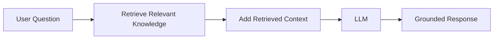

### Remember

- RAG does not depend only on the LLM's training knowledge.
- External knowledge is retrieved at query time.
- The retrieved content becomes context for generation.
- The goal is a more grounded answer.

### Interview Answer

> "RAG, or Retrieval-Augmented Generation, is an architecture where relevant external information is retrieved for a user's query and supplied to an LLM as context before the LLM generates the answer. It is useful for private, domain-specific, or frequently changing information."

---

# 2. RAG Pipeline

A RAG system in the source is divided into **two major pipelines**:

1. **Knowledge / Indexing Pipeline**
2. **Query / Retrieval Pipeline**

This separation is one of the most important concepts to understand.

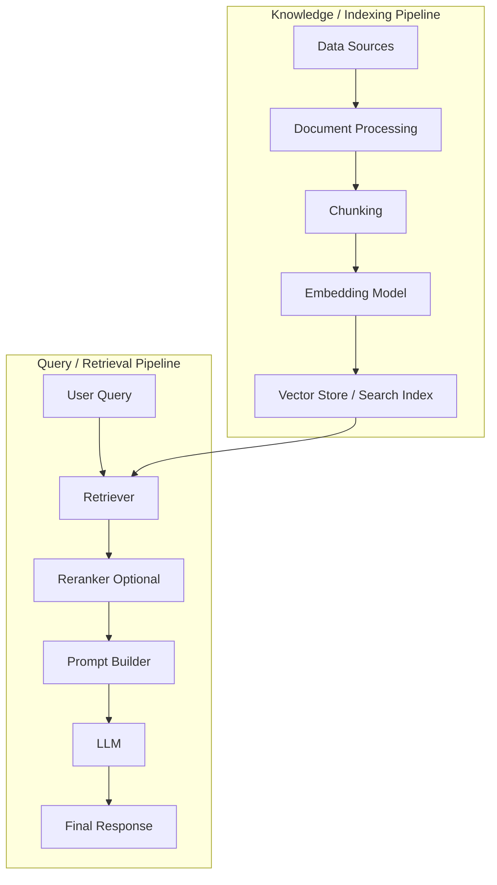

---

## 2.1 Knowledge / Indexing Pipeline

The indexing pipeline prepares enterprise data so it can be searched efficiently.

### Components

| Component | Responsibility |
|---|---|
| Data Sources | Supply enterprise knowledge |
| Document Processing | Extract and clean useful content |
| Chunking | Split large documents into meaningful pieces |
| Embedding Model | Convert chunks into numerical vectors |
| Vector Store / Search Index | Store chunks, embeddings, and metadata for retrieval |

### Typical data sources

The source gives examples such as:

- PDFs
- websites
- SharePoint
- Confluence
- databases
- APIs

### Document processing

The document-processing stage may involve:

- extracting text
- removing noise
- normalizing content
- preserving useful metadata

### Why metadata matters

Metadata travels with the searchable content and can be useful for narrowing or identifying the right information.

Examples from the source's advanced RAG flow include:

- source
- document type
- date
- tags

---

## 2.2 Query / Retrieval Pipeline

This pipeline is executed when the user asks a question.

### Components

| Component | Responsibility |
|---|---|
| Retriever | Finds relevant chunks |
| Reranker | Optionally reorders candidates by relevance |
| Prompt Builder | Combines instructions, context, and question |
| LLM | Generates the final response |

The source specifically mentions:

> **System Instructions + Retrieved Context + User Question**

as the information combined by the prompt builder.

---

## 2.3 End-to-end RAG flow

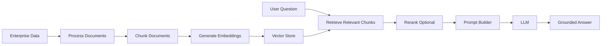

### Data Engineer view

The strongest Data Engineering contribution is usually on the **data side of the system**:

```text
Source Systems
    ↓
Ingestion
    ↓
Processing
    ↓
Chunking
    ↓
Metadata
    ↓
Embeddings
    ↓
Search / Vector Store
    ↓
Retrieval
```

### Interview Focus

Be ready to explain:

- Why is there an indexing pipeline and a retrieval pipeline?
- What happens before a document reaches the vector store?
- Why is chunking required?
- What data is stored in a vector store?
- What role does metadata play?
- Where does reranking fit?

---

# 3. Chunking Strategy

## 3.1 What is chunking?

**Chunking** is the process of splitting a large document into smaller, meaningful pieces before generating embeddings.

Example:

A 30-page HR policy may contain:

- Leave Policy
- Travel Policy
- Hotel Reimbursement
- Insurance
- Payroll

Instead of embedding the entire PDF as one unit:

```text
30-page PDF
```

the document can be divided into focused chunks:

```text
Chunk 1 → Leave Policy
Chunk 2 → Travel Policy
Chunk 3 → Hotel Reimbursement
Chunk 4 → Insurance
...
```

---

## 3.2 Why chunking matters

The source's reasoning is:

> Retrieval works better when the vector database contains focused pieces of information rather than entire documents.

For example:

```text
Question:
"What is the hotel reimbursement limit?"

          ↓

Relevant chunk:
"Hotel Reimbursement"
```

The retriever can therefore return information focused on the actual question.

---

## 3.3 Chunking strategies

### 1. Fixed-size chunking

Split content into a fixed token range.

The source gives **300–500 tokens** as an example.

```text
Document
├── Chunk 1: 1–500
├── Chunk 2: 501–1000
└── Chunk 3: 1001–1500
```

**Strength:** simple and predictable.

**Risk:** boundaries may cut through a logical idea.

---

### 2. Recursive chunking

Try natural boundaries first, then use smaller boundaries when the chunk remains too large.

Typical conceptual order:

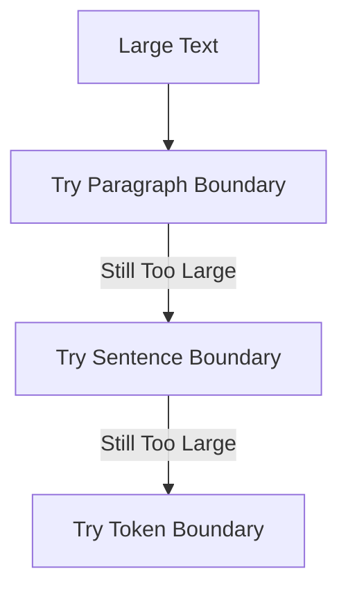

The source describes the strategy as:

> paragraph → sentence → token boundaries

This aims to preserve natural meaning while respecting chunk size.

---

### 3. Semantic chunking

Split when the **topic or meaning changes**.

Example:

```text
Topic: Travel Policy
        ↓
Topic changes
        ↓
Topic: Hotel Reimbursement
```

This attempts to make chunk boundaries align with meaning instead of only character or token counts.

---

### 4. Chunk overlap

A small portion of one chunk is repeated in the next chunk so that information near boundaries is not lost.

Source example:

```text
Chunk 1 → Tokens 1–500
Chunk 2 → Tokens 450–950
```

Therefore, tokens **450–500** overlap.

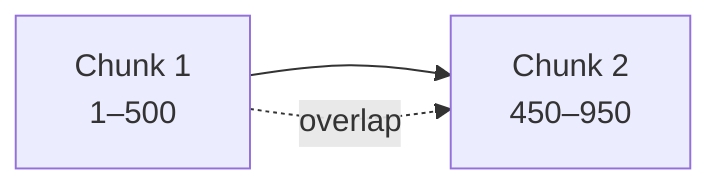

---

## 3.4 Chunk overlap

### Why use overlap?

Suppose an important explanation starts near the end of one chunk and finishes near the beginning of the next.

Without overlap:

```text
Chunk 1 → beginning of explanation
Chunk 2 → rest of explanation
```

With overlap:

```text
Chunk 1 → explanation begins
          ↓
Chunk 2 → carries some previous context + continuation
```

This can preserve continuity around chunk boundaries.

---

## 3.5 Chunk-size trade-off

There is no single chunk size that is best for every dataset.

### Too large

```text
Large Chunk
   ↓
More irrelevant context
   ↓
Less focused retrieval
```

### Too small

```text
Small Chunk
   ↓
Less surrounding context
   ↓
Important meaning may be lost
```

### The goal

> **Enough context for meaning + enough focus for accurate retrieval**

### Interview Answer

> "Chunking is the process of breaking large documents into smaller meaningful pieces before creating embeddings. Good chunking improves retrieval quality because the system can retrieve focused information instead of an entire document. The main trade-off is that chunks that are too large add irrelevant context, while chunks that are too small can lose important context."

### Remember

- Chunking happens before embedding generation.
- Focused chunks improve retrieval.
- Recursive chunking prefers natural boundaries.
- Semantic chunking follows meaning changes.
- Overlap preserves context around boundaries.
- Chunk size is a retrieval-quality trade-off.

---

# 4. Reranking

## 4.1 What is reranking?

**Reranking** is an optional retrieval step that re-evaluates the chunks returned by the initial search and places the most relevant chunks first.

### Why is it needed?

The source highlights an important distinction:

> **Most similar does not always mean most useful.**

A vector search can be fast and still return candidates that are not the best final context for answering the question.

---

## 4.2 Why reranking is useful

Example question:

> "Can I claim hotel expenses above ₹8,000?"

Initial vector search:

| Rank | Document | Initial Score |
|---:|---|---:|
| 1 | Travel Policy | 0.92 |
| 2 | Hotel Reimbursement | 0.88 |
| 3 | Expense Policy | 0.84 |
| 4 | International Travel | 0.81 |
| 5 | Leave Policy | 0.76 |

After reranking:

| Rank | Document |
|---:|---|
| 1 | Hotel Reimbursement |
| 2 | Expense Policy |
| 3 | Travel Policy |
| 4 | International Travel |
| 5 | Leave Policy |

The reranker has moved the chunk most useful for the actual question to the top.

---

## 4.3 Production retrieval flow

The source gives this production-oriented pattern:

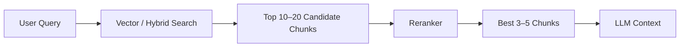

### Two-stage retrieval idea

```text
Stage 1 → Fast candidate retrieval
Stage 2 → More focused relevance ranking
```

### Interview Answer

> "Reranking is an optional second-stage retrieval step. The initial retriever quickly returns candidate chunks, and the reranker evaluates those candidates again to determine which ones are most relevant to the question before the final context is sent to the LLM."

### Remember

- Reranking is optional.
- It happens after initial retrieval.
- It improves ordering of candidate chunks.
- It adds latency, cost, and system complexity.
- Its purpose is better relevance, not more documents.

---

# 5. RAG Architectures

The source presents four RAG architectures:

1. Naive / Basic RAG
2. Advanced RAG
3. Conversational RAG
4. Agentic RAG

---

## 5.1 Naive / Basic RAG

### Core idea

Basic RAG follows a straightforward retrieval → generation flow.

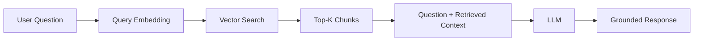

### Best fit

The source positions this architecture for simpler use cases such as:

- document Q&A
- FAQs
- internal knowledge bases
- RAG PoCs

### Limitation

The source highlights a key risk:

> If the original query is unclear or the wrong chunks are retrieved, answer quality drops.

---

## 5.2 Advanced RAG

Advanced RAG improves retrieval quality before context reaches the LLM.

The source diagram includes:

1. User question
2. Query rewrite / expansion
3. Metadata filtering
4. Hybrid search
5. Retrieve candidate chunks
6. Reranking
7. Select best context
8. LLM
9. Grounded response

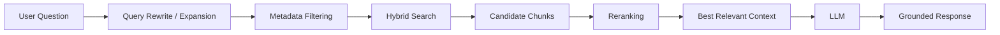

### Hybrid search

The source describes hybrid search as:

> **Vector + Keyword**

This means semantic search and keyword search are used together.

### Best fit

The source positions Advanced RAG for:

- enterprise search
- large knowledge bases
- high-accuracy RAG applications
- complex policies/documentation

### Limitation

Better retrieval can introduce:

- additional latency
- additional cost
- more components
- more system complexity

---

## 5.3 Conversational RAG

Conversational RAG uses the **current question together with previous conversation context**.

Example:

```text
User:
"What is our hotel reimbursement policy?"

Assistant:
"Employees can claim up to ₹8,000 per night."

User:
"What about international travel?"
```

The second question is ambiguous by itself.

The conversational RAG flow resolves the context into a standalone query such as:

```text
"Hotel reimbursement policy for international travel"
```

### Architecture

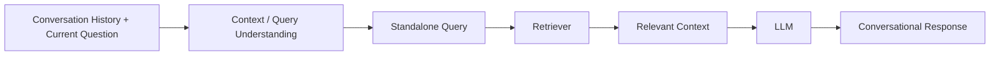

### Best fit

The source lists examples such as:

- enterprise chatbots
- HR assistants
- customer-support assistants
- knowledge copilots
- multi-turn Q&A

### Limitation

Long conversation history can:

- introduce irrelevant context
- increase token usage
- make context management harder

---

## 5.4 Agentic RAG

Agentic RAG introduces an **agent that decides what information is needed, where to retrieve it, and which tools or sources to use**.

The source architecture includes:

```text
User Request
    ↓
AI Agent / LLM
    ↓
Plan What Is Needed
    ↓
Select Tools / Sources
    ↓
Retrieve / Execute
    ↓
Reason Over Results
    ↓
Final Answer / Action
```

### Mermaid view

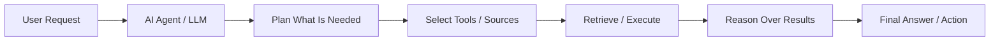

The agent may choose among sources such as:

- Vector Database
- SQL / HR Database
- APIs
- Other tools

### Example

Question:

> "How many leaves do I have left and can I carry them forward next year?"

The source's agent can:

1. Query the HR database for leave balance.
2. Search leave-policy documents for carry-forward rules.
3. Combine both results.
4. Generate a grounded answer.

### Best fit

The source positions Agentic RAG for:

- complex enterprise assistants
- multiple data sources
- dynamic workflows
- reasoning + actions

### Limitation

More autonomy increases:

- orchestration complexity
- latency
- cost
- security concerns
- reliability concerns

---

## 5.5 Architecture comparison

| Architecture | Main Idea | Strength | Main Limitation |
|---|---|---|---|
| Basic RAG | Direct retrieve → generate | Simple | Sensitive to retrieval quality |
| Advanced RAG | Improve retrieval before generation | Higher retrieval quality | More complexity/latency/cost |
| Conversational RAG | Use conversation context | Supports multi-turn Q&A | Long history can add irrelevant context |
| Agentic RAG | Agent plans and selects sources/tools | Handles dynamic multi-source workflows | More orchestration and reliability concerns |

### Interview Answer

> "Basic RAG retrieves relevant chunks and passes them to the LLM. Advanced RAG adds retrieval enhancements such as query rewriting, metadata filtering, hybrid search, and reranking. Conversational RAG incorporates previous conversation context. Agentic RAG goes further by allowing an agent to decide what information or tools are needed and then reason over the results."

### Remember

```text
Basic      → Retrieve
Advanced   → Improve retrieval
Conversational → Understand conversation
Agentic    → Decide, retrieve, reason, act
```

---

# 6. Tooling in LLM Applications

## 6.1 What is tooling?

**Tooling** means giving an LLM access to external capabilities so that it can:

- retrieve live information
- perform actions
- interact with real systems

This extends the LLM beyond being only a text generator.

---

## 6.2 Why tools are needed

The source states that an LLM alone cannot directly do tasks such as:

- check live database records
- call APIs
- read private files
- send emails
- query business systems
- perform real-time calculations

Tools bridge the gap.

### Mental model

```text
LLM
 ↓
Decides what capability is needed
 ↓
Calls a tool
 ↓
Tool interacts with external system
 ↓
Tool result returns
 ↓
LLM uses result
```

---

## 6.3 Examples

Examples from the source:

```text
get_leave_balance()
search_policy_docs()
query_sales_database()
send_email()
create_calendar_event()
```

A tool can therefore represent an action or capability exposed to the LLM application.

---

## 6.4 Tool-calling mental model

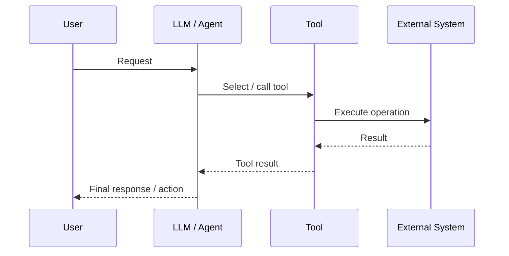

### Interview Answer

> "Tooling gives an LLM access to external capabilities such as databases, APIs, files, or business systems. Instead of relying only on text generation, the LLM can invoke a tool, receive the result, and use that result to answer or perform an action."

---

# 7. AI Agents

## 7.1 What is an AI agent?

The source defines an AI agent as an LLM-powered system that can:

- understand a goal
- plan steps
- use tools
- store intermediate state
- continue until the task is completed

### Agent formula

> **Agent = LLM + Tools + State + Decision Loop**

This is a useful interview mental model.

---

## 7.2 Agent loop

A simplified agent loop is:

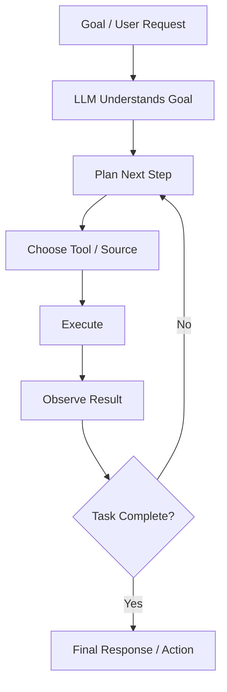

The important idea is that an agent can **iterate** rather than perform only one retrieval step.

---

## 7.3 Example

User:

> "Plan a 3-day Goa trip under ₹30,000."

An agent can reason about:

```text
Budget + Dates
     ↓
Search flights
     ↓
Compare hotels
     ↓
Check attractions
     ↓
Build itinerary
```

The source explains that the system combines:

- preferences
- search results
- constraints

to assemble a plan.

### Interview Answer

> "An AI agent is an LLM-powered system that can understand a goal, decide what steps are needed, use tools or data sources, maintain state, and iterate until it can produce a result or take an action."

### Remember

- LLM alone → generates/reasons
- Agent → reasons + decides + uses tools + maintains state + iterates

---

# 8. Agent Architecture

## 8.1 Core components

The source identifies six major components:

| Component | Role |
|---|---|
| Planner | Breaks the task into steps |
| Tools | External capabilities |
| State | Tracks current progress and context |
| Memory | Stores reusable information |
| Guardrails | Controls unsafe or invalid actions |
| Observability | Captures logs, traces, and metrics |

### Component relationships

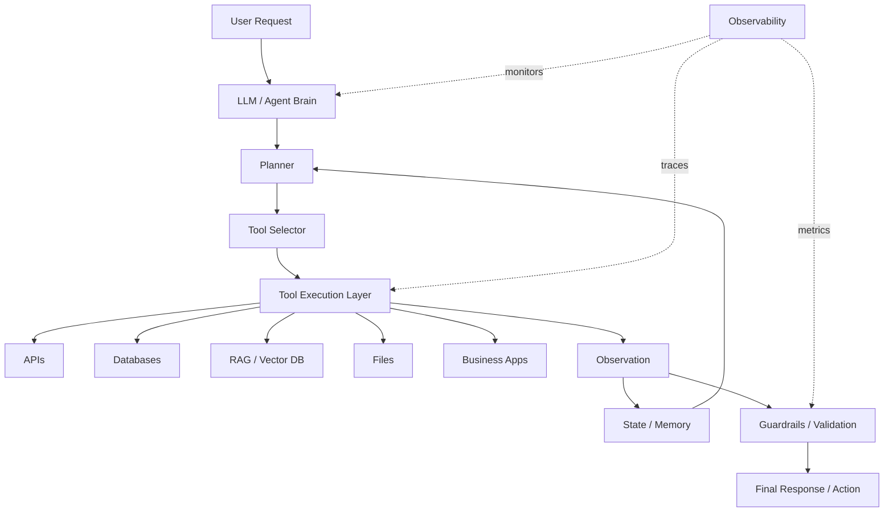

---

## 8.2 Why architecture matters

The source highlights why a deliberate agent architecture matters:

### State

Provides context for the current run.

### Guardrails

Help control:

- safety
- permissions
- risky actions

### Observability

Helps with:

- visibility
- debugging
- traceability

### Data Engineering connection

An agent may need to interact with:

- databases
- vector stores
- APIs
- files
- business applications
- workflow systems

That makes architecture important not only for the LLM but also for the systems around it.

---

## 8.3 Agent architecture flow

A practical mental model from the source is:

```text
User Request
    ↓
LLM / Agent Brain
    ↓
Planner
    ↓
Tool Selector
    ↓
Tool Execution Layer
    ↓
Observation
    ↓
State / Memory
    ↓
Guardrails / Validation
    ↓
Final Response / Action
```

The agent architecture should be designed so that tool execution, state, safety, and observability are explicit parts of the system.

### Interview Answer

> "Agent architecture defines how an agent plans work, selects and calls tools, tracks state and memory, applies guardrails, and observes execution. The goal is to make an agent reliable, traceable, and controllable rather than simply giving an LLM unrestricted tool access."

---

# 9. Agent Frameworks

## 9.1 What is an agent framework?

An **agent framework** provides reusable building blocks for creating, controlling, debugging, and deploying agent workflows.

---

## 9.2 What frameworks help with

The source lists capabilities including:

- tool registration
- planning
- agent loops
- state management
- conditional routing
- retries / fallbacks
- human approval
- tracing
- debugging

### Mental model

```text
Agent Framework
     ↓
Workflow orchestration
     +
State
     +
Tools
     +
Routing
     +
Retries
     +
Human approval
     +
Tracing
```

---

## 9.3 Frameworks mentioned in the source

| Framework | Source description |
|---|---|
| LangGraph | Graph-based agent workflows |
| OpenAI Agents SDK | Tool calling, handoffs, tracing |
| CrewAI | Multi-agent collaboration |
| AutoGen | Conversational multi-agent systems |
| LlamaIndex | RAG + agent workflows |

> **Source note:** Framework capabilities and product APIs can change over time. The table above reflects the descriptions present in the supplied document.

---

## 9.4 Example agent workflow

User:

> "Reschedule my meeting and inform the team."

The source's example workflow is:

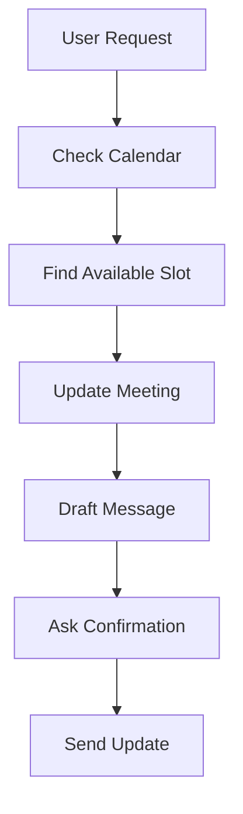

The important design idea is that the agent can execute a **multi-step workflow**, not just return a paragraph of text.

### Interview Focus

Be ready to explain:

- What problem does an agent framework solve?
- Why is state management important?
- What is conditional routing?
- Why are retries/fallbacks needed?
- Why is tracing important?
- When might human approval be required?

---

# 10. MCP — Model Context Protocol

## 10.1 What is MCP?

**MCP (Model Context Protocol)** is described in the source as a standard way for AI applications and agents to connect with external systems such as:

- databases
- files
- APIs
- tools
- workflows

### Core mental model

> **MCP = a standard connector layer for AI applications**

Instead of building one-off integrations for every system, MCP introduces a standardized connection model.

---

## 10.2 Why MCP is needed

### Without MCP

An agent may require separate integrations:

```text
Agent
 ├── Custom Snowflake integration
 ├── Custom Airflow integration
 ├── Custom Databricks integration
 └── Custom Docs integration
```

This can lead to multiple custom connection patterns.

### With MCP

```text
Agent / AI App
      ↓
  MCP Client
      ↓
  MCP Servers
      ↓
┌────────────┬──────────────┬──────────────┬─────────────┐
│ Warehouse  │ APIs         │ Docs         │ Tools       │
└────────────┴──────────────┴──────────────┴─────────────┘
```

### Why it matters

The source's main idea is:

> **Avoid one-off custom integrations by using a standardized connector layer.**

---

## 10.3 How MCP works

The source's MCP flow can be summarized as:

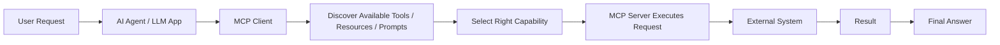

A key source statement is:

> The LLM does not directly access the systems; MCP provides controlled access through standardized servers.

---

## 10.4 What an MCP server can expose

The source identifies three categories:

| MCP Capability | Meaning |
|---|---|
| Tools | Callable actions / functions |
| Resources | Readable context, data, files, or metadata |
| Prompts | Reusable workflow templates |

### Remember

```text
Tools     → Do something
Resources → Read something
Prompts   → Reuse an interaction/workflow template
```

---

## 10.5 MCP architecture

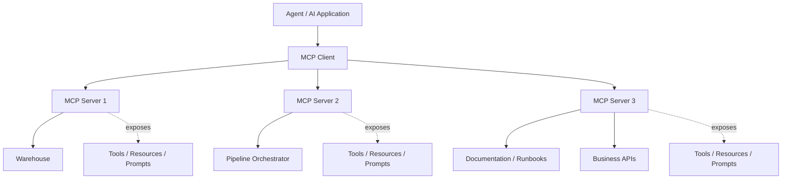

---

## 10.6 Data Engineering use case

The source provides a useful Data Engineering example.

### Situation

A pipeline loads processed sales data into a warehouse.

A user asks:

> "Why is today's sales dashboard showing lower revenue?"

An MCP-enabled agent can combine signals from multiple systems.

### Example MCP servers

```text
Airflow MCP Server
    → get_pipeline_status()

Warehouse MCP Server
    → check_row_count()
    → run_reconciliation_query()

Docs MCP Server
    → search_runbook()
```

### Investigation flow

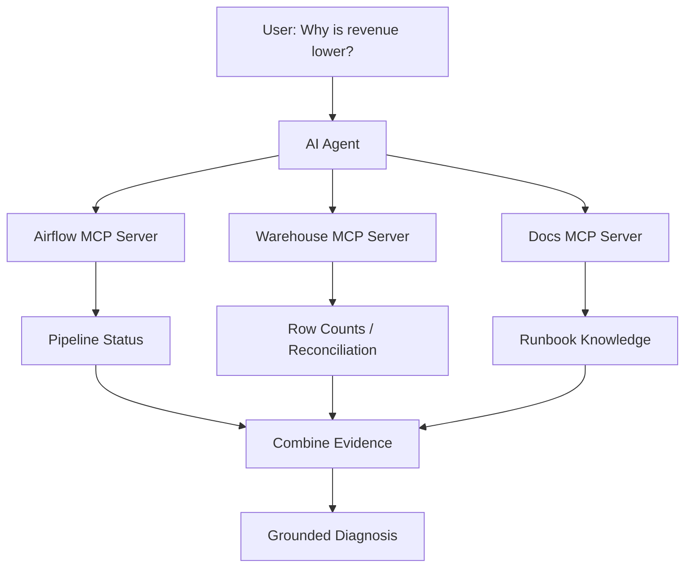

### Result from the source example

The example concludes:

- pipeline completed successfully
- source order data was partially loaded
- the processed table had **40% fewer rows than usual**
- the lower row count explains the lower dashboard revenue

### Why this matters for Data Engineers

MCP can help an agent combine:

- warehouse data
- pipeline metadata
- logs
- runbooks / documentation

to investigate a real operational problem.

### Interview Answer

> "MCP, or Model Context Protocol, provides a standardized way for AI applications and agents to connect with external systems through MCP clients and servers. MCP servers can expose tools, resources, and prompts, allowing an agent to access data and capabilities without building a separate custom integration for every system."

---

# 11. RAG vs Tooling vs Agents vs MCP

These concepts are related, but they solve different problems.

| Concept | Main Question It Answers | Primary Role |
|---|---|---|
| RAG | "What relevant knowledge should the LLM see?" | Retrieve contextual information |
| Tooling | "What external capability can the LLM call?" | Access data/actions/systems |
| Agent | "What steps should happen to complete the goal?" | Plan, decide, iterate |
| MCP | "How can AI applications connect to capabilities in a standardized way?" | Standardized integration layer |

### Easy mental model

```text
RAG    → Retrieve knowledge
Tools  → Perform/access capabilities
Agent  → Decide what to do
MCP    → Standardize how capabilities are exposed/connected
```

### How they can work together

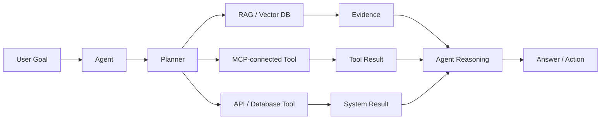

---

# 12. Data Engineer Perspective

This section converts the source into an explicit Data Engineering lens.

## 12.1 Why should a Data Engineer care about RAG?

Because RAG depends on a reliable information pipeline:

```text
Source Data
    ↓
Document Processing
    ↓
Chunking
    ↓
Embeddings
    ↓
Vector Store
    ↓
Retrieval
```

The quality of the final answer is therefore strongly connected to the quality of the underlying data and retrieval process.

---

## 12.2 Why should a Data Engineer care about chunking?

Chunking determines how source information becomes searchable units.

Poor chunking can create:

```text
Poor boundaries
    ↓
Poor retrieved context
    ↓
Lower-quality answer
```

Good chunking keeps the retrieved information both **focused** and **meaningful**.

---

## 12.3 Why should a Data Engineer care about metadata?

The source's advanced RAG flow uses metadata filtering with fields such as:

- source
- document type
- date
- tags

Metadata allows retrieval to become more targeted.

---

## 12.4 Why should a Data Engineer care about reranking?

Because retrieval is a quality-sensitive pipeline.

A retriever may return multiple candidate chunks, but a reranker helps put the best candidates first before they reach the LLM.

```text
Fast retrieval
     ↓
Candidate set
     ↓
Reranking
     ↓
Best context
```

---

## 12.5 Why should a Data Engineer care about agents?

Agents frequently depend on multiple data and operational systems:

```text
Agent
 ├── Databases
 ├── APIs
 ├── Vector stores
 ├── Files
 ├── Business applications
 └── Workflow systems
```

An AI Data Engineer therefore needs to understand not only LLMs, but also how reliable system integration works around them.

---

## 12.6 Why should a Data Engineer care about MCP?

The source's Data Engineering example demonstrates a practical use case:

```text
Agent
 ↓
MCP
 ├── Pipeline status
 ├── Warehouse validation
 └── Runbook / documentation
```

This allows one investigation to combine data from multiple operational systems.

### Strong interview framing

> "An AI Data Engineer does not only build the model-facing layer. The engineer also helps ensure the data, retrieval layer, system integrations, metadata, and operational signals are available and trustworthy."

---

# 13. Common Misconceptions

## 13.1 RAG is the same as an LLM

**Incorrect:** RAG and the LLM are the same thing.

**Better understanding:**

```text
LLM → Generation / reasoning capability
RAG → Adds relevant external context
```

---

## 13.2 The vector search result is automatically the best answer context

Not necessarily.

The source explicitly introduces reranking because:

> The most similar result is not always the most useful result.

---

## 13.3 Chunking only means splitting every N tokens

No.

The source describes multiple strategies:

- fixed-size
- recursive
- semantic
- overlap

---

## 13.4 An agent is just an LLM with a prompt

The source's mental model is stronger:

> **Agent = LLM + Tools + State + Decision Loop**

Planning and iterative execution are central to the agent concept.

---

## 13.5 Tooling and agents are the same thing

No.

```text
Tooling → provides capabilities
Agent   → decides when/how to use capabilities
```

---

## 13.6 MCP is itself an LLM

No.

MCP is the **connector/protocol layer** through which AI applications and agents can access standardized external capabilities.

---

## 13.7 More autonomy always means a better agent

Not necessarily.

The source explicitly notes that more autonomy can increase:

- orchestration complexity
- latency
- cost
- security concerns
- reliability concerns

---

# 14. Interview Focus

## RAG

Be able to explain:

- What is RAG?
- Why do we need RAG?
- What problem does it solve?
- What is the indexing pipeline?
- What is the retrieval pipeline?
- What is chunking?
- Why is chunking important?
- What is chunk overlap?
- What is reranking?
- Why does reranking improve retrieval?

## RAG Architecture

Know the difference between:

- Basic RAG
- Advanced RAG
- Conversational RAG
- Agentic RAG

## Tooling

Know:

- What is a tool?
- Why can an LLM need tools?
- What can a tool connect to?
- How does a tool call fit into an LLM workflow?

## Agents

Know:

- What is an agent?
- Agent vs LLM
- Agent = LLM + Tools + State + Decision Loop
- Why state is important
- Why memory is important
- Why guardrails are important
- Why observability is important

## Agent Frameworks

Know:

- What problem frameworks solve
- Tool registration
- State management
- Conditional routing
- Retries / fallbacks
- Human approval
- Tracing

## MCP

Know:

- What MCP means
- Why MCP is needed
- MCP client vs MCP server
- Tools vs resources vs prompts
- How MCP avoids one-off custom integrations
- How MCP can be applied to a Data Engineering troubleshooting workflow

---

# 15. Interview Questions

## Beginner

### Q1. What is RAG?

**Expected Answer**

RAG, or Retrieval-Augmented Generation, is a technique where relevant external information is retrieved and supplied to an LLM as context before generating the answer.

**Key Points**

- external knowledge
- retrieval before generation
- useful for private/up-to-date/domain-specific data

**Possible Follow-up**

Why not rely only on the LLM?

---

### Q2. What are the two major parts of a RAG pipeline?

**Expected Answer**

The source divides RAG into:

1. Knowledge / Indexing Pipeline
2. Query / Retrieval Pipeline

The first prepares and indexes the knowledge, while the second retrieves relevant context for a user's question.

**Possible Follow-up**

What components exist in each pipeline?

---

### Q3. What is chunking?

**Expected Answer**

Chunking is splitting large documents into smaller meaningful pieces before generating embeddings so retrieval can return focused information.

**Possible Follow-up**

What happens if chunks are too large or too small?

---

### Q4. What is chunk overlap?

**Expected Answer**

Chunk overlap means keeping some content from the previous chunk in the next chunk so that context near chunk boundaries is preserved.

**Source Example**

```text
Chunk 1 → 1–500
Chunk 2 → 450–950
```

---

### Q5. What is reranking?

**Expected Answer**

Reranking is an optional second-stage retrieval step that reevaluates the initial candidate chunks and reorders them by relevance before the LLM receives the final context.

**Possible Follow-up**

Why is vector similarity alone sometimes insufficient?

---

## Intermediate

### Q6. What is the difference between Basic RAG and Advanced RAG?

**Expected Answer**

Basic RAG uses a relatively direct retrieval pipeline. Advanced RAG adds retrieval improvements such as query rewriting, metadata filtering, hybrid search, and reranking to improve retrieval quality.

**Possible Follow-up**

What is the trade-off of advanced retrieval?

---

### Q7. What is Conversational RAG?

**Expected Answer**

Conversational RAG uses previous conversation context together with the current question so that follow-up questions can be converted into a meaningful standalone query before retrieval.

**Possible Follow-up**

What problem can long conversation history create?

---

### Q8. What is Agentic RAG?

**Expected Answer**

Agentic RAG uses an agent to determine what information is needed, which tools or sources should be queried, retrieve or execute those sources, reason over the results, and then produce an answer or action.

---

### Q9. What is tooling in an LLM application?

**Expected Answer**

Tooling provides external capabilities such as database queries, API calls, file access, email sending, or calculations so the LLM can interact with real systems rather than only generate text.

---

### Q10. What is an AI agent?

**Expected Answer**

An AI agent is an LLM-powered system that understands a goal, plans steps, uses tools, maintains state, and iterates until it reaches an outcome.

**Mental Model**

> Agent = LLM + Tools + State + Decision Loop

---

## Advanced

### Q11. What are the major components of an agent architecture?

**Expected Answer**

The source identifies:

- Planner
- Tools
- State
- Memory
- Guardrails
- Observability

These components help the agent plan work, interact with systems, track execution, control risky actions, and debug behavior.

---

### Q12. Why are guardrails important in agent architecture?

**Expected Answer**

Guardrails help enforce safety, permissions, and validation around agent actions. This is especially important when an agent can call tools that affect real business systems.

---

### Q13. Why is observability important for agents?

**Expected Answer**

Observability provides logs, traces, and metrics that help teams understand what the agent did, debug failures, and improve visibility into execution.

---

### Q14. What is MCP?

**Expected Answer**

MCP, or Model Context Protocol, is described in the source as a standardized way for AI applications and agents to connect to external systems such as databases, files, APIs, tools, and workflows.

---

### Q15. What can an MCP server expose?

**Expected Answer**

An MCP server can expose:

- **Tools** — callable actions/functions
- **Resources** — readable context/data
- **Prompts** — reusable workflow templates

---

### Q16. How is MCP different from a custom integration?

**Expected Answer**

Without MCP, an agent may need separate custom integrations for each system. MCP provides a standardized connector layer through MCP clients and servers.

---

### Q17. Explain a Data Engineering use case for MCP.

**Expected Answer**

An agent can investigate a dashboard anomaly by using an Airflow MCP server for pipeline status, a warehouse MCP server for row counts/reconciliation, and a documentation MCP server for runbooks. It can combine these results to explain the incident.

---

# 16. Mental Models

## 16.1 RAG

> **Retrieve → Context → Generate**

## 16.2 RAG indexing

> **Source → Process → Chunk → Embed → Store**

## 16.3 RAG retrieval

> **Question → Search → Rerank → Context → LLM**

## 16.4 Chunking

> **Focused enough to retrieve, large enough to preserve meaning**

## 16.5 Agent

> **LLM → Plan → Tool → Observe → Decide → Repeat**

## 16.6 Agent architecture

> **Planner + Tools + State + Memory + Guardrails + Observability**

## 16.7 MCP

> **AI App → MCP Client → MCP Server → External System**

## 16.8 The whole picture

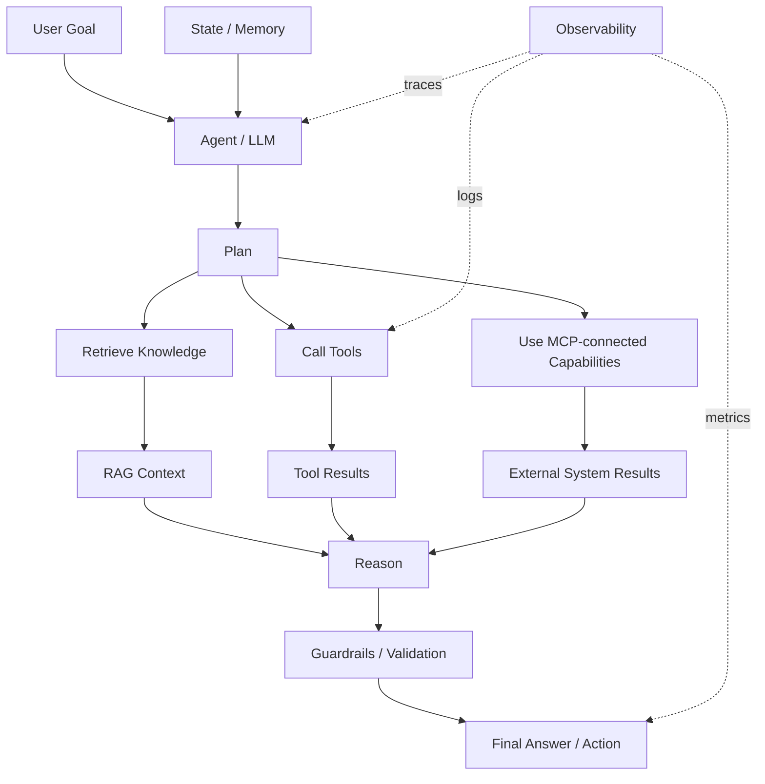

---

# 17. Quick Revision Cheat Sheet

## RAG

| Topic | One-line revision |
|---|---|
| RAG | LLM + relevant external knowledge |
| Indexing pipeline | Prepares knowledge for retrieval |
| Retrieval pipeline | Finds context for a user question |
| Chunking | Splits documents into meaningful pieces |
| Embedding | Converts chunks into numerical vectors |
| Vector store | Stores searchable chunks, embeddings, metadata |
| Reranking | Reorders retrieved candidates by relevance |

## Chunking

| Strategy | Idea |
|---|---|
| Fixed | Split by token size |
| Recursive | Paragraph → sentence → token boundaries |
| Semantic | Split when meaning/topic changes |
| Overlap | Reuse some previous content in the next chunk |

## RAG Architectures

| Type | Mental Model |
|---|---|
| Basic | Retrieve → Generate |
| Advanced | Improve retrieval → Generate |
| Conversational | Conversation context → Retrieve → Generate |
| Agentic | Plan → Select sources/tools → Retrieve/Execute → Reason → Answer/Act |

## Tooling

> **Tools give LLMs external capabilities.**

Examples:

```text
get_leave_balance()
query_sales_database()
send_email()
create_calendar_event()
```

## Agents

> **Agent = LLM + Tools + State + Decision Loop**

## Agent Architecture

```text
Planner
Tools
State
Memory
Guardrails
Observability
```

## Agent Frameworks

| Framework | Source description |
|---|---|
| LangGraph | Graph-based agent workflows |
| OpenAI Agents SDK | Tool calling, handoffs, tracing |
| CrewAI | Multi-agent collaboration |
| AutoGen | Conversational multi-agent systems |
| LlamaIndex | RAG + agent workflows |

## MCP

> **MCP = standardized connector layer for AI applications**

```text
AI App
 ↓
MCP Client
 ↓
MCP Server
 ↓
Tools / Resources / Prompts
 ↓
External Systems
```

### Final Interview Mental Model

```text
RAG
  ↓
Retrieve useful knowledge

Tools
  ↓
Access or perform capabilities

Agents
  ↓
Decide which steps/tools to use

MCP
  ↓
Standardize how AI apps connect to capabilities
```

---

## Final Takeaway

The source can be understood as a progression:

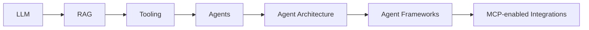

The progression is:

- **LLM** provides reasoning/generation.
- **RAG** gives the model relevant external knowledge.
- **Tooling** gives it access to capabilities.
- **Agents** add planning, state, and iterative decision-making.
- **Agent architecture** makes those behaviors structured and controllable.
- **Frameworks** provide reusable orchestration building blocks.
- **MCP** provides a standardized connector layer for external capabilities.

> **For a Data Engineer, the key shift is from "building a model" to "building the reliable data, retrieval, integration, and operational systems that an AI application depends on."**

