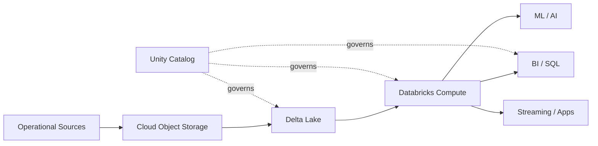
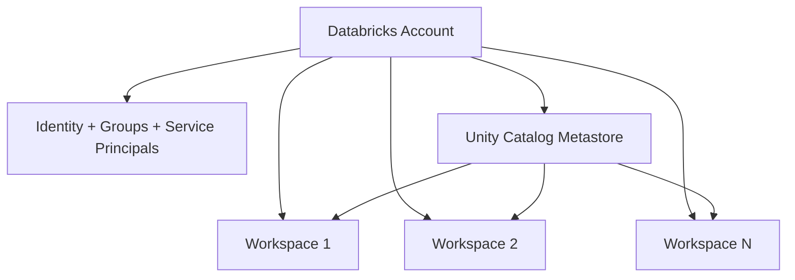
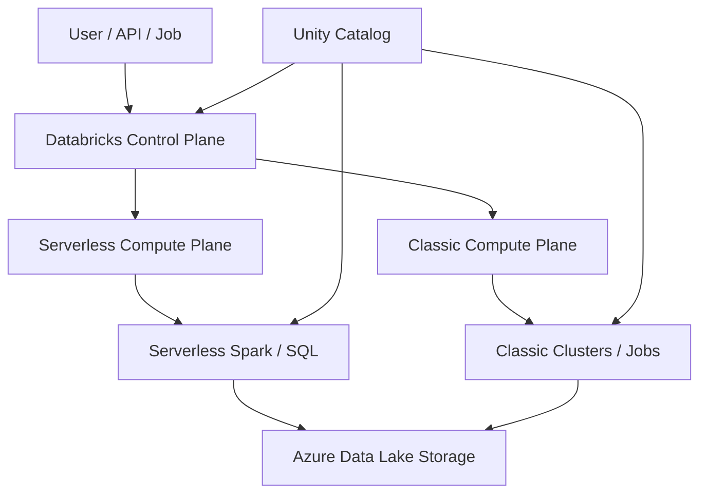

# Chapter 1: Platform & Lakehouse Fundamentals

> **Scope:** Topics 1–4 from the original master notes, grouped into one learning unit.

## Topics in this chapter

- [What is Azure Databricks?](#what-is-azure-databricks)
- [Lakehouse Fundamentals](#lakehouse-fundamentals)
- [Azure Databricks Enterprise Architecture](#azure-databricks-enterprise-architecture)
- [Control Plane vs Compute Plane](#control-plane-vs-compute-plane)

---

## 1. What is Azure Databricks?

Azure Databricks is a managed data and AI platform built around Apache Spark and a lakehouse architecture. It combines scalable cloud object storage, distributed compute, Delta Lake, Unity Catalog, orchestration, ingestion, analytics, and AI capabilities into one platform.

The central Data Engineer idea is:

```text
Cloud Object Storage
        |
        v
     Delta Lake  <---- transaction + table state
        |
        v
   Databricks Compute
        |
   +----+------------------+
   |                       |
Batch / ETL           Streaming / CDC
   |                       |
   +-----------+-----------+
               |
               v
      Governed Lakehouse
               |
      +--------+---------+
      |                  |
     BI             ML / AI / Apps
```

### Why Databricks?

Traditional architectures frequently separate:

- a data lake for cheap storage,
- a data warehouse for BI,
- a stream-processing platform for real time workloads,
- and separate governance/catalog systems.

The lakehouse pattern tries to use one governed data platform and one copy of data for many workloads.

### Core technologies

| Technology | Main job |
|---|---|
| Apache Spark | Distributed compute engine |
| Delta Lake | Reliable storage/table layer on cloud object storage |
| Unity Catalog | Governance, security, discovery, lineage |
| Lakeflow Connect | Data ingestion |
| Lakeflow pipelines | Declarative batch + streaming pipelines |
| Lakeflow Jobs | Workflow orchestration |
| Photon | Native vectorized execution engine for supported workloads |
| SQL warehouses | SQL/BI-optimized compute |
| Git + Declarative Automation Bundles | Software engineering / CI/CD |

---

## 2. Lakehouse Fundamentals

## 2.1 Data lake vs data warehouse vs lakehouse

### Data lake

A data lake usually stores large amounts of raw data cheaply in cloud object storage. It is flexible but historically weak on transactions, governance consistency, and BI performance without additional layers.

### Data warehouse

A data warehouse emphasizes structured data, governance, SQL performance, and BI workloads. Traditional warehouses often impose stronger structure and can introduce separate storage/compute economics and data-copy requirements.

### Lakehouse

A lakehouse combines:

- low-cost/open cloud object storage,
- transactional reliability,
- data engineering and streaming,
- SQL analytics,
- ML/AI access,
- centralized governance.



### Key lakehouse design principle

**Separate storage from compute.**

The data lives in durable cloud storage. Compute clusters/warehouses are created, scaled, and terminated independently.

This enables different compute profiles for different consumers without duplicating the data.

---

## 3. Azure Databricks Enterprise Architecture

## 3.1 Account → Workspace → Metastore

At the enterprise level, understand the hierarchy:



### Account

The account is the top-level management boundary.

Typical account-level responsibilities include:

- identity and user provisioning,
- groups and service principals,
- workspace management,
- Unity Catalog metastore management,
- usage/billing/compliance controls.

### Workspace

A workspace is the working environment in which users:

- create notebooks,
- access data,
- run compute,
- develop pipelines,
- schedule jobs,
- explore and analyze data.

In production organizations, separate workspaces are often used for environments such as development, staging, and production.

### Unity Catalog metastore

The metastore is the centralized governance boundary for governed data and AI assets.

The most important namespace is:

```text
catalog.schema.object
```

Example:

```text
sales.bronze.orders
sales.silver.orders
sales.gold.daily_sales
```

A metastore can be attached to multiple workspaces in the same region, enabling centralized governance and a consistent data view.

---

## 4. Control Plane vs Compute Plane

This is one of the most important architecture concepts for interviews.

## 4.1 Control plane

The control plane contains Databricks-managed backend services and the web application.

Think of it as the **management and coordination layer**.

Responsibilities include things such as:

- workspace UI,
- orchestration/control services,
- metadata and platform management,
- identity/access integration,
- APIs.

## 4.2 Compute plane

The compute plane is where workload processing occurs.

Azure Databricks currently exposes two broad models:

### Classic compute plane

- Compute resources run in your Azure subscription.
- You have more network/infrastructure customization.
- Common for workloads with specific networking or infrastructure requirements.

### Serverless compute plane

- Databricks manages the compute infrastructure.
- Compute is provisioned on demand.
- Less infrastructure management.
- Strong isolation and governance mechanisms are built into the platform.



### Interview distinction

> **Control plane manages and coordinates. Compute plane executes the workload.**

Do not confuse **storage** with compute. Data commonly remains in Azure storage while compute is ephemeral.

---

