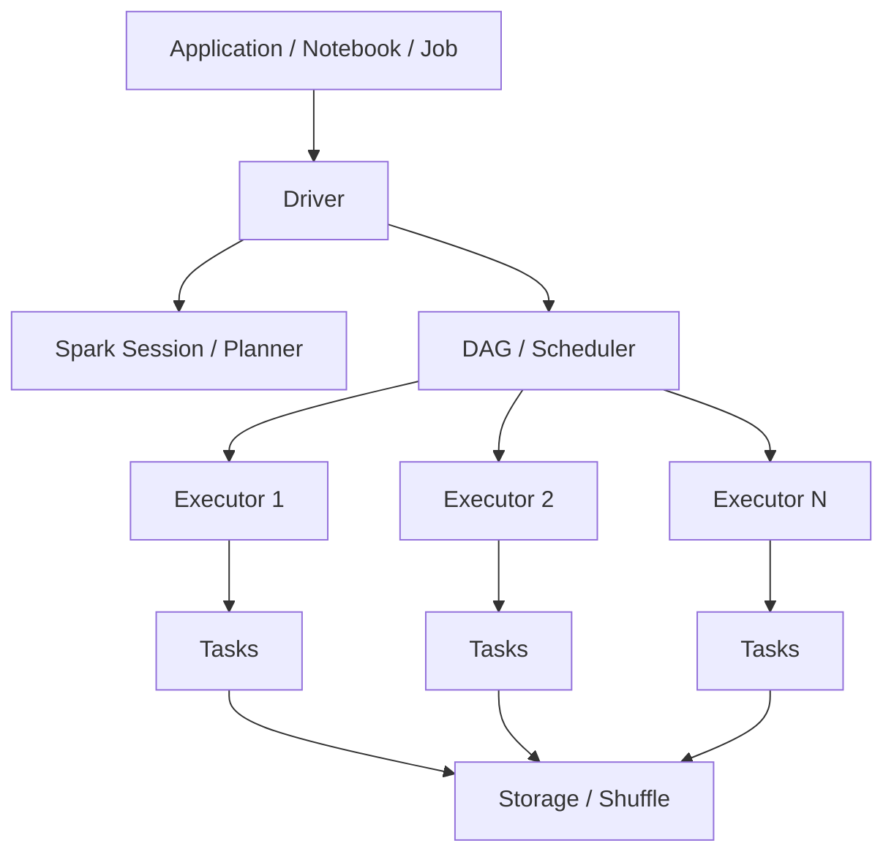
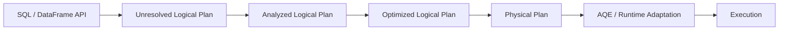

# Chapter 2: Compute & Spark Execution Internals

> **Scope:** Topics 5–10 from the original master notes, grouped into one learning unit.

## Topics in this chapter

- [Workspace Storage vs Data Storage](#workspace-storage-vs-data-storage)
- [Databricks Compute](#databricks-compute)
- [Spark Execution Internals](#spark-execution-internals)
- [Transformations, Actions, Lazy Evaluation](#transformations-actions-lazy-evaluation)
- [Narrow vs Wide Transformations](#narrow-vs-wide-transformations)
- [Catalyst and Adaptive Query Execution](#catalyst-and-adaptive-query-execution)

---

## 5. Workspace Storage vs Data Storage

A common conceptual mistake is thinking the workspace itself is the data lake.

A better mental model is:

```text
Workspace = collaboration + platform environment
Cloud storage = durable data
Databricks compute = processing
Delta Lake = reliable table/storage protocol
Unity Catalog = governance
```

For classic workspaces, there is an associated workspace storage account in the Azure subscription. However, enterprise lakehouse data architecture should intentionally separate workspace/platform storage from governed business data storage.

---

## 6. Databricks Compute

Azure Databricks compute broadly includes:

1. Serverless compute
2. Classic compute
3. SQL warehouses

## 6.1 Serverless compute

Best mental model: **Databricks manages infrastructure and scales it for you.**

Typical uses:

- notebooks,
- jobs,
- Lakeflow pipelines,
- SQL workloads.

Advantages:

- low infrastructure overhead,
- automatic scaling,
- faster developer experience,
- managed isolation.

## 6.2 Classic compute

Classic compute is provisioned compute that you configure/manage.

Common concepts:

- standard/shared compute,
- dedicated compute,
- jobs compute,
- instance pools,
- autoscaling,
- runtime versions.

### Standard vs Dedicated

**Standard compute** is intended for shared multi-user environments with strong isolation mechanisms.

**Dedicated compute** is assigned to a single user/group/workload and preserves more traditional Spark behavior.

## 6.3 SQL warehouses

SQL warehouses are optimized for SQL analytics and BI.

Think:

```text
BI Tool / SQL Client
        |
        v
  SQL Warehouse
        |
       SQL
        |
        v
 Delta / Lakehouse tables
```

They may be serverless or classic depending on requirements.

---

## 7. Spark Execution Internals

Databricks is built on Apache Spark, so understanding Spark internals is essential for a Data Engineer.

## 7.1 Driver and executors

Typical Spark execution:



### Driver

The driver is responsible for coordinating the Spark application. It constructs/owns the execution plan and coordinates jobs/stages/tasks.

### Executors

Executors execute tasks and perform distributed transformations and actions. They also hold cached/persisted data and shuffle data as required.

### Job

An action can trigger a Spark job.

Examples of actions:

- `count()`
- `collect()`
- `write`
- `save`

### Stage

A stage is a group of tasks that can execute without crossing a shuffle boundary.

### Task

A task is the unit of work executed for one partition of data.

---

## 8. Transformations, Actions, Lazy Evaluation

Spark transformations are generally lazy.

Example:

```python
df2 = df.filter("amount > 100").select("customer_id", "amount")
```

At this point Spark has primarily built a plan.

The action:

```python
df2.count()
```

triggers execution.

### Why lazy evaluation matters

Spark can optimize the complete operation graph before execution rather than executing each transformation immediately.

This allows optimizations such as:

- predicate pushdown,
- column pruning,
- join strategy selection,
- whole-stage optimizations,
- adaptive query optimizations.

---

## 9. Narrow vs Wide Transformations

## Narrow transformation

Each output partition depends on a relatively small number of input partitions.

Examples:

- `filter`
- `select`
- `withColumn`
- many map-style transformations.

These usually avoid a shuffle.

## Wide transformation

Data must move between executors/partitions.

Examples:

- `groupBy`
- `join` (unless broadcast/otherwise optimized)
- `distinct`
- `orderBy`

Wide transformations usually introduce shuffle boundaries.

```text
Narrow:
P1 -> P1'
P2 -> P2'
P3 -> P3'

Wide:
P1 ----\
P2 -----+--> Shuffle --> P1'
P3 ----/             --> P2'
```

### Practical performance rule

**Shuffle is expensive.**

When diagnosing a slow Spark job, always inspect:

- number of input files,
- partition counts,
- shuffle read/write,
- skew,
- join strategy,
- task duration distribution,
- spill to disk,
- executor memory pressure.

---

## 10. Catalyst and Adaptive Query Execution

Spark uses a query planner/optimizer. At a high level:



### Catalyst

Catalyst is Spark SQL's query optimization framework. It transforms and optimizes logical and physical plans.

### Adaptive Query Execution (AQE)

AQE can adapt execution based on runtime statistics.

Conceptually:

```text
Static plan
    |
    v
Runtime statistics
    |
    v
Re-optimization
    |
    +--> join strategy changes
    +--> partition coalescing
    +--> skew handling
```

For interviews, remember:

> **Catalyst optimizes the plan; AQE can adjust parts of the physical execution using runtime information.**

---

