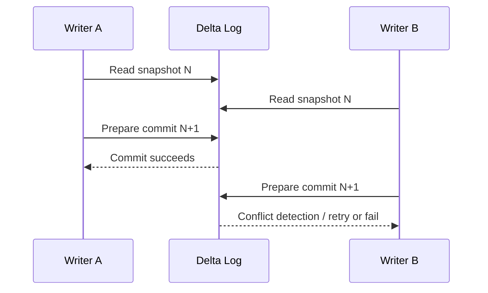
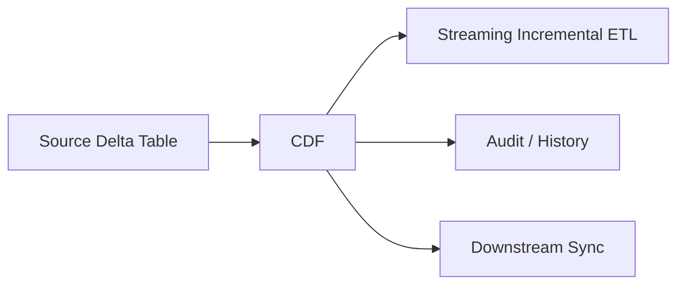

# Chapter 3: Delta Lake & Table Internals

> **Scope:** Topics 11–18 from the original master notes, grouped into one learning unit.

## Topics in this chapter

- [Photon](#photon)
- [Delta Lake — The Storage Layer](#delta-lake-the-storage-layer)
- [Delta Transaction Log Internals](#delta-transaction-log-internals)
- [ACID Transactions](#acid-transactions)
- [Time Travel](#time-travel)
- [MERGE, UPDATE, DELETE and Deletion Vectors](#merge-update-delete-and-deletion-vectors)
- [Change Data Feed (CDF)](#change-data-feed-cdf)
- [Delta and Streaming Together](#delta-and-streaming-together)

---

## 11. Photon

Photon is the Databricks-native vectorized query engine.

Important mental model:

```text
Spark SQL / DataFrame API
          |
       Catalyst
          |
    Physical plan
          |
   +------+------+
   |             |
   v             v
Spark JVM     Photon C++
execution     execution
   |             |
   +------+------+ 
          |
       Results
```

Photon:

- processes data in columnar batches,
- uses native C++ execution for supported operations,
- integrates with Spark APIs,
- accelerates SQL, DataFrame, ETL, and certain streaming workloads.

Photon does **not** replace Spark's query planning model; it can replace the execution layer for supported operations.

---

## 12. Delta Lake — The Storage Layer

Delta Lake is an open storage layer that extends Parquet with a transaction log.

Core idea:

```text
Delta Table

+-----------------------+
| Parquet data files    |
+-----------------------+
| _delta_log/           |
|  000000....json       |
|  000001....json       |
|  checkpoints/         |
+-----------------------+
```

Delta provides:

- ACID transactions,
- schema enforcement/evolution capabilities,
- scalable metadata handling,
- time travel/versioning,
- batch + streaming unification,
- updates/deletes/merges,
- data layout optimizations.

Delta is the default table format for Azure Databricks unless another format is explicitly selected.

---

## 13. Delta Transaction Log Internals

A very important Data Engineer mental model is that a Delta table is not just a directory of Parquet files.

It is better modeled as:

```text
Cloud storage
|
+-- data-000.parquet
+-- data-001.parquet
+-- data-002.parquet
|
+-- _delta_log/
    +-- 00000000000000000000.json
    +-- 00000000000000000001.json
    +-- 00000000000000000002.json
    +-- ...
    +-- checkpoints
```

The transaction log records table state changes and metadata/actions required to reconstruct a consistent table snapshot.

### Snapshot idea

If version `N` is the latest committed state:

```text
Snapshot(N)
 = checkpoint before N
 + JSON transaction actions after checkpoint
```

Readers use the log to determine which physical files are currently active.

### Why this solves the data-lake problem

A raw Parquet directory does not natively provide the same transactional table semantics as Delta.

Delta adds a metadata/transaction protocol over the files.

---

## 14. ACID Transactions

ACID means:

- **Atomicity** — a transaction is committed as a coherent unit.
- **Consistency** — table constraints/protocol rules are respected.
- **Isolation** — concurrent readers/writers observe controlled table states.
- **Durability** — committed state persists in durable storage.

### Optimistic concurrency idea

At a conceptual level:



Exact conflict behavior depends on the operation and table protocol, but the important idea is that the transaction log coordinates a consistent table state.

---

## 15. Time Travel

Because Delta tracks table versions, you can query historical snapshots subject to retention and vacuum policies.

Conceptually:

```sql
SELECT *
FROM sales VERSION AS OF 42;
```

or timestamp-based queries.

### Important distinction

Time travel is **logical table history**, not a permanent backup guarantee.

If old data files and transaction log history are physically removed beyond retention using maintenance operations such as `VACUUM`, those historical snapshots may no longer be available.

---

## 16. MERGE, UPDATE, DELETE and Deletion Vectors

Traditional file-based updates often mean rewriting Parquet files.

Example:

```text
1 row changes
   |
   v
Find containing Parquet file
   |
   v
Rewrite whole file
```

Deletion vectors improve this model for supported workloads.

```text
Parquet file
   |
   +---- row 10 -> unchanged
   +---- row 11 -> deleted/updated
   +---- row 12 -> unchanged
             |
             v
       deletion vector
```

A deletion vector stores metadata indicating affected rows so the physical file does not necessarily need to be rewritten immediately.

Later maintenance such as `OPTIMIZE` can rewrite data files.

### Why this matters

It can improve:

- `DELETE`,
- `UPDATE`,
- `MERGE`,
- row-level modifications,

especially for large files where rewriting entire files would be expensive.

---

## 17. Change Data Feed (CDF)

Change Data Feed exposes row-level changes between table versions.

Typical use cases:

- incremental ETL,
- CDC propagation,
- audit trails,
- downstream synchronization.

Conceptually:



Change records can identify events such as:

- insert,
- update pre-image,
- update post-image,
- delete.

### CDF + Structured Streaming

A common architecture is:

```text
Source Delta Table
        |
       CDF
        |
Structured Streaming
        |
Silver / Gold
```

This avoids repeatedly scanning the full source table when only changes are needed.

---

## 18. Delta and Streaming Together

Delta Lake is designed to work with Structured Streaming.

A Delta table can be:

- read by batch,
- read as a stream,
- written by batch,
- written by streaming.

This is one of the strongest lakehouse design ideas.

```text
             +--> Batch Reader
Delta Table -+
             +--> Streaming Reader

             +--> Batch Writer
Delta Table -+
             +--> Streaming Writer
```

A Delta sink uses the Delta transaction log to provide transactional writes and strong processing semantics.

---

