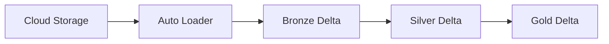
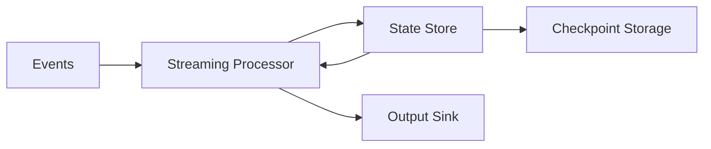

# Chapter 4: Ingestion & Streaming

> **Scope:** Topics 19–22 from the original master notes, grouped into one learning unit.

## Topics in this chapter

- [Auto Loader](#auto-loader)
- [Structured Streaming](#structured-streaming)
- [Structured Streaming Checkpoints](#structured-streaming-checkpoints)
- [Stateful Streaming](#stateful-streaming)

---

## 19. Auto Loader

Auto Loader is Databricks' scalable incremental file ingestion mechanism for cloud object storage.

Important benefits:

- scales to very large numbers of files,
- incremental file discovery,
- schema inference/evolution support,
- resilient ingestion state,
- integration with Structured Streaming.

Typical pattern:



## 19.1 File discovery modes

Conceptually there are two major approaches:

### Directory listing

Auto Loader lists the input directory and identifies new files.

Useful for getting started, but continuous directory listing can become expensive at large scale.

### File notification / file events

Cloud file events notify the ingestion system when files arrive.

This is more scalable and is recommended for many production workloads.

```text
Directory listing:
Auto Loader -> LIST storage -> identify files

File events:
New file -> cloud event -> event service/cache -> Auto Loader
```

### Key production principle

Use Auto Loader checkpoints to persist discovery/processing state. Do not treat file arrival detection as a stateless operation.

---

## 20. Structured Streaming

Structured Streaming is Spark's streaming engine.

A useful mental model is:

```text
Unbounded input
      |
      v
Streaming DataFrame
      |
 Transformations
      |
 Trigger / micro-batch
      |
      v
State + checkpoint
      |
      v
Sink
```

### Micro-batch mental model

A common execution style is:

```text
Batch 1 -> process -> commit
Batch 2 -> process -> commit
Batch 3 -> process -> commit
```

The exact trigger configuration controls when processing occurs.

---

## 21. Structured Streaming Checkpoints

A streaming checkpoint is fundamental to fault tolerance and recovery.

It can contain information such as:

- source offsets,
- committed micro-batches,
- state for stateful operations,
- query metadata/configuration.

```text
Checkpoint
|
+-- offsets
+-- commits
+-- state
+-- metadata
```

### Rule

Each streaming query must have its own checkpoint location.

Do not casually share a checkpoint directory between unrelated streaming queries.

### Why checkpoints matter

Suppose a job fails after processing batch 100.

The checkpoint helps the restarted query determine what was processed and resume from the correct position, subject to the source/sink semantics.

---

## 22. Stateful Streaming

Operations such as:

- streaming aggregation,
- stream-stream joins,
- deduplication,
- arbitrary stateful processing,

require persistent state.



### Watermarking

Watermarks let Spark reason about how much event-time data is expected to arrive late.

Example idea:

```text
Current event time = 12:00
Watermark delay = 10 minutes
Watermark = 11:50
```

The watermark can enable bounded state cleanup in certain stateful operations.

### Interview trap

A watermark is **not** simply “discard every event older than X minutes.” It is a mechanism tied to event-time progress and state management semantics.

---

