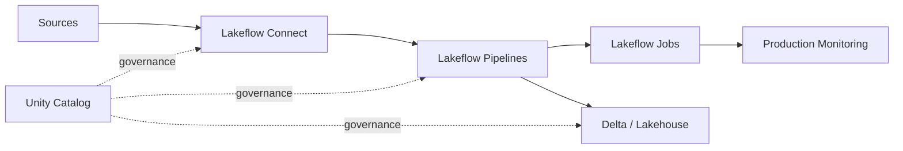
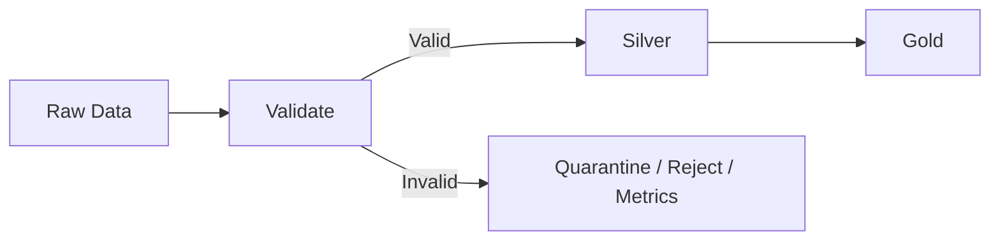

# Chapter 5: Lakeflow & Pipeline Engineering

> **Scope:** Topics 23–26 from the original master notes, grouped into one learning unit.

## Topics in this chapter

- [Lakeflow: Modern Data Engineering Layer](#lakeflow-modern-data-engineering-layer)
- [Declarative Pipelines vs Imperative Spark Code](#declarative-pipelines-vs-imperative-spark-code)
- [Streaming Tables vs Materialized Views](#streaming-tables-vs-materialized-views)
- [Data Quality](#data-quality)

---

## 23. Lakeflow: Modern Data Engineering Layer

Lakeflow is Databricks' end-to-end data engineering solution.

Major pieces:



### Lakeflow Connect

Ingestion from enterprise applications, databases, cloud storage, message buses, and other sources using managed or standard connectors.

### Lakeflow pipelines

Declarative batch and streaming pipeline framework built on Apache Spark Declarative Pipelines.

Key concepts include:

- flows,
- streaming tables,
- materialized views,
- sinks.

### Lakeflow Jobs

Workflow orchestration across tasks.

A job can coordinate:

- notebooks,
- pipelines,
- SQL queries,
- machine learning tasks,
- connectors,
- deployment/inference workloads,
- branching and looping.

---

## 24. Declarative Pipelines vs Imperative Spark Code

Traditional imperative approach:

```python
df = spark.read...
df = df.filter...
df.write...
```

You explicitly tell Spark what operations to perform.

Declarative pipeline approach:

```text
Declare the desired dataset/table
        |
        v
Framework determines dependency graph
        |
        v
Framework orchestrates incremental execution
```

### Why declarative pipelines matter

They can centralize:

- dependency management,
- incremental processing,
- data quality expectations,
- orchestration,
- pipeline lifecycle management.

The goal is to focus more on **what the dataset should represent** and less on manually wiring every operational step.

---

## 25. Streaming Tables vs Materialized Views

## Streaming table

A Delta-based target designed for streaming/incremental processing.

Think:

```text
Source changes
   |
   v
Streaming flow
   |
   v
Streaming table
```

## Materialized view

Stores materialized results so downstream queries can use precomputed data.

Think:

```text
Base tables
   |
   v
Transformation
   |
   v
Materialized result
```

### Practical distinction

Use streaming/incremental semantics when data continuously arrives or changes and the pipeline should process incrementally.

Use materialization when the main goal is maintaining a query-ready derived result.

---

## 26. Data Quality

Data quality should be designed into the pipeline, not added after failures occur.

Typical checks:

- null constraints,
- accepted values,
- uniqueness,
- referential integrity,
- business rules,
- schema expectations.



In Lakeflow pipelines, expectations can be used to define and monitor data quality constraints.

---

