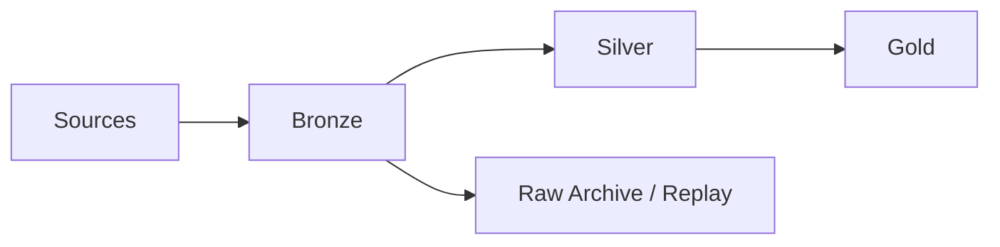
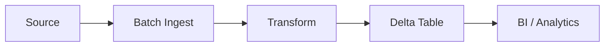
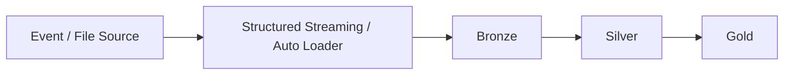
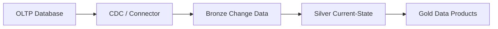

# Chapter 6: Medallion Architecture & Data Modeling

> **Scope:** Topics 27–47 from the original master notes, grouped into one learning unit.

## Topics in this chapter

- [Medallion Architecture](#medallion-architecture)
- [Schema Enforcement and Evolution](#schema-enforcement-and-evolution)
- [Batch vs Streaming Architecture](#batch-vs-streaming-architecture)
- [CDC Architecture](#cdc-architecture)
- [SCD Type 1 vs Type 2 on Databricks](#scd-type-1-vs-type-2-on-databricks)
- [Lakehouse Table Design](#lakehouse-table-design)

---

## 27. Medallion Architecture

A common lakehouse pattern is:



## Bronze

Purpose:

- preserve source information,
- support replay,
- capture raw/near-raw events,
- land data reliably.

Typical transformations: minimal.

## Silver

Purpose:

- clean,
- standardize,
- deduplicate,
- normalize,
- apply data quality rules,
- integrate sources.

## Gold

Purpose:

- business-ready data products,
- KPI tables,
- aggregates,
- dimensional/fact models,
- BI serving tables.

### Key principle

Bronze is not supposed to become an unmaintainable junkyard. It should be intentionally designed as the raw/source-of-truth layer with retention, governance, and replay requirements in mind.

---

## 43. Schema Enforcement and Evolution

A production pipeline needs an intentional approach to schema changes.

### Schema enforcement

Protects a table from accidental incompatible writes.

### Schema evolution

Allows controlled changes such as:

- adding columns,
- compatible changes,
- evolving ingestion schemas.

### Data engineering rule

Never interpret "schema evolution enabled" as "accept any input schema silently."

Instead define:

```text
Expected schema
      |
      +--> allowed change
      +--> rejected change
      +--> quarantine
      +--> alert
```

---

## 44. Batch vs Streaming Architecture

## Batch



Typical requirement:

- hourly/daily processing,
- large bounded datasets,
- simpler operational model.

## Streaming



Typical requirement:

- low-latency ingestion,
- continuous updates,
- event-driven pipelines.

### Hybrid reality

Many enterprise pipelines are actually hybrid:

```text
Historical backfill = batch
New data            = streaming
                 ↓
             same Delta model
```

---

## 45. CDC Architecture

Change Data Capture is a common enterprise Data Engineer requirement.

Typical flow:



For Delta-to-Delta incremental patterns, CDF can provide row-level changes to downstream consumers.

For source database CDC, connector choice and source-system semantics matter.

---

## 46. SCD Type 1 vs Type 2 on Databricks

## SCD Type 1

Overwrite the old dimension value.

```text
Customer 100
Old city = Delhi
New city = Pune

Current state:
Customer 100 -> Pune
```

Often implemented using `MERGE`.

## SCD Type 2

Preserve history.

```text
customer_id | city  | start      | end        | current
100         | Delhi | 2025-01-01 | 2026-03-01 | false
100         | Pune  | 2026-03-01 | null       | true
```

Key ideas:

- surrogate/business keys,
- effective start/end timestamps,
- current flag,
- deterministic merge logic.

---

## 47. Lakehouse Table Design

A practical table-design checklist:

1. Identify the grain.
2. Decide raw vs curated layer.
3. Define primary/business keys.
4. Define data types intentionally.
5. Plan schema evolution.
6. Understand query patterns.
7. Select layout strategy.
8. Define retention.
9. Define ownership and permissions.
10. Define data quality checks.

### Grain comes first

Example:

```text
FactSales grain = one order line
```

Then every measure and key should be evaluated against that grain.

This prevents:

- double counting,
- incorrect joins,
- accidental fan-out,
- misleading aggregates.

---

