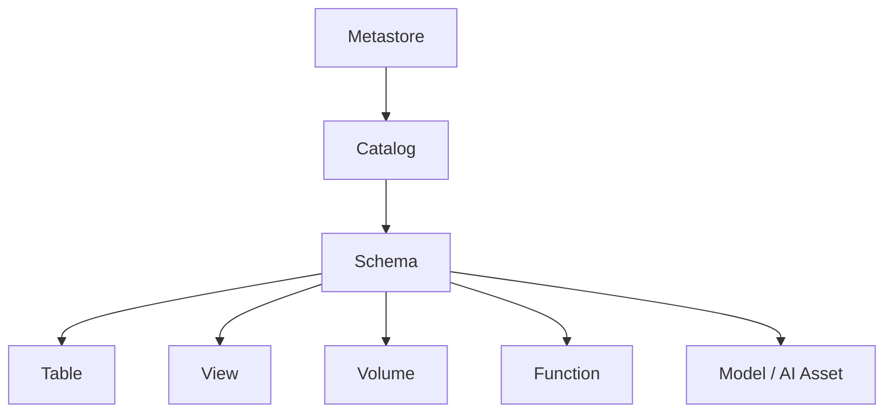
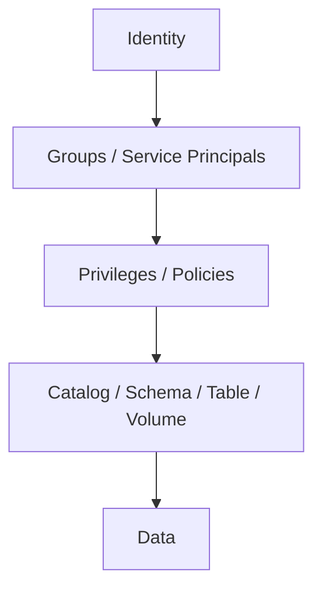
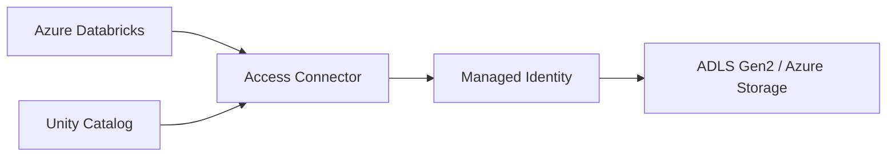
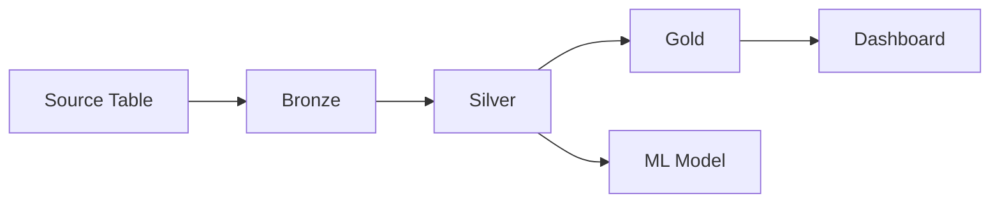

# Chapter 7: Unity Catalog, Security & Governance

> **Scope:** Topics 28–36 from the original master notes, grouped into one learning unit.

## Topics in this chapter

- [Unity Catalog — Governance Layer](#unity-catalog-governance-layer)
- [Managed vs External Tables](#managed-vs-external-tables)
- [Volumes](#volumes)
- [Access Control Mental Model](#access-control-mental-model)
- [Row Filters and Column Masks](#row-filters-and-column-masks)
- [Lakeguard and User Isolation](#lakeguard-and-user-isolation)
- [Azure Storage Authentication](#azure-storage-authentication)
- [External Locations and Storage Credentials](#external-locations-and-storage-credentials)
- [Data Discovery and Lineage](#data-discovery-and-lineage)

---

## 28. Unity Catalog — Governance Layer

Unity Catalog is the unified governance layer for data and AI assets in Azure Databricks.

Major capabilities include:

- access control,
- discovery,
- lineage,
- auditing,
- data sharing,
- managed/external asset governance,
- row/column-level security,
- tags/policies.

### Object hierarchy



Canonical naming:

```text
catalog.schema.object
```

---

## 29. Managed vs External Tables

## Managed table

Unity Catalog manages governance and the lifecycle of the underlying storage location.

Advantages:

- simpler platform management,
- lifecycle integration,
- centralized governance,
- easier standardization.

## External table

Unity Catalog manages the table's governance/metadata while the data remains in a location controlled outside the managed table lifecycle.

Use cases:

- data must remain at a specific storage path,
- an existing externally managed data layout must be registered,
- interoperability or organizational ownership requires external storage control.

### Modern recommendation

For new lakehouse data, prefer governed Unity Catalog managed tables unless there is a clear reason the data must remain external.

---

## 30. Volumes

Unity Catalog volumes are useful for files and non-tabular data.

Think:

```text
Tables -> structured tabular data
Volumes -> governed files / raw assets / unstructured data
```

Examples:

- landing files,
- documents,
- images,
- test data,
- ingestion artifacts.

---

## 31. Access Control Mental Model

Databricks governance involves several layers.



### Important security concepts

- identity-based access,
- workspace permissions,
- Unity Catalog privileges,
- storage credentials,
- external locations,
- row filters,
- column masks,
- attribute-based access control (ABAC),
- network controls,
- audit logs.

---

## 32. Row Filters and Column Masks

## Row filter

Controls which rows a user can see.

Example concept:

```text
Sales table
|
+-- India rows -> India users
+-- US rows    -> US users
+-- EU rows    -> EU users
```

## Column mask

Controls what value a user sees for a column.

Example:

```text
email = rohan@example.com

Analyst sees: r****@example.com
Authorized user sees: rohan@example.com
```

### ABAC

Attribute-Based Access Control scales security rules using governed tags and policy logic.

Useful when the same policy should automatically apply across many tables and columns.

---

## 33. Lakeguard and User Isolation

Lakeguard is part of Databricks' isolation model for shared compute and fine-grained access controls.

At a conceptual level:

```text
Shared Compute
|
+-- User A sandbox
+-- User B sandbox
+-- User C sandbox
|
+-- Spark engine
+-- Governed data access
```

The goal is to prevent user code from directly accessing other users' code/data or underlying infrastructure in shared environments while still allowing efficient shared compute.

This is especially relevant to serverless and standard/shared compute.

---

## 34. Azure Storage Authentication

For governed Azure storage access, an important concept is the Azure Databricks **Access Connector** and managed identities.

Mental model:



The key security principle is:

> Prefer identity-based authorization over hard-coded cloud storage keys/secrets whenever supported by the architecture.

---

## 35. External Locations and Storage Credentials

Unity Catalog decouples cloud storage authorization from individual notebooks.

Conceptually:

```text
User / Job
    |
    v
Unity Catalog object
    |
    v
External Location
    |
    v
Storage Credential
    |
    v
Azure Storage
```

This allows administrators to centralize and govern data access rather than asking every developer to manage storage secrets manually.

---

## 36. Data Discovery and Lineage

Unity Catalog can provide lineage information showing how data assets relate across a pipeline.



Lineage is useful for:

- impact analysis,
- debugging,
- compliance,
- understanding transformations,
- identifying downstream consumers.

---

