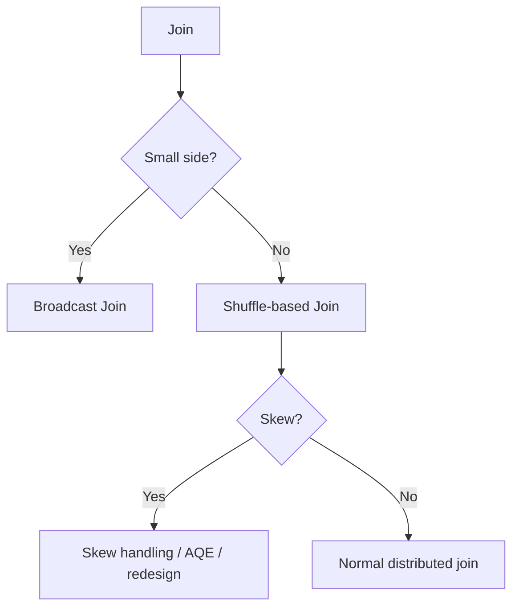

# Chapter 8: Performance Engineering & Optimization

> **Scope:** Topics 37–52 from the original master notes, grouped into one learning unit.

## Topics in this chapter

- [Query Performance: Data Skipping](#query-performance-data-skipping)
- [Z-ORDER](#z-order)
- [Liquid Clustering](#liquid-clustering)
- [OPTIMIZE](#optimize)
- [Small File Problem](#small-file-problem)
- [VACUUM](#vacuum)
- [Join Performance](#join-performance)
- [Data Skew](#data-skew)
- [Partitioning — Do Not Confuse the Concepts](#partitioning-do-not-confuse-the-concepts)
- [File Size and Partition Count](#file-size-and-partition-count)
- [Caching and Persistence](#caching-and-persistence)

---

## 37. Query Performance: Data Skipping

Databricks can use per-file statistics to avoid reading files that cannot satisfy a query predicate.

Example:

```text
File A: customer_id 1-1000
File B: customer_id 1001-2000
File C: customer_id 2001-3000

Query: customer_id = 2500

Read: File C
Skip: File A, File B
```

Typical stats include information such as:

- minimum values,
- maximum values,
- null counts,
- record counts.

### Key insight

**Data skipping reduces I/O before Spark reads irrelevant files.**

That is different from a filter that only removes rows after the file was already read.

---

## 38. Z-ORDER

Z-ordering historically improved locality of related values across files and thereby improved data skipping.

Example:

```sql
OPTIMIZE events
ZORDER BY (customer_id);
```

Good candidate columns historically include commonly filtered high-cardinality columns with statistics.

### Modern recommendation

For new Delta tables, Databricks recommends **liquid clustering** rather than designing new partition/Z-ORDER strategies around older layouts.

---

## 39. Liquid Clustering

Liquid clustering is a modern data-layout mechanism that lets the physical organization of data evolve with query patterns.

Conceptually:

```text
Traditional partitioning
-----------------------
Fixed key -> fixed partition layout

Liquid clustering
-----------------
Workload patterns
       |
       v
Adaptive clustering keys
       |
       v
Evolving file layout
```

Benefits include:

- less manual partition planning,
- better behavior for high-cardinality access patterns,
- ability to change clustering strategy,
- reduced need for rigid directory partition structures,
- incremental maintenance.

### Important compatibility rule

Liquid clustering is not combined with traditional partitioning or `ZORDER`.

### Typical maintenance

```sql
OPTIMIZE catalog.schema.table;
```

Predictive optimization can automatically perform optimization tasks for eligible managed tables.

---

## 40. OPTIMIZE

`OPTIMIZE` improves physical data layout.

It can help address the small-file problem through compaction and can perform layout optimization such as clustering.

Think:

```text
Many small files
      |
      v
   OPTIMIZE
      |
      v
Fewer / better-organized files
      |
      v
Less file-open overhead + better scans
```

### Important distinction

`OPTIMIZE` is primarily a **storage layout optimization** operation.

It does not replace:

- good schema design,
- correct joins,
- avoiding unnecessary data scans,
- reducing shuffle,
- correct partitioning strategy where still appropriate.

---

## 41. Small File Problem

A workload that continuously writes tiny batches can create many small files.

Problems:

- too much file-open overhead,
- more metadata/listing work,
- more scheduling overhead,
- poor scan efficiency.

Possible mitigations:

- appropriate micro-batch sizing,
- optimized writes/auto-compaction where supported,
- `OPTIMIZE`,
- predictive optimization,
- better ingestion design.

---

## 42. VACUUM

`VACUUM` removes old/unreferenced files that are no longer needed according to retention policies.

Mental model:

```text
Old file versions
       |
   Retention window
       |
       v
   VACUUM
       |
       v
Storage reclaimed
```

### Critical warning

Do not treat `VACUUM` as a harmless cleanup command. It affects the ability to access older table versions after files are deleted.

Time travel and retention strategy must be designed together.

---

## 48. Join Performance

Join strategy is a core Spark skill.

Conceptually:



### Broadcast join

If one side is small enough, broadcasting can avoid a full shuffle of the large side.

### Shuffle join

Large tables commonly require data redistribution by join key.

### Join optimization checklist

- filter early,
- select only needed columns,
- broadcast genuinely small dimensions,
- inspect skew,
- avoid accidental many-to-many joins,
- verify join keys and data types,
- inspect the physical plan.

---

## 49. Data Skew

Data skew occurs when one or a few keys contain a disproportionate amount of data.

Example:

```text
Partition 1 -> 10 MB
Partition 2 -> 11 MB
Partition 3 -> 12 MB
Partition 4 -> 4 GB   <-- skew
```

Result:

- most tasks finish quickly,
- one/few tasks run much longer,
- job waits for stragglers.

Mitigation can include:

- AQE skew handling,
- salting where appropriate,
- better join strategy,
- pre-aggregation,
- filtering invalid/special keys,
- data model changes.

### Interview clue

If the Spark UI shows most tasks complete in seconds while a few take minutes, investigate skew.

---

## 50. Partitioning — Do Not Confuse the Concepts

The word "partition" can refer to multiple different things.

### Spark partition

A unit of distributed processing.

### Table/data partition

A physical storage organization, historically often represented by directory keys.

### Azure storage directory

A physical cloud path.

These are not the same thing.

```text
Spark partition
     !=
Delta table partition
     !=
Folder / directory
```

Modern Databricks guidance increasingly emphasizes liquid clustering rather than aggressive manual table partitioning for new designs.

---

## 51. File Size and Partition Count

Spark's input parallelism depends on factors such as:

- file sizes,
- file count,
- file split configuration,
- compute resources,
- source format.

For interview discussions, avoid memorizing a simplistic rule like:

```text
partition count = file size / 128 MB
```

as an absolute formula.

Actual input partitioning depends on Spark's file splitting and open-cost settings, file format behavior, and scheduling details.

### Practical goal

Avoid both extremes:

```text
Too few partitions -> under-parallelization
Too many tiny partitions -> scheduling overhead
```

Tune based on actual workload metrics rather than a single fixed number.

---

## 52. Caching and Persistence

Caching stores computed data so repeated operations may reuse it.

```text
Read + Transform
      |
    cache
      |
      v
+----------------+
| memory/disk     |
| persisted data  |
+----------------+
      |
      +--> Query A
      +--> Query B
```

### Important distinction

Caching can consume cluster memory/storage and may effectively maintain another representation of data.

It does **not** mean the source files themselves become larger.

### When to cache

Useful when:

- the same expensive intermediate dataset is reused,
- recomputation is more expensive than storage,
- the workload fits a stable reuse pattern.

Avoid caching everything. It can cause memory pressure and eviction churn.

---

