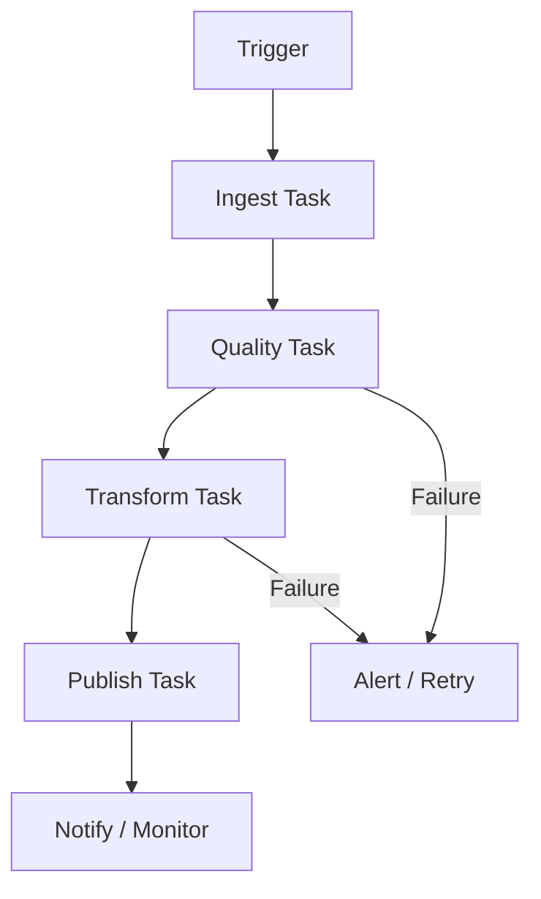

# Chapter 9: Orchestration, Reliability & Observability

> **Scope:** Topics 53–55 from the original master notes, grouped into one learning unit.

## Topics in this chapter

- [Orchestration with Lakeflow Jobs](#orchestration-with-lakeflow-jobs)
- [Reliability Patterns](#reliability-patterns)
- [Observability](#observability)

---

## 53. Orchestration with Lakeflow Jobs

A production pipeline often looks like:



Lakeflow Jobs support:

- multi-task workflows,
- schedules,
- triggers,
- retries,
- alerts,
- conditional logic,
- loops/foreach patterns,
- task dependencies.

### Job design principle

A job is an orchestration graph, not merely a notebook launcher.

---

## 54. Reliability Patterns

Production pipelines should address:

- retries,
- idempotency,
- checkpointing,
- bad-record handling,
- schema changes,
- partial failure,
- observability,
- replay/backfill.

## Idempotency

A job is idempotent when rerunning the same logical input produces the same intended final state without duplicating data.

Example concept:

```text
Input batch 2026-08-29
        |
        v
Job run #1 -> success

Retry / rerun
        |
        v
Job run #2 -> same correct state
```

Delta `MERGE`, deterministic keys, batch identifiers, and controlled writes are common building blocks.

---

## 55. Observability

Monitoring should answer:

1. Did the pipeline run?
2. Did it finish successfully?
3. How long did it take?
4. How much data moved?
5. Did data quality degrade?
6. Where did the job spend time?
7. Is cost increasing?
8. Can the run be safely replayed?

Useful areas to inspect:

- job run history,
- task duration,
- Spark UI,
- SQL query profile,
- cluster metrics,
- streaming progress,
- pipeline event logs,
- data quality metrics,
- lineage.

---

