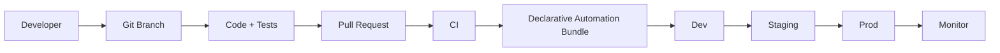
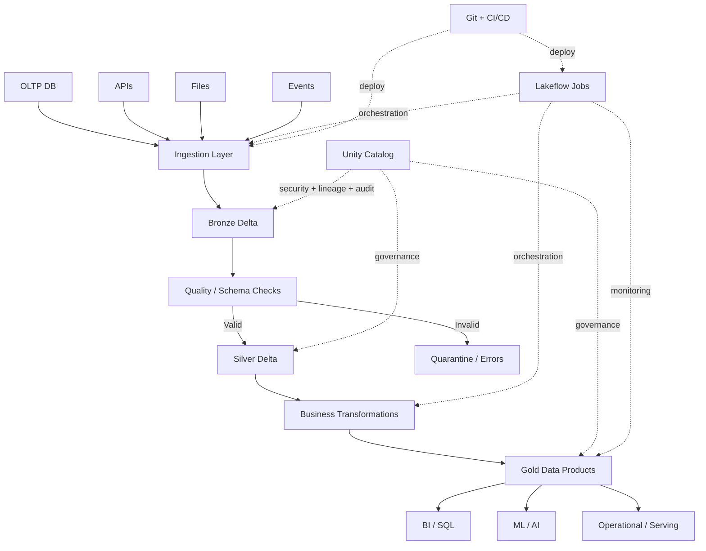

# Chapter 10: Production Architecture, Networking & CI/CD

> **Scope:** Topics 56–60 from the original master notes, grouped into one learning unit.

## Topics in this chapter

- [Production Deployment / CI-CD](#production-deployment-ci-cd)
- [Environment Separation](#environment-separation)
- [Networking Architecture](#networking-architecture)
- [Data Sharing and External Access](#data-sharing-and-external-access)
- [A Complete Production Data Pipeline](#a-complete-production-data-pipeline)

---

## 56. Production Deployment / CI-CD

A modern Databricks development flow is:



### Recommended engineering principles

- version source code,
- use branches and pull requests,
- test code automatically,
- define infrastructure/workflows as code,
- parameterize environments,
- avoid manual production changes,
- monitor after deployment,
- automate rollback where practical.

### Declarative Automation Bundles

Bundles let a project define deployable Databricks resources in source-controlled files.

They are the modern recommended approach for Databricks CI/CD.

Legacy name:

```text
Databricks Asset Bundles
        ->
Declarative Automation Bundles
```

---

## 57. Environment Separation

A practical enterprise pattern:

```text
          Git Repository
               |
        +------+------+------+
        |             |      |
       Dev          Stage   Prod
     Workspace     Workspace Workspace
```

Separate environments reduce:

- accidental production changes,
- configuration drift,
- unauthorized access,
- testing risk.

Common promotion path:

```text
Feature branch
    |
    v
CI tests
    |
    v
Dev deployment
    |
    v
PR approval
    |
    v
Prod deployment
```

---

## 58. Networking Architecture

Enterprise Azure Databricks designs often need:

- private connectivity,
- VNet integration/network controls,
- firewall rules,
- private endpoints where appropriate,
- secure storage access,
- egress control,
- identity-based storage authorization.

### Architecture principle

Do not design "compute first".

Design together:

```text
Identity
   +
Network
   +
Storage
   +
Compute
   +
Governance
   +
CI/CD
```

A production data platform is a system, not a notebook.

---

## 59. Data Sharing and External Access

Unity Catalog is intended to govern access to data assets, including supported external integration patterns.

The key engineering principle is:

> Keep access governed through the catalog rather than bypassing governance with uncontrolled direct file access.

When integrating external systems, consider:

- table format compatibility,
- supported APIs/catalog protocols,
- read/write capability,
- governance and lineage,
- authentication,
- network path.

---

## 60. A Complete Production Data Pipeline

A strong end-to-end architecture can look like this:



---

