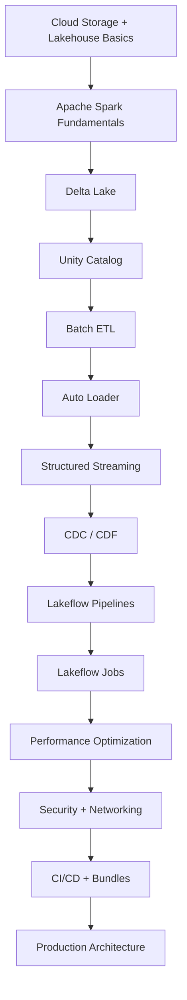

# Chapter 11: Mental Models, Certification & Interview Prep

> **Scope:** Topics 61–64 from the original master notes, grouped into one learning unit.

## Topics in this chapter

- [The Most Important Mental Models](#the-most-important-mental-models)
- [Certification / Interview Cheat Sheet](#certification-interview-cheat-sheet)
- [What a Strong Azure Databricks Data Engineer Should Be Able to Explain](#what-a-strong-azure-databricks-data-engineer-should-be-able-to-explain)
- [Recommended Learning Order](#recommended-learning-order)

---

## 61. The Most Important Mental Models

## Mental model 1 — Databricks is not "just Spark"

```text
Databricks
=
Spark
+ Delta Lake
+ Unity Catalog
+ Managed compute
+ Lakeflow
+ SQL
+ Governance
+ Operational tooling
+ CI/CD
```

## Mental model 2 — Delta table != Parquet folder

```text
Parquet files
    +
Delta transaction log
    =
Transactional table state
```

## Mental model 3 — Unity Catalog is the governance plane

```text
Who can access what?
Where is it?
Who changed it?
What depends on it?
How is it shared?
```

Unity Catalog provides the platform-level answer to these questions.

## Mental model 4 — Storage and compute are decoupled

```text
Durable data = cloud object storage
Compute = disposable / scalable
```

## Mental model 5 — Performance is mostly about data movement

When Spark is slow, ask:

```text
How much data is read?
How many files are read?
How much data is shuffled?
Is there skew?
How much state is maintained?
Are tasks balanced?
Can file skipping help?
Is the physical layout suitable?
```

---

## 62. Certification / Interview Cheat Sheet

### Architecture

**Q: What are the main planes?**  
A: Control plane and compute plane; compute is either classic or serverless.

**Q: Where does the data live?**  
A: Usually in cloud object storage; compute is decoupled from it.

**Q: What is the three-level namespace?**  
A: `catalog.schema.object`.

### Delta Lake

**Q: Why Delta instead of raw Parquet?**  
A: Transactional metadata/logging, ACID semantics, scalable metadata, schema controls, versioning, updates/deletes/merge, batch+stream integration.

**Q: What is `_delta_log`?**  
A: The transaction history/state metadata used to reconstruct consistent table snapshots.

**Q: What is time travel?**  
A: Reading historical table versions subject to retained log/data files.

**Q: What does `VACUUM` do?**  
A: Removes old/unreferenced files beyond retention; this can remove historical data needed for older snapshots.

### Spark

**Q: Driver vs executor?**  
A: Driver coordinates/plans; executors run tasks and process partitions.

**Q: Narrow vs wide transformation?**  
A: Narrow usually avoids shuffle; wide generally requires data redistribution.

**Q: Why is shuffle expensive?**  
A: It involves data movement, serialization/deserialization, network I/O, disk spill, and coordination.

### Streaming

**Q: Why is checkpointing important?**  
A: It tracks progress and state so the query can recover after failure.

**Q: What does watermarking solve?**  
A: It helps reason about event-time lateness and bound state for supported stateful operations.

### Ingestion

**Q: Why Auto Loader?**  
A: Scalable incremental discovery, schema handling, cloud integration, and resilient file ingestion.

**Q: Directory listing vs file events?**  
A: Directory listing discovers by listing storage; file events use notifications and are more scalable for many continuous workloads.

### Governance

**Q: What does Unity Catalog provide?**  
A: Centralized access control, discovery, lineage, auditing, data sharing, and fine-grained governance.

**Q: Row filter vs column mask?**  
A: Row filter controls which rows are visible; column mask controls how column values are presented.

### Performance

**Q: What is data skipping?**  
A: Use file statistics/layout information to avoid reading irrelevant files.

**Q: ZORDER vs liquid clustering?**  
A: ZORDER is the older locality/layout technique; Databricks currently recommends liquid clustering for new tables and it is incompatible with ZORDER.

**Q: Why is `OPTIMIZE` used?**  
A: To improve file layout/compaction and clustering performance characteristics.

---

## 63. What a Strong Azure Databricks Data Engineer Should Be Able to Explain

You should be able to explain these without opening documentation:

### Platform

- account vs workspace,
- control plane vs compute plane,
- classic vs serverless,
- SQL warehouses,
- Databricks Runtime,
- Photon.

### Spark

- driver/executors,
- partitions,
- jobs/stages/tasks,
- lazy evaluation,
- narrow/wide transformations,
- shuffle,
- broadcast joins,
- skew,
- Catalyst/AQE,
- caching.

### Delta

- Delta vs Parquet,
- transaction log,
- snapshots,
- ACID,
- time travel,
- schema evolution,
- MERGE,
- deletion vectors,
- CDF,
- OPTIMIZE,
- VACUUM,
- data skipping,
- liquid clustering.

### Ingestion and streaming

- Auto Loader,
- file events,
- Structured Streaming,
- checkpoint,
- watermark,
- stateful processing,
- CDC,
- replay/backfill.

### Governance

- Unity Catalog,
- catalog/schema/table hierarchy,
- managed vs external tables,
- volumes,
- storage credentials,
- external locations,
- row/column security,
- ABAC,
- lineage,
- auditability.

### Production engineering

- Lakeflow pipelines,
- Lakeflow Jobs,
- retries,
- idempotency,
- observability,
- Git,
- CI/CD,
- Declarative Automation Bundles,
- environment isolation.

---

## 64. Recommended Learning Order

For a Data Engineer, use this sequence:



### Why this order?

Because each layer builds on the previous one:

```text
Spark -> execution
Delta -> reliable storage
UC -> governance
Lakeflow -> pipelines
Jobs -> orchestration
Optimization -> performance
CI/CD -> repeatable production
Architecture -> enterprise system design
```

---

