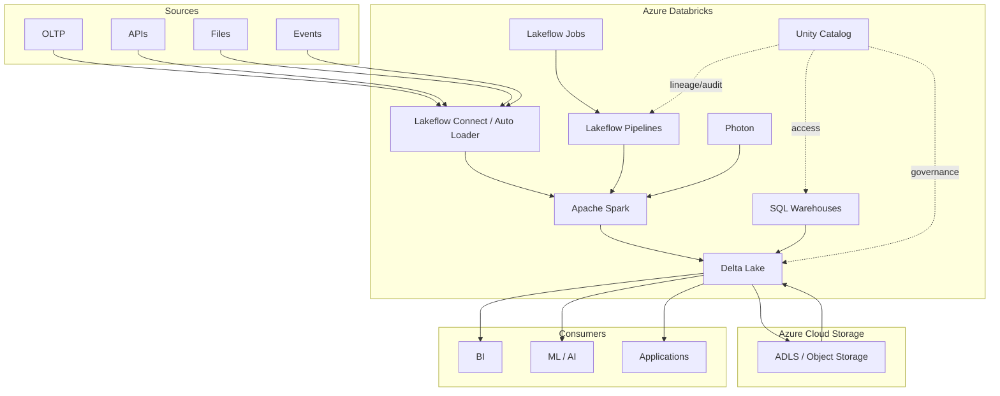

# Chapter 12: Reference Architecture & Revision

> **Scope:** Topics 65–67 from the original master notes, grouped into one learning unit.

## Topics in this chapter

- [Final Architecture Summary](#final-architecture-summary)
- [Official Microsoft Learn References](#official-microsoft-learn-references)
- [Final Revision Checklist](#final-revision-checklist)

---

## 65. Final Architecture Summary

The simplest complete mental picture is:



### The one-sentence summary

> **Azure Databricks provides managed, scalable distributed compute around a governed lakehouse: Spark executes workloads, Delta Lake provides reliable table state on cloud storage, Unity Catalog governs the assets, Lakeflow ingests/transforms/orchestrates data, and optimization/CI-CD/observability turn the platform into a production data engineering system.**

---

## 66. Official Microsoft Learn References

These notes are derived from the official Microsoft Learn Azure Databricks documentation and related official references.

- Azure Databricks documentation: https://learn.microsoft.com/en-us/azure/databricks/
- What is Azure Databricks?: https://learn.microsoft.com/en-us/azure/databricks/introduction/
- What is a data lakehouse?: https://learn.microsoft.com/en-us/azure/databricks/lakehouse/
- High-level architecture: https://learn.microsoft.com/en-us/azure/databricks/getting-started/high-level-architecture
- Architecture overview: https://learn.microsoft.com/en-us/azure/databricks/getting-started/architecture
- Compute: https://learn.microsoft.com/en-us/azure/databricks/compute/
- Photon: https://learn.microsoft.com/en-us/azure/databricks/compute/photon
- What is Delta Lake?: https://learn.microsoft.com/en-us/azure/databricks/delta/
- Data skipping: https://learn.microsoft.com/en-us/azure/databricks/delta/data-skipping
- Liquid clustering: https://learn.microsoft.com/en-us/azure/databricks/tables/clustering
- Auto Loader: https://learn.microsoft.com/en-us/azure/databricks/ingestion/cloud-object-storage/auto-loader/
- Structured Streaming checkpoints: https://learn.microsoft.com/en-us/azure/databricks/structured-streaming/checkpoints
- Delta + Structured Streaming: https://learn.microsoft.com/en-us/azure/databricks/structured-streaming/delta-lake
- Change Data Feed: https://learn.microsoft.com/en-us/azure/databricks/tables/features/change-data-feed
- What is Unity Catalog?: https://learn.microsoft.com/en-us/azure/databricks/data-governance/unity-catalog/
- Row filters and column masks: https://learn.microsoft.com/en-us/azure/databricks/data-governance/unity-catalog/filters-and-masks/
- ABAC: https://learn.microsoft.com/en-us/azure/databricks/data-governance/unity-catalog/abac/
- Lakeflow / Data engineering: https://learn.microsoft.com/en-us/azure/databricks/data-engineering/
- Lakeflow pipelines: https://learn.microsoft.com/en-us/azure/databricks/ldp/concepts/
- Lakeflow Jobs: https://learn.microsoft.com/en-us/azure/databricks/jobs/
- CI/CD: https://learn.microsoft.com/en-us/azure/databricks/dev-tools/ci-cd/
- Declarative Automation Bundles: https://learn.microsoft.com/en-us/azure/databricks/dev-tools/bundles/
- Production planning: https://learn.microsoft.com/en-us/azure/databricks/lakehouse-architecture/deployment-guide/

---

## 67. Final Revision Checklist

Before an interview or certification exam, make sure you can answer:

```text
[ ] What problem does a lakehouse solve?
[ ] Account vs workspace vs metastore?
[ ] Control plane vs compute plane?
[ ] Classic vs serverless compute?
[ ] Driver vs executor?
[ ] Job vs stage vs task?
[ ] Narrow vs wide transformation?
[ ] Why is shuffle expensive?
[ ] What is Catalyst / AQE?
[ ] What is Photon?
[ ] Why Delta instead of plain Parquet?
[ ] What is the Delta transaction log?
[ ] How do snapshots and time travel work conceptually?
[ ] MERGE and deletion vectors?
[ ] CDF and CDC?
[ ] Auto Loader and file events?
[ ] Structured Streaming checkpoint?
[ ] Watermark and state?
[ ] Bronze/Silver/Gold?
[ ] Unity Catalog three-level namespace?
[ ] Managed vs external tables?
[ ] Volumes?
[ ] External locations and storage credentials?
[ ] Row filters / column masks / ABAC?
[ ] Data skipping?
[ ] ZORDER vs liquid clustering?
[ ] OPTIMIZE vs VACUUM?
[ ] Lakeflow Connect vs Pipelines vs Jobs?
[ ] Idempotency?
[ ] Observability?
[ ] Git + CI/CD + Declarative Automation Bundles?
[ ] How would you design an end-to-end production pipeline?
```

---

## Bottom line

The deepest Databricks concept is not a single feature. It is the interaction between **distributed compute, reliable lakehouse storage, centralized governance, incremental processing, workload orchestration, and performance-aware physical layout**.

Learn those interactions and Databricks stops looking like a collection of products and starts looking like one coherent data engineering platform.

