# Azure Databricks Foundation — Data Engineer Master Notes

> **Source:** Microsoft Learn — Azure Databricks documentation
>
> **Purpose:** GitHub-ready study notes covering Azure Databricks foundations, lakehouse architecture, execution internals, storage, ingestion, transformation, streaming, governance, security, optimization, orchestration, and production engineering.
>
> **Last reviewed:** 29 August 2026
>
> **Important terminology:** Databricks has renamed **Delta Live Tables (DLT)** to **Lakeflow pipelines** and **Databricks Asset Bundles** to **Declarative Automation Bundles**. Older projects and interview questions may still use the legacy names.

---

## 1. What is Azure Databricks?

Azure Databricks is a managed data and AI platform built around Apache Spark and a lakehouse architecture. It combines scalable cloud object storage, distributed compute, Delta Lake, Unity Catalog, orchestration, ingestion, analytics, and AI capabilities into one platform.

The central Data Engineer idea is:

```text
Cloud Object Storage
        |
        v
     Delta Lake  <---- transaction + table state
        |
        v
   Databricks Compute
        |
   +----+------------------+
   |                       |
Batch / ETL           Streaming / CDC
   |                       |
   +-----------+-----------+
               |
               v
      Governed Lakehouse
               |
      +--------+---------+
      |                  |
     BI             ML / AI / Apps
```

### Why Databricks?

Traditional architectures frequently separate:

- a data lake for cheap storage,
- a data warehouse for BI,
- a stream-processing platform for real time workloads,
- and separate governance/catalog systems.

The lakehouse pattern tries to use one governed data platform and one copy of data for many workloads.

### Core technologies

| Technology | Main job |
|---|---|
| Apache Spark | Distributed compute engine |
| Delta Lake | Reliable storage/table layer on cloud object storage |
| Unity Catalog | Governance, security, discovery, lineage |
| Lakeflow Connect | Data ingestion |
| Lakeflow pipelines | Declarative batch + streaming pipelines |
| Lakeflow Jobs | Workflow orchestration |
| Photon | Native vectorized execution engine for supported workloads |
| SQL warehouses | SQL/BI-optimized compute |
| Git + Declarative Automation Bundles | Software engineering / CI/CD |

---

# 2. Lakehouse Fundamentals

## 2.1 Data lake vs data warehouse vs lakehouse

### Data lake

A data lake usually stores large amounts of raw data cheaply in cloud object storage. It is flexible but historically weak on transactions, governance consistency, and BI performance without additional layers.

### Data warehouse

A data warehouse emphasizes structured data, governance, SQL performance, and BI workloads. Traditional warehouses often impose stronger structure and can introduce separate storage/compute economics and data-copy requirements.

### Lakehouse

A lakehouse combines:

- low-cost/open cloud object storage,
- transactional reliability,
- data engineering and streaming,
- SQL analytics,
- ML/AI access,
- centralized governance.

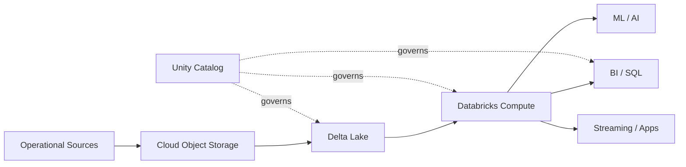

### Key lakehouse design principle

**Separate storage from compute.**

The data lives in durable cloud storage. Compute clusters/warehouses are created, scaled, and terminated independently.

This enables different compute profiles for different consumers without duplicating the data.

---

# 3. Azure Databricks Enterprise Architecture

## 3.1 Account → Workspace → Metastore

At the enterprise level, understand the hierarchy:

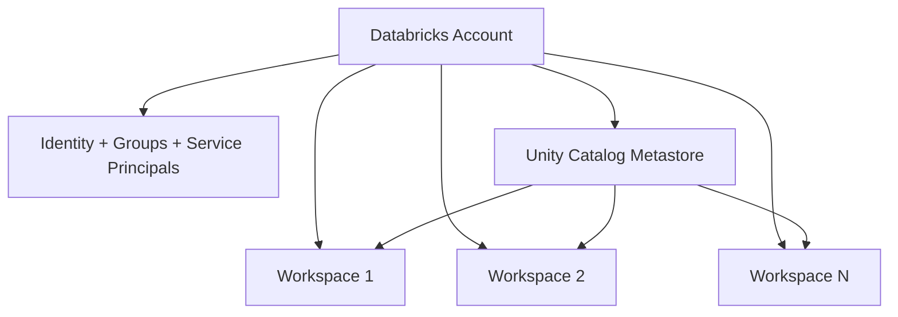

### Account

The account is the top-level management boundary.

Typical account-level responsibilities include:

- identity and user provisioning,
- groups and service principals,
- workspace management,
- Unity Catalog metastore management,
- usage/billing/compliance controls.

### Workspace

A workspace is the working environment in which users:

- create notebooks,
- access data,
- run compute,
- develop pipelines,
- schedule jobs,
- explore and analyze data.

In production organizations, separate workspaces are often used for environments such as development, staging, and production.

### Unity Catalog metastore

The metastore is the centralized governance boundary for governed data and AI assets.

The most important namespace is:

```text
catalog.schema.object
```

Example:

```text
sales.bronze.orders
sales.silver.orders
sales.gold.daily_sales
```

A metastore can be attached to multiple workspaces in the same region, enabling centralized governance and a consistent data view.

---

# 4. Control Plane vs Compute Plane

This is one of the most important architecture concepts for interviews.

## 4.1 Control plane

The control plane contains Databricks-managed backend services and the web application.

Think of it as the **management and coordination layer**.

Responsibilities include things such as:

- workspace UI,
- orchestration/control services,
- metadata and platform management,
- identity/access integration,
- APIs.

## 4.2 Compute plane

The compute plane is where workload processing occurs.

Azure Databricks currently exposes two broad models:

### Classic compute plane

- Compute resources run in your Azure subscription.
- You have more network/infrastructure customization.
- Common for workloads with specific networking or infrastructure requirements.

### Serverless compute plane

- Databricks manages the compute infrastructure.
- Compute is provisioned on demand.
- Less infrastructure management.
- Strong isolation and governance mechanisms are built into the platform.

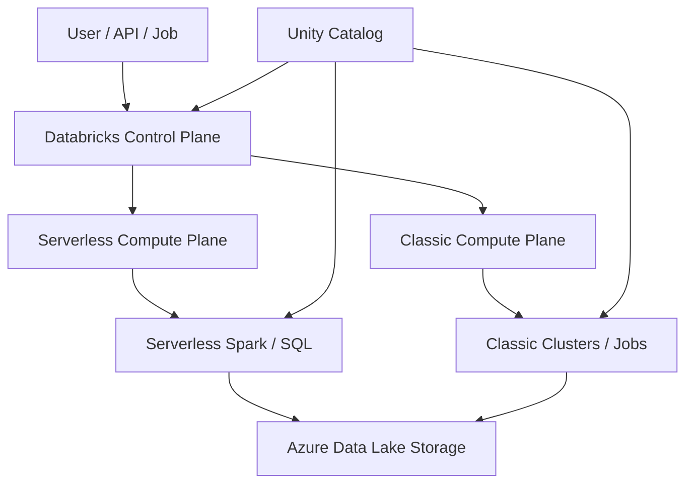

### Interview distinction

> **Control plane manages and coordinates. Compute plane executes the workload.**

Do not confuse **storage** with compute. Data commonly remains in Azure storage while compute is ephemeral.

---

# 5. Workspace Storage vs Data Storage

A common conceptual mistake is thinking the workspace itself is the data lake.

A better mental model is:

```text
Workspace = collaboration + platform environment
Cloud storage = durable data
Databricks compute = processing
Delta Lake = reliable table/storage protocol
Unity Catalog = governance
```

For classic workspaces, there is an associated workspace storage account in the Azure subscription. However, enterprise lakehouse data architecture should intentionally separate workspace/platform storage from governed business data storage.

---

# 6. Databricks Compute

Azure Databricks compute broadly includes:

1. Serverless compute
2. Classic compute
3. SQL warehouses

## 6.1 Serverless compute

Best mental model: **Databricks manages infrastructure and scales it for you.**

Typical uses:

- notebooks,
- jobs,
- Lakeflow pipelines,
- SQL workloads.

Advantages:

- low infrastructure overhead,
- automatic scaling,
- faster developer experience,
- managed isolation.

## 6.2 Classic compute

Classic compute is provisioned compute that you configure/manage.

Common concepts:

- standard/shared compute,
- dedicated compute,
- jobs compute,
- instance pools,
- autoscaling,
- runtime versions.

### Standard vs Dedicated

**Standard compute** is intended for shared multi-user environments with strong isolation mechanisms.

**Dedicated compute** is assigned to a single user/group/workload and preserves more traditional Spark behavior.

## 6.3 SQL warehouses

SQL warehouses are optimized for SQL analytics and BI.

Think:

```text
BI Tool / SQL Client
        |
        v
  SQL Warehouse
        |
       SQL
        |
        v
 Delta / Lakehouse tables
```

They may be serverless or classic depending on requirements.

---

# 7. Spark Execution Internals

Databricks is built on Apache Spark, so understanding Spark internals is essential for a Data Engineer.

## 7.1 Driver and executors

Typical Spark execution:

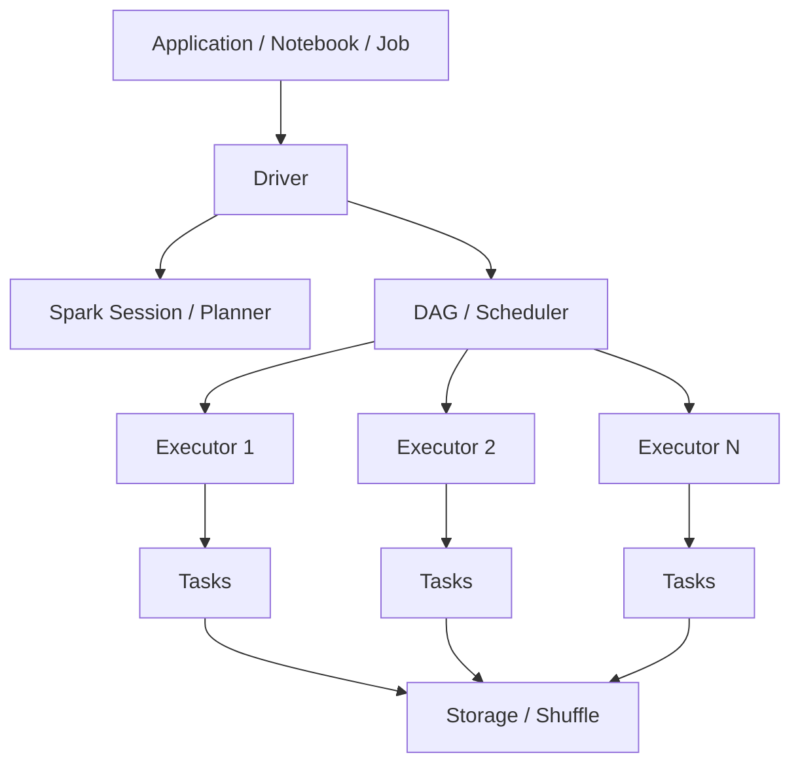

### Driver

The driver is responsible for coordinating the Spark application. It constructs/owns the execution plan and coordinates jobs/stages/tasks.

### Executors

Executors execute tasks and perform distributed transformations and actions. They also hold cached/persisted data and shuffle data as required.

### Job

An action can trigger a Spark job.

Examples of actions:

- `count()`
- `collect()`
- `write`
- `save`

### Stage

A stage is a group of tasks that can execute without crossing a shuffle boundary.

### Task

A task is the unit of work executed for one partition of data.

---

# 8. Transformations, Actions, Lazy Evaluation

Spark transformations are generally lazy.

Example:

```python
df2 = df.filter("amount > 100").select("customer_id", "amount")
```

At this point Spark has primarily built a plan.

The action:

```python
df2.count()
```

triggers execution.

### Why lazy evaluation matters

Spark can optimize the complete operation graph before execution rather than executing each transformation immediately.

This allows optimizations such as:

- predicate pushdown,
- column pruning,
- join strategy selection,
- whole-stage optimizations,
- adaptive query optimizations.

---

# 9. Narrow vs Wide Transformations

## Narrow transformation

Each output partition depends on a relatively small number of input partitions.

Examples:

- `filter`
- `select`
- `withColumn`
- many map-style transformations.

These usually avoid a shuffle.

## Wide transformation

Data must move between executors/partitions.

Examples:

- `groupBy`
- `join` (unless broadcast/otherwise optimized)
- `distinct`
- `orderBy`

Wide transformations usually introduce shuffle boundaries.

```text
Narrow:
P1 -> P1'
P2 -> P2'
P3 -> P3'

Wide:
P1 ----\
P2 -----+--> Shuffle --> P1'
P3 ----/             --> P2'
```

### Practical performance rule

**Shuffle is expensive.**

When diagnosing a slow Spark job, always inspect:

- number of input files,
- partition counts,
- shuffle read/write,
- skew,
- join strategy,
- task duration distribution,
- spill to disk,
- executor memory pressure.

---

# 10. Catalyst and Adaptive Query Execution

Spark uses a query planner/optimizer. At a high level:

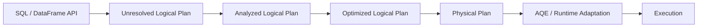

### Catalyst

Catalyst is Spark SQL's query optimization framework. It transforms and optimizes logical and physical plans.

### Adaptive Query Execution (AQE)

AQE can adapt execution based on runtime statistics.

Conceptually:

```text
Static plan
    |
    v
Runtime statistics
    |
    v
Re-optimization
    |
    +--> join strategy changes
    +--> partition coalescing
    +--> skew handling
```

For interviews, remember:

> **Catalyst optimizes the plan; AQE can adjust parts of the physical execution using runtime information.**

---

# 11. Photon

Photon is the Databricks-native vectorized query engine.

Important mental model:

```text
Spark SQL / DataFrame API
          |
       Catalyst
          |
    Physical plan
          |
   +------+------+
   |             |
   v             v
Spark JVM     Photon C++
execution     execution
   |             |
   +------+------+ 
          |
       Results
```

Photon:

- processes data in columnar batches,
- uses native C++ execution for supported operations,
- integrates with Spark APIs,
- accelerates SQL, DataFrame, ETL, and certain streaming workloads.

Photon does **not** replace Spark's query planning model; it can replace the execution layer for supported operations.

---

# 12. Delta Lake — The Storage Layer

Delta Lake is an open storage layer that extends Parquet with a transaction log.

Core idea:

```text
Delta Table

+-----------------------+
| Parquet data files    |
+-----------------------+
| _delta_log/           |
|  000000....json       |
|  000001....json       |
|  checkpoints/         |
+-----------------------+
```

Delta provides:

- ACID transactions,
- schema enforcement/evolution capabilities,
- scalable metadata handling,
- time travel/versioning,
- batch + streaming unification,
- updates/deletes/merges,
- data layout optimizations.

Delta is the default table format for Azure Databricks unless another format is explicitly selected.

---

# 13. Delta Transaction Log Internals

A very important Data Engineer mental model is that a Delta table is not just a directory of Parquet files.

It is better modeled as:

```text
Cloud storage
|
+-- data-000.parquet
+-- data-001.parquet
+-- data-002.parquet
|
+-- _delta_log/
    +-- 00000000000000000000.json
    +-- 00000000000000000001.json
    +-- 00000000000000000002.json
    +-- ...
    +-- checkpoints
```

The transaction log records table state changes and metadata/actions required to reconstruct a consistent table snapshot.

### Snapshot idea

If version `N` is the latest committed state:

```text
Snapshot(N)
 = checkpoint before N
 + JSON transaction actions after checkpoint
```

Readers use the log to determine which physical files are currently active.

### Why this solves the data-lake problem

A raw Parquet directory does not natively provide the same transactional table semantics as Delta.

Delta adds a metadata/transaction protocol over the files.

---

# 14. ACID Transactions

ACID means:

- **Atomicity** — a transaction is committed as a coherent unit.
- **Consistency** — table constraints/protocol rules are respected.
- **Isolation** — concurrent readers/writers observe controlled table states.
- **Durability** — committed state persists in durable storage.

### Optimistic concurrency idea

At a conceptual level:

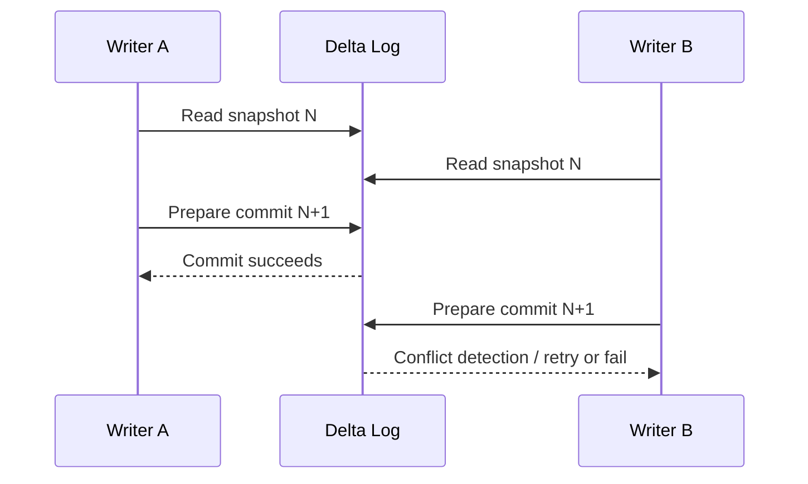

Exact conflict behavior depends on the operation and table protocol, but the important idea is that the transaction log coordinates a consistent table state.

---

# 15. Time Travel

Because Delta tracks table versions, you can query historical snapshots subject to retention and vacuum policies.

Conceptually:

```sql
SELECT *
FROM sales VERSION AS OF 42;
```

or timestamp-based queries.

### Important distinction

Time travel is **logical table history**, not a permanent backup guarantee.

If old data files and transaction log history are physically removed beyond retention using maintenance operations such as `VACUUM`, those historical snapshots may no longer be available.

---

# 16. MERGE, UPDATE, DELETE and Deletion Vectors

Traditional file-based updates often mean rewriting Parquet files.

Example:

```text
1 row changes
   |
   v
Find containing Parquet file
   |
   v
Rewrite whole file
```

Deletion vectors improve this model for supported workloads.

```text
Parquet file
   |
   +---- row 10 -> unchanged
   +---- row 11 -> deleted/updated
   +---- row 12 -> unchanged
             |
             v
       deletion vector
```

A deletion vector stores metadata indicating affected rows so the physical file does not necessarily need to be rewritten immediately.

Later maintenance such as `OPTIMIZE` can rewrite data files.

### Why this matters

It can improve:

- `DELETE`,
- `UPDATE`,
- `MERGE`,
- row-level modifications,

especially for large files where rewriting entire files would be expensive.

---

# 17. Change Data Feed (CDF)

Change Data Feed exposes row-level changes between table versions.

Typical use cases:

- incremental ETL,
- CDC propagation,
- audit trails,
- downstream synchronization.

Conceptually:

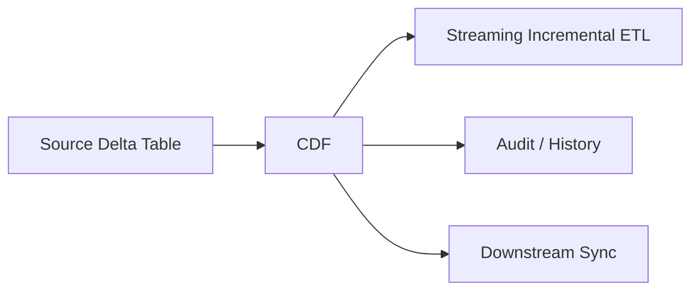

Change records can identify events such as:

- insert,
- update pre-image,
- update post-image,
- delete.

### CDF + Structured Streaming

A common architecture is:

```text
Source Delta Table
        |
       CDF
        |
Structured Streaming
        |
Silver / Gold
```

This avoids repeatedly scanning the full source table when only changes are needed.

---

# 18. Delta and Streaming Together

Delta Lake is designed to work with Structured Streaming.

A Delta table can be:

- read by batch,
- read as a stream,
- written by batch,
- written by streaming.

This is one of the strongest lakehouse design ideas.

```text
             +--> Batch Reader
Delta Table -+
             +--> Streaming Reader

             +--> Batch Writer
Delta Table -+
             +--> Streaming Writer
```

A Delta sink uses the Delta transaction log to provide transactional writes and strong processing semantics.

---

# 19. Auto Loader

Auto Loader is Databricks' scalable incremental file ingestion mechanism for cloud object storage.

Important benefits:

- scales to very large numbers of files,
- incremental file discovery,
- schema inference/evolution support,
- resilient ingestion state,
- integration with Structured Streaming.

Typical pattern:

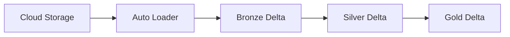

## 19.1 File discovery modes

Conceptually there are two major approaches:

### Directory listing

Auto Loader lists the input directory and identifies new files.

Useful for getting started, but continuous directory listing can become expensive at large scale.

### File notification / file events

Cloud file events notify the ingestion system when files arrive.

This is more scalable and is recommended for many production workloads.

```text
Directory listing:
Auto Loader -> LIST storage -> identify files

File events:
New file -> cloud event -> event service/cache -> Auto Loader
```

### Key production principle

Use Auto Loader checkpoints to persist discovery/processing state. Do not treat file arrival detection as a stateless operation.

---

# 20. Structured Streaming

Structured Streaming is Spark's streaming engine.

A useful mental model is:

```text
Unbounded input
      |
      v
Streaming DataFrame
      |
 Transformations
      |
 Trigger / micro-batch
      |
      v
State + checkpoint
      |
      v
Sink
```

### Micro-batch mental model

A common execution style is:

```text
Batch 1 -> process -> commit
Batch 2 -> process -> commit
Batch 3 -> process -> commit
```

The exact trigger configuration controls when processing occurs.

---

# 21. Structured Streaming Checkpoints

A streaming checkpoint is fundamental to fault tolerance and recovery.

It can contain information such as:

- source offsets,
- committed micro-batches,
- state for stateful operations,
- query metadata/configuration.

```text
Checkpoint
|
+-- offsets
+-- commits
+-- state
+-- metadata
```

### Rule

Each streaming query must have its own checkpoint location.

Do not casually share a checkpoint directory between unrelated streaming queries.

### Why checkpoints matter

Suppose a job fails after processing batch 100.

The checkpoint helps the restarted query determine what was processed and resume from the correct position, subject to the source/sink semantics.

---

# 22. Stateful Streaming

Operations such as:

- streaming aggregation,
- stream-stream joins,
- deduplication,
- arbitrary stateful processing,

require persistent state.

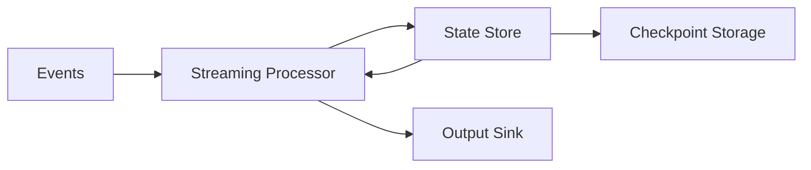

### Watermarking

Watermarks let Spark reason about how much event-time data is expected to arrive late.

Example idea:

```text
Current event time = 12:00
Watermark delay = 10 minutes
Watermark = 11:50
```

The watermark can enable bounded state cleanup in certain stateful operations.

### Interview trap

A watermark is **not** simply “discard every event older than X minutes.” It is a mechanism tied to event-time progress and state management semantics.

---

# 23. Lakeflow: Modern Data Engineering Layer

Lakeflow is Databricks' end-to-end data engineering solution.

Major pieces:

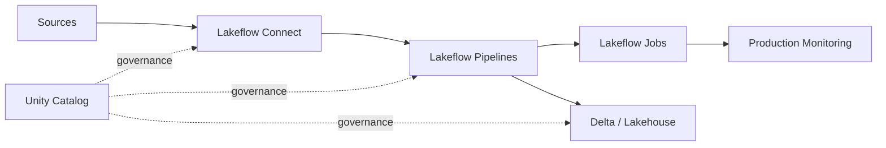

### Lakeflow Connect

Ingestion from enterprise applications, databases, cloud storage, message buses, and other sources using managed or standard connectors.

### Lakeflow pipelines

Declarative batch and streaming pipeline framework built on Apache Spark Declarative Pipelines.

Key concepts include:

- flows,
- streaming tables,
- materialized views,
- sinks.

### Lakeflow Jobs

Workflow orchestration across tasks.

A job can coordinate:

- notebooks,
- pipelines,
- SQL queries,
- machine learning tasks,
- connectors,
- deployment/inference workloads,
- branching and looping.

---

# 24. Declarative Pipelines vs Imperative Spark Code

Traditional imperative approach:

```python
df = spark.read...
df = df.filter...
df.write...
```

You explicitly tell Spark what operations to perform.

Declarative pipeline approach:

```text
Declare the desired dataset/table
        |
        v
Framework determines dependency graph
        |
        v
Framework orchestrates incremental execution
```

### Why declarative pipelines matter

They can centralize:

- dependency management,
- incremental processing,
- data quality expectations,
- orchestration,
- pipeline lifecycle management.

The goal is to focus more on **what the dataset should represent** and less on manually wiring every operational step.

---

# 25. Streaming Tables vs Materialized Views

## Streaming table

A Delta-based target designed for streaming/incremental processing.

Think:

```text
Source changes
   |
   v
Streaming flow
   |
   v
Streaming table
```

## Materialized view

Stores materialized results so downstream queries can use precomputed data.

Think:

```text
Base tables
   |
   v
Transformation
   |
   v
Materialized result
```

### Practical distinction

Use streaming/incremental semantics when data continuously arrives or changes and the pipeline should process incrementally.

Use materialization when the main goal is maintaining a query-ready derived result.

---

# 26. Data Quality

Data quality should be designed into the pipeline, not added after failures occur.

Typical checks:

- null constraints,
- accepted values,
- uniqueness,
- referential integrity,
- business rules,
- schema expectations.

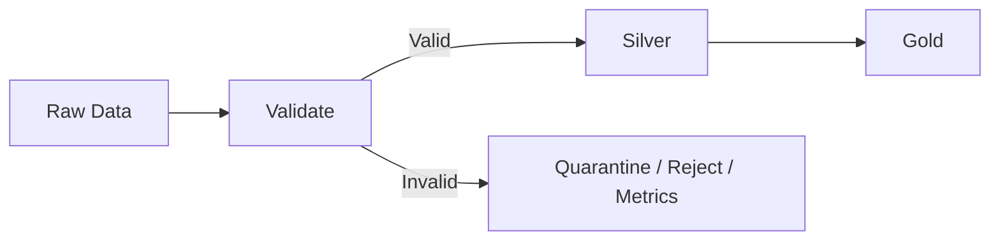

In Lakeflow pipelines, expectations can be used to define and monitor data quality constraints.

---

# 27. Medallion Architecture

A common lakehouse pattern is:

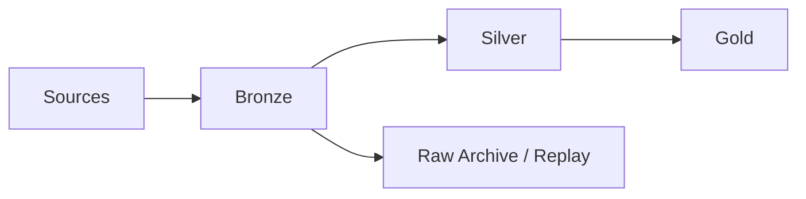

## Bronze

Purpose:

- preserve source information,
- support replay,
- capture raw/near-raw events,
- land data reliably.

Typical transformations: minimal.

## Silver

Purpose:

- clean,
- standardize,
- deduplicate,
- normalize,
- apply data quality rules,
- integrate sources.

## Gold

Purpose:

- business-ready data products,
- KPI tables,
- aggregates,
- dimensional/fact models,
- BI serving tables.

### Key principle

Bronze is not supposed to become an unmaintainable junkyard. It should be intentionally designed as the raw/source-of-truth layer with retention, governance, and replay requirements in mind.

---

# 28. Unity Catalog — Governance Layer

Unity Catalog is the unified governance layer for data and AI assets in Azure Databricks.

Major capabilities include:

- access control,
- discovery,
- lineage,
- auditing,
- data sharing,
- managed/external asset governance,
- row/column-level security,
- tags/policies.

### Object hierarchy

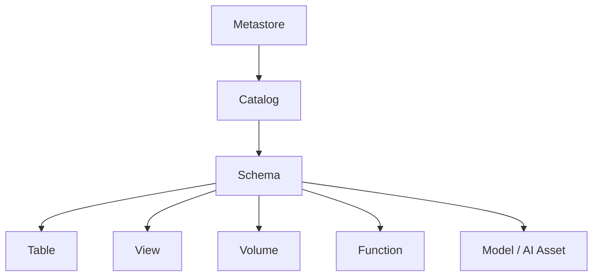

Canonical naming:

```text
catalog.schema.object
```

---

# 29. Managed vs External Tables

## Managed table

Unity Catalog manages governance and the lifecycle of the underlying storage location.

Advantages:

- simpler platform management,
- lifecycle integration,
- centralized governance,
- easier standardization.

## External table

Unity Catalog manages the table's governance/metadata while the data remains in a location controlled outside the managed table lifecycle.

Use cases:

- data must remain at a specific storage path,
- an existing externally managed data layout must be registered,
- interoperability or organizational ownership requires external storage control.

### Modern recommendation

For new lakehouse data, prefer governed Unity Catalog managed tables unless there is a clear reason the data must remain external.

---

# 30. Volumes

Unity Catalog volumes are useful for files and non-tabular data.

Think:

```text
Tables -> structured tabular data
Volumes -> governed files / raw assets / unstructured data
```

Examples:

- landing files,
- documents,
- images,
- test data,
- ingestion artifacts.

---

# 31. Access Control Mental Model

Databricks governance involves several layers.

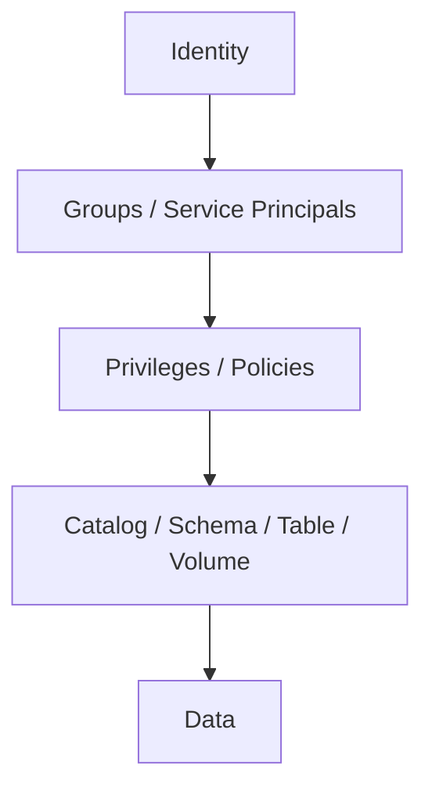

### Important security concepts

- identity-based access,
- workspace permissions,
- Unity Catalog privileges,
- storage credentials,
- external locations,
- row filters,
- column masks,
- attribute-based access control (ABAC),
- network controls,
- audit logs.

---

# 32. Row Filters and Column Masks

## Row filter

Controls which rows a user can see.

Example concept:

```text
Sales table
|
+-- India rows -> India users
+-- US rows    -> US users
+-- EU rows    -> EU users
```

## Column mask

Controls what value a user sees for a column.

Example:

```text
email = rohan@example.com

Analyst sees: r****@example.com
Authorized user sees: rohan@example.com
```

### ABAC

Attribute-Based Access Control scales security rules using governed tags and policy logic.

Useful when the same policy should automatically apply across many tables and columns.

---

# 33. Lakeguard and User Isolation

Lakeguard is part of Databricks' isolation model for shared compute and fine-grained access controls.

At a conceptual level:

```text
Shared Compute
|
+-- User A sandbox
+-- User B sandbox
+-- User C sandbox
|
+-- Spark engine
+-- Governed data access
```

The goal is to prevent user code from directly accessing other users' code/data or underlying infrastructure in shared environments while still allowing efficient shared compute.

This is especially relevant to serverless and standard/shared compute.

---

# 34. Azure Storage Authentication

For governed Azure storage access, an important concept is the Azure Databricks **Access Connector** and managed identities.

Mental model:

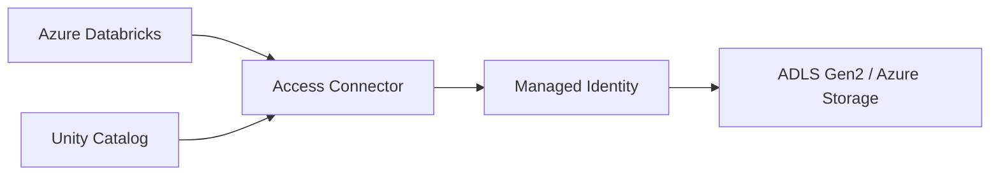

The key security principle is:

> Prefer identity-based authorization over hard-coded cloud storage keys/secrets whenever supported by the architecture.

---

# 35. External Locations and Storage Credentials

Unity Catalog decouples cloud storage authorization from individual notebooks.

Conceptually:

```text
User / Job
    |
    v
Unity Catalog object
    |
    v
External Location
    |
    v
Storage Credential
    |
    v
Azure Storage
```

This allows administrators to centralize and govern data access rather than asking every developer to manage storage secrets manually.

---

# 36. Data Discovery and Lineage

Unity Catalog can provide lineage information showing how data assets relate across a pipeline.

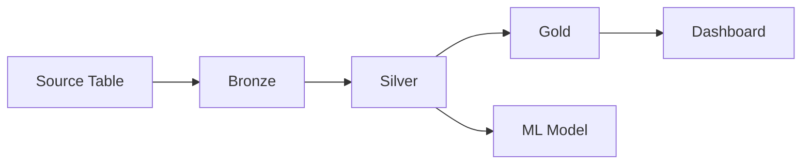

Lineage is useful for:

- impact analysis,
- debugging,
- compliance,
- understanding transformations,
- identifying downstream consumers.

---

# 37. Query Performance: Data Skipping

Databricks can use per-file statistics to avoid reading files that cannot satisfy a query predicate.

Example:

```text
File A: customer_id 1-1000
File B: customer_id 1001-2000
File C: customer_id 2001-3000

Query: customer_id = 2500

Read: File C
Skip: File A, File B
```

Typical stats include information such as:

- minimum values,
- maximum values,
- null counts,
- record counts.

### Key insight

**Data skipping reduces I/O before Spark reads irrelevant files.**

That is different from a filter that only removes rows after the file was already read.

---

# 38. Z-ORDER

Z-ordering historically improved locality of related values across files and thereby improved data skipping.

Example:

```sql
OPTIMIZE events
ZORDER BY (customer_id);
```

Good candidate columns historically include commonly filtered high-cardinality columns with statistics.

### Modern recommendation

For new Delta tables, Databricks recommends **liquid clustering** rather than designing new partition/Z-ORDER strategies around older layouts.

---

# 39. Liquid Clustering

Liquid clustering is a modern data-layout mechanism that lets the physical organization of data evolve with query patterns.

Conceptually:

```text
Traditional partitioning
-----------------------
Fixed key -> fixed partition layout

Liquid clustering
-----------------
Workload patterns
       |
       v
Adaptive clustering keys
       |
       v
Evolving file layout
```

Benefits include:

- less manual partition planning,
- better behavior for high-cardinality access patterns,
- ability to change clustering strategy,
- reduced need for rigid directory partition structures,
- incremental maintenance.

### Important compatibility rule

Liquid clustering is not combined with traditional partitioning or `ZORDER`.

### Typical maintenance

```sql
OPTIMIZE catalog.schema.table;
```

Predictive optimization can automatically perform optimization tasks for eligible managed tables.

---

# 40. OPTIMIZE

`OPTIMIZE` improves physical data layout.

It can help address the small-file problem through compaction and can perform layout optimization such as clustering.

Think:

```text
Many small files
      |
      v
   OPTIMIZE
      |
      v
Fewer / better-organized files
      |
      v
Less file-open overhead + better scans
```

### Important distinction

`OPTIMIZE` is primarily a **storage layout optimization** operation.

It does not replace:

- good schema design,
- correct joins,
- avoiding unnecessary data scans,
- reducing shuffle,
- correct partitioning strategy where still appropriate.

---

# 41. Small File Problem

A workload that continuously writes tiny batches can create many small files.

Problems:

- too much file-open overhead,
- more metadata/listing work,
- more scheduling overhead,
- poor scan efficiency.

Possible mitigations:

- appropriate micro-batch sizing,
- optimized writes/auto-compaction where supported,
- `OPTIMIZE`,
- predictive optimization,
- better ingestion design.

---

# 42. VACUUM

`VACUUM` removes old/unreferenced files that are no longer needed according to retention policies.

Mental model:

```text
Old file versions
       |
   Retention window
       |
       v
   VACUUM
       |
       v
Storage reclaimed
```

### Critical warning

Do not treat `VACUUM` as a harmless cleanup command. It affects the ability to access older table versions after files are deleted.

Time travel and retention strategy must be designed together.

---

# 43. Schema Enforcement and Evolution

A production pipeline needs an intentional approach to schema changes.

### Schema enforcement

Protects a table from accidental incompatible writes.

### Schema evolution

Allows controlled changes such as:

- adding columns,
- compatible changes,
- evolving ingestion schemas.

### Data engineering rule

Never interpret "schema evolution enabled" as "accept any input schema silently."

Instead define:

```text
Expected schema
      |
      +--> allowed change
      +--> rejected change
      +--> quarantine
      +--> alert
```

---

# 44. Batch vs Streaming Architecture

## Batch

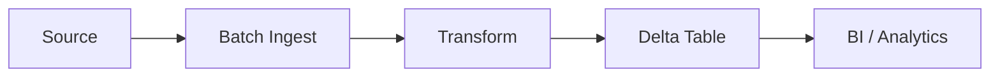

Typical requirement:

- hourly/daily processing,
- large bounded datasets,
- simpler operational model.

## Streaming

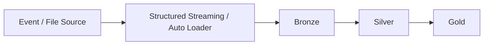

Typical requirement:

- low-latency ingestion,
- continuous updates,
- event-driven pipelines.

### Hybrid reality

Many enterprise pipelines are actually hybrid:

```text
Historical backfill = batch
New data            = streaming
                 ↓
             same Delta model
```

---

# 45. CDC Architecture

Change Data Capture is a common enterprise Data Engineer requirement.

Typical flow:

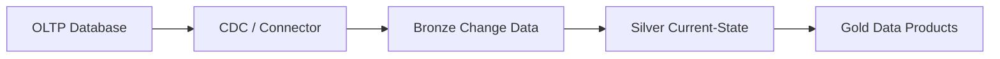

For Delta-to-Delta incremental patterns, CDF can provide row-level changes to downstream consumers.

For source database CDC, connector choice and source-system semantics matter.

---

# 46. SCD Type 1 vs Type 2 on Databricks

## SCD Type 1

Overwrite the old dimension value.

```text
Customer 100
Old city = Delhi
New city = Pune

Current state:
Customer 100 -> Pune
```

Often implemented using `MERGE`.

## SCD Type 2

Preserve history.

```text
customer_id | city  | start      | end        | current
100         | Delhi | 2025-01-01 | 2026-03-01 | false
100         | Pune  | 2026-03-01 | null       | true
```

Key ideas:

- surrogate/business keys,
- effective start/end timestamps,
- current flag,
- deterministic merge logic.

---

# 47. Lakehouse Table Design

A practical table-design checklist:

1. Identify the grain.
2. Decide raw vs curated layer.
3. Define primary/business keys.
4. Define data types intentionally.
5. Plan schema evolution.
6. Understand query patterns.
7. Select layout strategy.
8. Define retention.
9. Define ownership and permissions.
10. Define data quality checks.

### Grain comes first

Example:

```text
FactSales grain = one order line
```

Then every measure and key should be evaluated against that grain.

This prevents:

- double counting,
- incorrect joins,
- accidental fan-out,
- misleading aggregates.

---

# 48. Join Performance

Join strategy is a core Spark skill.

Conceptually:

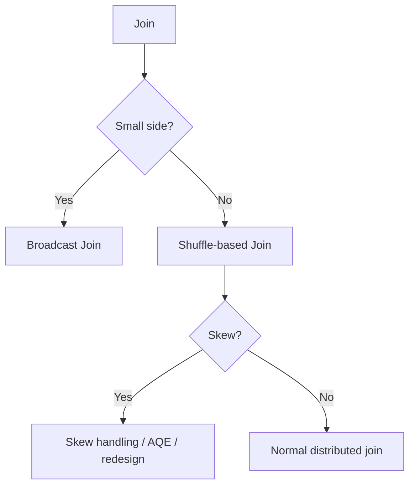

### Broadcast join

If one side is small enough, broadcasting can avoid a full shuffle of the large side.

### Shuffle join

Large tables commonly require data redistribution by join key.

### Join optimization checklist

- filter early,
- select only needed columns,
- broadcast genuinely small dimensions,
- inspect skew,
- avoid accidental many-to-many joins,
- verify join keys and data types,
- inspect the physical plan.

---

# 49. Data Skew

Data skew occurs when one or a few keys contain a disproportionate amount of data.

Example:

```text
Partition 1 -> 10 MB
Partition 2 -> 11 MB
Partition 3 -> 12 MB
Partition 4 -> 4 GB   <-- skew
```

Result:

- most tasks finish quickly,
- one/few tasks run much longer,
- job waits for stragglers.

Mitigation can include:

- AQE skew handling,
- salting where appropriate,
- better join strategy,
- pre-aggregation,
- filtering invalid/special keys,
- data model changes.

### Interview clue

If the Spark UI shows most tasks complete in seconds while a few take minutes, investigate skew.

---

# 50. Partitioning — Do Not Confuse the Concepts

The word "partition" can refer to multiple different things.

### Spark partition

A unit of distributed processing.

### Table/data partition

A physical storage organization, historically often represented by directory keys.

### Azure storage directory

A physical cloud path.

These are not the same thing.

```text
Spark partition
     !=
Delta table partition
     !=
Folder / directory
```

Modern Databricks guidance increasingly emphasizes liquid clustering rather than aggressive manual table partitioning for new designs.

---

# 51. File Size and Partition Count

Spark's input parallelism depends on factors such as:

- file sizes,
- file count,
- file split configuration,
- compute resources,
- source format.

For interview discussions, avoid memorizing a simplistic rule like:

```text
partition count = file size / 128 MB
```

as an absolute formula.

Actual input partitioning depends on Spark's file splitting and open-cost settings, file format behavior, and scheduling details.

### Practical goal

Avoid both extremes:

```text
Too few partitions -> under-parallelization
Too many tiny partitions -> scheduling overhead
```

Tune based on actual workload metrics rather than a single fixed number.

---

# 52. Caching and Persistence

Caching stores computed data so repeated operations may reuse it.

```text
Read + Transform
      |
    cache
      |
      v
+----------------+
| memory/disk     |
| persisted data  |
+----------------+
      |
      +--> Query A
      +--> Query B
```

### Important distinction

Caching can consume cluster memory/storage and may effectively maintain another representation of data.

It does **not** mean the source files themselves become larger.

### When to cache

Useful when:

- the same expensive intermediate dataset is reused,
- recomputation is more expensive than storage,
- the workload fits a stable reuse pattern.

Avoid caching everything. It can cause memory pressure and eviction churn.

---

# 53. Orchestration with Lakeflow Jobs

A production pipeline often looks like:

```mermaid
flowchart TD
    A[Trigger] --> B[Ingest Task]
    B --> C[Quality Task]
    C --> D[Transform Task]
    D --> E[Publish Task]
    E --> F[Notify / Monitor]
    C -->|Failure| X[Alert / Retry]
    D -->|Failure| X
```

Lakeflow Jobs support:

- multi-task workflows,
- schedules,
- triggers,
- retries,
- alerts,
- conditional logic,
- loops/foreach patterns,
- task dependencies.

### Job design principle

A job is an orchestration graph, not merely a notebook launcher.

---

# 54. Reliability Patterns

Production pipelines should address:

- retries,
- idempotency,
- checkpointing,
- bad-record handling,
- schema changes,
- partial failure,
- observability,
- replay/backfill.

## Idempotency

A job is idempotent when rerunning the same logical input produces the same intended final state without duplicating data.

Example concept:

```text
Input batch 2026-08-29
        |
        v
Job run #1 -> success

Retry / rerun
        |
        v
Job run #2 -> same correct state
```

Delta `MERGE`, deterministic keys, batch identifiers, and controlled writes are common building blocks.

---

# 55. Observability

Monitoring should answer:

1. Did the pipeline run?
2. Did it finish successfully?
3. How long did it take?
4. How much data moved?
5. Did data quality degrade?
6. Where did the job spend time?
7. Is cost increasing?
8. Can the run be safely replayed?

Useful areas to inspect:

- job run history,
- task duration,
- Spark UI,
- SQL query profile,
- cluster metrics,
- streaming progress,
- pipeline event logs,
- data quality metrics,
- lineage.

---

# 56. Production Deployment / CI-CD

A modern Databricks development flow is:

```mermaid
flowchart LR
    A[Developer] --> B[Git Branch]
    B --> C[Code + Tests]
    C --> D[Pull Request]
    D --> E[CI]
    E --> F[Declarative Automation Bundle]
    F --> G[Dev]
    G --> H[Staging]
    H --> I[Prod]
    I --> J[Monitor]
```

### Recommended engineering principles

- version source code,
- use branches and pull requests,
- test code automatically,
- define infrastructure/workflows as code,
- parameterize environments,
- avoid manual production changes,
- monitor after deployment,
- automate rollback where practical.

### Declarative Automation Bundles

Bundles let a project define deployable Databricks resources in source-controlled files.

They are the modern recommended approach for Databricks CI/CD.

Legacy name:

```text
Databricks Asset Bundles
        ->
Declarative Automation Bundles
```

---

# 57. Environment Separation

A practical enterprise pattern:

```text
          Git Repository
               |
        +------+------+------+
        |             |      |
       Dev          Stage   Prod
     Workspace     Workspace Workspace
```

Separate environments reduce:

- accidental production changes,
- configuration drift,
- unauthorized access,
- testing risk.

Common promotion path:

```text
Feature branch
    |
    v
CI tests
    |
    v
Dev deployment
    |
    v
PR approval
    |
    v
Prod deployment
```

---

# 58. Networking Architecture

Enterprise Azure Databricks designs often need:

- private connectivity,
- VNet integration/network controls,
- firewall rules,
- private endpoints where appropriate,
- secure storage access,
- egress control,
- identity-based storage authorization.

### Architecture principle

Do not design "compute first".

Design together:

```text
Identity
   +
Network
   +
Storage
   +
Compute
   +
Governance
   +
CI/CD
```

A production data platform is a system, not a notebook.

---

# 59. Data Sharing and External Access

Unity Catalog is intended to govern access to data assets, including supported external integration patterns.

The key engineering principle is:

> Keep access governed through the catalog rather than bypassing governance with uncontrolled direct file access.

When integrating external systems, consider:

- table format compatibility,
- supported APIs/catalog protocols,
- read/write capability,
- governance and lineage,
- authentication,
- network path.

---

# 60. A Complete Production Data Pipeline

A strong end-to-end architecture can look like this:

```mermaid
flowchart TB
    S1[OLTP DB]
    S2[APIs]
    S3[Files]
    S4[Events]

    S1 --> I[Ingestion Layer]
    S2 --> I
    S3 --> I
    S4 --> I

    I --> B[Bronze Delta]
    B --> Q1[Quality / Schema Checks]
    Q1 -->|Valid| S[Silver Delta]
    Q1 -->|Invalid| R[Quarantine / Errors]

    S --> T[Business Transformations]
    T --> G[Gold Data Products]

    G --> BI[BI / SQL]
    G --> ML[ML / AI]
    G --> API[Operational / Serving]

    UC[Unity Catalog] -. security + lineage + audit .-> B
    UC -. governance .-> S
    UC -. governance .-> G

    J[Lakeflow Jobs] -. orchestration .-> I
    J -. orchestration .-> T
    J -. monitoring .-> G

    CI[Git + CI/CD] -. deploy .-> J
    CI -. deploy .-> I
```

---

# 61. The Most Important Mental Models

## Mental model 1 — Databricks is not "just Spark"

```text
Databricks
=
Spark
+ Delta Lake
+ Unity Catalog
+ Managed compute
+ Lakeflow
+ SQL
+ Governance
+ Operational tooling
+ CI/CD
```

## Mental model 2 — Delta table != Parquet folder

```text
Parquet files
    +
Delta transaction log
    =
Transactional table state
```

## Mental model 3 — Unity Catalog is the governance plane

```text
Who can access what?
Where is it?
Who changed it?
What depends on it?
How is it shared?
```

Unity Catalog provides the platform-level answer to these questions.

## Mental model 4 — Storage and compute are decoupled

```text
Durable data = cloud object storage
Compute = disposable / scalable
```

## Mental model 5 — Performance is mostly about data movement

When Spark is slow, ask:

```text
How much data is read?
How many files are read?
How much data is shuffled?
Is there skew?
How much state is maintained?
Are tasks balanced?
Can file skipping help?
Is the physical layout suitable?
```

---

# 62. Certification / Interview Cheat Sheet

### Architecture

**Q: What are the main planes?**  
A: Control plane and compute plane; compute is either classic or serverless.

**Q: Where does the data live?**  
A: Usually in cloud object storage; compute is decoupled from it.

**Q: What is the three-level namespace?**  
A: `catalog.schema.object`.

### Delta Lake

**Q: Why Delta instead of raw Parquet?**  
A: Transactional metadata/logging, ACID semantics, scalable metadata, schema controls, versioning, updates/deletes/merge, batch+stream integration.

**Q: What is `_delta_log`?**  
A: The transaction history/state metadata used to reconstruct consistent table snapshots.

**Q: What is time travel?**  
A: Reading historical table versions subject to retained log/data files.

**Q: What does `VACUUM` do?**  
A: Removes old/unreferenced files beyond retention; this can remove historical data needed for older snapshots.

### Spark

**Q: Driver vs executor?**  
A: Driver coordinates/plans; executors run tasks and process partitions.

**Q: Narrow vs wide transformation?**  
A: Narrow usually avoids shuffle; wide generally requires data redistribution.

**Q: Why is shuffle expensive?**  
A: It involves data movement, serialization/deserialization, network I/O, disk spill, and coordination.

### Streaming

**Q: Why is checkpointing important?**  
A: It tracks progress and state so the query can recover after failure.

**Q: What does watermarking solve?**  
A: It helps reason about event-time lateness and bound state for supported stateful operations.

### Ingestion

**Q: Why Auto Loader?**  
A: Scalable incremental discovery, schema handling, cloud integration, and resilient file ingestion.

**Q: Directory listing vs file events?**  
A: Directory listing discovers by listing storage; file events use notifications and are more scalable for many continuous workloads.

### Governance

**Q: What does Unity Catalog provide?**  
A: Centralized access control, discovery, lineage, auditing, data sharing, and fine-grained governance.

**Q: Row filter vs column mask?**  
A: Row filter controls which rows are visible; column mask controls how column values are presented.

### Performance

**Q: What is data skipping?**  
A: Use file statistics/layout information to avoid reading irrelevant files.

**Q: ZORDER vs liquid clustering?**  
A: ZORDER is the older locality/layout technique; Databricks currently recommends liquid clustering for new tables and it is incompatible with ZORDER.

**Q: Why is `OPTIMIZE` used?**  
A: To improve file layout/compaction and clustering performance characteristics.

---

# 63. What a Strong Azure Databricks Data Engineer Should Be Able to Explain

You should be able to explain these without opening documentation:

### Platform

- account vs workspace,
- control plane vs compute plane,
- classic vs serverless,
- SQL warehouses,
- Databricks Runtime,
- Photon.

### Spark

- driver/executors,
- partitions,
- jobs/stages/tasks,
- lazy evaluation,
- narrow/wide transformations,
- shuffle,
- broadcast joins,
- skew,
- Catalyst/AQE,
- caching.

### Delta

- Delta vs Parquet,
- transaction log,
- snapshots,
- ACID,
- time travel,
- schema evolution,
- MERGE,
- deletion vectors,
- CDF,
- OPTIMIZE,
- VACUUM,
- data skipping,
- liquid clustering.

### Ingestion and streaming

- Auto Loader,
- file events,
- Structured Streaming,
- checkpoint,
- watermark,
- stateful processing,
- CDC,
- replay/backfill.

### Governance

- Unity Catalog,
- catalog/schema/table hierarchy,
- managed vs external tables,
- volumes,
- storage credentials,
- external locations,
- row/column security,
- ABAC,
- lineage,
- auditability.

### Production engineering

- Lakeflow pipelines,
- Lakeflow Jobs,
- retries,
- idempotency,
- observability,
- Git,
- CI/CD,
- Declarative Automation Bundles,
- environment isolation.

---

# 64. Recommended Learning Order

For a Data Engineer, use this sequence:

```mermaid
flowchart TD
    A[Cloud Storage + Lakehouse Basics]
    A --> B[Apache Spark Fundamentals]
    B --> C[Delta Lake]
    C --> D[Unity Catalog]
    D --> E[Batch ETL]
    E --> F[Auto Loader]
    F --> G[Structured Streaming]
    G --> H[CDC / CDF]
    H --> I[Lakeflow Pipelines]
    I --> J[Lakeflow Jobs]
    J --> K[Performance Optimization]
    K --> L[Security + Networking]
    L --> M[CI/CD + Bundles]
    M --> N[Production Architecture]
```

### Why this order?

Because each layer builds on the previous one:

```text
Spark -> execution
Delta -> reliable storage
UC -> governance
Lakeflow -> pipelines
Jobs -> orchestration
Optimization -> performance
CI/CD -> repeatable production
Architecture -> enterprise system design
```

---

# 65. Final Architecture Summary

The simplest complete mental picture is:

```mermaid
flowchart TB
    subgraph Sources
        A[OLTP]
        B[APIs]
        C[Files]
        D[Events]
    end

    subgraph Platform[Azure Databricks]
        I[Lakeflow Connect / Auto Loader]
        SP[Apache Spark]
        DL[Delta Lake]
        LP[Lakeflow Pipelines]
        LJ[Lakeflow Jobs]
        SQL[SQL Warehouses]
        PH[Photon]
        UC[Unity Catalog]
    end

    subgraph Storage[Azure Cloud Storage]
        O[ADLS / Object Storage]
    end

    subgraph Consumers
        BI[BI]
        ML[ML / AI]
        APP[Applications]
    end

    A --> I
    B --> I
    C --> I
    D --> I
    I --> SP
    SP --> DL
    DL --> O
    O --> DL
    LP --> SP
    LJ --> LP
    SQL --> DL
    PH --> SP
    UC -. governance .-> DL
    UC -. access .-> SQL
    UC -. lineage/audit .-> LP
    DL --> BI
    DL --> ML
    DL --> APP
```

### The one-sentence summary

> **Azure Databricks provides managed, scalable distributed compute around a governed lakehouse: Spark executes workloads, Delta Lake provides reliable table state on cloud storage, Unity Catalog governs the assets, Lakeflow ingests/transforms/orchestrates data, and optimization/CI-CD/observability turn the platform into a production data engineering system.**

---

# 66. Official Microsoft Learn References

These notes are derived from the official Microsoft Learn Azure Databricks documentation and related official references.

- Azure Databricks documentation: https://learn.microsoft.com/en-us/azure/databricks/
- What is Azure Databricks?: https://learn.microsoft.com/en-us/azure/databricks/introduction/
- What is a data lakehouse?: https://learn.microsoft.com/en-us/azure/databricks/lakehouse/
- High-level architecture: https://learn.microsoft.com/en-us/azure/databricks/getting-started/high-level-architecture
- Architecture overview: https://learn.microsoft.com/en-us/azure/databricks/getting-started/architecture
- Compute: https://learn.microsoft.com/en-us/azure/databricks/compute/
- Photon: https://learn.microsoft.com/en-us/azure/databricks/compute/photon
- What is Delta Lake?: https://learn.microsoft.com/en-us/azure/databricks/delta/
- Data skipping: https://learn.microsoft.com/en-us/azure/databricks/delta/data-skipping
- Liquid clustering: https://learn.microsoft.com/en-us/azure/databricks/tables/clustering
- Auto Loader: https://learn.microsoft.com/en-us/azure/databricks/ingestion/cloud-object-storage/auto-loader/
- Structured Streaming checkpoints: https://learn.microsoft.com/en-us/azure/databricks/structured-streaming/checkpoints
- Delta + Structured Streaming: https://learn.microsoft.com/en-us/azure/databricks/structured-streaming/delta-lake
- Change Data Feed: https://learn.microsoft.com/en-us/azure/databricks/tables/features/change-data-feed
- What is Unity Catalog?: https://learn.microsoft.com/en-us/azure/databricks/data-governance/unity-catalog/
- Row filters and column masks: https://learn.microsoft.com/en-us/azure/databricks/data-governance/unity-catalog/filters-and-masks/
- ABAC: https://learn.microsoft.com/en-us/azure/databricks/data-governance/unity-catalog/abac/
- Lakeflow / Data engineering: https://learn.microsoft.com/en-us/azure/databricks/data-engineering/
- Lakeflow pipelines: https://learn.microsoft.com/en-us/azure/databricks/ldp/concepts/
- Lakeflow Jobs: https://learn.microsoft.com/en-us/azure/databricks/jobs/
- CI/CD: https://learn.microsoft.com/en-us/azure/databricks/dev-tools/ci-cd/
- Declarative Automation Bundles: https://learn.microsoft.com/en-us/azure/databricks/dev-tools/bundles/
- Production planning: https://learn.microsoft.com/en-us/azure/databricks/lakehouse-architecture/deployment-guide/

---

# 67. Final Revision Checklist

Before an interview or certification exam, make sure you can answer:

```text
[ ] What problem does a lakehouse solve?
[ ] Account vs workspace vs metastore?
[ ] Control plane vs compute plane?
[ ] Classic vs serverless compute?
[ ] Driver vs executor?
[ ] Job vs stage vs task?
[ ] Narrow vs wide transformation?
[ ] Why is shuffle expensive?
[ ] What is Catalyst / AQE?
[ ] What is Photon?
[ ] Why Delta instead of plain Parquet?
[ ] What is the Delta transaction log?
[ ] How do snapshots and time travel work conceptually?
[ ] MERGE and deletion vectors?
[ ] CDF and CDC?
[ ] Auto Loader and file events?
[ ] Structured Streaming checkpoint?
[ ] Watermark and state?
[ ] Bronze/Silver/Gold?
[ ] Unity Catalog three-level namespace?
[ ] Managed vs external tables?
[ ] Volumes?
[ ] External locations and storage credentials?
[ ] Row filters / column masks / ABAC?
[ ] Data skipping?
[ ] ZORDER vs liquid clustering?
[ ] OPTIMIZE vs VACUUM?
[ ] Lakeflow Connect vs Pipelines vs Jobs?
[ ] Idempotency?
[ ] Observability?
[ ] Git + CI/CD + Declarative Automation Bundles?
[ ] How would you design an end-to-end production pipeline?
```

---

## Bottom line

The deepest Databricks concept is not a single feature. It is the interaction between **distributed compute, reliable lakehouse storage, centralized governance, incremental processing, workload orchestration, and performance-aware physical layout**.

Learn those interactions and Databricks stops looking like a collection of products and starts looking like one coherent data engineering platform.
