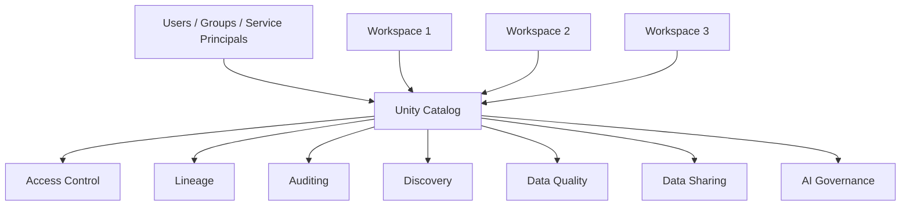
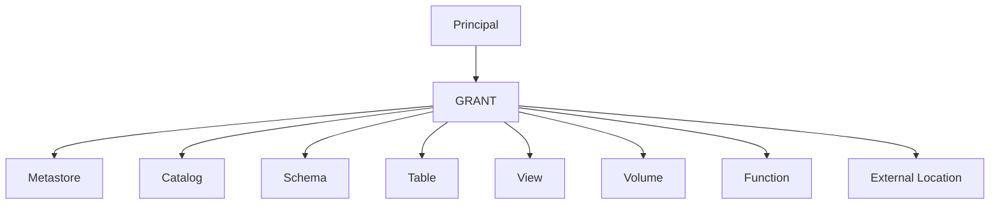
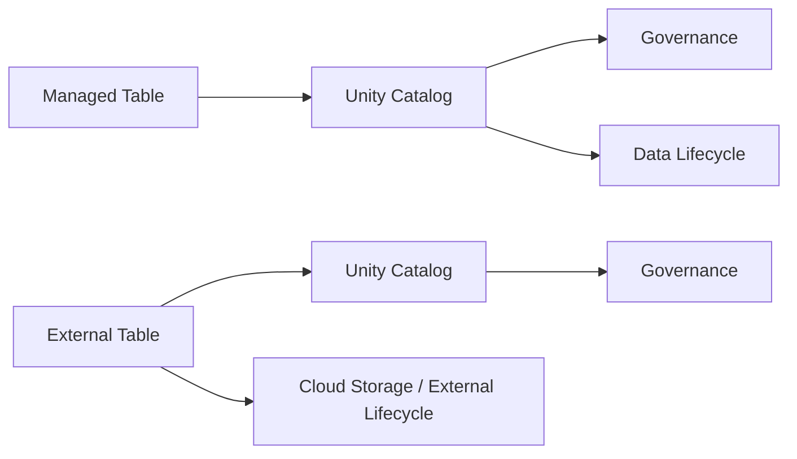

# Unity Catalog Fundamentals

> Study notes based on the official Databricks Unity Catalog documentation.
>
> Official documentation: https://docs.databricks.com/aws/en/data-governance/unity-catalog/

## 1. What is Unity Catalog?

**Unity Catalog (UC)** is Databricks' unified governance layer for data and AI.

It provides centralized capabilities for:

- Access control
- Data discovery
- Data lineage
- Auditing
- Data classification
- Data quality monitoring
- Data sharing
- AI governance

Unity Catalog works across Databricks workspaces that are attached to the same metastore.



## 2. Why Unity Catalog?

Without centralized governance, organizations can end up with:

```text
Workspace A
  ├── Users
  ├── Tables
  └── Permissions

Workspace B
  ├── Users
  ├── Tables
  └── Permissions

Workspace C
  ├── Users
  ├── Tables
  └── Permissions
```

This can lead to inconsistent access policies and difficult auditing.

Unity Catalog provides a centralized governance model:

```text
                    Unity Catalog
                         |
             +-----------+-----------+
             |           |           |
          Access      Lineage     Audit
             |           |           |
        +----+-----------+-----------+
        |
   Multiple Workspaces
```

## 3. Core Unity Catalog Object Model

The most important hierarchy to remember is:

```text
Metastore
   |
   +-- Catalog
         |
         +-- Schema
               |
               +-- Table
               +-- View
               +-- Volume
               +-- Function
               +-- Model
               +-- Service
```

Data assets generally use the three-level namespace:

```text
catalog.schema.object
```

Example:

```text
finance.production.transactions
```

Meaning:

```text
finance       -> Catalog
production    -> Schema
transactions  -> Table
```

## 4. Metastore

The **metastore** is the top-level Unity Catalog container for governed objects.

It provides the governance boundary for workspaces attached to it.

Important points:

- Workspaces in the same region can share a metastore.
- A region has one Unity Catalog metastore.
- Catalogs, storage credentials, external locations, shares, and other securable objects are governed from the metastore.
- Metastore is not normally the primary unit of data isolation; catalogs are typically used for that.

## 5. Catalog

A **catalog** is the primary organizational and data-isolation layer in the normal Unity Catalog model.

Example:

```text
company
├── finance
├── hr
├── sales
└── engineering
```

Each catalog can contain multiple schemas.

Typical catalog designs:

```text
dev
test
prod
```

or:

```text
finance
hr
sales
marketing
```

or a combination appropriate to the organization's governance model.

## 6. Schema

A schema is a container inside a catalog.

Example:

```text
finance
└── accounting
    ├── transactions
    ├── invoices
    └── payments
```

A schema provides an additional layer for:

- Organization
- Access control
- Ownership
- Privilege inheritance

## 7. Tables, Views, Volumes and Other Objects

Objects inside a schema can include:

- Tables
- Views
- Volumes
- Functions
- Models
- Services
- Other governed objects supported by the current Unity Catalog version

Example:

```text
catalog
└── schema
    ├── customers        -> Table
    ├── customer_view    -> View
    ├── raw_files        -> Volume
    ├── clean_name()     -> Function
    └── fraud_model      -> Model
```

## 8. Securable Objects

A **securable object** is an object on which permissions can be granted to principals.

Common principals:

- Users
- Groups
- Service principals

Common securable objects:

- Metastore
- Catalog
- Schema
- Table
- View
- Volume
- Function
- Model
- Storage credential
- External location
- Connection
- Share



## 9. Managed vs External Assets

Unity Catalog distinguishes between managed and external data assets.

### Managed table

Unity Catalog manages:

```text
Governance
+
Underlying data lifecycle
```

### External table

Unity Catalog manages:

```text
Governance
```

while the cloud storage/data lifecycle remains managed externally.



Databricks currently recommends managed tables and volumes for most new use cases.

## 10. Managed Tables

Managed tables are fully managed by Unity Catalog.

Current Databricks documentation states that managed tables use Delta or Apache Iceberg.

Benefits include:

- Centralized governance
- Managed lifecycle
- Metadata optimizations
- Automatic optimizations where supported
- Easier management

## 11. External Tables

External tables point to data stored in a cloud storage location governed through Unity Catalog.

Typical reasons to use them:

- Existing data that should not be moved
- Migration from Hive metastore
- Disaster recovery requirements
- External readers/writers
- Non-Delta/non-Iceberg formats such as Parquet, Avro, or ORC

Example concept:

```text
S3
└── company-data/
    └── sales/
        └── orders/
```

Unity Catalog registers the location and governs Databricks access to the table.

## 12. Unity Catalog vs Hive Metastore

| Feature | Hive Metastore | Unity Catalog |
|---|---|---|
| Central governance | Limited | Strong |
| Cross-workspace governance | Limited | Yes |
| Three-level namespace | No | Yes |
| Fine-grained privileges | Limited | Yes |
| Data lineage | Limited | Built-in |
| Central audit | Limited | Built-in |
| Managed/external assets | Yes | Yes |
| Data discovery | Limited | Catalog Explorer |
| AI governance | Limited | Yes |

## 13. Interview Definition

> Unity Catalog is Databricks' centralized governance layer for data and AI that provides a hierarchical object model, fine-grained access control, lineage, auditing, discovery, data sharing, and governance across workspaces.

## Official references

- https://docs.databricks.com/aws/en/data-governance/unity-catalog/
- https://docs.databricks.com/aws/en/data-governance/unity-catalog/securable-objects
- https://docs.databricks.com/aws/en/data-governance/unity-catalog/best-practices
