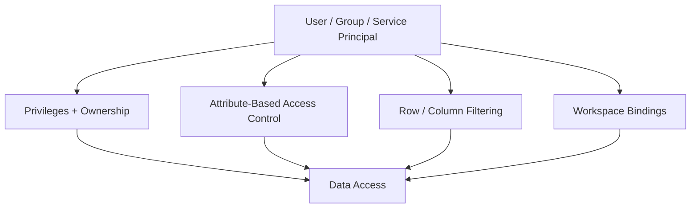
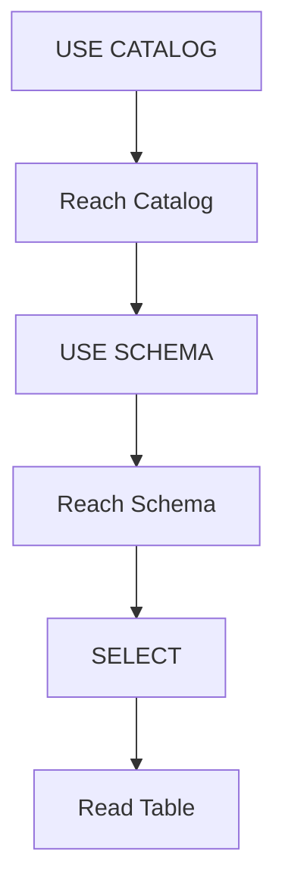
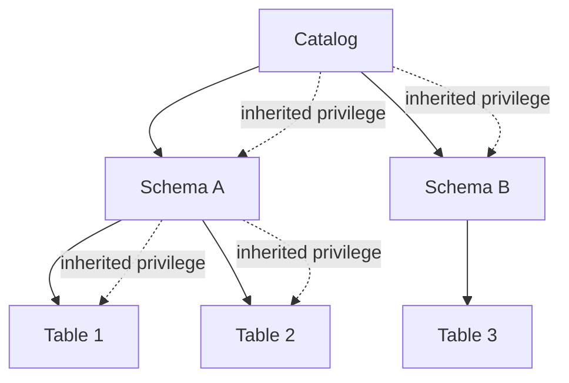
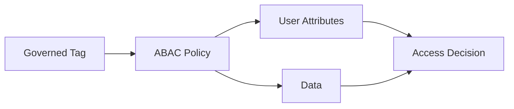
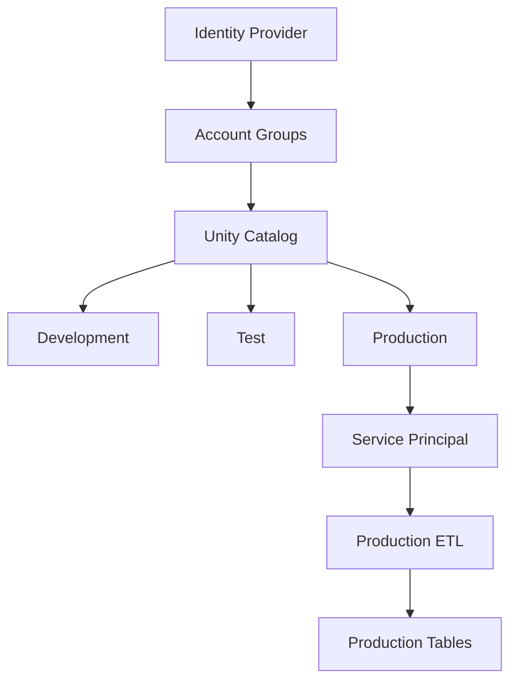

# Unity Catalog Security and Access Control

## 1. Security Mental Model

Unity Catalog access control is based on multiple complementary mechanisms:



The current Databricks documentation describes four major layers:

1. Privileges and ownership
2. Attribute-based policies
3. Table-level filtering/masking
4. Workspace-level restrictions

## 2. Principal

A principal is an identity that can receive privileges.

Common principals:

```text
User
Group
Service Principal
```

Best practice:

> Prefer granting permissions to groups rather than directly to individual users.

For automated production workloads:

> Prefer service principals over personal user identities.

## 3. Privilege

A privilege defines what a principal can do on a securable object.

Examples:

```text
SELECT
MODIFY
USE CATALOG
USE SCHEMA
CREATE TABLE
READ VOLUME
WRITE VOLUME
EXECUTE
BROWSE
MANAGE
```

Example:

```sql
GRANT SELECT
ON TABLE finance.sales.orders
TO `analytics-team`;
```

## 4. USE CATALOG and USE SCHEMA

A common interview confusion is:

> Having `SELECT` alone does not mean the user can automatically reach the table.

For a table, users generally need:

```text
USE CATALOG
       +
USE SCHEMA
       +
SELECT
```

Example:

```sql
GRANT USE CATALOG
ON CATALOG finance
TO `analysts`;

GRANT USE SCHEMA
ON SCHEMA finance.sales
TO `analysts`;

GRANT SELECT
ON TABLE finance.sales.orders
TO `analysts`;
```

Mental model:



## 5. SELECT

`SELECT` provides read access to supported tabular objects such as tables and views.

Example:

```sql
GRANT SELECT
ON TABLE finance.sales.orders
TO `analysts`;
```

## 6. MODIFY

`MODIFY` provides write-related access to tables.

Example:

```sql
GRANT MODIFY
ON TABLE finance.sales.orders
TO `etl-service-principal`;
```

For production, avoid giving broad write access to human users unless there is a clear requirement.

## 7. BROWSE

`BROWSE` is important for data discovery.

It allows users to discover objects and view metadata without giving them access to the underlying data.

```text
BROWSE
   |
   +--> Discover
   +--> Metadata
   +--> Search
   +--> Lineage
   +--> Request Access
```

Important:

> `BROWSE` does not grant data access.

## 8. CREATE TABLE

Example:

```sql
GRANT CREATE TABLE
ON SCHEMA finance.sales
TO `data-engineers`;
```

The user still needs the appropriate usage privileges on the parent catalog/schema.

## 9. Privilege Inheritance

Unity Catalog uses hierarchical privilege inheritance.

Example:

```text
Catalog
  |
  +-- Schema A
  |     |
  |     +-- Table 1
  |     +-- Table 2
  |
  +-- Schema B
        |
        +-- Table 3
```

If you grant a privilege at the catalog level, it can apply to current and future child objects.



Because inheritance can be broad:

> Grant catalog/schema privileges carefully.

## 10. Ownership

Every securable object has an owner.

The creator becomes the initial owner.

Owner can be:

- User
- Group
- Service principal

Best practice:

> Assign production object ownership to groups rather than individuals.

This reduces dependency on one employee account.

## 11. MANAGE

`MANAGE` allows delegation of administrative capabilities over an object.

Use it carefully because it is powerful.

Best practice:

```text
Production object
      |
      v
Admin / Data Owner Group
      |
      v
MANAGE
```

Do not grant powerful privileges broadly.

## 12. ALL PRIVILEGES

`ALL PRIVILEGES` grants all applicable capabilities for an object and its children, subject to documented exclusions.

Databricks explicitly recommends being sparing with powerful privileges.

Do not use:

```sql
GRANT ALL PRIVILEGES ...
```

as the default solution for every user.

Prefer least privilege.

## 13. Workspace-Catalog Binding

By default, catalogs can be accessible from workspaces attached to the same metastore.

Workspace-catalog binding lets you restrict a catalog to specific workspaces.

Example:

```text
Metastore
   |
   +-- prod_catalog
   |      |
   |      +-- Production Workspace
   |
   +-- dev_catalog
          |
          +-- Development Workspace
```

This can help isolate:

- Production
- Development
- Test
- Sensitive environments

Important:

> A user may have `SELECT`, but access can still be denied if the catalog is not available to that workspace.

## 14. Row-Level Security

Row-level security restricts which rows a user can see.

Concept:

```text
orders table

User A -> rows for Region A
User B -> rows for Region B
Admin  -> all rows
```

The table is shared, but the visible data differs by user/context.

## 15. Column Masking

Column masking controls how sensitive column values are presented.

Example:

```text
Original:
9876543210

Analyst:
********10

Authorized user:
9876543210
```

Typical sensitive columns:

- Phone number
- Email
- National identifiers
- Account numbers
- Salary

## 16. Attribute-Based Access Control

ABAC uses attributes/tags and centralized policies to control access.

Conceptually:



Example concept:

```text
Tag:
classification = confidential

Policy:
Only users with approved business attribute
can access confidential data.
```

ABAC is useful when many tables/columns need a common centralized policy.

## 17. Least Privilege

Follow:

```text
Give only the access required
            |
            v
Review regularly
            |
            v
Remove unused privileges
```

Avoid:

```text
User
 |
 +-- ALL PRIVILEGES
 +-- MODIFY everywhere
 +-- Direct cloud storage access
```

Prefer:

```text
Group
 |
 +-- USE CATALOG
 +-- USE SCHEMA
 +-- SELECT on required tables
```

## 18. Production Security Pattern



## 19. Interview Questions

### Q: Does SELECT alone give table access?

Usually no. The user also needs the required `USE CATALOG` and `USE SCHEMA` privileges.

### Q: What is BROWSE?

Metadata/data discovery without granting access to the underlying data.

### Q: Why use groups?

Centralized access management, easier onboarding/offboarding, and reduced direct grants.

### Q: Why use service principals?

They provide stable identities for automated jobs and reduce the risk of production jobs depending on personal accounts.

### Q: What is workspace-catalog binding?

A mechanism to restrict which workspaces can access a catalog.

## Official references

- https://docs.databricks.com/aws/en/data-governance/unity-catalog/access-control/
- https://docs.databricks.com/aws/en/data-governance/unity-catalog/access-control/permissions-concepts
- https://docs.databricks.com/aws/en/data-governance/unity-catalog/access-control/privileges-reference
- https://docs.databricks.com/aws/en/data-governance/unity-catalog/access-control/workspace-catalog-binding
