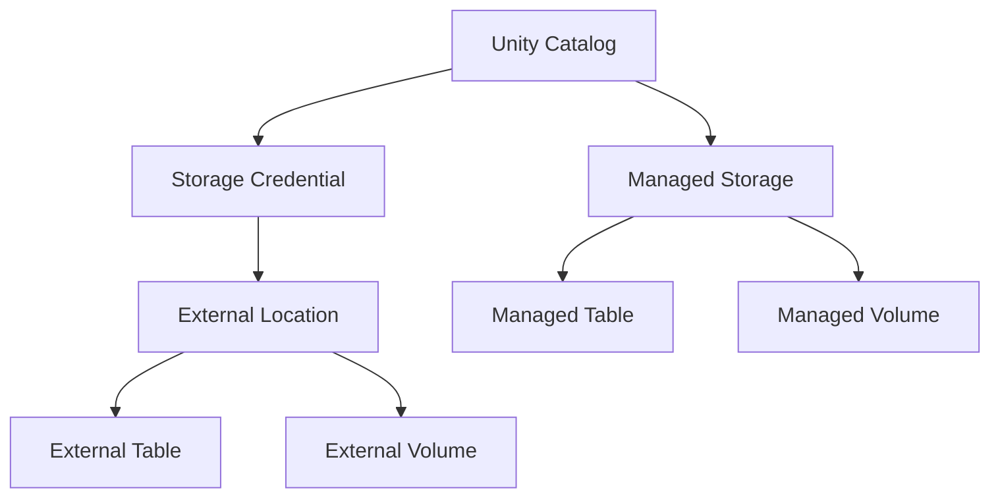
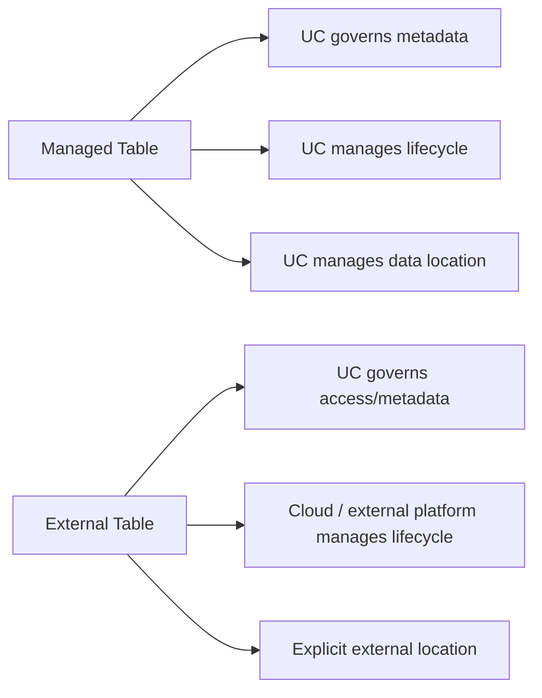
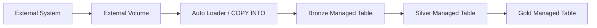
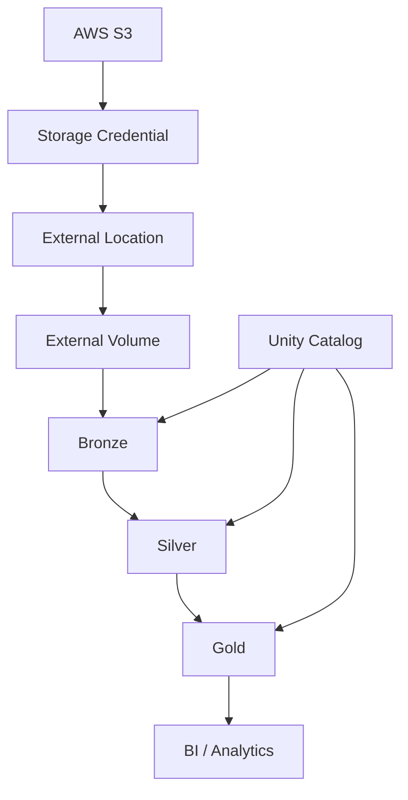

# Unity Catalog Storage and Data Assets

## 1. Storage Mental Model

One of the most important Unity Catalog topics is understanding how governance connects to cloud storage.



## 2. Storage Credential

A **storage credential** stores the authentication information needed for Unity Catalog to access cloud storage.

On AWS, this commonly involves an IAM role.

Conceptually:

```text
Unity Catalog
      |
      v
Storage Credential
      |
      v
AWS IAM Role
      |
      v
S3
```

Storage credentials are commonly used as building blocks for external locations.

## 3. External Location

An external location combines:

```text
Storage Credential
+
Cloud Storage Path
```

Example concept:

```text
Storage Credential
        +
s3://company-data/finance/
        |
        v
External Location
```

External locations provide governed access from Unity Catalog to a cloud storage path.

## 4. External Location vs Storage Credential

| Component | Purpose |
|---|---|
| Storage Credential | Authentication to cloud storage |
| External Location | Authentication + specific storage path |
| External Table | Table registered over a storage location |
| External Volume | File-oriented access over a storage location |

## 5. External Table

An external table allows Databricks/Unity Catalog to govern a table whose data remains in an externally managed storage location.

Example:

```sql
CREATE TABLE finance.sales.orders
USING DELTA
LOCATION 's3://company-data/sales/orders/';
```

The actual location must be governed appropriately through Unity Catalog external-location configuration.

## 6. Managed Table

With a managed table:

```text
User
 |
 v
Unity Catalog
 |
 +--> Governance
 |
 +--> Storage lifecycle
 |
 +--> Metadata
 |
 v
Managed Storage
```

The user normally does not need to manually manage the underlying data location.

## 7. Managed vs External Table



### Prefer managed tables when

- Creating new tables
- You want full Unity Catalog lifecycle management
- You want Databricks-managed optimizations
- You do not need external storage ownership

### Consider external tables when

- Existing data should remain in place
- Migrating from Hive metastore
- External systems must read/write the data
- Non-Delta/non-Iceberg formats are required
- Specific disaster-recovery requirements exist

## 8. Volumes

Volumes provide governed access to files that are not necessarily tables.

Useful for:

- CSV
- JSON
- Images
- Audio
- Video
- PDFs
- ML artifacts
- Libraries
- Staging files
- Operational files

Two types:

```text
Volumes
  |
  +-- Managed Volume
  |
  +-- External Volume
```

## 9. Managed Volume

Unity Catalog manages access and the storage lifecycle.

Use managed volumes for most normal file-governance use cases.

## 10. External Volume

An external volume registers an existing storage location in Unity Catalog.

Useful for:

- Landing areas
- Ingestion staging
- Auto Loader
- `COPY INTO`
- CTAS workflows
- Existing unstructured data

## 11. External Table vs External Volume

This distinction is extremely important.

### External Table

Use when:

> You want to query data **in place as a table**.

```text
Cloud Storage
     |
     v
External Table
     |
     v
SQL Analytics
```

### External Volume

Use when:

> You want governed **file access**.

```text
Cloud Storage
     |
     v
External Volume
     |
     v
Files / ML / Ingestion / Processing
```

## 12. Practical Ingestion Architecture



This is a strong modern Lakehouse pattern.

## 13. Managed Storage Hierarchy

Managed storage can be configured at different levels:

```text
Metastore
   |
   +-- Catalog
         |
         +-- Schema
               |
               +-- Managed Table
```

Data is stored at the lowest available managed-storage location in the hierarchy.

Databricks currently recommends catalog-level storage as the primary unit of data isolation.

## 14. Important Security Rule

Do not bypass Unity Catalog by giving users direct cloud-storage access to locations that Unity Catalog is supposed to govern.

Bad:

```text
User
 |
 +----> Unity Catalog
 |
 +----> Direct S3 Access
```

Better:

```text
User
 |
 v
Unity Catalog
 |
 v
Governed External Location / Volume / Table
 |
 v
S3
```

Direct access can bypass Unity Catalog's:

- Access control
- Auditability
- Lineage/governance

## 15. External Location Permissions

Because external locations can represent broad cloud-storage paths, access should be restricted.

Avoid giving general end users broad:

```text
READ FILES
WRITE FILES
CREATE EXTERNAL LOCATION
```

Use more granular table/volume permissions instead.

## 16. Path Overlap

Avoid creating external tables or volumes at the root of an external location when you intend to create additional child objects.

Prefer:

```text
External Location
s3://company-data/

    /finance/
    /sales/
    /hr/
```

rather than consuming the root with one external object.

## 17. Common Storage Architecture



## 18. Interview Questions

### Q: Storage credential vs external location?

Storage credential represents authentication; external location combines a credential with a cloud storage path.

### Q: Managed vs external table?

Managed tables have their governance and underlying storage lifecycle managed by Unity Catalog. External tables have governance in Unity Catalog while the underlying data lifecycle remains external.

### Q: Table vs volume?

Table is for structured/tabular data queried as a table. Volume is for governed file access.

### Q: When use external volume?

Landing/staging areas, raw files, unstructured data, ingestion, and file-oriented workloads.

### Q: Should users directly access S3 behind Unity Catalog?

Generally no. Direct access can bypass Unity Catalog governance.

## Official references

- https://docs.databricks.com/aws/en/connect/unity-catalog/cloud-storage/storage-credentials
- https://docs.databricks.com/aws/en/connect/unity-catalog/cloud-storage/external-locations
- https://docs.databricks.com/aws/en/volumes/
- https://docs.databricks.com/aws/en/data-governance/unity-catalog/best-practices
