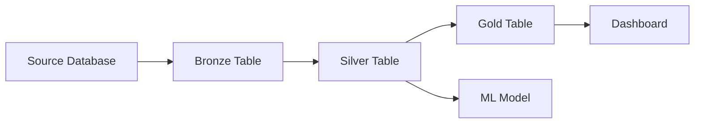
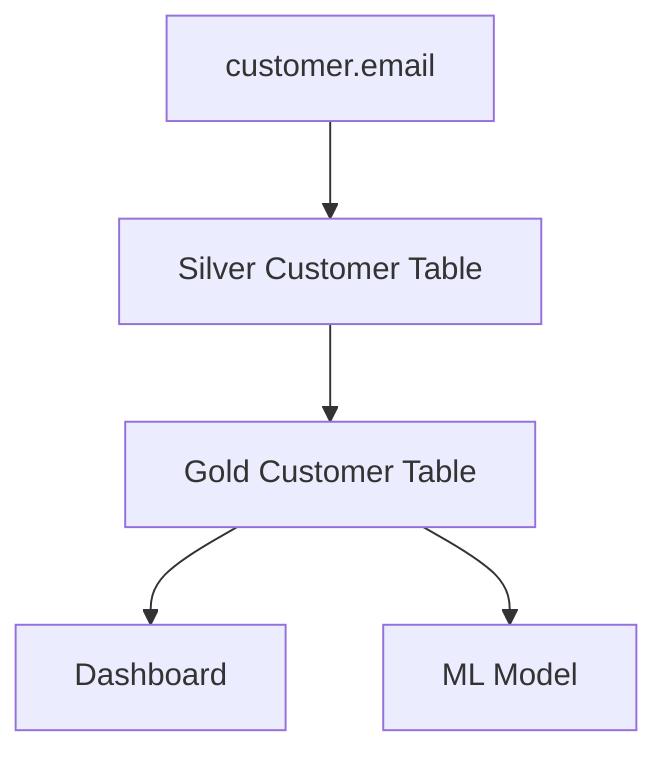
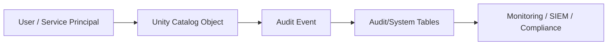
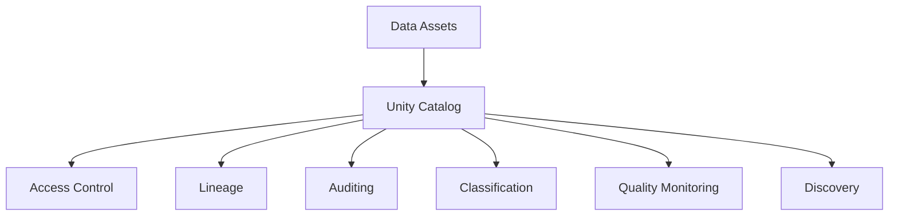
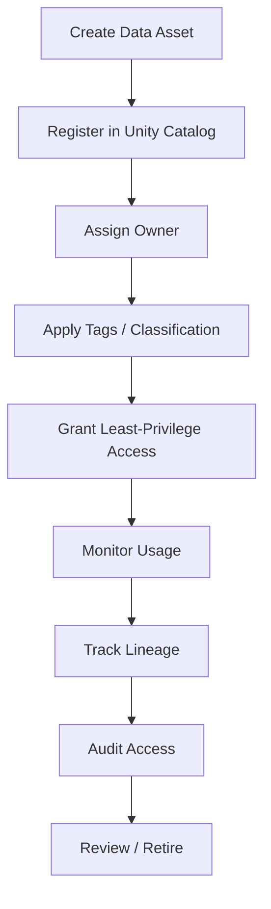

# Unity Catalog Lineage, Auditing, Discovery, and Governance

## 1. Data Discovery

Unity Catalog provides **Catalog Explorer** for discovering and managing governed data and AI assets.

Conceptually:

```text
User
 |
 v
Catalog Explorer
 |
 +--> Catalogs
 +--> Schemas
 +--> Tables
 +--> Views
 +--> Volumes
 +--> Models
 +--> Functions
 +--> Lineage
 +--> Permissions
```

Discovery and access are different concepts.

A user can be allowed to discover metadata through `BROWSE` without being allowed to read the underlying data.

## 2. Data Lineage

Data lineage answers:

> Where did this data come from, how was it transformed, and where is it being used?

Example:



Unity Catalog can automatically capture lineage for supported Databricks queries.

Current documentation describes lineage down to the **column level** where possible.

## 3. Upstream and Downstream

### Upstream

Where the data came from.

```text
Source
  |
  v
Transformation
  |
  v
Current Table
```

### Downstream

What depends on the current data.

```text
Current Table
  |
  +--> Dashboard
  +--> Job
  +--> ML Model
  +--> Another Table
```

## 4. Impact Analysis

Suppose you want to remove:

```text
customer.email
```

Lineage can help identify downstream dependencies before changing it.



Question:

> If I change this column, what can break?

Lineage helps answer it.

## 5. Root Cause Analysis

If a dashboard suddenly shows incorrect revenue:

```text
Dashboard
   ^
   |
Gold Revenue
   ^
   |
Silver Transactions
   ^
   |
Bronze CDC
   ^
   |
Source DB
```

Trace backward to find where the data changed.

## 6. Column-Level Lineage

Example:

```text
Source:
orders.amount
orders.quantity

        |
        v

Transformation:
amount * quantity

        |
        v

Target:
sales.revenue
```

Column lineage connects source columns to derived target columns where supported.

## 7. Lineage Across Workspaces

Lineage is aggregated across workspaces attached to the same Unity Catalog metastore, subject to the user's permissions.

This makes Unity Catalog useful for organization-wide dependency analysis.

## 8. Lineage Permissions

Lineage visibility follows Unity Catalog permissions.

A user generally needs appropriate access such as `BROWSE`/data privileges and workspace permissions for related workspace objects.

A user without permission to an object may see masked/limited lineage information rather than unrestricted details.

## 9. Lineage System Tables

Lineage can also be queried programmatically using Unity Catalog system tables.

Examples include:

```text
system.access.table_lineage
system.access.column_lineage
```

The current documentation states that lineage system tables retain a rolling one-year window, while lineage displayed in Catalog Explorer has longer retention.

## 10. Auditing

Unity Catalog supports auditing through Databricks audit logs/system tables.

Audit information can answer questions such as:

```text
Who accessed the table?
When?
What operation occurred?
From where?
Which object was affected?
```

Conceptual architecture:



## 11. Why Auditing Matters

Auditing supports:

- Compliance
- Security investigations
- Access reviews
- Incident response
- Operational monitoring
- Governance reporting

## 12. Data Classification

Unity Catalog can classify and tag sensitive data.

Conceptually:

```text
Column
  |
  v
Classification
  |
  +--> Public
  +--> Internal
  +--> Confidential
  +--> Sensitive
```

Classification can then be used with governance policies.

## 13. Tags

Tags add metadata to governed objects.

Example:

```text
table: customers

tags:
  domain = customer
  classification = confidential
  owner = customer-data-team
```

Tags are useful for:

- Discovery
- Governance
- Classification
- ABAC policies
- Ownership metadata

## 14. Data Quality Monitoring

Unity Catalog's governance ecosystem also includes data-quality monitoring capabilities.

A typical governance architecture can be:



## 15. Data Sharing

Unity Catalog supports secure data sharing through Databricks sharing capabilities and OpenSharing.

Conceptually:

```text
Provider
   |
   v
Share
   |
   v
Recipient
   |
   v
Shared Data
```

The important idea is that sharing can occur without giving the recipient direct ownership of the provider's underlying storage.

## 16. Governance Lifecycle

A practical governance lifecycle:



## 17. Production Governance Example

```text
Source Systems
      |
      v
Bronze
      |
      v
Silver
      |
      v
Gold
      |
      v
BI / ML

             Unity Catalog
                    |
       +------------+------------+
       |            |            |
    Security     Lineage       Audit
       |            |            |
       +------------+------------+
                    |
              Governance
```

## 18. Interview Questions

### Q: What is lineage?

Lineage shows how data flows between source and downstream assets.

### Q: Why is lineage useful?

Impact analysis, root-cause analysis, compliance, dependency management, and understanding data flow.

### Q: What is column lineage?

It maps source columns to target/derived columns.

### Q: Does lineage bypass security?

No. Lineage visibility follows the relevant permission model.

### Q: What is Catalog Explorer?

Databricks' UI for discovering and managing Unity Catalog assets.

## Official references

- https://docs.databricks.com/aws/en/data-governance/unity-catalog/data-lineage
- https://docs.databricks.com/aws/en/data-governance/unity-catalog/
- https://docs.databricks.com/aws/en/data-governance/unity-catalog/audit
