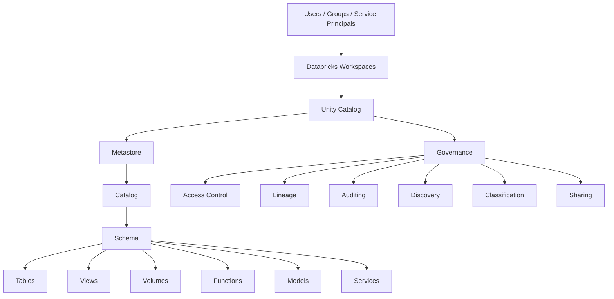
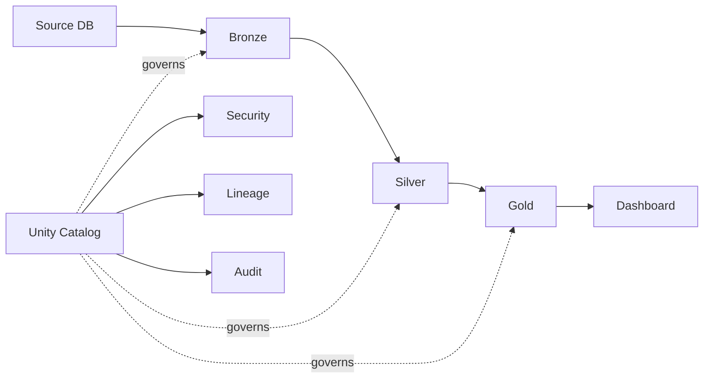

# Unity Catalog Interview Guide

## 1. One-Minute Explanation

> Unity Catalog is Databricks' centralized governance layer for data and AI. It organizes assets using a metastore → catalog → schema → object hierarchy and provides fine-grained access control, privilege inheritance, ownership, discovery, lineage, auditing, data classification, sharing, and workspace-level isolation. It can govern both managed and external data assets.

## 2. Core Architecture



## 3. The Hierarchy

Memorize:

```text
Metastore
    |
Catalog
    |
Schema
    |
Object
```

Example:

```text
company
└── sales
    └── analytics
        └── orders
```

Full name:

```text
company.sales.analytics.orders
```

More precisely for a table:

```text
catalog.schema.table
```

## 4. Most Important Terms

| Term | Meaning |
|---|---|
| Metastore | Top-level governance container |
| Catalog | Primary data isolation/container layer |
| Schema | Container inside catalog |
| Table | Structured data asset |
| View | Query-defined read-oriented object |
| Volume | Governed file storage/access |
| Storage Credential | Authentication to cloud storage |
| External Location | Credential + storage path |
| Securable Object | Object on which privileges can be granted |
| Principal | User/group/service principal |
| Privilege | Allowed action |
| Owner | Principal responsible for an object |
| BROWSE | Metadata discovery without data access |
| Lineage | Data dependency/flow graph |
| Workspace Binding | Restricts object availability to workspaces |

## 5. Managed vs External

### Managed

```text
Unity Catalog
   |
   +--> Governance
   +--> Data lifecycle
   +--> Storage management
```

### External

```text
Unity Catalog
   |
   +--> Governance

Cloud Provider / External Platform
   |
   +--> Data lifecycle
   +--> File layout
```

## 6. Access-Control Example

Question:

> Analyst should read `finance.sales.orders`.

Answer:

```sql
GRANT USE CATALOG
ON CATALOG finance
TO `analysts`;

GRANT USE SCHEMA
ON SCHEMA finance.sales
TO `analysts`;

GRANT SELECT
ON TABLE finance.sales.orders
TO `analysts`;
```

Remember:

```text
USE CATALOG
      +
USE SCHEMA
      +
SELECT
      =
Table Read Access
```

## 7. Data Engineer Example

A production ETL service needs to update a table.

```text
Service Principal
        |
        v
Unity Catalog
        |
        v
finance.sales.orders
        |
        v
MODIFY
```

Prefer service principals for automated production workloads.

## 8. Data Governance Example



## 9. Common Interview Comparisons

### Unity Catalog vs Hive Metastore

Unity Catalog provides centralized, cross-workspace governance and modern data/AI governance capabilities, whereas Hive Metastore is a more workspace-centric legacy metastore model.

### Catalog vs Schema

Catalog is the higher-level container and common data-isolation boundary. Schema organizes objects within a catalog.

### Table vs Volume

Table is for structured data accessed as a table. Volume is for governed file access.

### Storage Credential vs External Location

Storage credential = authentication.

External location = authentication + storage path.

### Managed vs External Table

Managed = Unity Catalog manages governance and underlying lifecycle.

External = Unity Catalog governs access/metadata while external systems manage the underlying storage lifecycle.

### BROWSE vs SELECT

`BROWSE` = discover metadata.

`SELECT` = read data.

### User vs Service Principal

User = human identity.

Service principal = automation/application identity.

## 10. Scenario Questions

### Scenario 1

> Developers must not access production catalog.

Use:

```text
Workspace-catalog binding
+
Catalog-level permissions
```

### Scenario 2

> Everyone should discover available datasets but only authorized users can read them.

Use:

```text
BROWSE
+
SELECT only for approved users
```

### Scenario 3

> Raw PDF/image files arrive in S3 before processing.

Consider:

```text
External Volume
```

### Scenario 4

> Existing Delta data is already in S3 and should be queried without moving it.

Consider:

```text
External Table
```

### Scenario 5

> New production table should be fully managed by Databricks.

Prefer:

```text
Managed Table
```

### Scenario 6

> Need to know which dashboards depend on a table.

Use:

```text
Unity Catalog Lineage
```

### Scenario 7

> Need to know who accessed a table.

Use:

```text
Audit logs / system tables
```

## 11. 30-Second Revision

```text
Unity Catalog
     |
     +-- Metastore
           |
           +-- Catalog
                 |
                 +-- Schema
                       |
                       +-- Table
                       +-- View
                       +-- Volume
                       +-- Function
                       +-- Model

Security:
  Principals
      |
  Privileges
      |
  Securable Objects

Governance:
  Access Control
  Lineage
  Audit
  Discovery
  Classification
  Sharing
  AI Governance

Storage:
  Managed
  External
```

## 12. Top 10 Interview Questions

1. What is Unity Catalog?
2. Explain the Unity Catalog hierarchy.
3. What is a metastore?
4. Catalog vs schema?
5. Managed vs external table?
6. Storage credential vs external location?
7. What is a volume?
8. Explain `USE CATALOG`, `USE SCHEMA`, and `SELECT`.
9. What is data lineage?
10. Why use service principals and groups?

## 13. Best Answer Pattern

For architecture questions, answer in this order:

```text
1. Identity
2. Object hierarchy
3. Access control
4. Storage
5. Workspace isolation
6. Lineage
7. Audit
8. Data lifecycle
```

This gives a structured governance answer instead of listing random Unity Catalog features.

## Official documentation

https://docs.databricks.com/aws/en/data-governance/unity-catalog/
