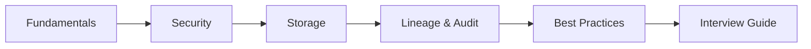

# Unity Catalog Notes

GitHub-ready study notes based on the official Databricks Unity Catalog documentation.

## Documentation

Official source:

https://docs.databricks.com/aws/en/data-governance/unity-catalog/

## Notes

| File | Topic |
|---|---|
| [01-unity-catalog-fundamentals.md](01-unity-catalog-fundamentals.md) | Unity Catalog overview, hierarchy, metastore, catalog, schema, managed/external assets |
| [02-unity-catalog-security-and-access-control.md](02-unity-catalog-security-and-access-control.md) | Principals, privileges, inheritance, BROWSE, ownership, ABAC, workspace bindings |
| [03-unity-catalog-storage-and-data-assets.md](03-unity-catalog-storage-and-data-assets.md) | Storage credentials, external locations, managed/external tables, volumes |
| [04-unity-catalog-lineage-auditing-discovery.md](04-unity-catalog-lineage-auditing-discovery.md) | Catalog Explorer, lineage, column lineage, auditing, classification, sharing |
| [05-unity-catalog-best-practices.md](05-unity-catalog-best-practices.md) | Production governance, least privilege, groups, service principals, storage security |
| [06-unity-catalog-interview-guide.md](06-unity-catalog-interview-guide.md) | Interview revision, scenarios, comparisons, SQL examples |

## Recommended learning order



## Core mental model

```text
                         Unity Catalog
                              |
                  +-----------+-----------+
                  |                       |
              Metastore               Governance
                  |                       |
               Catalog              +----+----+
                  |                 |    |    |
               Schema             Access Lineage Audit
                  |
        +---------+---------+
        |         |         |
      Table     View      Volume
```

## Key concepts to memorize

### Hierarchy

```text
Metastore
  -> Catalog
      -> Schema
          -> Object
```

### Table access

```text
USE CATALOG
      +
USE SCHEMA
      +
SELECT
      =
Read access
```

### Storage

```text
Storage Credential
        +
Storage Path
        =
External Location
```

### Managed vs External

```text
Managed:
Unity Catalog -> governance + lifecycle

External:
Unity Catalog -> governance
Cloud/External Platform -> lifecycle
```

### Security

```text
Principal
   |
Privilege
   |
Securable Object
```

## Important current-documentation points

- Unity Catalog is the unified governance layer for data and AI in Databricks.
- Data assets use the `catalog.schema.object` namespace.
- Catalogs are generally the primary unit of data isolation.
- Privileges on catalogs and schemas can inherit to child objects.
- `BROWSE` supports metadata discovery without granting data access.
- Managed tables and volumes are preferred for most new use cases.
- External locations should be tightly controlled.
- Direct cloud-storage access can bypass Unity Catalog governance.
- Groups are preferred over direct user grants.
- Service principals are preferred for production automation.
- Workspace-catalog binding can restrict catalogs to specific workspaces.
- Unity Catalog provides lineage, auditing, discovery, classification, data quality, sharing, and AI governance capabilities.

## Important

Unity Catalog evolves frequently. Always verify syntax, privilege availability, feature status, and limitations against the exact Databricks Runtime and cloud/version used by your project.
