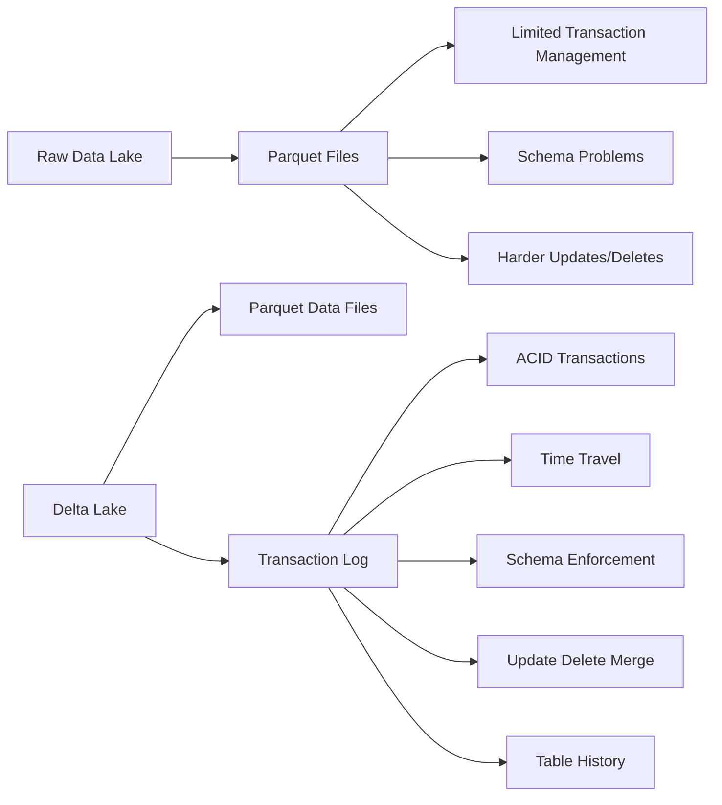
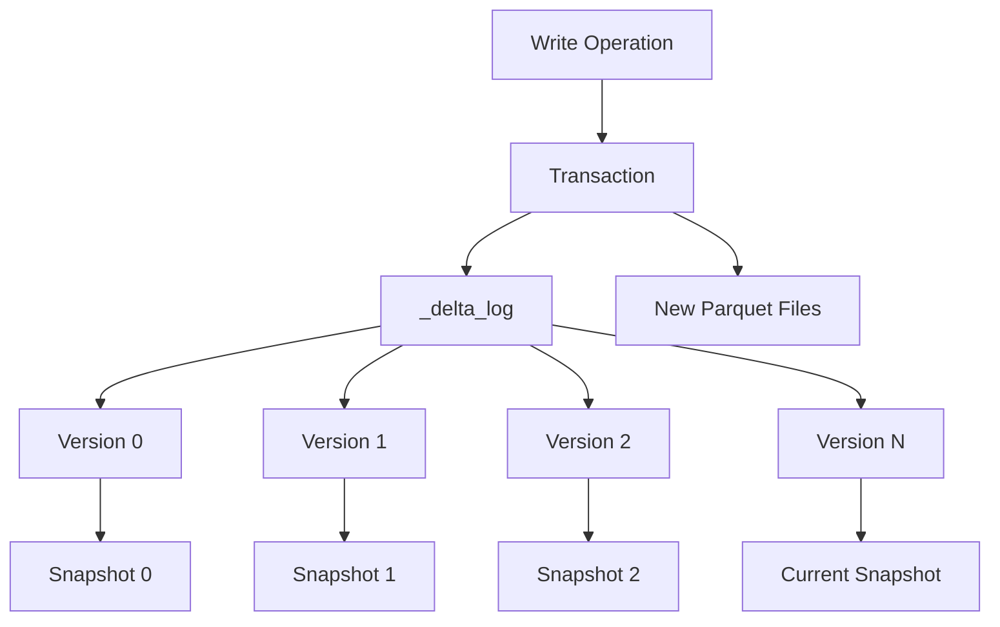
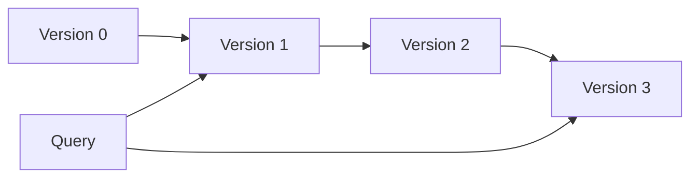

# Delta Lake Fundamentals

> Notes based on the official Delta Lake documentation: https://docs.delta.io/
>
> Focus: concepts you should understand before working with Delta Lake in Spark/Databricks.

## 1. What is Delta Lake?

Delta Lake is an open-source **storage layer** for data lakes that adds reliability and database-like capabilities while continuing to use cloud/object storage.

It is designed for Lakehouse architectures and works with systems such as Apache Spark and storage such as S3, ADLS, GCS, and HDFS.

### Delta Lake gives a data lake

- ACID transactions
- Scalable metadata handling
- Schema enforcement
- Schema evolution
- Time travel
- `INSERT`, `UPDATE`, `DELETE`, and `MERGE`
- Batch + streaming support
- Change Data Feed
- Data skipping and file-layout optimizations
- Transaction history and auditing

## 2. Data Lake vs Delta Lake



The important idea is:

> **Delta Lake does not replace Parquet. It adds a transaction and metadata layer around Parquet data files.**

## 3. How a Delta Table is Stored

A typical Delta table directory looks conceptually like:

```text
customer/
├── part-00000-....snappy.parquet
├── part-00001-....snappy.parquet
├── part-00002-....snappy.parquet
└── _delta_log/
    ├── 00000000000000000000.json
    ├── 00000000000000000001.json
    ├── 00000000000000000002.json
    └── 00000000000000000010.checkpoint.parquet
```

### Two major components

**1. Data files**

- Usually Parquet files.
- Contain the actual table data.

**2. `_delta_log`**

- Contains the transaction history/state information.
- Allows Delta to reconstruct the correct snapshot of the table.
- Supports ACID transactions, time travel, concurrency control, and metadata management.

## 4. Transaction Log

The transaction log is the core concept behind Delta Lake.

Instead of treating the directory as "whatever Parquet files currently exist", Delta maintains a versioned record of table changes.



## 5. ACID Transactions

Delta Lake provides transactional guarantees for operations on a table.

### Atomicity

A transaction is committed as a unit.

Readers should not observe a partially committed table state.

### Consistency

Delta validates table/schema rules and commits a valid table state.

### Isolation

Concurrent readers can read a consistent snapshot while writes occur.

### Durability

Once a transaction is committed, its state is represented in durable table storage and transaction history.

## 6. Snapshot Isolation

Think of a Delta table as a sequence of snapshots:

```text
Version 0  ---> Version 1 ---> Version 2 ---> Version 3
   |             |               |               |
 Snapshot 0    Snapshot 1      Snapshot 2      Snapshot 3
```

A reader works against a consistent snapshot rather than observing individual file changes while another transaction is modifying the table.

## 7. Schema Enforcement

Schema enforcement prevents incompatible data from silently corrupting a Delta table.

Example:

```text
Existing table:
id INT
name STRING
salary DOUBLE

Incoming data:
id INT
name STRING
salary STRING
```

The write may fail because the incoming schema is incompatible.

This is especially useful in production pipelines where upstream data can change unexpectedly.

## 8. Schema Evolution

Schema evolution allows a table schema to change when the incoming data contains supported changes.

Example:

```text
Before:
id
name

Incoming:
id
name
email

After schema evolution:
id
name
email
```

For current Delta Lake versions, operation-level schema evolution is preferred when supported rather than enabling broad session-wide evolution.

Example:

```python
df.write \
  .format("delta") \
  .mode("append") \
  .withSchemaEvolution() \
  .saveAsTable("customers")
```

For older versions, `mergeSchema` and the Spark configuration `spark.databricks.delta.schema.autoMerge.enabled` are commonly documented approaches.

## 9. Time Travel

Time travel lets you query older table versions.

```sql
SELECT *
FROM delta.`/path/to/table`
VERSION AS OF 10;
```

Or by timestamp where supported:

```sql
SELECT *
FROM delta.`/path/to/table`
TIMESTAMP AS OF '2026-08-01 10:00:00';
```

### Why use time travel?

- Debugging
- Auditing
- Reproducing reports
- Recovering from accidental changes
- Comparing table versions
- Reproducing historical ML datasets



## 10. Important Retention Concept

Time travel depends on the availability of both:

- transaction-log history
- required underlying data files

Official documentation currently describes:

- `delta.logRetentionDuration` default: 30 days
- `delta.deletedFileRetentionDuration` default: 7 days

`VACUUM` can physically remove old files that are no longer referenced.

Therefore:

> **Time travel is not unlimited backup.**

Plan retention according to your recovery and audit requirements.

## 11. Delta vs Parquet

| Capability | Parquet | Delta |
|---|---|---|
| Columnar storage | Yes | Yes |
| ACID transactions | No | Yes |
| Schema enforcement | Limited | Yes |
| Time travel | No built-in table transaction history | Yes |
| Update/Delete/Merge | Requires rewriting/custom logic | Supported |
| Transaction log | No | Yes |
| Batch processing | Yes | Yes |
| Streaming integration | Possible | Strong integration |
| Change Data Feed | No | Yes |

## 12. Mental Model

Remember this:

```text
             Delta Table
                  |
        +---------+---------+
        |                   |
   Parquet files        _delta_log
   actual data          table state/history
        |                   |
        +---------+---------+
                  |
       Reliable Lakehouse Table
```

## 13. Interview Definition

> Delta Lake is an open-source storage layer that brings ACID transactions, schema management, versioning, reliable updates/deletes/merges, and unified batch/streaming capabilities to data lakes while storing table data primarily in Parquet.

## Official references

- https://docs.delta.io/
- https://docs.delta.io/delta-faq/
- https://docs.delta.io/delta-batch/
- https://docs.delta.io/versioning/
