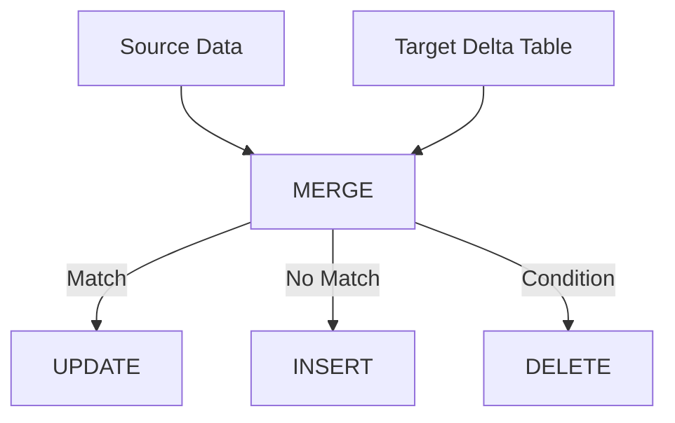
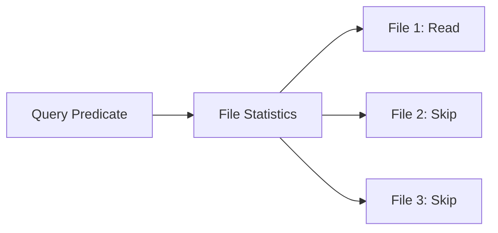

# Delta Lake Table Operations

> Practical notes for creating, reading, writing, updating, deleting, merging, and inspecting Delta tables.

## 1. Create a Delta Table

### SQL

```sql
CREATE TABLE customers (
    customer_id BIGINT,
    customer_name STRING,
    email STRING,
    created_at TIMESTAMP
)
USING DELTA;
```

### Create from query

```sql
CREATE TABLE customers
USING DELTA
AS
SELECT *
FROM source_customers;
```

### PySpark

```python
df.write \
  .format("delta") \
  .mode("overwrite") \
  .save("/data/customers")
```

## 2. Managed vs Path-Based Tables

A Delta table can be registered in a catalog/metastore or accessed through a storage path.

### Catalog table

```sql
CREATE TABLE customers (
    customer_id BIGINT,
    customer_name STRING
)
USING DELTA;
```

### Path-based table

```python
df = spark.read.format("delta").load("/data/customers")
```

## 3. Read a Delta Table

### SQL

```sql
SELECT *
FROM customers;
```

### PySpark

```python
df = spark.read \
    .format("delta") \
    .load("/data/customers")
```

## 4. Write Modes

Common Spark write modes:

```text
append
overwrite
error / errorifexists
ignore
```

Example:

```python
df.write \
  .format("delta") \
  .mode("append") \
  .save("/data/customers")
```

## 5. Update

```sql
UPDATE customers
SET email = 'new@example.com'
WHERE customer_id = 101;
```

Delta tracks the table change through its transaction mechanism.

## 6. Delete

```sql
DELETE FROM customers
WHERE customer_id = 101;
```

Do not assume that `DELETE` immediately means the old Parquet bytes disappear from storage.

Physical cleanup is a separate concern handled by table maintenance such as `VACUUM`.

## 7. MERGE

`MERGE` is one of the most important Delta operations for Data Engineering.

It is commonly used for:

- Upserts
- CDC pipelines
- SCD Type 1
- SCD Type 2 patterns
- Deduplication
- Incremental processing

Example:

```sql
MERGE INTO target_customers AS t
USING source_customers AS s
ON t.customer_id = s.customer_id

WHEN MATCHED THEN
  UPDATE SET
    t.customer_name = s.customer_name,
    t.email = s.email

WHEN NOT MATCHED THEN
  INSERT (
    customer_id,
    customer_name,
    email
  )
  VALUES (
    s.customer_id,
    s.customer_name,
    s.email
  );
```

### MERGE mental model



## 8. MERGE Schema Validation

Delta validates whether the expressions in `UPDATE` and `INSERT` actions are compatible with the target schema.

With schema evolution enabled, supported source columns can be added to the target schema.

## 9. MERGE and CDC

A common architecture is:

```text
Source DB
   |
   v
CDC Events
   |
   v
Bronze Delta
   |
   v
Deduplication
   |
   v
MERGE
   |
   v
Silver Delta
```

## 10. Table History

Use history to understand what operations have occurred.

```sql
DESCRIBE HISTORY customers;
```

Typical information includes operation/version metadata useful for auditing and troubleshooting.

## 11. Table Details

```sql
DESCRIBE DETAIL customers;
```

This can be useful for inspecting table-level information such as:

- Location
- Number of files
- Size
- Partition information
- Table properties

## 12. Replace Table Content or Schema

When replacing a table, be careful to distinguish:

- replacing data
- replacing schema
- modifying existing rows

Example:

```python
df.write \
  .format("delta") \
  .mode("overwrite") \
  .option("overwriteSchema", "true") \
  .saveAsTable("customers")
```

Use schema replacement deliberately because it can remove or change existing columns.

## 13. Partitioning

Example:

```sql
CREATE TABLE events (
    event_id BIGINT,
    user_id BIGINT,
    event_date DATE,
    event_type STRING
)
USING DELTA
PARTITIONED BY (event_date);
```

Partitioning creates a directory-level organization.

Conceptually:

```text
events/
├── event_date=2026-08-25/
├── event_date=2026-08-26/
└── event_date=2026-08-27/
```

Choose partition columns carefully.

Good candidates generally have:

- Frequent filtering
- Reasonable cardinality
- Sufficient data per partition

Avoid blindly partitioning by high-cardinality columns such as unique IDs.

## 14. Data Skipping

Delta can use file statistics such as minimum and maximum values to avoid reading files that cannot satisfy a query predicate.

Example:

```sql
SELECT *
FROM events
WHERE event_date = '2026-08-27';
```

If file statistics show that a file contains dates only from earlier days, that file can be skipped.



## 15. OPTIMIZE / Compaction

Small files can hurt query performance.

`OPTIMIZE` compacts small files into larger files.

```sql
OPTIMIZE customers;
```

Partition-filtered optimization:

```sql
OPTIMIZE events
WHERE event_date >= '2026-08-01';
```

Conceptually:

```text
Before:
small_1.parquet
small_2.parquet
small_3.parquet
small_4.parquet
small_5.parquet

          OPTIMIZE

After:
large_1.parquet
large_2.parquet
```

Compaction is designed to improve file layout without changing the logical result of the table.

## 16. Z-Ordering

Z-Ordering is a multi-dimensional clustering technique documented for Delta Lake.

Conceptually:

```sql
OPTIMIZE events
ZORDER BY (user_id);
```

It can help queries that frequently filter on selected columns by improving data locality and file skipping.

Do not treat Z-Ordering as a replacement for every partitioning strategy.

## 17. Liquid Clustering

Modern Delta Lake also documents **liquid clustering**.

```sql
CREATE TABLE events (
    event_id BIGINT,
    user_id BIGINT,
    event_time TIMESTAMP
)
USING DELTA
CLUSTER BY (user_id);
```

Liquid clustering:

- Simplifies layout decisions
- Can adapt as access patterns change
- Is not combined with traditional partitioning or `ZORDER`
- Uses `OPTIMIZE` for incremental clustering

For newer Delta environments, understand liquid clustering in addition to partitioning and Z-Ordering.

## 18. VACUUM

`VACUUM` removes old data files that are no longer needed by the current table state and have passed the applicable retention threshold.

Example:

```sql
VACUUM customers;
```

Important:

```text
DELETE / UPDATE / MERGE
        |
        v
Logical table state changes
        |
        v
Old files may remain
        |
        v
VACUUM
        |
        v
Physical cleanup
```

Therefore:

> `DELETE` is a data operation; `VACUUM` is a storage cleanup operation.

## 19. Change Data Feed

Change Data Feed (CDF) records row-level changes between Delta table versions when enabled.

```sql
ALTER TABLE customers
SET TBLPROPERTIES (
  delta.enableChangeDataFeed = true
);
```

CDF can expose metadata such as:

```text
_change_type
_change_version
_commit_timestamp
```

Typical change types include:

- `insert`
- `update_preimage`
- `update_postimage`
- `delete`

## 20. When to Use What?

| Requirement | Delta feature |
|---|---|
| Insert new rows | `INSERT` / append |
| Modify existing rows | `UPDATE` |
| Remove rows | `DELETE` |
| Insert + update | `MERGE` |
| Historical version | Time travel |
| Audit operations | History |
| Remove obsolete files | `VACUUM` |
| Small-file problem | `OPTIMIZE` |
| Improve file locality | Z-Ordering / clustering |
| Incremental row changes | Change Data Feed |
| Evolving schema | Schema evolution |

## Official references

- https://docs.delta.io/delta-batch/
- https://docs.delta.io/delta-update/
- https://docs.delta.io/optimizations-oss/
- https://docs.delta.io/delta-clustering/
- https://docs.delta.io/delta-change-data-feed/
