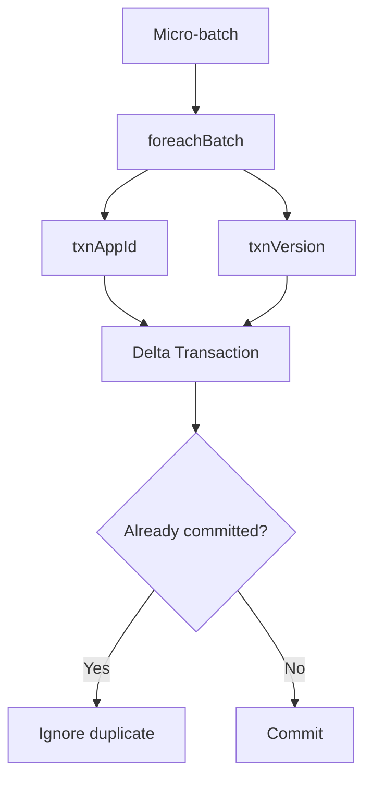
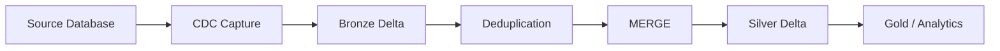
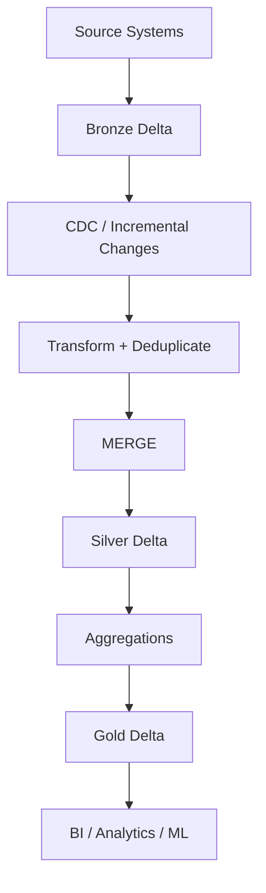

# Delta Lake Streaming and CDC

> Notes for using Delta tables with Spark Structured Streaming and incremental data pipelines.

## 1. Delta + Structured Streaming

Delta Lake integrates with Spark Structured Streaming.

A Delta table can act as:

```text
                 +------------------+
                 |    Delta Table   |
                 +------------------+
                    /            \
                   /              \
                  v                v
            Batch Source       Stream Source
                  |                |
                  v                v
            Batch Processing  Streaming Query
                  |                |
                  +-------+--------+
                          |
                          v
                    Delta Sink
```

This makes Delta useful for Lakehouse pipelines where the same table may be consumed by both batch and streaming workloads.

## 2. Streaming Read

```python
streaming_df = (
    spark.readStream
    .format("delta")
    .load("/data/events")
)
```

A streaming read processes existing table data and then continues processing new data that arrives after the stream starts.

## 3. Streaming Write

```python
(
    streaming_df.writeStream
    .format("delta")
    .outputMode("append")
    .option("checkpointLocation", "/checkpoints/events")
    .start("/data/events")
)
```

### Why checkpointing matters

The checkpoint stores streaming progress/state needed by Structured Streaming.

A practical layout is:

```text
events/
├── _delta_log/
├── part-*.parquet
└── _checkpoints/
```

The Delta documentation notes that `VACUUM` skips directories beginning with `_`, making such a checkpoint directory safe to colocate when appropriate.

## 4. Exactly-Once Concept

The Delta transaction log allows Delta sinks to provide exactly-once transactional behavior for supported streaming writes, including concurrent batch and stream activity.

Do not confuse this with every arbitrary external side effect being exactly once.

For external systems, idempotency must still be designed.

## 5. foreachBatch

`foreachBatch` allows custom processing of each micro-batch.

Example:

```python
def process_batch(batch_df, batch_id):
    (
        batch_df.write
        .format("delta")
        .mode("append")
        .save("/data/processed")
    )

(
    streaming_df.writeStream
    .foreachBatch(process_batch)
    .option("checkpointLocation", "/checkpoints/processed")
    .start()
)
```

## 6. foreachBatch Idempotency

`foreachBatch` by itself does not make arbitrary writes idempotent.

If a batch is retried, the same batch can potentially be written again.

Delta supports idempotent transaction identifiers using:

```text
txnAppId
txnVersion
```

Conceptually:



## 7. CDC Pipeline

A common architecture:



## 8. Change Data Feed

CDF is useful when downstream systems need row-level changes rather than repeatedly scanning the entire table.

Typical use cases:

- Incremental ETL
- Downstream synchronization
- Audit tables
- Silver/Gold processing
- Feeding changes into another system

Enable it:

```sql
ALTER TABLE customers
SET TBLPROPERTIES (
  delta.enableChangeDataFeed = true
);
```

## 9. CDF Event Types

A CDF consumer may encounter:

```text
insert
update_preimage
update_postimage
delete
```

The metadata identifies the table version and commit timestamp associated with the change.

## 10. Incremental Processing Pattern

Instead of:

```text
Every day:
Read entire 10 TB table
        |
        v
Process all 10 TB
```

Use:

```text
Initial load:
Read 10 TB
        |
        v
Create target

Future runs:
Read only changes
        |
        v
Process small incremental dataset
        |
        v
MERGE / transform
```

This is one of the major reasons Delta features are valuable in production data engineering.

## 11. Streaming + MERGE

A common pattern is:

```python
def upsert_to_delta(batch_df, batch_id):
    # deduplicate batch
    # merge batch into target
    pass

(
    source_stream.writeStream
    .foreachBatch(upsert_to_delta)
    .option("checkpointLocation", "/checkpoints/source")
    .start()
)
```

When using `MERGE` inside `foreachBatch`, make the operation idempotent because the same micro-batch may be processed again after failures.

## 12. Schema Changes and Streaming

Schema changes require special care.

The official documentation notes that changing a Delta table schema can terminate streams reading the table; a stream may need to be restarted depending on the change.

Column mapping and non-additive schema changes can also introduce additional streaming/schema-tracking requirements.

## 13. Practical Bronze/Silver/Gold Pattern



### Bronze

Keep source-oriented data with minimal transformation.

### Silver

Clean, standardized, deduplicated, business-ready data.

### Gold

Aggregated and consumption-oriented datasets.

## 14. Streaming Interview Points

Remember these:

1. Delta can be a streaming source and sink.
2. The transaction log helps identify table changes.
3. Checkpoints track streaming progress.
4. `foreachBatch` enables custom micro-batch processing.
5. `foreachBatch` writes need idempotency design.
6. CDF provides row-level change information.
7. `MERGE` is common for CDC/upsert workloads.
8. Schema changes can affect active streams.

## Official references

- https://docs.delta.io/delta-streaming/
- https://docs.delta.io/delta-change-data-feed/
- https://docs.delta.io/delta-update/
- https://docs.delta.io/quick-start/
