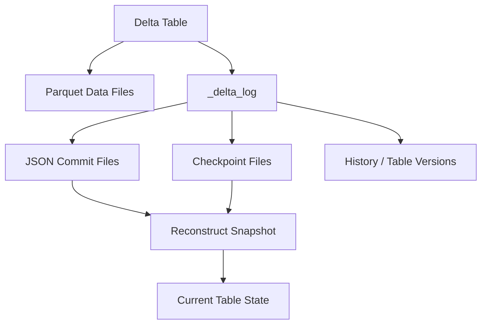
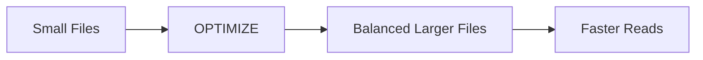

# Delta Lake Performance, Internals, and Best Practices

> Notes focused on transaction-log internals, file layout, performance, retention, and compatibility.

## 1. Delta Table Internals

A Delta table can be viewed as:



The transaction log records table actions. Checkpoints periodically summarize state so readers do not have to replay an unbounded sequence of log files.

## 2. JSON Commit Files

Conceptually:

```text
_delta_log/
00000000000000000000.json
00000000000000000001.json
00000000000000000002.json
...
```

Each committed table version corresponds to a transaction-log version.

The exact actions recorded can include information about:

- Added files
- Removed files
- Metadata
- Protocol
- Transactions

## 3. Checkpoints

A checkpoint is a compact representation of table state.

Without checkpoints, reconstructing a current snapshot could require processing many historical commits.

```text
Many JSON commits
      |
      v
  Checkpoint
      |
      v
Faster snapshot reconstruction
```

Delta documentation also supports checkpoint variants/features in newer versions.

## 4. Snapshot Reconstruction

Conceptually:

```text
Checkpoint at version 100
        +
commits 101
102
103
104
        |
        v
Current Snapshot = version 104
```

The reader reconstructs the table state from the checkpoint plus later commits.

## 5. Data Skipping

Delta can collect file-level statistics.

For a file:

```text
File A
min(id) = 1
max(id) = 100

File B
min(id) = 101
max(id) = 200
```

Query:

```sql
SELECT *
FROM customers
WHERE id = 150;
```

File A can be skipped because:

```text
150 is not between 1 and 100
```

File B is a candidate.

This reduces unnecessary I/O.

## 6. Small Files Problem

Suppose a pipeline creates:

```text
10,000 files × 10 MB
```

instead of:

```text
200 files × 500 MB
```

The first design may create significant metadata and file-opening overhead.

Symptoms include:

- Slow scans
- Large task counts
- Metadata overhead
- Poor cloud-storage efficiency

## 7. OPTIMIZE / Bin Packing

Compaction combines smaller files into larger files.



The official Delta documentation describes bin-packing optimization as idempotent.

## 8. Optimized Writes

Optimized writes can reduce small files during the write itself, especially for partitioned tables.

Conceptually:

```text
Input partitions
      |
      v
Shuffle / organize
      |
      v
Better-sized output files
```

Trade-off:

- More efficient output layout
- Potential additional write/shuffle cost

## 9. Partitioning vs Z-Ordering vs Liquid Clustering

### Partitioning

Best when a column:

- Is commonly filtered
- Has reasonable cardinality
- Creates useful directory pruning

Example:

```sql
PARTITIONED BY (event_date)
```

### Z-Ordering

Useful for improving data locality and skipping for selected filter columns.

Example:

```sql
OPTIMIZE events
ZORDER BY (user_id, event_type);
```

### Liquid Clustering

A newer layout strategy that can adapt table organization over time.

Example:

```sql
CREATE TABLE events (
    event_id BIGINT,
    user_id BIGINT,
    event_time TIMESTAMP
)
USING DELTA
CLUSTER BY (user_id);
```

### Decision model

```text
                 Need data layout?
                       |
          +------------+------------+
          |                         |
     Stable pattern            Changing pattern
          |                         |
     Partitioning /             Liquid
     Z-Ordering                 Clustering
```

Do not blindly use every optimization. Measure workload patterns first.

## 10. Deletion Vectors

Traditional row-level deletion can require rewriting a whole Parquet file.

Deletion vectors allow supported operations to mark rows as removed without immediately rewriting the entire Parquet file.

```text
Traditional DELETE:
Parquet file
    |
    v
Rewrite file
    |
    v
New Parquet file

Deletion Vector:
Parquet file
    |
    +----> Row bitmap / deletion metadata
    |
    v
Logical rows removed
```

Physical cleanup/rewrite can happen later through supported maintenance operations such as `OPTIMIZE` or `REORG TABLE ... APPLY (PURGE)`, followed by `VACUUM` for eligible obsolete files.

## 11. Retention

Two properties are especially important:

### Log retention

```text
delta.logRetentionDuration
```

Controls how long Delta transaction-log history is retained.

Current documented default:

```text
30 days
```

### Deleted-file retention

```text
delta.deletedFileRetentionDuration
```

Controls how long deleted files are retained before becoming eligible for `VACUUM`.

Current documented default:

```text
7 days
```

These settings should be aligned with recovery, audit, and time-travel requirements.

## 12. VACUUM Safety

Before using aggressive retention:

```text
Ask:
  |
  +--> Do we need historical queries?
  |
  +--> Do we need rollback/recovery?
  |
  +--> Do downstream readers depend on old versions?
  |
  +--> Is our retention policy compliant?
```

Do not treat `VACUUM` as a routine "delete everything old" command without understanding its impact on historical access.

## 13. Protocol Versions

Delta uses protocol compatibility information to determine which clients can safely read/write a table.

Important concepts include:

```text
minReaderVersion
minWriterVersion
```

Modern Delta Lake also uses **table features** for finer-grained compatibility.

Examples of features with protocol implications include:

- Change Data Feed
- Generated columns
- Column mapping
- Identity columns
- Deletion vectors
- V2 checkpoints
- Liquid clustering

## 14. Column Mapping

Column mapping allows logical Delta column names to differ from physical Parquet column names.

One major benefit is that supported rename/drop operations can avoid rewriting the underlying Parquet data.

Example:

```sql
ALTER TABLE customers
RENAME COLUMN old_name TO customer_name;
```

Important:

> Enabling column mapping upgrades the table protocol and has compatibility implications.

## 15. Table Properties

Useful properties include:

```text
delta.enableChangeDataFeed
delta.logRetentionDuration
delta.deletedFileRetentionDuration
delta.minReaderVersion
delta.minWriterVersion
delta.columnMapping.mode
delta.enableDeletionVectors
```

Inspect properties/details using table metadata commands such as:

```sql
DESCRIBE DETAIL customers;
```

## 16. Performance Checklist

Before optimizing:

- Understand query patterns.
- Check file sizes.
- Check number of files.
- Check partition cardinality.
- Check whether predicates can use data skipping.
- Check Spark execution plans.
- Measure before and after optimization.

Then consider:

```text
Small files
   -> optimized writes / OPTIMIZE

Poor pruning
   -> better partitioning / clustering / Z-Ordering

Frequent row-level changes
   -> MERGE / deletion vectors where appropriate

Large incremental workloads
   -> CDF / streaming / incremental processing
```

## 17. Common Mistakes

### Mistake 1: Partition by a unique ID

Bad:

```sql
PARTITIONED BY (customer_id)
```

when `customer_id` is extremely high-cardinality.

### Mistake 2: Run OPTIMIZE blindly

Optimization consumes compute and rewrites files.

### Mistake 3: Use Z-ORDER on every column

Choose columns based on actual filtering/query patterns.

### Mistake 4: Treat VACUUM as backup

It can remove physical files required for older snapshots.

### Mistake 5: Enable schema evolution globally without thought

Broad schema evolution can allow unintended schema changes.

### Mistake 6: Ignore protocol compatibility

Enabling advanced Delta features can make older clients unable to read or write the table.

## 18. Interview Mental Model

When asked "How does Delta Lake work?", answer:

```text
                     Delta Lake
                         |
          +--------------+--------------+
          |                             |
    Parquet Files                  _delta_log
    Actual Data                   Transactions
          |                             |
          +--------------+--------------+
                         |
                    Table Snapshot
                         |
       +-----------------+-----------------+
       |                 |                 |
    ACID            Time Travel       Concurrency
       |
       +-----------------+-----------------+
                         |
             Update / Delete / Merge
                         |
                 Streaming + Batch
```

## Official references

- https://docs.delta.io/optimizations-oss/
- https://docs.delta.io/delta-clustering/
- https://docs.delta.io/delta-deletion-vectors/
- https://docs.delta.io/versioning/
- https://docs.delta.io/delta-column-mapping/
- https://docs.delta.io/table-properties/
- https://docs.delta.io/delta-batch/
