# Delta Lake UniForm (Universal Format)

> **Source:** [Official Delta Lake documentation](https://docs.delta.io/delta-uniform/)  
> **Topic:** Delta Universal Format (UniForm)  
> **Purpose:** Understand how one Delta table can be read by Iceberg and Hudi clients without maintaining separate copies of the data.

---

## 1. What is Delta UniForm?

**Delta Universal Format (UniForm)** allows a **Delta Lake table** to be read by **Apache Iceberg** and **Apache Hudi** clients.

The key idea is:

- Delta, Iceberg, and Hudi all use **Parquet data files**.
- Their main difference is the **metadata/transaction layer**.
- UniForm keeps **one physical copy of the data files**.
- After a successful Delta commit, UniForm asynchronously generates the metadata required by Iceberg/Hudi clients.

### Big picture

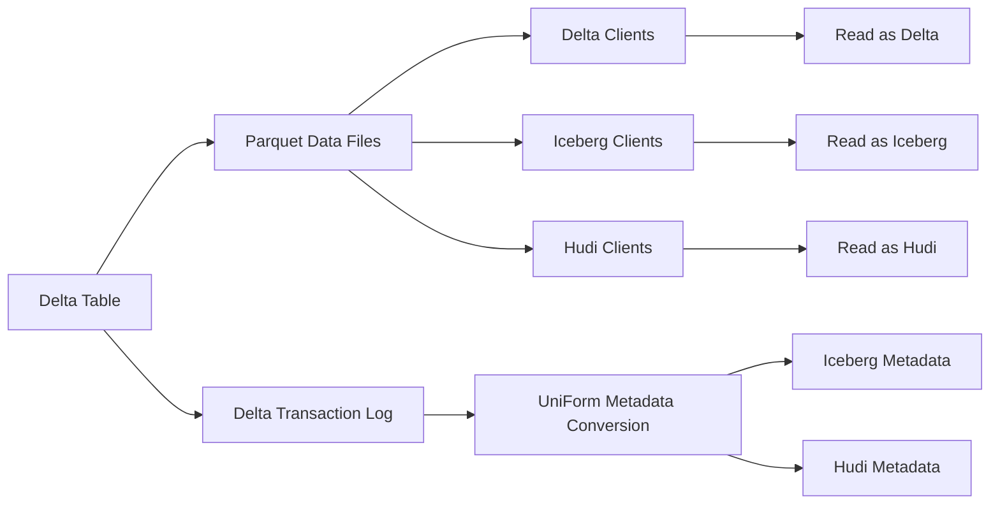

### Important idea

UniForm does **not** create another copy of the actual data.

```text
                ONE physical data layer
                         │
                 Parquet data files
                  /       |       \
                 /        |        \
             Delta     Iceberg     Hudi
             client     client     client
```

This is useful when different analytics engines or platforms expect different table formats.

---

# 2. Why UniForm?

Without UniForm, an organization may need to maintain separate representations of the same data:

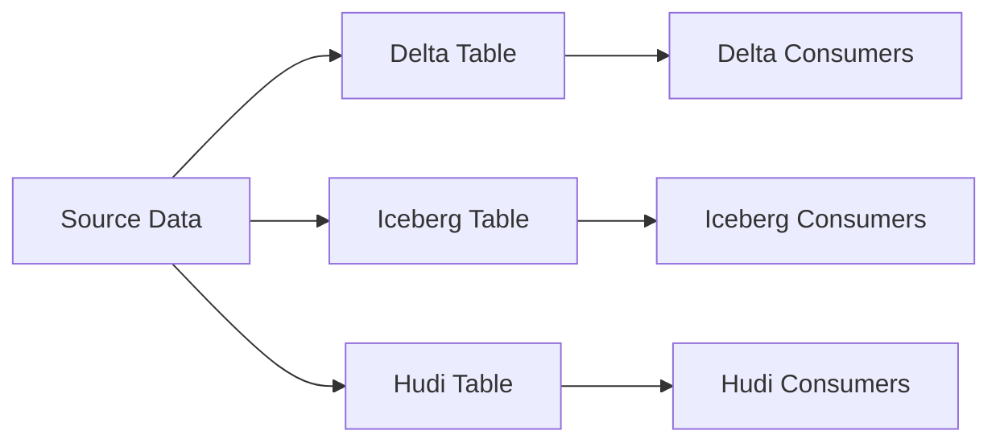

This can result in:

- Multiple copies of data
- Additional storage
- Multiple pipelines
- More synchronization work
- More operational complexity

With UniForm:

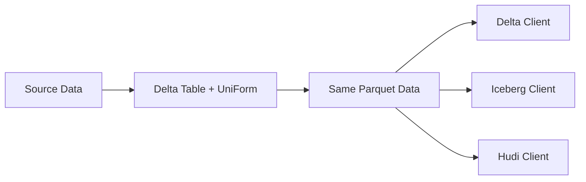

### Main benefit

> **Write data once, keep one physical copy, and expose it through multiple table-format metadata layers.**

---

# 3. How UniForm Works

When a Delta write occurs:

1. The Delta transaction commits.
2. The Delta write completes.
3. UniForm asynchronously generates Iceberg/Hudi metadata.
4. External Iceberg/Hudi clients can read the table after metadata generation completes.

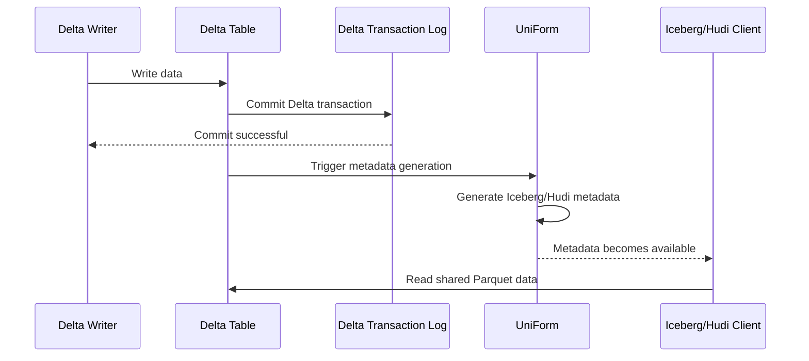

### Important

Metadata generation happens **asynchronously after the Delta transaction completes**.

Therefore, enabling UniForm generally has **negligible Delta write overhead**, because the conversion happens after the Delta commit.

---

# 4. Supported Universal Formats

UniForm supports:

| Format | Status |
|---|---|
| Delta | Native |
| Iceberg | Supported |
| Hudi | Preview |

The documentation describes **UniForm Iceberg** and **UniForm Hudi** separately because their requirements and configuration differ.

---

# 5. Requirements

## 5.1 UniForm Iceberg Requirements

To enable UniForm Iceberg:

1. Column mapping must be enabled.
2. `minReaderVersion >= 2`
3. `minWriterVersion >= 7`
4. Writes must use **Delta Lake 3.1+**.
5. Hive Metastore (HMS) must be configured as the catalog.

### Requirements diagram

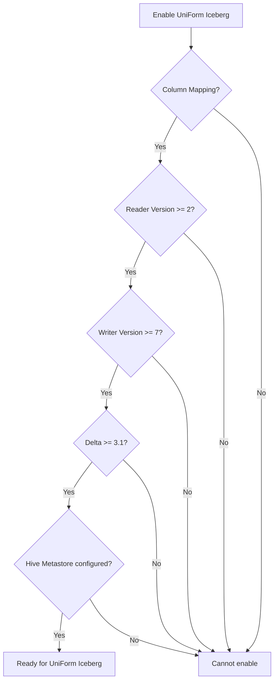

## 5.2 UniForm Hudi Requirements

For UniForm Hudi:

- Writes must use **Delta Lake 3.2+**.

Column mapping is also required when enabling UniForm on an existing table according to the documented procedure.

---

# 6. Iceberg vs Hudi Configuration

## UniForm Iceberg

The important table properties are:

```sql
'delta.enableIcebergCompatV2' = 'true'
'delta.universalFormat.enabledFormats' = 'iceberg'
```

## UniForm Hudi

```sql
'delta.universalFormat.enabledFormats' = 'hudi'
```

## Both Iceberg + Hudi

```sql
'delta.enableIcebergCompatV2' = 'true'
'delta.universalFormat.enabledFormats' = 'iceberg,hudi'
```

### Configuration comparison

| Requirement | Iceberg | Hudi |
|---|---:|---:|
| Column mapping | Yes | Yes |
| `IcebergCompatV2` | Yes | No |
| `enabledFormats=iceberg` | Yes | No |
| `enabledFormats=hudi` | No | Yes |
| Delta 3.1+ writes | Yes | No |
| Delta 3.2+ writes | — | Yes |
| HMS required | Yes | — |

---

# 7. Required Spark Packages

## Iceberg

When enabling UniForm Iceberg, provide the `delta-iceberg` package:

```bash
--packages io.delta:io.delta:delta-iceberg_2.12:<version>
```

## Hudi

For UniForm Hudi:

```bash
--packages io.delta:io.delta:delta-hudi_2.12:<version>
```

> Use the package/version appropriate for your Delta Lake/Spark environment.

---

# 8. Creating a New UniForm Iceberg Table

A new Delta table can be created with Iceberg UniForm enabled:

```sql
CREATE TABLE T(c1 INT)
USING DELTA
TBLPROPERTIES(
  'delta.enableIcebergCompatV2' = 'true',
  'delta.universalFormat.enabledFormats' = 'iceberg'
);
```

Column mapping is automatically enabled during table creation for this configuration.

---

# 9. Enabling UniForm on an Existing Table

For Delta Lake **3.3+**, UniForm Iceberg can be enabled/upgraded on an existing table:

```sql
ALTER TABLE table_name
SET TBLPROPERTIES(
  'delta.enableIcebergCompatV2' = 'true',
  'delta.universalFormat.enabledFormats' = 'iceberg'
);
```

### Hudi

```sql
ALTER TABLE table_name
SET TBLPROPERTIES(
  'delta.universalFormat.enabledFormats' = 'hudi'
);
```

---

# 10. When Should You Use REORG?

You can use:

```sql
REORG TABLE table_name
APPLY (
  UPGRADE UNIFORM(ICEBERG_COMPAT_VERSION=2)
);
```

Use `REORG` when:

- The table has **deletion vectors** enabled.
- You previously enabled **IcebergCompatV1**.
- You need to read the table from Iceberg engines that don't support Hive-style Parquet files, such as **Athena or Redshift**.

### Why REORG matters

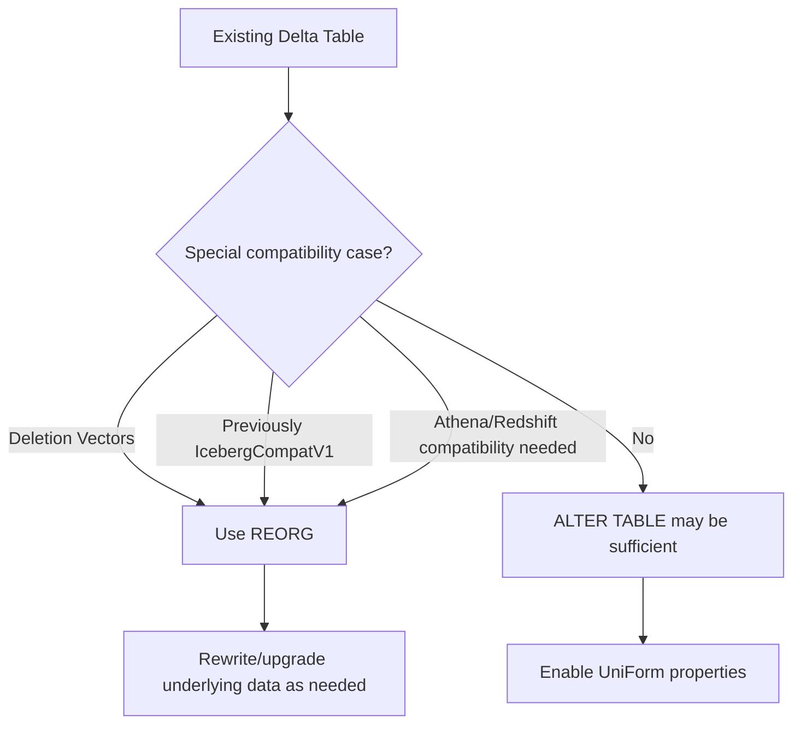

---

# 11. Asynchronous Metadata Generation

This is one of the most important concepts in UniForm.

After a Delta transaction succeeds:

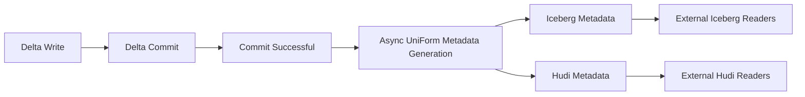

The external client **cannot necessarily query immediately** after the Delta commit.

The metadata-generation task must complete first.

---

# 12. Frequent Commits

Iceberg/Hudi metadata generation can have higher write latency than Delta.

For workloads with very frequent commits:

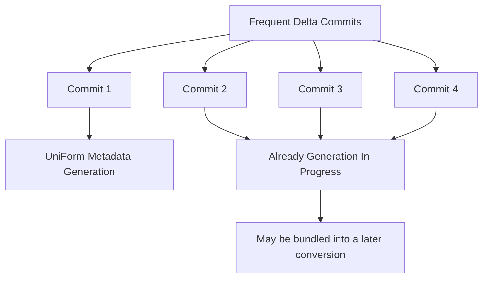

Delta ensures that only **one metadata generation process per format** is active at a time on a single cluster.

If another Delta commit occurs while metadata generation is already running:

- The Delta commit can still succeed.
- It does not start another concurrent metadata-generation process.

This prevents metadata generation from causing cascading latency in workloads with commits every few seconds/minutes.

---

# 13. Checking Metadata Generation Status

UniForm adds two important metadata properties.

## `converted_delta_version`

The latest Delta version for which metadata was successfully generated.

## `converted_delta_timestamp`

The timestamp of the latest Delta commit for which metadata was successfully generated.

### Check using Spark SQL

```sql
SHOW TBLPROPERTIES <table-name>;
```

### Example interpretation

Suppose:

```text
Delta latest version = 105
converted_delta_version = 103
```

This means:

```text
Delta table
    │
    ├── Version 103 ──> Iceberg/Hudi metadata generated
    │
    ├── Version 104 ──> Not yet converted
    │
    └── Version 105 ──> Not yet converted
```

Therefore, external Iceberg/Hudi readers may not yet see the latest Delta changes.

---

# 14. Reading UniForm as Iceberg in Apache Spark

The general process is:

1. Start Apache Spark with Iceberg.
2. Connect Spark to the **same Hive Metastore** used by UniForm.
3. Use `SHOW TABLES`.
4. Read the table using normal SQL.

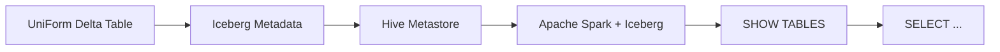

Example:

```sql
SHOW TABLES;
```

Then:

```sql
SELECT *
FROM table_name;
```

The external Spark environment sees the table through the Iceberg interface.

---

# 15. Reading Iceberg Using Metadata JSON Path

Some Iceberg clients allow an external Iceberg table to be registered using a **versioned metadata JSON path**.

UniForm creates a new metadata JSON file whenever it converts a new Delta version to Iceberg.

The metadata is stored under:

```text
<table-path>/metadata/v<version-number>-uuid.metadata.json
```

### Example

```text
s3://bucket/my-table/
│
├── _delta_log/
├── part-00001.parquet
├── part-00002.parquet
│
└── metadata/
    ├── v10-abc.metadata.json
    ├── v11-def.metadata.json
    └── v12-xyz.metadata.json
```

Some clients, such as BigQuery, can use this metadata path approach.

---

# 16. Reading UniForm as Hudi

A UniForm table can be read as Hudi from Apache Spark.

Example:

```scala
spark.read
  .format("hudi")
  .option("hoodie.metadata.enable", "true")
  .load("PATH_TO_UNIFORM_TABLE_DIRECTORY")
```

Conceptually:

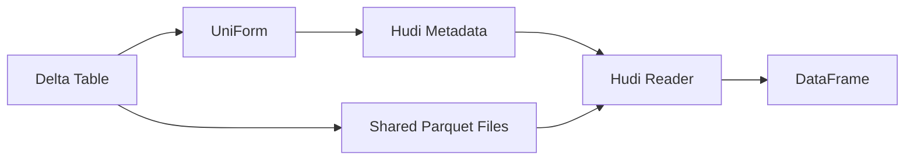

---

# 17. Delta vs Iceberg/Hudi Versions

Do **not** assume that Delta, Iceberg, and Hudi versions are the same.

### Delta vs Iceberg

Delta and Iceberg versions do not align by:

- Commit timestamp
- Version ID

### Delta vs Hudi

Delta and Hudi:

- Commit timestamps align.
- Version IDs do not necessarily align.

To determine which Delta version corresponds to an Iceberg/Hudi version, use:

```text
converted_delta_version
converted_delta_timestamp
```

### Example

```text
Delta
  Version 50
       │
       ▼
UniForm conversion
       │
       ▼
Iceberg metadata version X
```

The Iceberg version number should **not** be assumed to be `50`.

---

# 18. Critical Limitation: Read-Only from Iceberg/Hudi

This is perhaps the most important operational rule:

> **Iceberg/Hudi clients should only read UniForm tables. They should not write to them.**

UniForm is designed around Delta being the source of truth.

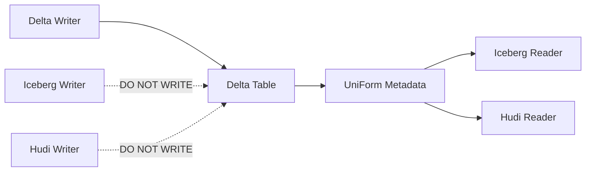

Why?

An Iceberg/Hudi writer may perform:

- Data cleanup
- Garbage collection
- File deletion
- Other table-maintenance operations

Delta may be unaware of these changes.

This can potentially:

- Corrupt the Delta table
- Cause inconsistent metadata
- Cause data loss

---

# 19. Other Limitations

UniForm has the following documented limitations:

### 1. Deletion vectors

UniForm does not work on tables with deletion vectors enabled.

### 2. `VOID` data type

Delta tables with UniForm enabled do not support the `VOID` type.

### 3. External writes

Iceberg/Hudi clients can read but should not write.

### 4. Client-specific limitations

Even when UniForm supports a format, the particular Iceberg/Hudi reader may have its own limitations.

Always check the documentation for the target reader engine.

---

# 20. Delta Features That External Formats Don't Support

Some Delta features continue to work for **Delta clients**, but are not supported through Iceberg.

Examples include:

- Change Data Feed (CDF)
- Delta Sharing

This means:

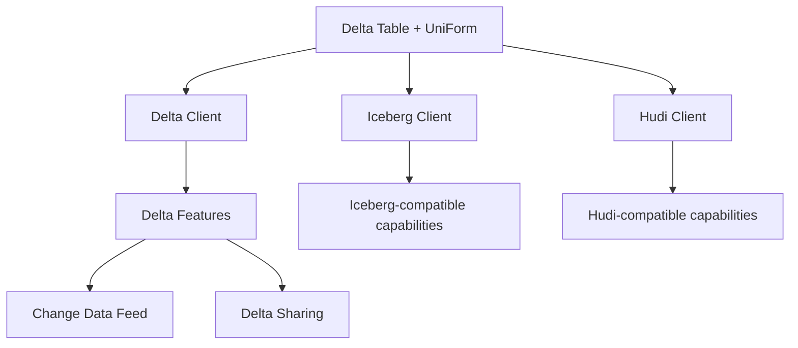

Do not assume that every Delta feature automatically becomes available through Iceberg/Hudi.

---

# 21. Turning UniForm Off

UniForm can be disabled by unsetting:

```text
delta.universalFormat.enabledFormats
```

However, some changes cannot be reversed.

### Important irreversible changes

Once enabled:

- Column mapping cannot be turned off.
- Upgrades to Delta reader/writer protocol versions cannot be undone.

Therefore, enabling UniForm should be treated as a **table design decision**, not merely a temporary setting.

---

# 22. End-to-End Architecture

The complete architecture can be visualized as:

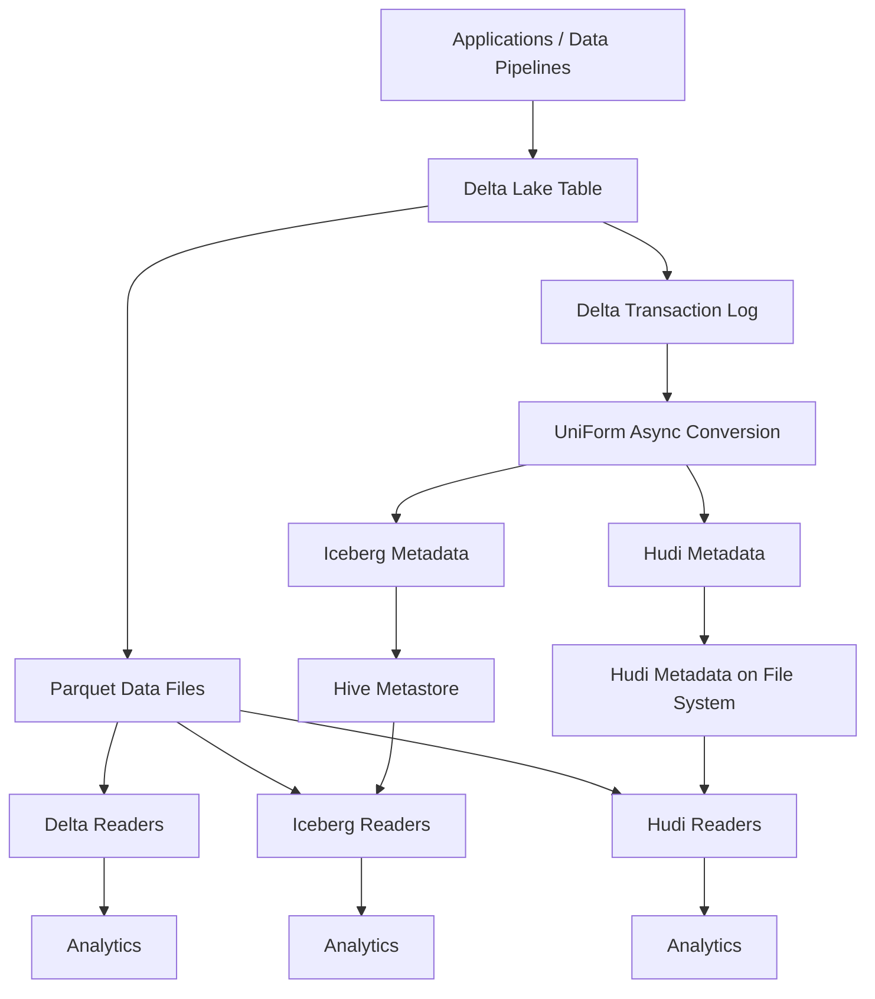

### Core architecture principle

```text
                   Delta = Source of Truth
                           │
             ┌─────────────┴─────────────┐
             │                           │
       Delta Metadata              Parquet Files
             │                           │
             ▼                           │
          UniForm                       │
             │                           │
       ┌─────┴─────┐                     │
       ▼           ▼                     │
   Iceberg       Hudi                    │
   Metadata      Metadata                │
       │           │                     │
       └─────┬─────┘                     │
             │                           │
             └───────────┬───────────────┘
                         ▼
              Multiple Reader Ecosystems
```

---

# 23. UniForm vs Traditional Conversion

| Aspect | Traditional Conversion | Delta UniForm |
|---|---|---|
| Physical data copies | Often multiple | One |
| Delta source of truth | Yes | Yes |
| Iceberg access | Separate conversion/table often needed | Metadata generated automatically |
| Hudi access | Separate conversion/table often needed | Metadata generated automatically |
| Storage overhead | Higher | Lower |
| Synchronization | More complex | Built into UniForm workflow |
| External writes | Depends on architecture | Should not write through Iceberg/Hudi |
| Metadata generation | Pipeline-dependent | Asynchronous |

---

# 24. Important Table Properties

| Property | Purpose |
|---|---|
| `delta.enableIcebergCompatV2` | Enables Iceberg compatibility V2 |
| `delta.universalFormat.enabledFormats` | Specifies enabled universal formats |
| `converted_delta_version` | Latest Delta version successfully converted |
| `converted_delta_timestamp` | Timestamp of latest successfully converted Delta commit |

### Examples

#### Iceberg

```sql
'd​​elta.enableIcebergCompatV2' = 'true'
'delta.universalFormat.enabledFormats' = 'iceberg'
```

#### Hudi

```sql
'delta.universalFormat.enabledFormats' = 'hudi'
```

#### Both

```sql
'delta.enableIcebergCompatV2' = 'true'
'delta.universalFormat.enabledFormats' = 'iceberg,hudi'
```

> Note: In actual SQL, use the exact property spelling `delta.enableIcebergCompatV2`.

---

# 25. UniForm Mental Model

A simple way to remember UniForm:

```text
                    ONE TABLE
                       │
              ┌────────┴────────┐
              │                 │
        Parquet Files       Metadata
              │                 │
              │          ┌──────┴──────┐
              │          │             │
              │       Delta         UniForm
              │                        │
              │                  ┌─────┴─────┐
              │                  │           │
              │               Iceberg      Hudi
              │
              └───────────────┬──────────────┘
                              │
                    Multiple Readers
```

### Remember:

> **UniForm = One physical data copy + multiple metadata representations.**

---

# 26. Interview Questions

## Q1. What is Delta UniForm?

Delta UniForm is a Delta Lake capability that allows Delta tables to be read by Iceberg and Hudi clients using automatically generated metadata.

---

## Q2. Does UniForm create another copy of the data?

**No.**

The physical data files remain shared, typically as Parquet files.

---

## Q3. Does UniForm convert the entire Delta table into Iceberg?

Conceptually, UniForm generates the metadata required for Iceberg/Hudi readers while sharing the underlying Parquet data files. It does not require a separate physical data copy.

---

## Q4. Is metadata generation synchronous?

**No.**

It happens asynchronously after the Delta transaction completes.

---

## Q5. Can Iceberg or Hudi clients write to a UniForm table?

**No.**

UniForm is intended to be read-only from the Iceberg/Hudi perspective.

---

## Q6. Why is external writing dangerous?

Because Iceberg/Hudi writers may perform file cleanup or garbage collection that Delta does not know about, potentially causing corruption or data loss.

---

## Q7. How can you check whether UniForm metadata has caught up?

Use:

```sql
SHOW TBLPROPERTIES <table-name>;
```

Look at:

```text
converted_delta_version
converted_delta_timestamp
```

---

## Q8. Do Delta and Iceberg table version numbers match?

**No.**

Their version IDs do not align.

Use UniForm's conversion properties to identify the corresponding Delta version.

---

## Q9. What happens when Delta commits occur very frequently?

Only one metadata generation process per format is allowed at a time on a single cluster. Additional Delta commits can still succeed while metadata generation is already running.

---

## Q10. Can UniForm be disabled completely?

The universal-format property can be unset, but some changes made while enabling UniForm cannot be reversed, such as column-mapping activation and protocol-version upgrades.

---

# 27. Quick Revision

### UniForm

```text
Delta Universal Format
        │
        ├── Iceberg
        └── Hudi
```

### Main benefit

```text
One physical data copy
        ↓
Multiple table-format readers
```

### Iceberg requirements

```text
Column Mapping
+ Reader Version >= 2
+ Writer Version >= 7
+ Delta 3.1+
+ Hive Metastore
```

### Hudi

```text
Delta 3.2+ writes
```

### Important properties

```text
delta.enableIcebergCompatV2
delta.universalFormat.enabledFormats
```

### Metadata status

```text
converted_delta_version
converted_delta_timestamp
```

### Critical rule

```text
Delta → WRITE
Iceberg → READ
Hudi → READ
```

### Main limitation

```text
Do NOT write to the UniForm table
from Iceberg/Hudi clients.
```

---

# 28. Practical Decision Flow

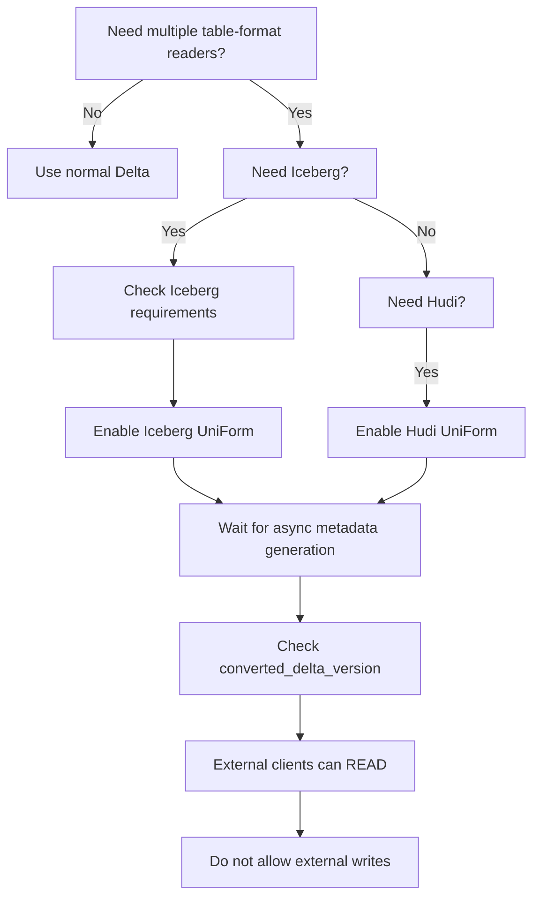

---

# 29. Key Takeaways

1. **UniForm allows Delta tables to be read as Iceberg or Hudi.**
2. **The physical data files are shared**, avoiding duplicate data copies.
3. UniForm primarily generates **format-specific metadata**.
4. Metadata generation happens **asynchronously after Delta commits**.
5. Iceberg UniForm requires specific protocol versions and Hive Metastore.
6. Hudi UniForm requires Delta 3.2+ for writes.
7. `converted_delta_version` and `converted_delta_timestamp` help monitor metadata freshness.
8. Delta, Iceberg, and Hudi version numbers should **not be assumed to match**.
9. **Iceberg/Hudi should be treated as read-only interfaces** to the UniForm table.
10. Some Delta features, such as **Change Data Feed and Delta Sharing**, are not available through Iceberg.
11. Enabling UniForm can involve **irreversible table protocol/column-mapping changes**.
12. UniForm is especially useful when an organization wants **Delta as the source of truth while supporting multiple reader ecosystems**.

---

## Official Reference

- [Delta Lake — Universal Format (UniForm)](https://docs.delta.io/delta-uniform/)
- [Delta Lake Documentation](https://docs.delta.io/)
