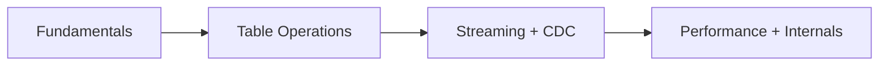

# Delta Lake Notes

Clean, GitHub-ready study notes based primarily on the official Delta Lake documentation.

## Files

| File | Focus |
|---|---|
| [01-delta-lake-fundamentals.md](01-delta-lake-fundamentals.md) | Delta Lake concepts, ACID, transaction log, schema, time travel |
| [02-delta-lake-operations.md](02-delta-lake-operations.md) | Create/read/write/update/delete/merge, partitioning, OPTIMIZE, Z-Order, VACUUM |
| [03-delta-lake-streaming-cdc.md](03-delta-lake-streaming-cdc.md) | Structured Streaming, foreachBatch, CDC, Change Data Feed |
| [04-delta-lake-performance-and-internals.md](04-delta-lake-performance-and-internals.md) | Internals, checkpoints, data skipping, clustering, deletion vectors, retention, protocols |

## Learning order



## Core mental model

```text
Delta Table
├── Parquet data files
└── _delta_log
    ├── Transaction history
    ├── Metadata
    ├── File additions/removals
    └── Checkpoints
```

## Official documentation

https://docs.delta.io/

## Note

Delta Lake evolves quickly. Version-specific features and syntax can differ, so verify the exact Delta Lake/Spark/Databricks version used by your project before applying advanced features.
