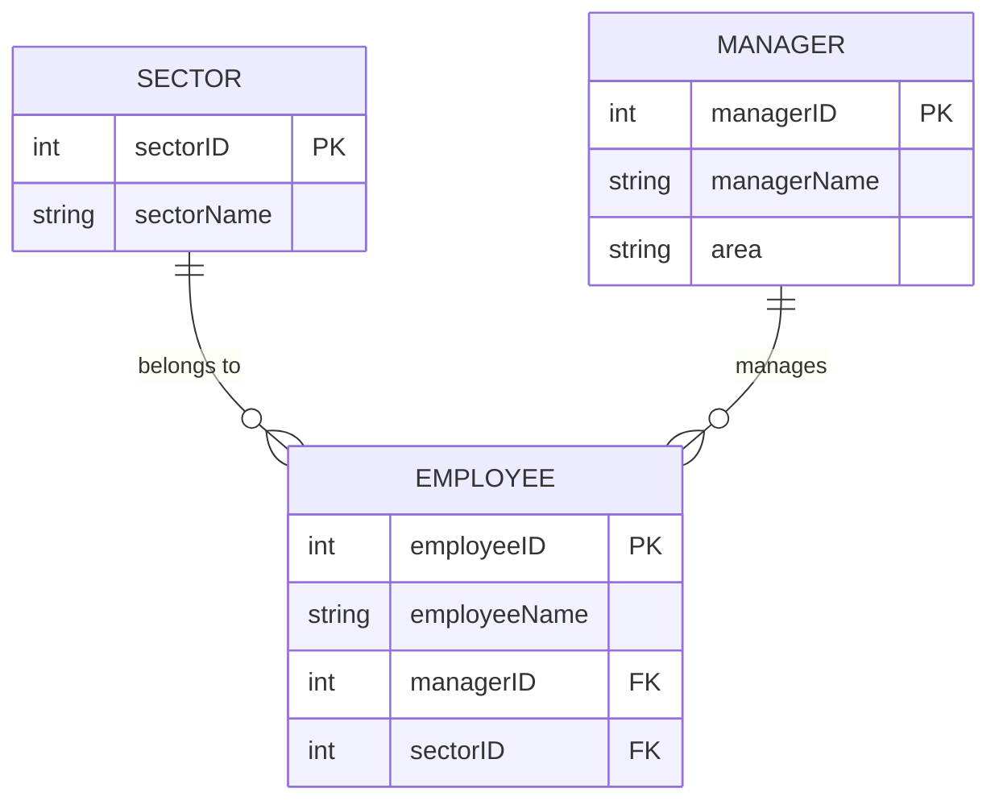
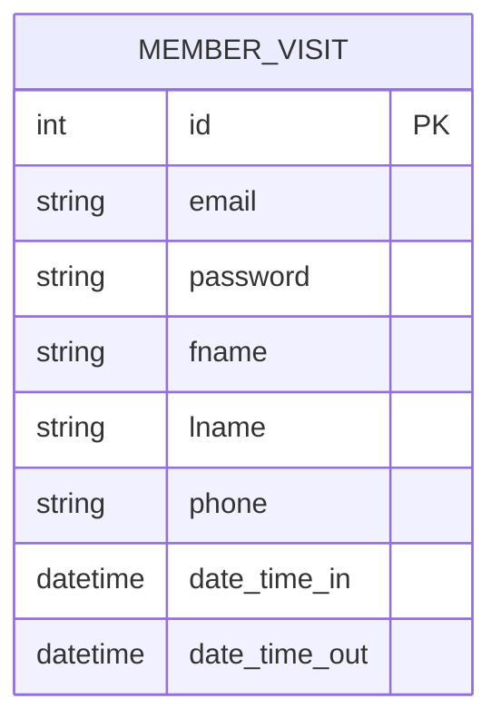
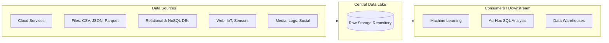
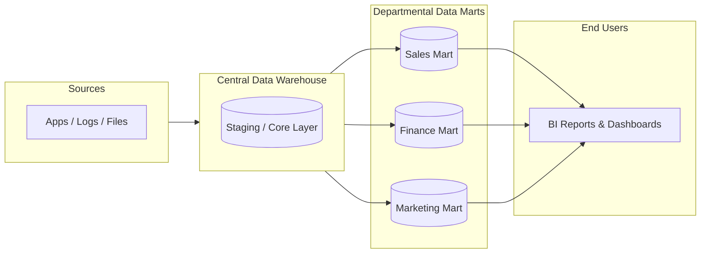
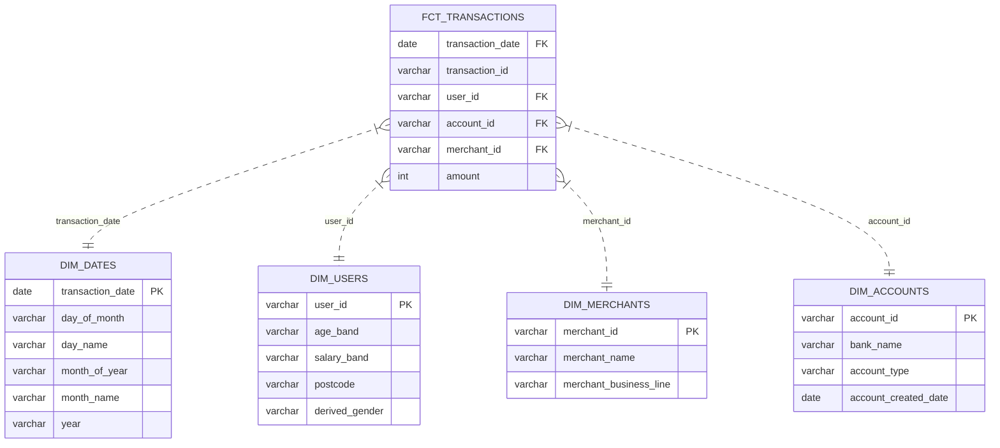
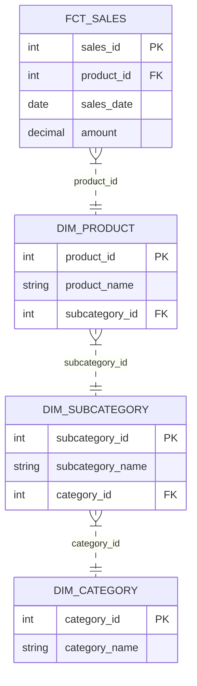
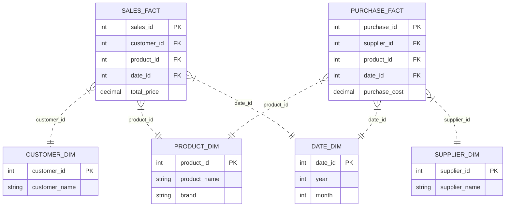

# Data Warehousing & Data Engineering Fundamentals

A comprehensive reference guide covering OLTP, OLAP, Data Normalization, Data Lakes, Data Warehouses, Data Marts, Data Modeling (Star, Snowflake, Galaxy schemas), and Slowly Changing Dimensions (SCD).

---

## Table of Contents
1. [OLTP (Online Transaction Processing)](#1-oltp-online-transaction-processing)
2. [OLAP (Online Analytical Processing)](#2-olap-online-analytical-processing)
3. [OLTP vs. OLAP Comparison](#3-oltp-vs-olap-comparison)
4. [Data Normalization vs. Denormalization](#4-data-normalization-vs-denormalization)
5. [Data Lake](#5-data-lake)
6. [Data Warehouse](#6-data-warehouse)
7. [Data Mart](#7-data-mart)
8. [Data Warehouse Design vs. Data Modeling](#8-data-warehouse-design-vs-data-modeling)
9. [Data Modeling Concepts](#9-data-modeling-concepts)
   - [Fact Tables](#fact-tables)
   - [Dimension Tables](#dimension-tables)
   - [Star Schema](#star-schema)
   - [Snowflake Schema](#snowflake-schema)
   - [Galaxy Schema (Fact Constellation)](#galaxy-schema-fact-constellation)
10. [Slowly Changing Dimensions (SCD)](#10-slowly-changing-dimensions-scd)

---

## 1. OLTP (Online Transaction Processing)

**OLTP** systems support transaction-oriented applications designed for real-time execution of operational tasks.

### Key Characteristics
* **Transactional Operations:** Handles large volumes of short, atomic CRUD (Create, Read, Update, Delete) transactions.
* **Concurrency Control:** Employs multi-concurrency techniques to manage concurrent user actions and prevent conflicts.
* **Data Integrity:** Strict adherence to **ACID** properties (Atomicity, Consistency, Isolation, Durability).
* **Real-Time Processing:** Optimized for rapid response times and high-throughput transaction execution.
* **High Availability:** Built with fault tolerance to support mission-critical applications.
* **Metrics:** Evaluated primarily by **Transactions Per Second (TPS)**.
* **Database Design:** Typically highly normalized relational schemas with optimized indexing.

### Example Systems
* **ERP Systems:** SAP ERP, Oracle ERP, Microsoft Dynamics.
* **Financial Services:** Online banking systems, ATM networks.
* **Reservations & Ticketing:** Airline booking platforms.
* **E-commerce & On-Demand Services:** Amazon, eBay, Uber, Lyft, DoorDash, Airbnb.
* **Point of Sale (POS) & CRM:** Retail POS, Salesforce, HubSpot.

### Popular OLTP Databases
`Oracle Database` | `MySQL` | `PostgreSQL` | `Microsoft SQL Server` | `IBM DB2` | `MariaDB` | `SAP HANA` | `Amazon Aurora` | `Google Cloud Spanner` | `CockroachDB`

---

## 2. OLAP (Online Analytical Processing)

**OLAP** systems provide analytical capabilities for business intelligence, reporting, and strategic decision-making.

### Key Characteristics
* **Multi-Dimensional Analysis:** Analyzes metrics across multiple dimensions (e.g., Sales by Product, Region, and Time).
* **Speedy Query Performance:** Utilizes precomputed aggregations and multidimensional cubes for rapid ad-hoc querying.
* **Aggregation & Computation:** Optimized for complex calculations (sums, averages, ratios, ranks) over large datasets.
* **Read-Optimized:** Designed for heavy read workloads with minimal write operations.
* **Exploratory Analysis:** Supports interactive data discovery and scenario ("what-if") testing.

### Popular OLAP Systems & Cloud Data Warehouses
`Amazon Redshift` | `Google BigQuery` | `Snowflake` | `Microsoft SSAS` | `SAP BW`

---

## 3. OLTP vs. OLAP Comparison

```
+---------------------+------------------------------------------+------------------------------------------+
| Feature             | OLTP                                     | OLAP                                     |
+---------------------+------------------------------------------+------------------------------------------+
| Main Function       | Day-to-day transaction processing        | Complex analysis & decision support      |
| Database Design     | Normalized (3NF); optimized for write    | Denormalized; optimized for read/report  |
| Data Nature         | Detailed, current operational data       | Summarized, consolidated, historical data|
| Operations          | Fast CRUD operations & short queries     | Long, complex analytical queries         |
| Access Pattern      | Small row-level access (single record)   | Scans across millions of rows/tables     |
| Metric              | Transactions Per Second (TPS)            | Query Response Time / Throughput         |
| User Base           | Front-line workers, clerks, end users    | Analysts, Managers, Data Scientists      |
| Consistency         | High concurrency & strict ACID control   | Batch loads; relaxed consistency needs   |
+---------------------+------------------------------------------+------------------------------------------+
```

---

## 4. Data Normalization vs. Denormalization

### Data Normalization
The process of organizing data into multiple related tables according to normal forms to minimize redundancy and maintain data integrity.

* **Advantages:** Eliminates redundant data storage, ensures update consistency, reduces overall database footprint.
* **Best Used In:** OLTP applications where fast write operations and strict data integrity are mandatory.



### Data Denormalization
The process of combining normalized tables into fewer, broader tables to improve read performance by avoiding complex JOIN operations.

* **Advantages:** Speeds up reporting queries, simplifies SQL statements, optimizes read-heavy workloads.
* **Trade-offs:** Introduces data redundancy, increases storage usage, and raises potential update anomalies.
* **Best Used In:** OLAP data warehouses and reporting marts.



---

## 5. Data Lake

A **Data Lake** is a centralized repository that stores raw data in its native format (structured, semi-structured, and unstructured) without requiring a predefined schema (**Schema-on-Read**).

### Architecture Flow



### Key Benefits
* **Data Variety:** Native support for structured (tables), semi-structured (JSON, XML, Parquet, Avro), and unstructured data (text, images, audio, video).
* **Scalability & Cost:** Low-cost object storage (e.g., AWS S3, Azure Blob Storage, GCS) scaling to petabyte/exabyte levels.
* **Schema-on-Read:** Flexibility to defer schema enforcement until data is queried.

---

## 6. Data Warehouse

A **Data Warehouse** is a centralized, integrated analytical database optimized for complex aggregation and historical trend analysis.

### Core Value Drivers
* **Unified Source of Truth:** Consolidates data from disparate operational systems.
* **Data Cleansing & Quality:** Applies transformations to enforce consistency across enterprise metrics.
* **Historical Retention:** Preserves long-term data for trend analysis and forecasting.
* **System Isolation:** Offloads heavy analytical workloads from production OLTP databases.

### Modern Capabilities
While traditional data warehouses strictly ingested structured tabular data, modern cloud platforms (**Snowflake**, **Google BigQuery**, **Amazon Redshift**) support semi-structured types (e.g., JSON, Variant) and integrate natively with Data Lake architectures.

---

## 7. Data Mart

A **Data Mart** is a focused subset of a data warehouse tailored to the specific operational needs of a single business unit or department (e.g., Sales, Finance, Marketing).



### Advantages
* **Optimized Performance:** Smaller dataset size leads to faster query execution.
* **Domain Focus:** Simplified domain-specific attributes for non-technical business users.
* **Access Control & Governance:** Granular security boundaries at department level.

---

## 8. Data Warehouse Design vs. Data Modeling

* **Data Warehouse Design:** The overall structural blueprint of the system architecture. Covers data acquisition, staging layers, ETL/ELT pipelines, storage selection, indexing, security, and backup strategies.
* **Data Modeling:** The sub-process of structural layout definition for stored entities. Focuses on defining facts, dimensions, attributes, keys, and entity-relationship models (Star, Snowflake, Galaxy).

---

## 9. Data Modeling Concepts

### Fact Tables
Central table containing numeric, quantitative measurements (metrics) and foreign keys linking to surrounding dimension tables.

* **Grain:** Defines the exact level of detail represented by a single row (e.g., single retail transaction line item).
* **Column Types:**
  1. *Foreign Keys:* Links to dimensions (`date_key`, `product_key`, `store_key`).
  2. *Measures/Facts:* Quantitative numeric values (`sales_amount`, `quantity_sold`, `discount_amount`).

### Dimension Tables
Surrounding tables containing descriptive context (attributes) associated with factual measurements.

* **Characteristics:** Textual attributes, hierarchical attributes (e.g., `Year -> Quarter -> Month -> Day`), relatively stable change frequency compared to fact tables.

---

### Star Schema
The standard dimensional schema where a central fact table connects directly to denormalized dimension tables.



---

### Snowflake Schema
An extension of the Star Schema where dimension tables are normalized into sub-dimension tables to eliminate redundancy.



---

### Galaxy Schema (Fact Constellation)
A complex architecture containing multiple fact tables that share common (conformed) dimension tables.



---

## 10. Slowly Changing Dimensions (SCD)

Techniques used in data warehousing to manage and track attribute changes over time within dimension tables.

```
+----------+-----------------------------------+-----------------------------------------------------------------------------------+
| SCD Type | Mechanism                         | Use Case & Impact                                                                 |
+----------+-----------------------------------+-----------------------------------------------------------------------------------+
| Type 1   | Overwrite                         | Replaces old data with new value. No historical tracking maintained.             |
| Type 2   | Add New Row                       | Adds new row with new surrogate key and active flag/date range. Full history kept. |
| Type 3   | Add New Column                    | Adds `previous_attribute` column. Tracks current and immediate prior state only. |
| Type 4   | Outrigger / History Table         | Stores current record in main dimension table and archives changes in history DB. |
| Type 6   | Hybrid (Type 1 + Type 2 + Type 3) | Combines new row insertion (Type 2) with column updates across historic versions. |
+----------+-----------------------------------+-----------------------------------------------------------------------------------+
```

### Implementation Summary Examples

* **SCD Type 1 (Overwrite):**
  * *Action:* Update `Address = 'New York'` directly where `Customer_ID = 101`.
  * *Result:* Historical context lost.

* **SCD Type 2 (Add New Row):**
  * *Action:* Insert new record with `Customer_Key = 202`, set `Is_Current = True`, set previous record `Is_Current = False`.
  * *Result:* Preserves full history for historical reporting.

* **SCD Type 3 (Add New Column):**
  * *Action:* Set `Previous_Address = Current_Address`, then update `Current_Address = 'New York'`.
  * *Result:* Limited to tracking two states.

* **SCD Type 4 (Separate History Table):**
  * *Action:* Move old row to `Customer_History` table and update active row in `Customer` dimension table.

* **SCD Type 6 (Hybrid 1+2+3):**
  * *Action:* Insert a new row (Type 2), retain previous attribute column (Type 3), and overwrite current attribute state across historical rows (Type 1).
