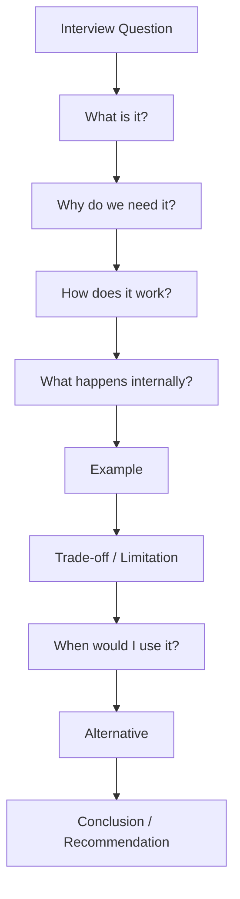
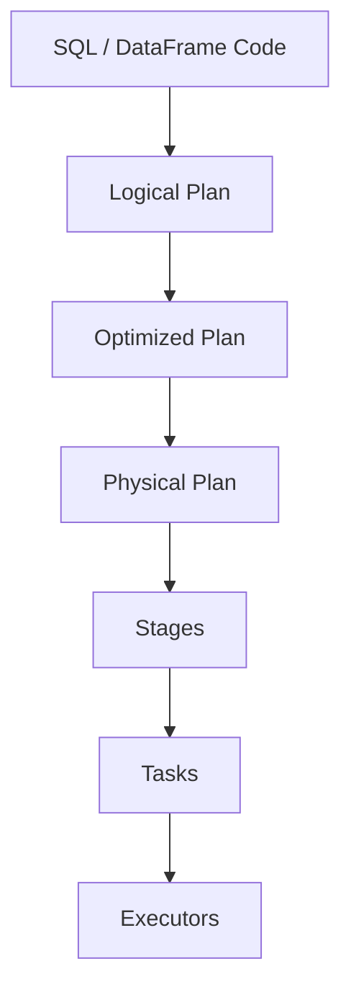
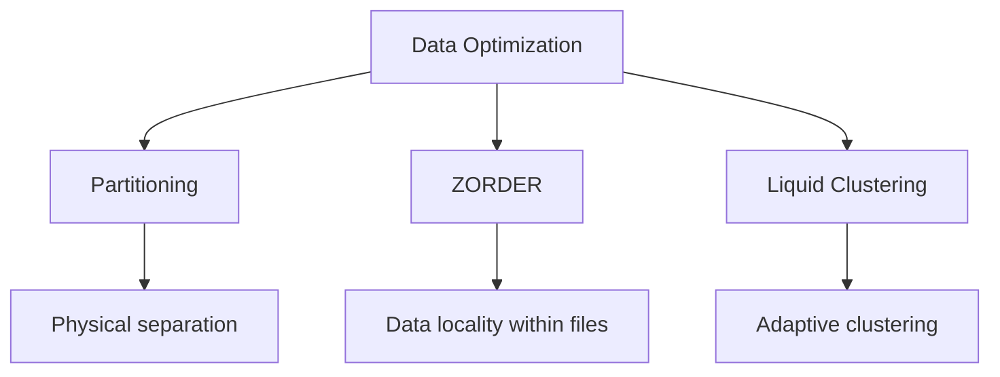
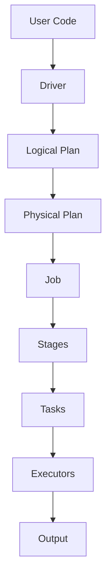
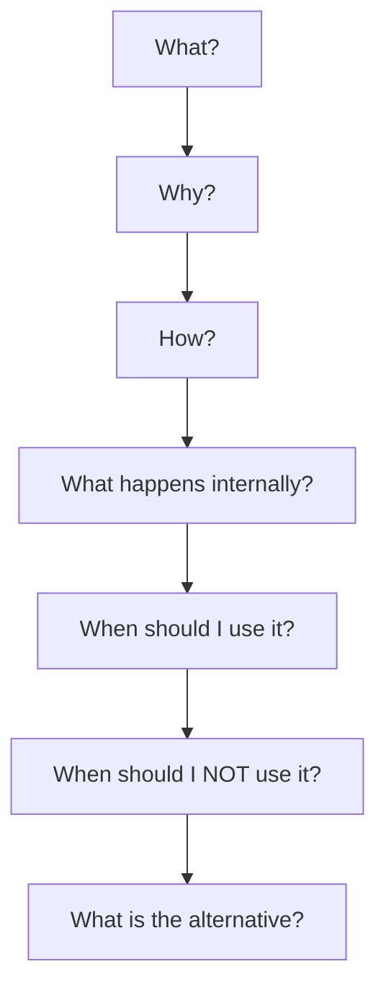
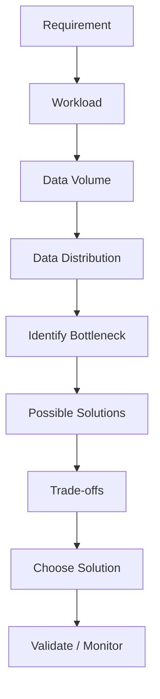
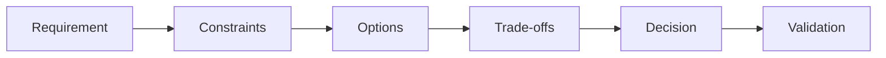
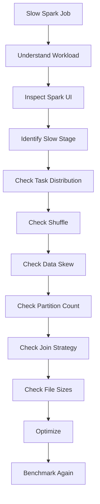
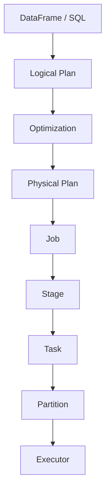
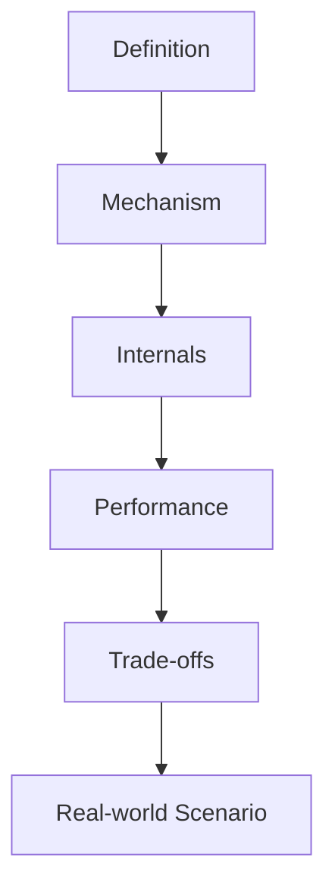

# Data Engineering Interview Answer Framework

> A practical framework for structuring technical, scenario-based, performance, and system-design answers during Data Engineering interviews.

---

## 1. Core Interview Answer Framework

For most technical questions, use:

**What → Why → How → Internals → Example → Trade-off → Use Case → Alternative → Conclusion**



### 1. What is it?

Start with a one- or two-sentence definition.

**Example:**

> Partitioning is a technique of physically organizing data into separate partitions based on a column or expression so that queries can avoid scanning unnecessary data.

Do not start with five minutes of theory.

### 2. Why do we need it?

Explain the problem it solves.

> The main purpose is to reduce the amount of data scanned and improve query performance, especially when queries frequently filter on the partition column.

### 3. How does it work?

Explain the mechanism.

**Example:**

> When data is written, rows are distributed into physical locations based on the partition value. During a query, the engine can prune partitions that do not satisfy the filter.

### 4. Explain the internals

This is where you differentiate yourself from someone who memorized definitions.

For Spark, think in terms of:



### 5. Give an example

Use a small example rather than a large code dump.

```python
df.write   .partitionBy("event_date")   .format("delta")   .save(path)
```

> If a query filters on a specific `event_date`, the engine can potentially scan only the relevant partition instead of the entire table.

### 6. Explain the trade-off

Always ask:

> What can go wrong?

**Example:**

> Partitioning is not always beneficial. A very high-cardinality partition column can create too many small files or directories, increasing metadata overhead and hurting performance.

### 7. State when you would use it

> I would use partitioning when the column has suitable cardinality and is frequently used as a selective filter.

### 8. Mention alternatives



### 9. Finish with a recommendation

> So, I would use partitioning when the column is appropriate for physical partitioning and is commonly filtered. For very high-cardinality or changing query patterns, I would evaluate alternatives such as clustering.

---

# 2. The 30-Second Formula

When the interviewer wants a short answer:

**What → Why → How → Example → Trade-off**

### Example: Spark AQE

> AQE, or Adaptive Query Execution, allows Spark to modify the physical execution plan at runtime using information collected during execution. It helps when the optimizer's original estimates are inaccurate. For example, Spark can coalesce shuffle partitions, handle skewed joins, and change join strategies based on runtime statistics. It is useful when data distribution is unpredictable. The trade-off is some runtime planning overhead, but the performance benefits can be significant.

---

# 3. The 2-Minute Formula

For deeper technical questions:

1. Definition
2. Purpose
3. Execution flow
4. Internals
5. Example
6. Trade-off
7. Recommendation

### Example: Explain Spark Execution

**Definition**

> Spark execution is the process through which high-level application code is converted into executable work that runs across a cluster.

**Execution flow**



**Internals**

> The Driver coordinates the application. Spark creates a logical plan from DataFrame or SQL operations, optimizes it, generates a physical plan, and divides execution into stages around shuffle boundaries. Stages are divided into tasks, and executors run those tasks.

**Example**

> A `groupBy` often requires data from multiple partitions to be redistributed, creating a shuffle boundary and commonly resulting in multiple stages.

**Trade-off**

> Shuffle can involve network and disk I/O, so avoiding unnecessary shuffles is a major Spark performance concern.

**Conclusion**

> Understanding partitions, shuffle boundaries, stages, and tasks is fundamental to understanding Spark performance.

---

# 4. The "Why?" Thinking Framework

Do not study Spark as a list of definitions.

Think:



### Example: repartition()

```text
repartition()
   ↓
Why?
   ↓
Redistribute data
   ↓
How?
   ↓
Shuffle
   ↓
Cost?
   ↓
Network + disk I/O
   ↓
When useful?
   ↓
Redistribution / balancing / preparing downstream operations
   ↓
Alternative?
   ↓
coalesce() when reducing partitions and a full redistribution is unnecessary
```

The important skill is learning to reason through the concept instead of reciting its definition.

---

# 5. Comparison Question Framework

For questions such as:

- `repartition()` vs `coalesce()`
- `cache()` vs `persist()`
- Broadcast Join vs Sort-Merge Join
- Partitioning vs Clustering
- Batch vs Streaming
- ETL vs ELT

Use a comparison table.

### Example: repartition vs coalesce

| Aspect | `repartition()` | `coalesce()` |
|---|---|---|
| Shuffle | Usually yes | Usually avoids a full shuffle |
| Increase partitions | Yes | No |
| Decrease partitions | Yes | Yes |
| Cost | Higher | Lower |
| Typical use | Redistribute data | Reduce partitions |

**Conclusion:**

> I use `repartition()` when I need redistribution or need to increase partitions, while `coalesce()` is mainly useful when reducing partitions with less data movement.

---

# 6. Scenario Question Framework

Scenario questions test decision-making, not just memory.



### Example

**Question:**

> You have a 2 TB Delta table. Queries mostly filter by `customer_id`. How would you optimize it?

### Step 1 — Understand the workload

> First I would understand query patterns, cardinality, data distribution, and write frequency.

### Step 2 — Identify the bottleneck

> If the main issue is excessive file scanning during `customer_id` filters, I would focus on data skipping and data locality.

### Step 3 — Evaluate options

```text
Partitioning
    ↓
Very high-cardinality customer_id?
    ↓
Likely too many partitions → avoid

ZORDER
    ↓
Can improve locality for common filters
    ↓
Potential option

Liquid Clustering
    ↓
Can adapt to changing query patterns
    ↓
Potential option
```

### Step 4 — Recommendation

> Given extremely high cardinality, I would avoid partitioning by `customer_id`. I would evaluate clustering approaches based on the workload, platform capabilities, write patterns, and maintenance cost.

---

# 7. "I Don't Know" Framework

You will eventually get a question you do not know.

Do not bluff.

Use:

> I haven't worked with that directly, but based on my understanding, I would approach it this way...

Then reason from fundamentals.

### Example

> I haven't worked extensively with Spark's internal memory manager, but I understand that Spark separates execution and storage concerns within executor memory. I would investigate memory configuration, spill behavior, GC pressure, and the Spark UI metrics before deciding on a change.

This demonstrates honesty and technical reasoning.

---

# 8. Engineering Judgment Framework

For architecture and scenario questions:



Think about:

- Data volume
- Data velocity
- Cardinality
- Skew
- Query patterns
- Read/write frequency
- Latency requirements
- Cost
- Reliability
- Maintainability
- Security and governance

The goal is to show why you selected one solution over another.

---

# 9. Spark Performance Question Framework

Never immediately jump to a tuning parameter.

Use:



### Example answer

> First I would reproduce the issue and inspect the Spark UI. I would identify the slowest stage and examine task duration, input size, shuffle read/write, skew, and partition distribution. Then I would investigate joins, partition count, file sizes, and unnecessary shuffles before changing configuration. After optimization, I would benchmark the new execution against the original.

---

# 10. Spark Mental Model

Keep this execution model in your head:



### Core hierarchy

```text
Application
    ↓
Job
    ↓
Stage
    ↓
Task
    ↓
Partition
```

### Important idea

> A task generally processes one partition of data.

Therefore:

```text
Too few partitions
    ↓
Large tasks
    ↓
Poor parallelism

Too many partitions
    ↓
Too many tasks
    ↓
Scheduling overhead
```

---

# 11. Two-Month Practice Plan

## Month 1 — Build Explanation Muscle

Every day choose around five concepts.

For each concept, answer:

```text
1. What?
2. Why?
3. How?
4. Internal architecture?
5. Example?
6. Trade-off?
7. Alternative?
```

### Example Day 1 — Spark Fundamentals

```text
Spark Application
Driver
Executor
Partition
Task
Stage
```

### Example Day 2 — Spark Execution

```text
Shuffle
Narrow Transformation
Wide Transformation
Repartition
Coalesce
Caching
```

### Example Day 3 — Spark SQL & Optimization

```text
Logical Plan
Physical Plan
Catalyst optimization concepts
AQE
Broadcast Join
Sort-Merge Join
```

### Example Day 4 — Data Engineering

```text
Fact Table
Dimension Table
Star Schema
SCD Type 1
SCD Type 2
Partitioning
```

### Example Day 5 — Databricks

```text
Delta Lake
OPTIMIZE
ZORDER
Liquid Clustering
Unity Catalog
Auto Loader
```

The exact topic list can change. The important thing is the answering structure.

---

# 12. Month 2 — Interview Simulation

Move from:

> Can I understand this?

to:

> Can I explain this clearly under pressure?

## Round 1 — Rapid Fire

Answer around 10 questions in 30–45 seconds each.

Examples:

```text
What is Spark?
What is a partition?
What is shuffle?
What is AQE?
What is Broadcast Join?
What is Delta Lake?
What is Unity Catalog?
What is an SCD?
What is partition pruning?
What is data skew?
```

## Round 2 — Deep Dive

Take 3 questions and answer each for around 2–3 minutes.

Examples:

```text
Explain Spark execution.
Explain Spark shuffle.
Explain how Spark optimizes a SQL query.
Explain Delta Lake architecture.
Explain how you would troubleshoot a slow Spark job.
```

## Round 3 — Scenario

Take one real-world problem.

Example:

> A Spark job processing 500 GB takes two hours. How would you troubleshoot it?

Use:

```text
Understand workload
       ↓
Check Spark UI
       ↓
Identify slow stage
       ↓
Check task distribution
       ↓
Check shuffle
       ↓
Check skew
       ↓
Check partition count
       ↓
Check joins
       ↓
Check file sizes
       ↓
Optimize
       ↓
Benchmark again
```

---

# 13. Daily Practice Template

Use this template in your interview-preparation notes.

```markdown
## Interview Practice — <Date>

### Concept 1
**Question:** What is ______?

**30-second answer:**
> ...

**2-minute answer:**
> ...

**Internal flow:**
```text
...
```

**Example:**
```python
...
```

**Trade-off:**
> ...

**When would I use it?**
> ...

**Alternative:**
> ...

**Final recommendation:**
> ...

---

### Concept 2
...
```

---

# 14. Build an Interview Answer Bank

For every major concept, maintain:

```text
Concept
├── 30-second answer
├── 2-minute answer
├── Internal diagram
├── Example
├── Trade-offs
├── Comparison
├── Scenario
└── Follow-up questions
```

### Example

```text
Spark Shuffle
├── 30-second answer
├── 2-minute answer
├── Shuffle diagram
├── groupBy example
├── Network / disk cost
├── repartition comparison
├── Skew scenario
└── Common follow-ups
```

This turns your GitHub notes into an interview preparation system rather than only a reference library.

---

# 15. Prepare for Follow-Up Questions

A strong interviewer may drill into one phrase from your answer.

For example:

> Spark creates stages based on shuffle boundaries.

Possible follow-ups:

> What is a shuffle boundary?

> Why is shuffle expensive?

> How can you reduce shuffle?

> How would you identify shuffle problems in the Spark UI?

> What happens when data is skewed?

Prepare at least two deeper levels for important concepts.



---

# 16. What a Strong Data Engineer Answer Sounds Like

A mature answer often sounds like:

> The concept is X. We use it because Y. Internally, it works by Z. For example, in this workload I would do A. The main trade-off is B. Given these constraints, I would choose C rather than D because...

This pattern works across:

- Python
- SQL
- Spark
- Databricks
- Delta Lake
- Azure
- Data Warehousing
- Data Modeling
- Kafka
- Airflow
- System Design

---

# 17. Master Cheat Sheet

## Definition question

```text
What → Why → How → Example → Trade-off
```

## Deep technical question

```text
Definition → Internals → Execution Flow → Example → Trade-off → Recommendation
```

## Comparison question

```text
A vs B → Key Differences → Use Cases → Trade-offs → Recommendation
```

## Scenario question

```text
Requirement → Workload → Constraints → Bottleneck → Options → Trade-offs → Decision → Validation
```

## Performance question

```text
Reproduce → Measure → Identify Bottleneck → Diagnose → Optimize → Benchmark
```

## When you do not know

```text
Acknowledge → State what you know → Reason from fundamentals → Explain how you would investigate
```

---

# 18. Final Interview Checklist

Before finishing an answer, mentally check:

```text
[ ] Did I define it clearly?
[ ] Did I explain why it exists?
[ ] Did I explain how it works?
[ ] Did I mention important internals?
[ ] Did I give a practical example?
[ ] Did I mention a trade-off?
[ ] Did I explain when to use it?
[ ] Did I mention an alternative?
[ ] Did I give a recommendation?
[ ] Did I keep the answer structured?
```

---

# 19. The One Rule for the Next Two Months

> **Don't try to sound knowledgeable. Try to make your thought process easy for the interviewer to follow.**

A strong Data Engineer answer should make the interviewer think:

> **"He understands the concept, knows what happens internally, understands the trade-offs, and knows how to apply it to a real system."**

That is the standard to aim for.

---

# 20. Final Practice Principle

The goal is **not** to give the longest answer.

The goal is to give the:

> **clearest correct answer at the right depth.**
